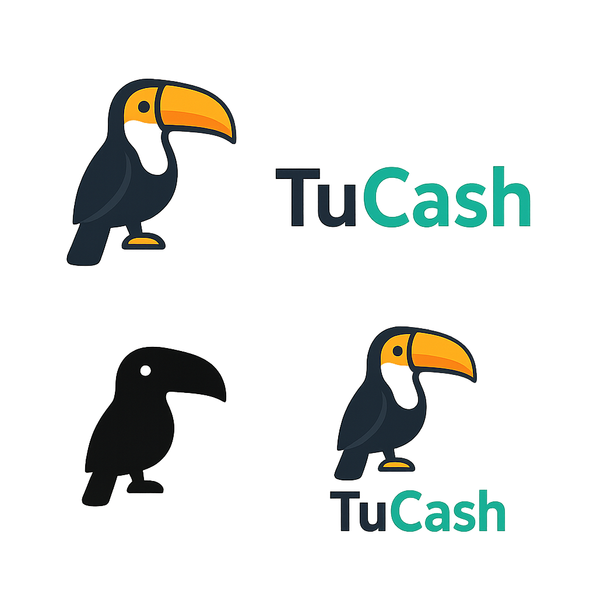
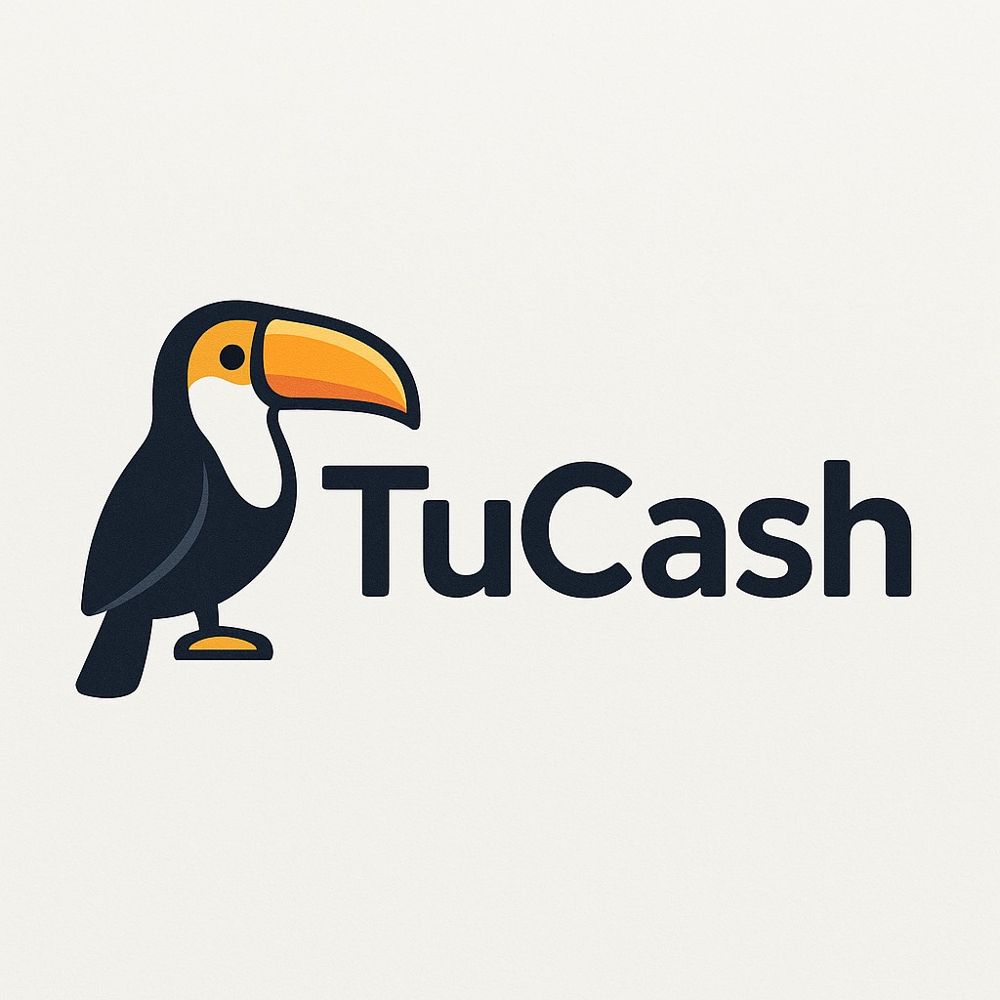
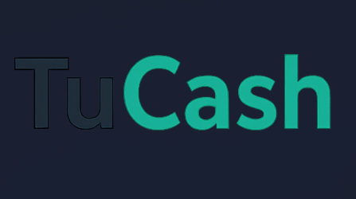
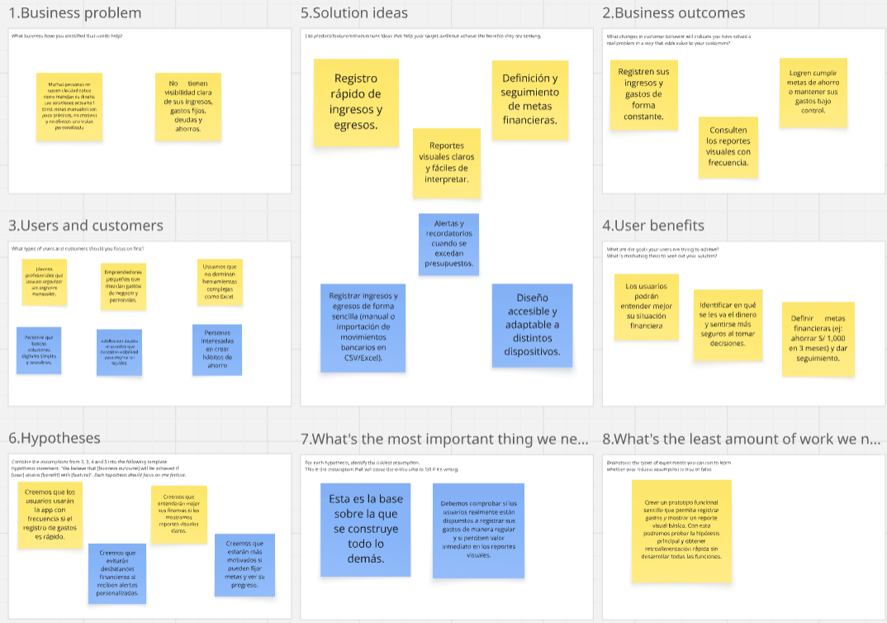
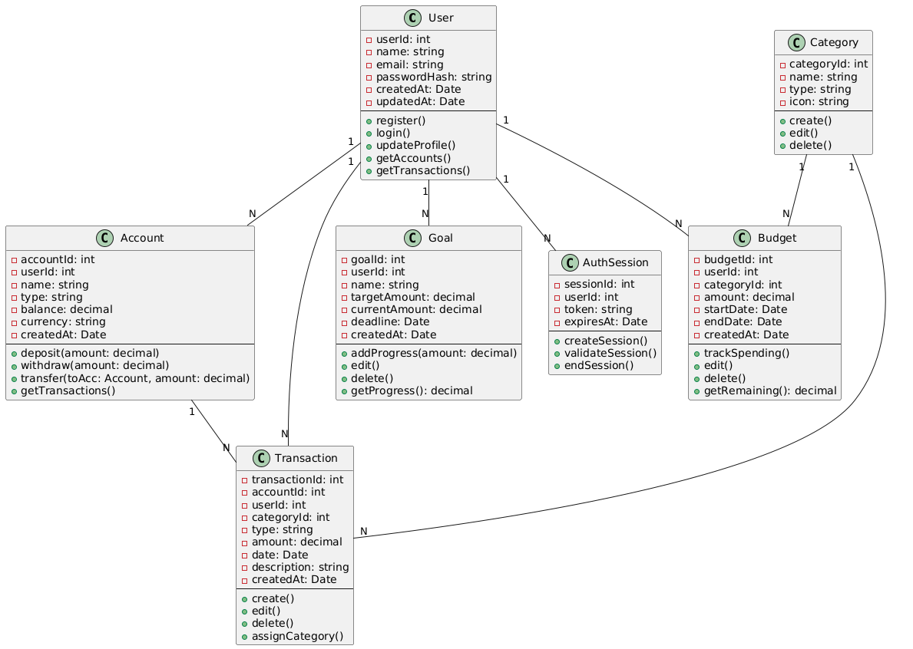

### Universidad Peruana de Ciencias Aplicadas

  

**CARRERA**   Ingeniería de Software 

**CICLO**   2025-02

**CURSO**   Desarrollo de Aplicaciones Open Source

**NRC**   7369

**DOCENTE**   Wilder Julio Espinoza Bravo

### "INFORME DE TRABAJO FINAL"

**STARTUP**   Kashu
<!--Desarrollo de aplicaciones open source-->

**PRODUCTO**   TuCash
<!--Nombres de integrantes-->

| Nombre |Código|
|-------|:----------:|
| Taquiri Calderon, Jhunior Giussepe | u20221c576|
| Payesa Torres, Harrison Hubert | u2022201024|
| Mondoñedo Rodriguez, Juan Diego Javier | u202110373 |
| Mejia Poma, Patricia Valeria | u202523271 |
| Huaman Hinostroza, Milenio | u20211c245 |

**AGOSTO** 

**2025**
 

---

<!--Registro de versiones-->
<h1 align="left">Registro de versiones del Informe</h1>
 
<table border="1" cellpadding="10" cellspacing="0" style="border-collapse: collapse; width: 100%;">
  <tr>
    <td align="center" style="border: 1px solid #ddd; padding: 8px;">Versión</td>
    <td align="center" style="border: 1px solid #ddd; padding: 8px;">Fecha</td>
    <td align="center" style="border: 1px solid #ddd; padding: 8px;">Autores</td>
    <td align="center" style="border: 1px solid #ddd; padding: 8px;">Descripción</td>
  </tr>
  <tr>
    <td style="border: 1px solid #ddd; padding: 8px;">TB1</td>
    <td style="border: 1px solid #ddd; padding: 8px;"></td>
    <td style="border: 1px solid #ddd; padding: 8px;">
      <ul>
        
      </ul>
    </td>
    <td style="border: 1px solid #ddd; padding: 8px;">            
      <ul>
        
      </ul>
    </td>
  </tr>
  <tr>
    <td style="border: 1px solid #ddd; padding: 8px;">TP</td>
    <td style="border: 1px solid #ddd; padding: 8px;">15/05/2025</td>
    <td style="border: 1px solid #ddd; padding: 8px;">
      <ul>
        
    
</table> 

<!--Link al repositorio en la organización-->
# Project Report Collaboration Insights

**TB1 Network Graph**
<figure style="text-align: center;">
    
</figure>

**TB1 Contributors**
<figure style="text-align: center;">
    < alt="">
</figure>

Para el desarrollo del informe perteneciente a la entrega TB1, se dividió la implementación de secciones de la siguiente forma para cada integrante del equipo:

<table align="center" border="1" cellpadding="10" cellspacing="0" style="border-collapse: collapse; width: 100%;">
  <tr>
    <td align="center" style="border: 1px solid #ddd; padding: 8px;">Integrante</td>
    <td align="center" style="border: 1px solid #ddd; padding: 8px;">Tareas Asignadas</td>
  </tr>
  <tr>
    <td style="border: 1px solid #ddd; padding: 8px;"></td>
    <td style="border: 1px solid #ddd; padding: 8px;">.</td>
  </tr>
  <tr>
    <td style="border: 1px solid #ddd; padding: 8px;"></td>
    <td style="border: 1px solid #ddd; padding: 8px;"></td>
  </tr>
  <tr>
    <td style="border: 1px solid #ddd; padding: 8px;"></td>
    <td style="border: 1px solid #ddd; padding: 8px;"></td>
  </tr>
  <tr>
    <td style="border: 1px solid #ddd; padding: 8px;"> </td>
    <td style="border: 1px solid #ddd; padding: 8px;">.</td>
  </tr>
  <tr>
    <td style="border: 1px solid #ddd; padding: 8px;"></td>
    <td style="border: 1px solid #ddd; padding: 8px;"></td>
  </tr>
</table>

**TP1 Network Graph**
<figure style="text-align: center;">
    
</figure>

**TP1 Contributors**
<figure style="text-align: center;">
    
</figure>

**TP1 Pulse**
<figure style="text-align: center;">
    
</figure>

<h1>TP</h1>

Para el desarrollo del informe perteneciente a la entrega TP, se dividió la implementación de secciones de la siguiente forma para cada integrante del equipo:

<!--ÍNDICE-->
# Contenido 
[Student Outcome](#student-outcome)

[Capítulo I: Introducción](#capítulo-i-introducción)
- [1.1. Startup Profile](#11-startup-profile)
  - [1.1.1. Descripción de la Startup](#111-descripción-de-la-startup)
  - [1.1.2. Perfiles de integrantes del equipo](#112-perfiles-de-integrantes-del-equipo)
- [1.2. Solution Profile](#12-solution-profile)
  - [1.2.1 Antecedentes y problemática](#121-antecedentes-y-problemática)
  - [1.2.2 Lean UX Process](#122-lean-ux-process)
    - [1.2.2.1. Lean UX Problem Statements](#1221-lean-ux-problem-statements)
    - [1.2.2.2. Lean UX Assumptions](#1222-lean-ux-assumptions)
    - [1.2.2.3. Lean UX Hypothesis Statements](#1223-lean-ux-hypothesis-statements)
    - [1.2.2.4. Lean UX Canvas](#1224-lean-ux-canvas)
- [1.3. Segmentos objetivo](#13-segmentos-objetivo)
- [Capítulo II: Requirements Elicitation \& Analysis](#capítulo-ii-requirements-elicitation--analysis)
  - [2.1. Competidores](#21-competidores)
    - [2.1.1. Análisis competitivo](#211-análisis-competitivo)
    - [2.1.2. Estrategias y tácticas frente a competidores](#212-estrategias-y-tácticas-frente-a-competidores)
  - [2.2. Entrevistas](#22-entrevistas)
    - [2.2.1. Diseño de entrevistas](#221-diseño-de-entrevistas)
    - [2.2.2. Registro de entrevistas](#222-registro-de-entrevistas)
    - [2.2.3. Análisis de entrevistas](#223-análisis-de-entrevistas)
  - [2.3. Needfinding](#23-needfinding)
    - [2.3.1. User Personas](#231-user-personas)
    - [2.3.2. User Task Matrix](#232-user-task-matrix)
    - [2.3.3. User Journey Mapping](#233-user-journey-mapping)
    - [2.3.4. Empathy Mapping](#234-empathy-mapping)
    - [2.3.5. As-is Scenario Mapping](#235-as-is-scenario-mapping)
  - [2.4. Ubiquitous Language](#24-ubiquitous-language)
- [Capítulo III: Requirements Specification](#capítulo-iii-requirements-specification)
  - [3.1. To-Be Scenario Mapping](#31-to-be-scenario-mapping)
  - [3.2. User Stories](#32-user-stories)
  - [3.3. Impact Mapping](#33-impact-mapping)
  - [3.4. Product Backlog](#34-product-backlog)
- [Capítulo IV: Product Design](#capítulo-iv-product-design)
  - [4.1. Style Guidelines](#41-style-guidelines)
    - [4.1.1. General Style Guidelines](#411-general-style-guidelines)
    - [4.1.2. Web Style Guidelines](#412-web-style-guidelines)
  - [4.2. Information Architecture](#42-information-architecture)
    - [4.2.1. Organization Systems](#421-organization-systems)
    - [4.2.2. Labeling Systems](#422-labeling-systems)
    - [4.2.3. SEO Tags and Meta Tags](#423-seo-tags-and-meta-tags)
    - [4.2.4. Searching Systems](#424-searching-systems)
    - [4.2.5. Navigation Systems](#425-navigation-systems)
  - [4.3. Landing Page UI Design](#43-landing-page-ui-design)
    - [4.3.1. Landing Page Wireframe](#431-landing-page-wireframe)
    - [4.3.2. Landing Page Mock-up](#432-landing-page-mock-up)
  - [4.4. Web Applications UX/UI Design](#44-web-applications-uxui-design)
    - [4.4.1. Web Applications Wireframes](#441-web-applications-wireframes)
    - [4.4.2. Web Applications Wireflow Diagrams](#442-web-applications-wireflow-diagrams)
    - [4.4.3. Web Applications Mock-ups](#443-web-applications-mock-ups)
    - [4.4.4. Web Applications User Flow Diagrams](#444-web-applications-user-flow-diagrams)
  - [4.5. Web Applications Prototyping](#45-web-applications-prototyping)
  - [4.6. Domain-Driven Software Architecture](#46-domain-driven-software-architecture)
    - [4.6.1. Software Architecture Context Diagram](#461-software-architecture-context-diagram)
    - [4.6.2. Software Architecture Container Diagrams](#462-software-architecture-container-diagrams)
    - [4.6.3. Software Architecture Components Diagrams](#463-software-architecture-components-diagrams)
    - [4.6.4. Software Architecture Packages and Layers Diagrams](#464-software-architecture-packages-and-layers-diagrams)
  - [4.7. Software Object-Oriented Design](#47-software-object-oriented-design)
    - [4.7.1. Class Diagrams](#471-class-diagrams)
    - [4.7.2. Class Dictionary](#472-class-dictionary)
  - [4.8. Database Design](#48-database-design)
    - [4.8.1. Database Diagram](#481-database-diagram)
- [Capítulo V: Product Implementation, Validation \& Deployment](#capítulo-v-product-implementation-validation--deployment)
  - [5.1. Software Configuration Management](#51-software-configuration-management)
    - [5.1.1. Software Development Environment Configuration](#511-software-development-environment-configuration)
    - [5.1.2. Source Code Management](#512-source-code-management)
    - [5.1.3. Source Code Style Guide \& Conventions](#513-source-code-style-guide--conventions)
    - [5.1.4. Software Deployment Configuration](#514-software-deployment-configuration)
  - [5.2. Landing Page, Services \& Applications Implementation](#52-landing-page-services--applications-implementation)
    - [5.2.1. Sprint 1](#521-sprint-1)
      - [5.2.1.1. Sprint Planning 1](#5211-sprint-planning-1)
      - [5.2.1.2. Aspect Leaders and Collaborators](#5212-aspect-leaders-and-collaborators)
      - [5.2.1.3. Sprint Backlog 1.](#5213-sprint-backlog-1)
      - [5.2.1.4. Development Evidence for Sprint Review](#5214-development-evidence-for-sprint-review)
      - [5.2.1.5. Execution Evidence for Sprint Review](#5215-execution-evidence-for-sprint-review)
      - [5.2.1.6. Services Documentation Evidence for Sprint Review](#5216-services-documentation-evidence-for-sprint-review)
      
  - [5.4. Video About-the-Product](#54-video-about-the-product)
- [Conclusiones y recomendaciones](#conclusiones-y-recomendaciones)
- [Video About-the-Team](#video-about-the-team)
- [Bibliografía](#bibliografía)
- [Anexos](#anexos)
  

<!--STUDENT OUTCOME-->
# Student Outcome

    <table align="center" border="1" cellpadding="8" cellspacing="0" style="border-collapse: collapse; width: 100%;">
        <tr>
            <th style="text-align:center; border: 1px solid #ddd;">Student Outcomes</th>
            <th style="text-align:center; border: 1px solid #ddd;">Acciones realizadas</th>
            <th style="text-align:center; border: 1px solid #ddd;">Conclusiones</th>
        </tr>
        <tr>
            <td style="border: 1px solid #ddd; vertical-align: top;">
            3.c1. Comunica oralmente con efectividad a diferentes rangos de audiencia</td>
            <td style="border: 1px solid #ddd; vertical-align: top;">
                <strong>Guillermo Tantaleán</strong> 
                TP1:   
                <strong>Henry Esteban</strong> 
                TP1:   
                <strong>Adrian Donayre</strong> 
                TP1:   
                <strong>Christian Inga</strong> 
                TP1:   
                <strong>Carlos Fernandez</strong> 
                TP1:   
                <strong>Juan Diego Mondoñedo</strong> 
                TP1:   
            </td>
            <td style="border: 1px solid #ddd; vertical-align: top;">
                <b>TP1:</b>   
            </td>
        </tr>
        <tr>
            <td style="border: 1px solid #ddd; vertical-align: top;">
             3.c2. Comunica por escrito con efectividad a diferentes rangos de audiencia</td>
            <td style="border: 1px solid #ddd; vertical-align: top;">
                <strong>Henry Esteban</strong> 
                TP1:   
                <strong>Adrian Donayre</strong> 
                TP1:   
                <strong>Christian Inga</strong> 
                TP1:   
                <strong>Carlos Fernandez</strong> 
                TP1:   
                <strong>Guillermo Fabián Tantaleán Mesta</strong> 
                TP1:   
                <strong>Juan Diego Mondoñedo Rodriguez</strong> 
                TP1:   
            </td>
            <td style="border: 1px solid #ddd; vertical-align: top;">
                <b>TP1:</b>   
            </td>
        </tr>
    </table>

<!--TODAS LAS SECCIONES A COMPLETAR-->

# Capítulo I: Introducción
## 1.1. Startup Profile
En esta sección se brinda la descripción de nuestra startup, producto y miembros de equipo.
### 1.1.1. Descripción de la Startup
**Nombre de la Startup:**  KASHU 
**Descripción:**  Kashu es una empresa emergente Fintech enfocada en desarrollar soluciones digitales innovadoras que promuevan la inclusión financiera y la gestión responsable del dinero en Latinoamérica. 
**Misión:**  Nuestra visión es convertirnos en una plataforma tecnológica de referencia para el manejo financiero personal y familiar, ofreciendo herramientas accesibles, intuitivas y escalables que empoderen a los usuarios a tomar mejores decisiones económicas. 
**Visión:**  Nuestra misión es democratizar el acceso a la educación y control financiero mediante productos digitales sencillos, inclusivos y seguros, que puedan evolucionar hacia aplicaciones móviles, servicios conectados a IoT y futuras integraciones con ecosistemas financieros. 

#### Logo, isotipo y logotipo:
 
**LOGO**

**ISOTIPO**

 

**LOGOTIPO**

 

### 1.1.2. Perfiles de integrantes del equipo

<table border="1">
<tr><th>Nombre</th><th>Biografía del los integrantes del equipo</th></tr>

  <tr>
    <td></td>
    <td>
      <b>🧑‍💻 Jhunior Giussepe Taquiri Calderon (U20221C576)</b>  
      Soy estudiante del sexto ciclo de Ingeniería de Software en la UPC, con una formación orientada al desarrollo de software y al uso de diversas tecnologías. 
      Tengo experiencia en C++, Python, Java y SQL, además de bases en HTML, CSS y JavaScript, lo que me ha permitido trabajar tanto en lógica de programación como en aspectos de desarrollo web.   
      Me considero una persona responsable, organizada y comprometida, con facilidad para el trabajo en equipo y con interés en seguir aprendiendo para fortalecer mi perfil profesional.   
      Mis expectativas para el curso de Aplicaciones Web son muy altas, ya que representa una oportunidad para profundizar en el desarrollo frontend y backend, así como para aprender
      nuevos frameworks como Vue, que serán de gran valor en mi futuro como desarrollador.
    </td>
  </tr>
  <tr>
    <td></td></td>
    <td>
      <b>Harrison Hubert Payesa Torres (U2022201024)</b> 
      <!-- Aquí va su descripción -->
    </td>
  </tr>

  <tr>
    <td></td>
    <td>
      <b>Juan Diego Javier Mondoñedo Rodriguez (U202110373)</b> 
      <!-- Aquí va su descripción -->
    </td>
  </tr>

  <tr>
    <td></td>
    <td>
      <b>Patricia Valeria Mejia Poma (U202523271)</b> 
      Soy estudiante de Ingeniería de Software en la UPC. Mi experiencia abarca el desarrollo backend con tecnologías como Java y C#, y la gestión de bases de datos como MySQL y PostgreSQL. Además, tengo conocimientos en el desarrollo frontend con HTML, CSS y framework como Tailwind CSS. 
      Me defino como una persona responsable y comprometida con el trabajo en equipo. Tengo un gran interés en seguir aprendiendo para fortalecer mi perfil profesional, aplicando mis habilidades para aportar soluciones innovadoras. Espero que este curso me permita profundizar en el desarrollo de aplicaciones web y consolidar mi formación como futura ingeniera.
    </td>
  </tr>

  <tr>
    <td> </td>
    <td>
      <b>Milenio Huaman Hinostroza (U20211C245)</b>  
      Soy estudiante de Ingeniería de Sistemas de Software en la UPC. Mi formación está orientada al desarrollo de aplicaciones web distribuidas y al uso de tecnologías open source. Tengo experiencia en Java con Spring Boot, Angular, HTML, CSS, JavaScript y TypeScript, además de conocimientos en bases de datos SQL y en control de versiones con Git y GitHub aplicando GitFlow.  
      Me considero una persona responsable, perseverante y comprometida, con capacidad para trabajar en equipo y adaptarme a diferentes roles dentro de un proyecto. Me interesa seguir fortaleciendo mis habilidades tanto en el desarrollo backend como en frontend, además de adquirir experiencia en el diseño de experiencias de usuario (UX/UI) y en metodologías ágiles.  
      Mis expectativas para el curso de Desarrollo de Aplicaciones Open Source son altas, ya que representa una oportunidad para aplicar buenas prácticas de ingeniería de software, explorar herramientas modernas de desarrollo y consolidar mi perfil como futuro ingeniero de software capaz de aportar soluciones innovadoras y escalables.
   </td>
  </tr>
</table>

## 1.2. Solution Profile
### 1.2.1. Antecedentes y problemática
En la actualidad, gran parte de la población enfrenta dificultades para gestionar sus finanzas personales. Muchas personas desconocen exactamente en qué gastan su dinero, lo que impide llevar un control efectivo de ingresos, egresos, deudas y ahorros.
•	En Latinoamérica, estudios muestran que más del 60% de trabajadores no lleva un registro formal de sus gastos.
•	Las herramientas más usadas son Excel o notas manuales, pero suelen ser poco prácticas, requieren disciplina y carecen de alertas inteligentes.
•	La falta de control financiero deriva en endeudamiento, poca capacidad de ahorro e imposibilidad de planificar metas económicas.

**Who (¿Quiénes?):** 
 
- Profesionales jóvenes y adultos con ingresos fijos o variables.
- Emprendedores que mezclan finanzas personales y gastos de negocio.
- Personas con deudas que necesitan visibilidad para mejorar su economía.
 

**What (¿Qué sucede?):** 
 
- No cuentan con herramientas simples y automatizadas para registrar ingresos/egresos.
- Les resulta difícil identificar patrones de gasto, fijar metas de ahorro o anticipar deudas.
- Pierden control de su liquidez mensual y no toman decisiones financieras informadas.
 

**Where (¿Dónde ocurre?):**
 
- En contextos urbanos y semiurbanos de Latinoamérica, donde existe acceso a internet y smartphones, pero bajo uso de soluciones fintech avanzadas.
 

**When (¿Cuándo ocurre?):** 
 
- De forma continua, ya que el manejo de ingresos y gastos es un proceso diario y recurrente.
- Es más crítico a fin de mes o en fechas de pagos de deudas/servicios.
 

**Why (¿Por qué es un problema?):**
 
- La falta de control genera endeudamiento, estrés financiero y baja capacidad de ahorro.
- No existe cultura de educación financiera clara ni accesible.
- Las herramientas bancarias tradicionales no son inclusivas ni amigables para usuarios comunes.
 

**How (¿Cómo lo solucionan hoy?):**
 
- Personas gastan más de lo que ganan sin darse cuenta.
- Usan múltiples medios (apps de bancos, Excel, notas) sin integración ni visión consolidada.
- No reciben alertas ni métricas que los ayuden a cambiar su comportamiento.
  

**How much (¿Cuánto cuesta no resolverlo?):**
 
- Según la CEPAL, más del 70% de personas en Latinoamérica carecen de hábitos de ahorro formal.
- En Perú, menos del 40% de adultos llevan un registro financiero sistemático.
- Esto implica una población objetivo potencial de millones de usuarios con necesidad de una solución accesible y escalable.
  

### 1.2.2. Lean UX Process
#### 1.2.2.1. Lean UX Problem Statements
Se ha detectado que, aunque los usuarios cuentan con diversas herramientas como Excel, aplicaciones bancarias o notas manuales, no logran mantener un control disciplinado y visualmente claro de su dinero. Como resultado, experimentan falta de claridad sobre sus gastos, baja motivación para registrar movimientos financieros, abandono prematuro de las herramientas existentes y poca percepción de valor en los resultados obtenidos es por ello que nos planteamos lo siguiente.

¿Cómo podríamos diseñar una solución que permita a los usuarios llevar un registro simple y visual de sus finanzas, recibir recomendaciones y alertas personalizadas y fijar metas claras, de manera que perciban un mayor control de su dinero, aumenten la frecuencia de uso de la plataforma y logren mejores resultados en su bienestar financiero?

**Domain:**
 Gestión de finanzas personales (personal finance management). 

**Customer Segments:**
 Jóvenes estudiantes con ingresos variantes que buscan organizar gastos y ahorrar.
Adultos con gastos y deudas recurrentes que necesitan visualizar pagos y mejorar su liquidez.
Emprendedores pequeños que mezclan gastos personales y de negocio. 

**Pain Points (dolores):**
 
- Falta de claridad sobre en qué se gasta el dinero.
- Dificultad para llevar un registro disciplinado en Excel o manual.
- Ausencia de alertas cuando se supera un presupuesto o se acerca un pago importante.
- Poca cultura de planificación financiera accesible. 

**Gap (brecha actual):**
 
- Existen apps bancarias, pero no son inclusivas ni flexibles.
- Las soluciones globales (ej. Mint, Fintonic) no están adaptadas al contexto latinoamericano (moneda local, idioma, accesibilidad).
- El mercado latinoamericano aún carece de herramientas sencillas, visuales e inclusivas. 

**Vision/Strategy:**
 
- Brindar una plataforma digital inclusiva, simple y visual que ayude a las personas a registrar, categorizar y analizar sus finanzas personales.
- Evolucionar hacia integraciones móviles, IoT y APIs bancarias para automatizar el proceso. 

**Initial Segment:**
 Estudiantes jóvenes (16–55 años) en Perú y Latinoamérica urbana, con acceso a internet y smartphones, pero sin hábitos financieros consolidados. 

#### 1.2.2.2. Lean UX Assumptions
**¿Quién es el usuario?**  El usuario es principalmente un adulto joven o estudiante universitarios que recibe ingresos de manera regular, aunque en muchos casos enfrenta gastos variables, deudas recurrentes o dificultades para ahorrar. Es alguien que busca tener mayor control sobre su dinero, pero que hasta ahora no ha encontrado una herramienta sencilla y confiable que le permita organizarse sin invertir demasiado tiempo o esfuerzo. 

**¿Dónde encaja nuestro producto en su vida?**  Nuestro producto encaja en su vida diaria como un aliado silencioso: no pretende reemplazar su banco ni complicarle con procesos técnicos, sino convertirse en el espacio central donde pueda visualizar de forma clara y ordenada el estado de sus finanzas. Allí, el usuario podrá entender en qué se está yendo su dinero, fijar metas y recibir alertas que lo ayuden a tomar mejores decisiones 

**¿Qué problemas tiene nuestro producto y cómo se pueden resolver?**  El problema principal es la falta de visibilidad y motivación. Hoy, muchos intentan llevar un control con Excel o notas, pero lo abandonan porque el proceso es tedioso, poco visual y sin retroalimentación.Nuestro producto aborda esta necesidad ofreciendo simplicidad en el registro de ingresos y egresos, categorización automática y reportes visuales fáciles de interpretar, además de notificaciones que guían al usuario en momentos clave, como cuando está por superar su presupuesto. 

**¿Cuándo y cómo se usará nuestro producto?**  El producto será utilizado en los momentos cotidianos en los que la persona recibe dinero o realiza un gasto: al pagar una cuenta, comprar en el supermercado o planificar a fin de mes. En su versión web, se utilizará sobre todo en laptops y PCs al revisar balances completos; en la app móvil permitirá registrar gastos en tiempo real desde cualquier lugar. 

**¿Qué características son importantes?**  Las características más importantes se relacionan con la simplicidad, la claridad visual y la personalización. No se trata de tener cientos de funciones, sino de que cada interacción aporte valor inmediato: registrar rápido, ver de un vistazo el estado financiero, recibir alertas útiles y definir metas alcanzables 

**¿Cómo debe verse nuestro producto y cómo debe comportarse?**  El producto debe verse moderno y confiable, con un diseño amigable y profesional que inspire seguridad, pero también accesible para cualquier persona, incluso quienes no tienen experiencia en herramientas financieras. Su comportamiento debe ser fluido y coherente: ágil al momento de registrar datos, consistente en sus reportes y proactivo al enviar recomendaciones personalizadas. 

#### 1.2.2.3. Lean UX Hypothesis Statements
**Hypothesis Statement 1:**  **Creemos que** si ofrecemos una forma rápida y sencilla de registrar ingresos y egresos, los usuarios mantendrán un registro constante de su vida financiera.
**Sabremos que** hemos tenido éxito **cuando** al menos el 60% de los usuarios registre movimientos al menos tres veces por semana. 

**Hypothesis Statement 2:**  **Creemos que** si presentamos reportes visuales claros sobre el flujo de dinero, los usuarios comprenderán mejor sus hábitos de gasto.
**Sabremos que** hemos tenido éxito **cuando** más del 70% de los usuarios consulten sus reportes al menos una vez por semana. 

**Hypothesis Statement 3:**  **Creemos que** si la solución envía alertas y recordatorios personalizados, los usuarios podrán anticiparse a gastos importantes y evitar sobrepasar sus presupuestos.
**Sabremos** que hemos tenido éxito **cuando** al menos el 50% de los usuarios ajusten su comportamiento financiero después de recibir una alerta. 

**Hypothesis Statement 4:** Creemos que si se permite definir metas financieras alcanzables y muestra el progreso de forma motivadora, los usuarios se comprometerán más con la plataforma.
Sabremos que hemos tenido éxito cuando al menos el 40% de los usuarios logren cumplir una meta de ahorro en los primeros tres meses de uso.
 

#### 1.2.2.4. Lean UX Canvas
<td></td>

[Enlace para accerder al canva](https://miro.com/app/board/uXjVJL9MIK8=/?share_link_id=902556983183)

## 1.3. Segmentos objetivo
### Segmentación del Dominio del Problema
La solución TuCash está orientada a dos segmentos principales de usuarios que enfrentan retos financieros en su vida diaria y que necesitan herramientas accesibles, visuales y confiables para mejorar el control de sus ingresos y gastos.

#### 1. Estudiantes universitarios (16–24 años)
**Demografía:**
jóvenes que cursan estudios técnicos o universitarios, en su mayoría dependientes económicamente de sus padres o con ingresos parciales (trabajos de medio tiempo, prácticas profesionales o becas).

**Características:**
- Manejan ingresos limitados y variables.
- Alta afinidad con el uso de tecnología y aplicaciones móviles.
- Buscan independencia y aprender a organizar su dinero desde etapas tempranas.

**Necesidades:**
- Un sistema simple para registrar ingresos (mesadas, trabajos eventuales) y gastos diarios.
- Herramientas visuales que les ayuden a identificar patrones de consumo.
- Motivación para empezar a crear hábitos de ahorro.

Datos de sustento: según el INEI (2023), en Perú más del 65% de jóvenes entre 18 y 24 años usa internet desde el celular para actividades financieras básicas, pero menos del 30% lleva un registro formal de sus finanzas.
#### 2. Padres, madres o tutores (25–45 años)
**Demografía:**
- adultos con ingresos estables (formales o informales), responsables de la economía familiar.

**aracterísticas:**
- Manejan presupuestos familiares, con gastos recurrentes (alquiler, servicios, alimentación, educación).
- Buscan mantener estabilidad financiera y planificar metas a mediano plazo.
- Valoran herramientas que brinden claridad y seguridad.

**Necesidades:**
- Un sistema confiable que les permita organizar gastos del hogar y anticipar pagos.
- Alertas y recordatorios que ayuden a evitar sobreendeudamiento.
- Metas financieras familiares (ahorrar para educación, vivienda, salud).

**Datos de sustento:** el Banco Interamericano de Desarrollo (2022) señala que más del 45% de adultos en Latinoamérica con hijos declara tener dificultades para llegar a fin de mes, y un 38% carece de un método estructurado de control financiero.

# Capítulo II: Requirements Elicitation & Analysis

# Capítulo II: Requirements Elicitation & Analysis

## 2.1 Competidores

### ¿Por qué llevar a cabo este análisis?

El análisis competitivo resulta fundamental para comprender el panorama del mercado de aplicaciones financieras personales. A través de esta evaluación, es posible identificar fortalezas, debilidades, oportunidades y amenazas en el sector. Además, permite diferenciar a **TuCash**, destacando su simplicidad, enfoque educativo y adaptación al contexto financiero peruano.

---

## 2.1.1 Análisis competitivo (Comparativa)

### Competitive Analysis

| Perfil                        |  **Mi Plata**                                                |  **Controlar Gastos**                         |  **Monefy**                                        | **Kakeibo**                                   |  **TuCash (Perú)**                                    |
|-----------------------------|---------------------------------------------------------------------------|------------------------------------------------------------|------------------------------------------------------------------|------------------------------------------------------------|------------------------------------------------------------------|
| **Overview**                | App peruana para registrar ingresos/gastos y definir metas de ahorro.    | App simple de registro diario de gastos con reportes básicos. | App internacional con registro rápido y visual de ingresos/gastos. | Basada en el método japonés Kakeibo, con reflexión sobre gastos. | App peruana para estudiantes y familias, con control de ingresos, gastos, metas y educación financiera. |
| **Ventaja competitiva**     | Facilidad de uso y metas claras de ahorro.                               | Muy sencilla y gratuita, ideal para principiantes.         | Visualización atractiva y rapidez.                               | Promueve consciencia y hábitos financieros saludables.      | Localización, accesibilidad y personalización (categorías y moneda local). |
| **Clientes**                | Adultos jóvenes que desean control básico de dinero.                     | Usuarios que buscan simplicidad sin funciones avanzadas.   | Jóvenes y adultos que prefieren apps rápidas y gráficas.          | Personas interesadas en disciplina y ahorro consciente.      | Estudiantes universitarios y familias peruanas de ingresos medios. |
| **Mercado objetivo**        | Usuarios no necesariamente bancarizados en Perú.                         | Usuarios básicos que valoran la simplicidad.                | Mercado internacional y usuarios tecnológicos.                    | Nicho en métodos alternativos de ahorro.                     | Jóvenes y familias peruanas que necesitan educación y control financiero. |
| **Estrategia de marketing** | Redes sociales y tiendas de apps.                                         | Boca a boca y app stores.                                  | Marketing global y fuerte presencia en tiendas digitales.         | Enfocada en un nicho minimalista.                           | Campañas en redes sociales, alianzas con universidades y enfoque educativo. |
| **Productos & Servicios**   | Registro de gastos/ingresos y metas de ahorro.                           | Registro manual con reportes simples.                        | Registro visual de ingresos/gastos con gráficos.                   | Registro manual con categorías reflexivas.                   | Control de ingresos/gastos, metas, recordatorios, reportes y educación financiera. |
| **Precios**                 | Gratuita / Premium accesible.                                             | Gratuita.                                                   | Gratis / Pro con pago único.                                      | Gratuita o de bajo costo.                                   | Freemium: básica gratuita + Premium económico en soles.         |
| **Canales de distribución** | App móvil (iOS/Android).                                                  | App móvil.                                                  | App móvil.                                                        | App móvil.                                                  | App móvil (iOS/Android); futura versión web.                    |

---

## Análisis SWOT – TuCash

| Categoría       | Descripción |
|----------------|-------------|
| **Fortalezas** | - Enfoque 100 % local (Perú). - Interfaz sencilla e intuitiva. - Personalización (categorías, moneda local). - Precios accesibles adaptados al mercado peruano. |
| **Debilidades**| - Competencia con más recursos (apps internacionales). - Bajo reconocimiento de marca. - Recursos limitados en marketing masivo. |
| **Oportunidades** | - Crecimiento del ecosistema fintech en Perú y LATAM. - Escasa oferta de apps peruanas para estudiantes/familias. - Potencial integración con billeteras digitales y bancos locales. |
| **Amenazas**   | - Entrada de grandes competidores internacionales. - Desconfianza de usuarios en privacidad de datos. - Cambios regulatorios en apps financieras digitales. |

---

## 2.1.2 Estrategias y tácticas frente a competidores

1. **Diferenciación por localización**  
   TuCash se dirige exclusivamente al contexto peruano, con categorías, precios y lenguaje alineados al usuario local.

2. **Simplicidad con educación financiera**  
   Combina la interfaz ágil y funcional de Monefy con un componente educativo que la hace única en el mercado.

3. **Segmentación clara**  
   Apunta a estudiantes universitarios y familias de ingresos medios—aquellos menos atendidos por otras apps.

4. **Modelo freemium atractivo**  
   **Gratis**: acceso completo a funciones básicas.  
   **Premium económico en soles**: metas personalizadas, reportes automáticos, recordatorios inteligentes y herramientas educativas.

5. **Confianza y transparencia**  
   Mensajes claros sobre privacidad y protección de datos, adecuados para usuarios no técnicos.

6. **Marketing educativo**  
     Alianzas con universidades para penetración en el público estudiantil.  
    Contenido útil en redes sociales: consejos financieros, microcursos y retos de ahorro.  
    Enfoque en impacto social: mejorar la salud financiera de las familias peruanas.  
## 2.2 Entrevistas

### 2.2.1. Diseño de entrevistas  

El objetivo de estas entrevistas es identificar y comprender las **necesidades, dificultades y expectativas** de los usuarios potenciales de **TuCash**. Para ello, se consideraron tres segmentos principales de estudiantes universitarios:  

- **Estudiantes con mesada de los padres**  
- **Estudiantes que trabajan y estudian**  
- **Estudiantes becados**  

## Segmento 1: Estudiantes con mesada de los padres  

**Preguntas principales:**  
1. ¿De cuánto es aproximadamente tu mesada y con qué frecuencia la recibes (semanal, mensual)?  
2. ¿Qué haces normalmente para administrar tu mesada: la gastas toda, intentas ahorrar o llevas un registro?  
3. ¿En qué gastas más tu mesada (alimentación, transporte, ocio, materiales de estudio, salud)?  
4. ¿Alguna vez te quedaste sin dinero antes de recibir tu siguiente mesada? ¿Qué pasó?  
5. ¿Has usado alguna app o herramienta digital para organizar tu mesada? ¿Qué te gustó o no te gustó?  
6. ¿Qué tan útil sería para ti que TuCash te envíe recordatorios cuando gastes demasiado?  
7. ¿Qué tipo de metas de ahorro te motivarían más: metas pequeñas (ej. ahorrar para un libro) o metas grandes (ej. un viaje)?  
8. ¿Cómo prefieres ver tu información: gráficos, reportes semanales o notificaciones rápidas?  
9. ¿Qué tan importante es para ti que TuCash sea fácil de usar y rápida al registrar un gasto?  
10. ¿Qué función extra haría que TuCash se vuelva tu app indispensable para manejar tu mesada?  

---

## Segmento 2: Estudiantes que trabajan y estudian  

**Preguntas principales:**  
1. ¿Cómo organizas actualmente tu dinero entre ingresos del trabajo y gastos de la universidad?  
2. ¿Llevas un registro de cuánto dinero te sobra o falta cada mes? ¿Cómo lo haces?  
3. ¿Qué gastos fijos son los más importantes para ti (pensión universitaria, transporte, alimentación, servicios, deudas)?  
4. ¿Has tenido dificultades para separar gastos personales de gastos académicos?  
5. ¿Qué tan útil sería que TuCash te muestre un balance mensual de ingresos vs. gastos?  
6. ¿Qué funciones te ayudarían más: recordatorios de pagos, metas de ahorro o alertas de gasto excesivo?  
7. ¿Prefieres que TuCash te dé reportes simples o reportes más avanzados con detalles?  
8. ¿Qué tan importante es que la app funcione también sin internet (modo offline)?  
9. ¿Confiarías en ingresar tus ingresos y gastos reales dentro de TuCash? ¿Por qué sí o no?  
10. Si TuCash tuviera una versión Premium, ¿qué te motivaría a pagarla (ej. reportes avanzados, integración con billeteras, asesoría financiera)?  

---

##  Segmento 3: Estudiantes becados  

**Preguntas principales:**  
1. ¿Cómo administras actualmente el dinero que recibes de tu beca (ej. gastos básicos, ahorro, ocio)?  
2. ¿Qué tan seguido llevas un registro de en qué usas tu beca (diario, semanal, nunca)?  
3. ¿Qué gastos principales cubres con tu beca (alimentación, materiales, transporte, vivienda, salud)?  
4. ¿Has tenido problemas para que el dinero de tu beca dure todo el mes o el ciclo académico?  
5. ¿Qué tan útil sería que TuCash te ayude a planificar cuánto gastar y cuánto ahorrar de tu beca?  
6. ¿Preferirías que TuCash te dé consejos automáticos de organización o solo un registro de tus movimientos?  
7. ¿Qué tan importante es para ti que la app te muestre reportes fáciles de compartir con tus padres o tutores?  
8. ¿Qué formato te sería más cómodo: notificaciones rápidas, gráficos sencillos o reportes detallados?  
9. ¿Confiarías en una app como TuCash para organizar el dinero de tu beca? ¿Qué te daría más confianza?  
10. Si TuCash ofreciera funciones Premium, ¿qué te gustaría que incluya (ej. ahorro de emergencias, metas personalizadas, integración con cuentas universitarias)?  

### 2.2.2 Registro de entrevistas

#### Entrevistas a estudiantes universitarios

| Campo         | Información |
|---------------|-------------|
| Entrevistado 1 |             |
| Edad          |             |
| Distrito      |             |
| Foto          |  |
| Timing        | [Ver grabación]() |

---

| Campo         | Información |
|---------------|-------------|
| Entrevistado 2 |             |
| Edad          |             |
| Distrito      |             |
| Foto          |  |
| Timing        | [Ver grabación]() |

---

| Campo         | Información |
|---------------|-------------|
| Entrevistado 3 |             |
| Edad          |             |
| Distrito      |             |
| Foto          |  |
| Timing        | [Ver grabación]() |

---

#### Entrevistas a padres/madres o tutores

| Campo         | Información |
|---------------|-------------|
| Entrevistado 1 |             |
| Edad          |             |
| Distrito      |             |
| Foto          |  |
| Timing        | [Ver grabación]() |

---

| Campo         | Información |
|---------------|-------------|
| Entrevistado 2 |             |
| Edad          |             |
| Distrito      |             |
| Foto          |  |
| Timing        | [Ver grabación]() |

---

| Campo         | Información |
|---------------|-------------|
| Entrevistado 3 |             |
| Edad          |             |
| Distrito      |             |
| Foto          |  |
| Timing        | [Ver grabación]() |

---

### 2.2.3 Análisis de entrevistas

#### Análisis del segmento 
- **Estudiantes con mesada de los padres (16–24 años):**  
    
    
    
    

- **Estudiantes que trabajan y estudian (18–26 años):**  

    
    
    
    

- **Estudiantes becados (18–25 años):**  

## 2.3. Needfinding
### 2.3.1. User Personas
**Estudiantes con mesada de los padres**  

**Estudiantes que trabajan y estudian**  
 
 

**Estudiantes becados**
 

### 2.3.2. User Task Matrix

| **Task** | **Estudiantes con mesada**  (16–24 años) |  | **Estudiantes que trabajan y estudian**  (18–26 años) |  | **Estudiantes becados**  (18–25 años) |  |
|----------|---------------------------------------------|--|-----------------------------------------------------------|--|-------------------------------------------|--|
|          | **Frequency** | **Importance** | **Frequency** | **Importance** | **Frequency** | Importance |
| Registrar gastos diarios | Sometimes | Medium | Always | High | Often | High |
| Registrar ingresos (mesada, trabajos, becas) | Always | High | Always | High | Always | High |
| Ahorrar para metas específicas (viajes, estudios, emergencias) | Sometimes | Medium | Often | High | Often | High |
| Controlar presupuesto mensual | Often | High | Always | High | Always | High |
| Revisar historial de gastos | Sometimes | Medium | Often | High | Often | High |
| Recibir alertas de pagos/recordatorios | Often | High | Always | High | Always | High |
| Usar apps móviles para pagos o control financiero | Often | High | Always | High | Often | High |
| Compartir gastos con amigos/familia | Often | Medium | Sometimes | Medium | Rarely | Low |
| Planificar gastos futuros | Sometimes | Medium | Often | High | Often | High |
| Manejo de deudas o préstamos | Rarely | Low | Often | High | Sometimes | Medium |
| Educación financiera/autocapacitación | Sometimes | Medium | Often | High | Always | High |

### 2.3.3. User Journey Mapping
 
### Segmento 1: Estudiantes con mesada

### Segmento 2: Estudiantes que trabajan y estudian

### Segmento 3: Estudiantes becados

### 2.3.4. Empathy Mapping
**Administradores y dueños de cafeterias de especialidad**  
<td></td>

**Barista Profesional**  
<td></td>

### 2.3.5. As-is Scenario Mapping

  

**Administradores y dueños de cafeterías de especialidad**  
<td></td>

**Barista Profesional**  
<td></td>

## 2.4. Ubiquitous Language

  

**Glosario de Términos:**

<table border = 1>
  <thead>
    <tr>
      <th>Término (Inglés)</th>
      <th>Término (Español)</th>
      <th>Definición</th>
    </tr>
  </thead>
  <tbody>
    <tr>
      <td>  </td>
      <td>  </td>
      <td>  </td>
    </tr>
    <tr>
      <td>  </td>
      <td>  </td>
      <td>  </td>
    </tr>
    <!-- Repite filas según necesidad -->
  </tbody>
</table>

# Capítulo III: Requirements Specification

## 3.1. To-Be Scenario Mapping
El mapeo de escenarios “To-Be” nos permite visualizar cómo será el proceso o flujo de trabajo deseado del usuario una vez que implementemos nuestra solución. Basado en nuestros segmentos objetivo, elaboramos un To-Be Scenario Mapping para observar cómo TuCash aborda las necesidades de cada usuario, detallando sus acciones, pensamientos y emociones en cada fase de su viaje financiero.

---

#### Segmento 1: Estudiantes universitarios en busca de control financiero

| PHASES | *1. Adopción y Registro Inicial* | *2. Análisis de Datos y Concienciación* | *3. Planificación y Seguimiento de Metas* |
| :--- | :--- | :--- | :--- |
| *DOING* | Realiza el proceso de alta en la plataforma. Registra sus transacciones financieras diarias (gastos e ingresos) utilizando las categorías predefinidas. | Accede al dashboard principal para revisar la data consolidada. Utiliza los filtros para visualizar la distribución de gastos por categoría en un período determinado. | Define una meta de ahorro con un monto y plazo específicos. Ingresa periódicamente los montos destinados a dicha meta y monitorea su avance. |
| *THINKING* | "Evalúa si la simplicidad de la herramienta le permitirá ser constante en el registro de sus finanzas para obtener datos útiles." | "Identifica una oportunidad de ahorro significativa al visualizar el alto costo de una categoría de gasto específica." | "Considera que el plan de ahorro sugerido por la aplicación es una guía clara y alcanzable para cumplir su objetivo." |
| *FEELING* | *Interesada, con expectativas moderadas sobre la utilidad de la herramienta. | **Sorprendida, pero con una mayor **sensación de control* al comprender sus patrones de consumo. | *Motivada, con un claro **sentido de logro* al observar el progreso hacia su objetivo financiero. |

---

#### Segmento 2: Padres y madres de familia buscando estabilidad económica

| PHASES | *1. Configuración del Presupuesto Familiar* | *2. Monitoreo y Gestión Continua* | *3. Planificación Financiera Estratégica* |
| :--- | :--- | :--- | :--- |
| *DOING* | Ingresa los ingresos fijos del hogar. Configura los gastos recurrentes (servicios, hipoteca, educación) estableciendo sus fechas de vencimiento. | Recibe notificaciones automáticas de próximos vencimientos. Registra los gastos variables de la familia conforme se realizan. | Analiza los reportes mensuales consolidados junto a su pareja. Establece una meta de ahorro a mediano plazo para un objetivo familiar. |
| *THINKING* | "Piensa que registrar los gastos recurrentes desde el principio establecerá una base sólida para el control del presupuesto familiar." | "Valora la utilidad de los recordatorios para evitar recargos. Reconoce la eficiencia del registro inmediato de gastos." | "Confirma que la visualización de datos consolidados permite tomar decisiones informadas sobre el ahorro y la planificación." |
| *FEELING* | *Aliviado, con una **sensación de orden* en la gestión financiera del hogar. | *Seguro* y con *menor estrés financiero* gracias a las alertas y al control constante. | *Optimista* y *alineado con los objetivos familiares* al contar con un plan financiero claro. |

## 3.2. User Stories

Tras analizar las Épicas definidas, procedemos a desglosarlas en Historias de Usuario más detalladas, enfocándonos en cubrir las funcionalidades principales de cada una. Este proceso nos permitió identificar los requisitos específicos del usuario y los casos de uso de cada Épica, lo que facilitó la priorización y planificación de las siguientes etapas de desarrollo.

Para elaborar user stories que pertenecen a un epic. A continuación, las epics que consideramos como equipo:

| EPIC ID | TÍTULO DE LA EPIC |
| :--- | :--- |
| *EP01* | Gestión de Cuentas de Usuario |
| *EP02* | Gestión de Transacciones |
| *EP03* | Visualización de Datos y Reportes |
| *EP04* | Planificación y Metas Financieras |
| *EP05* | Presupuestos y Notificaciones |

---

A continuacion, la realizacion de los user stories con sus criterios de aceptacion con escenarios e ID de Épica:

| Epic / Story ID | Título | Descripción | Criterios de Aceptación | Epic ID |
| :--- | :--- | :--- | :--- | :--- |
| *EP01/US01* | Creación de cuenta de usuario | Como usuario nuevo, quiero registrarme en la plataforma utilizando mi correo electrónico y una contraseña para crear una cuenta personal y segura. | **Escenario 1: Registro Exitoso Given* que el usuario se encuentra en la página de registro. *When* ingresa un correo electrónico válido, una contraseña segura y hace clic en "Registrarse". *Then* el sistema crea la cuenta, inicia su sesión y lo redirige al panel principal.  *Escenario 2: Correo ya existente Given* que el usuario se encuentra en la página de registro. *When* ingresa un correo electrónico que ya está registrado. *Then* el sistema muestra un mensaje de error indicando que el correo ya existe. | EP01 |
| *EP01/US02* | Inicio de sesión de usuario | Como usuario registrado, quiero iniciar sesión en mi cuenta para acceder a mi información financiera. | **Escenario 1: Credenciales Correctas Given* que un usuario registrado se encuentra en la página de inicio de sesión. *When* ingresa su correo y contraseña correctos. *Then* el sistema valida las credenciales y le da acceso a su panel principal.  *Escenario 2: Credenciales Incorrectas Given* que un usuario registrado se encuentra en la página de inicio de sesión. *When* ingresa un correo o contraseña incorrectos. *Then* el sistema muestra un mensaje de error de "Credenciales inválidas". | EP01 |
| *EP02/US01* | Registro de Ingresos | Como usuario, quiero registrar un nuevo ingreso de forma rápida para mantener mi saldo total actualizado. | **Given* que el usuario ha iniciado sesión. *When* el usuario añade un nuevo ingreso con un monto válido y una descripción. *Then* el sistema registra la transacción, actualiza el saldo general y la muestra en el historial. | EP02 |
| *EP02/US02* | Registro de Egresos | Como usuario, quiero registrar un nuevo egreso y asignarle una categoría para facilitar el análisis de mis patrones de consumo. | **Given* que el usuario ha iniciado sesión. *When* el usuario añade un nuevo egreso, completa el monto y selecciona una categoría de la lista. *Then* el sistema registra la transacción, actualiza el saldo y la muestra en el historial con la categoría asignada. | EP02 |
| *EP03/US01* | Dashboard Financiero | Como usuario, quiero acceder a un panel principal que resuma mi estado financiero para obtener una vista consolidada de mis finanzas. | **Given* que el usuario ha iniciado sesión. *When* el usuario navega a la página principal. *Then* se muestra un dashboard con: saldo actual, total de ingresos del mes y total de egresos del mes. | EP03 |
| *EP03/US02* | Reporte Gráfico por Categoría | Como usuario, quiero ver un gráfico de distribución de gastos por categoría para identificar las áreas de mayor egreso. | **Given* que el usuario ha registrado egresos en el mes actual. *When* el usuario visualiza el dashboard. *Then* se muestra un gráfico (ej. circular o de barras) que desglosa los gastos del mes por categoría. | EP03 |
| *EP04/US01* | Creación de Metas de Ahorro | Como estudiante, quiero crear una meta de ahorro con un nombre y monto objetivo para dar seguimiento a un objetivo específico. | **Given* que el usuario está en la sección de "Metas". *When* el usuario selecciona "Crear Nueva Meta", completa los campos requeridos y guarda. *Then* la nueva meta aparece en su listado con un progreso de 0%. | EP04 |
| *EP04/US02| Contribución a Metas | Como usuario, quiero poder registrar aportes monetarios a una meta existente para actualizar el monto ahorrado. | **Given* que el usuario tiene una meta de ahorro creada. *When* el usuario selecciona una meta y elige la opción de "Añadir Ahorro", ingresando un monto. *Then* el monto se suma al total ahorrado de la meta y la barra de progreso se actualiza. | EP04 |
| *EP05/US01* | Creación de Presupuestos | Como usuario, quiero establecer un límite de gasto mensual por categoría para gestionar proactivamente mis egresos. | **Given* que el usuario está en la sección de "Presupuestos". *When* el usuario selecciona una categoría, establece un monto límite para el mes en curso y guarda. *Then* el presupuesto queda registrado y activo para esa categoría. | EP05 |
| *EP05/US02* | Alertas de Presupuesto | Como usuario, quiero recibir una alerta cuando mi gasto en una categoría se aproxime al límite del presupuesto para tomar decisiones informadas. | **Given* que un presupuesto para una categoría está activo. *When* un nuevo egreso causa que el total gastado en esa categoría supere el 90% del límite. *Then* el sistema genera una notificación visible para el usuario. | EP05 |

## 3.3. Impact Mapping

El Impact Mapping es una técnica de planificación estratégica que nos permite visualizar cómo las funcionalidades del producto se conectan con los objetivos del negocio. Nos ayuda a asegurar que estamos construyendo las características correctas para generar el impacto deseado en el comportamiento de nuestros usuarios y, en última instancia, alcanzar nuestras metas.

A continuación, se presenta el Impact Map para el proyecto TuCash.

## 3.4. Product Backlog

  | Orden | User Story Id | Título | Descripción | Story (1/2/3/5/8) |
| :--- | :--- | :--- | :--- | :---: |
| 1 | EP01/US01 | Creación de cuenta de usuario | Como usuario nuevo, quiero registrarme en la plataforma utilizando mi correo electrónico y una contraseña para crear una cuenta personal y segura. | *3* |
| 2 | EP01/US02 | Inicio de sesión de usuario | Como usuario registrado, quiero iniciar sesión en mi cuenta para acceder a mi información financiera. | *2* |
| 3 | EP02/US01 | Registro de Ingresos | Como usuario, quiero registrar un nuevo ingreso de forma rápida para mantener mi saldo total actualizado. | *2* |
| 4 | EP02/US02 | Registro de Egresos | Como usuario, quiero registrar un nuevo egreso y asignarle una categoría para facilitar el análisis de mis patrones de consumo. | *3* |
| 5 | EP03/US01 | Dashboard Financiero | Como usuario, quiero acceder a un panel principal que resuma mi estado financiero para obtener una vista consolidada de mis finanzas. | *5* |
| 6 | EP03/US02 | Reporte Gráfico por Categoría | Como usuario, quiero ver un gráfico de distribución de gastos por categoría para identificar las áreas de mayor egreso. | *5* |
| 7 | EP05/US01 | Creación de Presupuestos | Como usuario, quiero establecer un límite de gasto mensual por categoría para gestionar proactivamente mis egresos. | *3* |
| 8 | EP05/US02 | Alertas de Presupuesto | Como usuario, quiero recibir una alerta cuando mi gasto en una categoría se aproxime al límite del presupuesto para tomar decisiones informadas. | *5* |
| 9 | EP04/US01 | Creación de Metas de Ahorro | Como estudiante, quiero crear una meta de ahorro con un nombre y monto objetivo para dar seguimiento a un objetivo específico. | *3* |
| 10 | EP04/US02 | Contribución a Metas | Como usuario, quiero poder registrar aportes monetarios a una meta existente para actualizar el monto ahorrado. | *2* |
| 11 | EP01/US03 | Recuperar Contraseña | Como usuario, quiero poder recuperar mi contraseña a través de mi correo electrónico en caso de que la olvide, para poder acceder nuevamente a mi cuenta. | *3* |
| 12 | EP06/US01 | Editar Perfil de Usuario | Como usuario, quiero poder editar la información de mi perfil, como mi nombre y foto, para personalizar mi cuenta. | *2* |
| 13 | EP02/US03 | Configurar Transacciones Recurrentes | Como usuario con gastos fijos, quiero configurar ingresos y egresos recurrentes (ej. sueldo, alquiler) para que se registren automáticamente. | *5* |
| 14 | EP06/US02 | Personalizar Categorías | Como usuario, quiero poder crear, editar y eliminar mis propias categorías de gastos para que se ajusten mejor a mi realidad. | *3* |
| 15 | EP03/US03 | Historial de Transacciones | Como usuario, quiero acceder a un historial completo de todas mis transacciones, con opciones para buscar y filtrar, para encontrar movimientos específicos. | *3* |
| 16 | EP03/US04 | Filtrar Transacciones | Como usuario, quiero poder filtrar mi historial de transacciones por rango de fechas, categoría o tipo (ingreso/egreso) para un análisis más detallado. | *3* |
| 17 | EP07/US01 | Registrar Deudas | Como usuario, quiero registrar mis deudas pendientes, incluyendo el monto total y el acreedor, para tener un control claro de mis pasivos. | *5* |
| 18 | EP07/US02 | Registrar Pagos a Deudas | Como usuario con deudas registradas, quiero poder anotar los pagos que realizo a cada una para ver cómo disminuye el saldo pendiente. | *3* |
| 19 | EP03/US05 | Exportar Reportes | Como usuario, quiero poder exportar mis reportes financieros (ej. gastos del mes) a un archivo CSV o PDF para mis registros personales. | *5* |
| 20 | EP02/US04 | Adjuntar Recibos a Egresos | Como usuario, quiero poder adjuntar una imagen o foto de un recibo a un registro de egreso para tener un comprobante digital. | *5* |
| 21 | EP08/US01 | Módulo de Educación Financiera | Como usuario, quiero acceder a una sección con artículos y consejos sobre finanzas personales para aprender a manejar mejor mi dinero. | *3* |
| 22 | EP06/US03 | Cambiar Moneda | Como usuario internacional o viajero, quiero poder cambiar la moneda principal de la aplicación para registrar mis finanzas en la divisa local. | *2* |
| 23 | EP03/US06 | Reporte Anual | Como usuario, quiero poder generar un reporte anual consolidado para analizar mis patrones de ingresos y gastos a largo plazo. | *5* |
| 24 | EP01/US04 | Autenticación de Dos Factores (2FA) | Como usuario preocupado por la seguridad, quiero poder activar la autenticación de dos factores para proteger el acceso a mi cuenta. | *8* |
| 25 | EP02/US05 | Dividir Gasto en Categorías | Como usuario, quiero poder dividir un único gasto en múltiples categorías (ej. una compra de supermercado en "Comida" y "Limpieza"). | *3* |
| 26 | EP09/US01 | Compartir Cuenta Familiar | Como padre de familia, quiero poder invitar a mi pareja a una cuenta compartida para gestionar el presupuesto del hogar de forma colaborativa. | *8* |
| 27 | EP04/US03 | Archivar Metas Cumplidas | Como usuario, quiero poder archivar mis metas de ahorro ya cumplidas para mantener limpia mi lista de metas activas, pero sin perder el historial. | *2* |
| 28 | EP03/US07 | Búsqueda por Descripción | Como usuario, quiero poder buscar transacciones específicas usando palabras clave en la descripción para encontrarlas rápidamente. | *3* |
| 29 | EP05/US03 | Ver Progreso del Presupuesto | Como usuario, quiero ver una barra de progreso visual para cada presupuesto que me indique fácilmente cuánto he gastado del límite. | *3* |
| 30 | EP08/US02 | Recibir Notificaciones Educativas | Como usuario, quiero poder recibir notificaciones opcionales con consejos rápidos y datos interesantes sobre finanzas personales. | *2* |

# Capítulo IV: Product Design
## 4.1. Style Guideline
### 4.1.1. General Style Guidelines

- **Branding**: Definir colores, tipografía y logotipo alineados con la identidad de TuCash.  
- **Typography**: Usar fuentes legibles y modernas, priorizando jerarquía visual entre títulos, subtítulos y cuerpo de texto.  
- **Spacing**:  
  - Espaciado entre líneas (line-height): suficiente para lectura cómoda.  
  - Espaciado entre párrafos: claro para separar ideas.  
  - Margen y espaciado alrededor de elementos de la interfaz: consistente para evitar saturación visual.  
- **Navigation**:  
  - Espaciado entre elementos de menú y navegación uniforme.  
  - Estructura clara para guiar al usuario.  
- **Imagery**:  
  - Espaciado alrededor de imágenes e ilustraciones.  
  - Uso de recursos visuales coherentes con el branding.  
- **Consistency**: Mantener un diseño homogéneo en toda la aplicación.  
- **Accessibility**: Colores y contrastes adecuados para personas con dificultades visuales, además de textos alternativos en imágenes.  

### 4.1.2. Web Style Guidelines

- **Layout**:  
  - Uso de diseño responsivo (responsive design) para adaptarse a distintos tamaños de pantalla.  
  - Estructura basada en cuadrículas para mantener orden y jerarquía visual.  
  - Incorporar suficiente espacio en blanco (white space) para evitar saturación de contenido.  

- **Typography**:  
  - Mantener coherencia con las fuentes definidas en las guías generales.  
  - Tamaños escalables para títulos, subtítulos y contenido.  
  - Asegurar contraste adecuado entre texto y fondo.  

- **Color Scheme**:  
  - Aplicar la paleta de colores institucional definida en el branding.  
  - Usar colores de acento para botones, enlaces y llamadas a la acción (CTA).  
  - Mantener coherencia cromática en toda la interfaz.  

- **Navigation**:  
  - Barra de navegación fija y accesible desde cualquier punto de la página.  
  - Inclusión de breadcrumbs (migas de pan) para mejorar la orientación del usuario.  
  - Menús y submenús claros, fáciles de entender e interactuar.  

- **Interactive Elements**:  
  - Botones con feedback visual al hacer hover o clic.  
  - Enlaces destacados y accesibles.  
  - Formularios simples con validación clara y mensajes de error comprensibles.  

- **Imagery and Media**:  
  - Imágenes optimizadas para carga rápida sin perder calidad.  
  - Uso de iconografía consistente con el estilo visual definido.  
  - Integración de multimedia (videos o animaciones) solo cuando aporten valor.  

- **Accessibility (WCAG)**:  
  - Contraste de colores suficiente para usuarios con baja visión.  
  - Inclusión de etiquetas ALT en imágenes.  
  - Compatibilidad con lectores de pantalla y navegación por teclado.  

- **Performance**:  
  - Minimización de recursos (CSS, JS e imágenes).  
  - Optimización para tiempos de carga rápidos.  
  - Compatibilidad entre navegadores modernos.  

**Pantallas emergentes:**

## 4.2. Information Architecture

#### 4.2.1. Organization Systems  
- Clasificación de contenidos por categorías principales (ej. inicio, catálogo, servicios, contacto).  
- Jerarquía clara para priorizar la información más relevante.  
- Uso de estructuras en árbol para mantener la lógica de navegación.  
- Consistencia en la organización entre diferentes secciones de la plataforma.  

#### 4.2.2. Labeling Systems  
- Etiquetas claras y descriptivas que permitan al usuario comprender de inmediato la función o contenido.  
- Uso de lenguaje natural y cercano al usuario.  
- Evitar tecnicismos innecesarios en los menús y botones.  
- Estándar tipográfico para títulos, subtítulos y enlaces.  

#### 4.2.3. SEO Tags and Meta Tags  
- Implementación de títulos únicos y descripciones meta para cada página.  
- Uso de **meta keywords** relevantes para mejorar la indexación.  
- Inclusión de etiquetas **Open Graph (OG)** para optimizar la compartición en redes sociales.  
- Aplicación de encabezados (H1, H2, H3) jerárquicos y semánticos.  
- Uso de URLs amigables con palabras clave.  

#### 4.2.4. Searching Systems  
- Barra de búsqueda visible en la parte superior de la interfaz.  
- Autocompletado y sugerencias para agilizar las consultas.  
- Filtros y categorías para refinar resultados.  
- Inclusión de historial de búsqueda y resultados relevantes.  

#### 4.2.5. Navigation Systems  
- Menú principal jerárquico y accesible desde todas las páginas.  
- Inclusión de breadcrumbs (migas de pan) para orientar al usuario.  
- Menú de pie de página (footer) con accesos rápidos a secciones clave.  
- Consistencia en la ubicación y estilo de los elementos de navegación.  
- Posibilidad de navegación móvil mediante menús desplegables (hamburger menu).  

## 4.3. Landing Page UI Design.
### 4.3.1. Landing Page Wireframe.
**Landing Page para Desktop Web Browser**

**Landing Page para Mobile Web Browser**

### 4.3.2. Landing Page Mock-up.
**Landing Page para Desktop Web Browser**

**Landing Page para Mobile Web Browser**

## 4.4. Web Applications UX/UI Design.
### 4.4.1. Web Applications Wireframes.

**Web Application para Desktop Web Browser**

#### Web Application para Mobile Web Browser

### 4.4.2. Web Applications Wireflow Diagrams.

### 4.4.3. Web Applications Mock-ups.
#### Mock-ups for Desktops

#### Mock-ups for Mobiles

 

### 4.4.4. Web Applications User Flow Diagrams.

## 4.6. Domain-Driven Software Architecture.

### 4.6.1. Software Architecture Context Diagram.

### 4.6.2. Software Architecture Container Diagrams.

## 4.7. Software Object Oriented Design.

### 4.7.1. Class Diagram.

  

### 4.7.2. Class Dictionary.

| Class        | Bounded Context       | Entity/Value Object | Description | Attributes | Methods | Relationships |
|--------------|----------------------|---------------------|-------------|------------|---------|----------------|
| **User** | CRM | Entity | Representa a un usuario registrado en la plataforma | - userId: int - name: string - email: string - passwordHash: string - createdAt: Date - updatedAt: Date | + register() + login() + updateProfile() + getAccounts() + getTransactions() | - 1 to N Account: el usuario es dueño de una o múltiples cuentas - 1 to N Transaction: el usuario registra una o múltiples transacciones - 1 to N Goal: el usuario puede definir uno o múltiples objetivos - 1 to N Budget: el usuario puede definir uno o múltiples presupuestos - 1 to N AuthSession: el usuario se autentica |
| **Account** | CRM | Entity | Representa una cuenta financiera de un usuario (ej: cuenta corriente, ahorro, tarjeta de crédito) | - accountId: int - userId: int - name: string - type: string - balance: decimal - currency: string - createdAt: Date | + deposit(amount) + withdraw(amount) + transfer(toAcc, amount) + getTransactions() | - 1 to N Transaction: la cuenta contiene múltiples transacciones - 1 to 1 User: la cuenta pertenece a un usuario |
| **Transaction** | Finance Management | Entity | Representa un movimiento financiero individual (ingreso, gasto, ahorro, transferencia) | - transactionId: int - accountId: int - userId: int - categoryId: int - type: string - amount: decimal - date: Date - description: string - createdAt: Date | + create() + edit() + delete() + assignCategory() | - N to 1 Account: la transacción pertenece a una cuenta - N to 1 User: la transacción fue creada por un usuario - N to 1 Category: la transacción está categorizada |
| **Category** | Finance Management | Value Object | Representa una etiqueta para agrupar transacciones (ej: Alimentación, Transporte, Sueldo) | - categoryId: int - name: string - type: string - icon: string | + create() + edit() + delete() | - 1 to N Transaction: la categoría clasifica múltiples transacciones - 1 to N Budget: la categoría agrupa múltiples presupuestos |
| **Goal** | Finance Management | Entity | Representa un objetivo de ahorro definido por el usuario (ej: fondo de emergencia, viaje) | - goalId: int - userId: int - name: string - targetAmount: decimal - currentAmount: decimal - deadline: Date - createdAt: Date | + addProgress(amount) + edit() + delete() + getProgress() | - N to 1 User: el objetivo es definido por un usuario |
| **Budget** | Finance Management | Entity | Representa una asignación de gasto mensual o por periodo, asociada a una categoría | - budgetId: int - userId: int - categoryId: int - amount: decimal - startDate: Date - endDate: Date - createdAt: Date | + trackSpending() + edit() + delete() + getRemaining() | - N to 1 User: el presupuesto es definido por un usuario - N to 1 Category: el presupuesto aplica a una categoría |
| **AuthSession** | CRM | Value Object | Representa una sesión de autenticación para validar la identidad del usuario | - sessionId: int - userId: int - token: string - expiresAt: Date | + createSession() + validateSession() + endSession() | - N to 1 User: la sesión es creada por un usuario |

## 4.8. Database Design.

### 4.8.1. Database Diagram.

  

# Capítulo V: Product Implementation, Validation & Deployment

## 5.1. Software Configuration Management.
### 5.1.1. Software Development Environment Configuration.
#### Project Management

#### Product UX/UI Design:

#### Software Development:

#### Software Documentation:

### 5.1.2. Source Code Management.

#### Front End Web Application Deployment

## 5.2. Landing Page, Services & Applications Implementation
### 5.2.1. Sprint 1
#### 5.2.1.1. Sprint Planning 1

#### 5.2.1.2. Aspect Leaders and Collaborators.

#### 5.2.1.3. Sprint Backlog 1.

#### 5.2.1.4. Development Evidence for Sprint Review.

#### 5.2.1.5. Execution Evidence for Sprint Review.

#### 5.2.1.6. Services Documentation Evidence for Sprint Review.

#### 5.2.1.7. Software Deployment Evidence for Sprint Review.

#### 5.2.1.8. Team Collaboration Insights during Sprint.

# Video About-the-Product

# Conclusiones y Recomendaciones

## Conclusiones

## Recomendaciones

# Video About-the-Team.

#### 

**Título:**

- **YouTube:** 
- **Microsoft Stream:** [

# Bibliografía

# Anexos

-
- **Usuarios con los diferentes planes:**

- 
