<div align="center">

### Universidad Peruana de Ciencias Aplicadas


**CARRERA** </br> Ingeniería de Software

**CICLO** </br> 2025-02

**CURSO** </br> Desarrollo de Aplicaciones Open Source

**NRC** </br> 7369

**DOCENTE** </br> Wilder Julio Espinoza Bravo

### "INFORME DE TRABAJO FINAL"

**STARTUP** </br> Kashu
<!--Desarrollo de aplicaciones open source-->

**PRODUCTO** </br> TuCash
<!--Nombres de integrantes-->

| Nombre |Código|
|-------|:----------:|
| Taquiri Calderon, Jhunior Giussepe | u20221c576|
| Payesa Torres, Harrison Hubert | u2022201024|
| Mondoñedo Rodriguez, Juan Diego Javier | u202110373 |
| Mejia Poma, Patricia Valeria | u202523271 |
| Huaman Hinostroza, Milenio | u20211c245 |

## AGOSTO

**2025**
</br>

</div>

---
<!--Registro de versiones-->
<h1 align="left">Registro de versiones del Informe</h1>
</br>

<table border="1" cellpadding="10" cellspacing="0" style="border-collapse: collapse; width: 100%;">
  <tr>
    <td align="center" style="border: 1px solid #ddd; padding: 8px;">Versión</td>
    <td align="center" style="border: 1px solid #ddd; padding: 8px;">Fecha</td>
    <td align="center" style="border: 1px solid #ddd; padding: 8px;">Autores</td>
    <td align="center" style="border: 1px solid #ddd; padding: 8px;">Descripción</td>
  </tr>
  <tr>
    <td style="border: 1px solid #ddd; padding: 8px;">TB1</td>
    <td style="border: 1px solid #ddd; padding: 8px;">26/04/2025</td>
    <td style="border: 1px solid #ddd; padding: 8px;">
      <ul>
        <li>Jhunior Giussepe Taquiri Calderon - u20221c576</li>
        <li>Harrison Hubert Payesa Torres - u2022201024</li>
        <li>Juan Diego Javier Mondoñedo Rodriguez - u202110373</li>
        <li>Patricia Valeria Mejia Poma - u202523271</li>
        <li>Milenio Huaman Hinostroza - u20211c245</li>
      </ul>
    </td>
    <td style="border: 1px solid #ddd; padding: 8px;">
      <ul>
        <li>Capítulo I: Introducción</li>
        <li>Capítulo II: Requirements Elicitation & Analysis</li>
        <li>Capítulo III: Requirements Specification</li>
        <li>Capítulo IV: Product Design</li>
        <li>Capítulo V: Product Implementation, Validation & Deployment hasta el primer sprint</li>
        <li>Avance de Conclusiones, Bibliografía y Anexos</li>
      </ul>
    </td>
  </tr>

</table>
<br>
<table border="1" cellpadding="10" cellspacing="0" style="border-collapse: collapse; width: 100%;">
  <tr>
    <td align="center" style="border: 1px solid #ddd; padding: 8px;">Versión</td>
    <td align="center" style="border: 1px solid #ddd; padding: 8px;">Fecha</td>
    <td align="center" style="border: 1px solid #ddd; padding: 8px;">Autores</td>
    <td align="center" style="border: 1px solid #ddd; padding: 8px;">Descripción</td>
  </tr>
  <tr>
    <td style="border: 1px solid #ddd; padding: 8px;">TP1</td>
    <td style="border: 1px solid #ddd; padding: 8px;">09/10/2025</td>
    <td style="border: 1px solid #ddd; padding: 8px;">
      <ul style="margin: 0; padding-left: 18px;">
        <li>Jhunior Giussepe Taquiri Calderon - u20221c576</li>
        <li>Harrison Hubert Payesa Torres - u2022201024</li>
        <li>Juan Diego Javier Mondoñedo Rodriguez - u202110373</li>
        <li>Patricia Valeria Mejia Poma - u202523271</li>
        <li>Milenio Huaman Hinostroza - u20211c245</li>
      </ul>
    </td>
    <td style="border: 1px solid #ddd; padding: 8px;">
      <ul style="margin: 0; padding-left: 18px;">
        <li>Capítulo V: Product Implementation, Validation &amp; Deployment — <strong>Sprint 2</strong></li>
      </ul>
    </td>
  </tr>
</table>

<table border="1" cellpadding="10" cellspacing="0" style="border-collapse: collapse; width: 100%;">
  <tr>
    <td align="center" style="border: 1px solid #ddd; padding: 8px;">Versión</td>
    <td align="center" style="border: 1px solid #ddd; padding: 8px;">Fecha</td>
    <td align="center" style="border: 1px solid #ddd; padding: 8px;">Autores</td>
    <td align="center" style="border: 1px solid #ddd; padding: 8px;">Descripción</td>
  </tr>

  <!-- TB2 AÑADIDO -->
  <tr>
    <td style="border: 1px solid #ddd; padding: 8px;">TB2</td>
    <td style="border: 1px solid #ddd; padding: 8px;">30/11/2025</td>
    <td style="border: 1px solid #ddd; padding: 8px;">
      <ul style="margin: 0; padding-left: 18px;">
        <li>Jhunior Giussepe Taquiri Calderon - u20221c576</li>
        <li></li>
        <li></li>
        <li>Patricia Valeria Mejia Poma - u202523271</li>
        <li>Milenio Huaman Hinostroza - u20211c245</li>
      </ul>
    </td>
    <td style="border: 1px solid #ddd; padding: 8px;">
      <ul style="margin: 0; padding-left: 18px;">
        <li>Capítulo V: Product Implementation, Validation &amp; Deployment — <strong>Sprint 3</strong></li>
        <li>Actualización de evidencias de desarrollo y ejecución.</li>
        <li>Incorporación de entrevistas de validación Sprint 3.</li>
        <li>Ajustes al diseño final del producto KapakID.</li>
        <li>Actualización de Conclusiones, Recomendaciones y Anexos.</li>
      </ul>
    </td>
  </tr>
</table>


<!--Link al repositorio en la organización-->
# Project Report Collaboration Insights

**Tb1 Network Graph**

<td></td>

**Tb1 Contributors**

<td>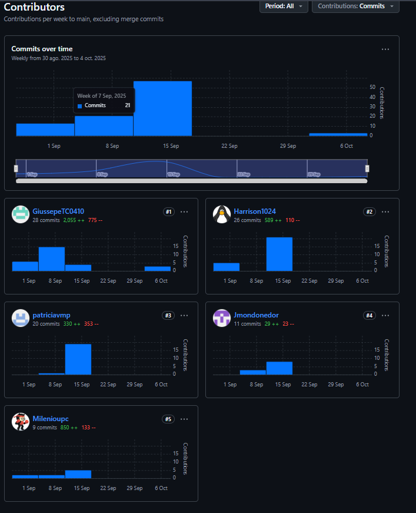</td>

**Tb1 Pulse**

<td>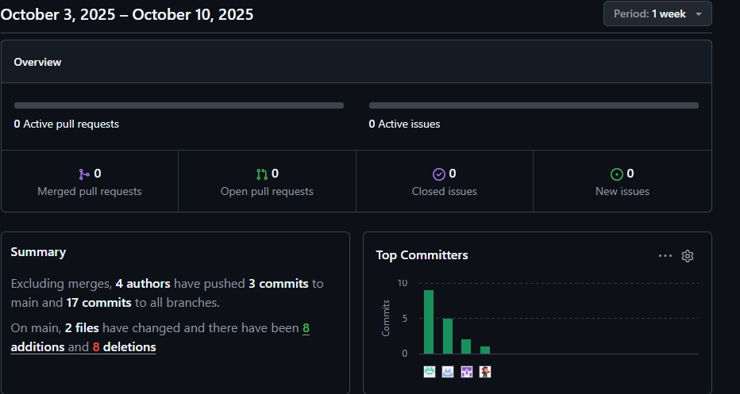</td>

</figure>

<p>Para el desarrollo del informe perteneciente a la entrega TB1, se dividió la implementación de secciones de la siguiente forma para cada integrante del equipo:</p>

<!--Link al repositorio en la organización-->
<h1>Project Report Collaboration Insights</h1>

<h2>TB1</h2>

<p>Para el desarrollo del informe perteneciente a la entrega TB1, se dividió la implementación de secciones de la siguiente forma para cada integrante del equipo:</p>

<table align="center" border="1" cellpadding="10" cellspacing="0" style="border-collapse: collapse; width: 100%;">
  <tr>
    <td align="center" style="border: 1px solid #ddd; padding: 8px;">Integrante</td>
    <td align="center" style="border: 1px solid #ddd; padding: 8px;">Tareas Asignadas</td>
  </tr>
  <tr>
    <td style="border: 1px solid #ddd; padding: 8px;">Milenio Huaman Hinostroza</td>
    <td style="border: 1px solid #ddd; padding: 8px;">
      Redacté desde la Parte 1 del informe hasta el Segmento Objetivo.
    </td>
  </tr>
  <tr>
    <td style="border: 1px solid #ddd; padding: 8px;">Jhunior Giussepe Taquiri Calderon</td>
    <td style="border: 1px solid #ddd; padding: 8px;">
      Me encargué de elaborar de forma completa el Capítulo II: Requirements Elicitation & Analysis, incluyendo la construcción de user personas, user task matrix y user journey mapping.  
Asimismo, desarrollé las secciones asignadas del Capítulo IV: Product Design, desde Style Guidelines hasta Navigation Systems, asegurando coherencia, estructura y alineación con los objetivos del proyecto.
    </td>
  </tr>
  <tr>
    <td style="border: 1px solid #ddd; padding: 8px;">Patricia Valeria Mejia Poma</td>
    <td style="border: 1px solid #ddd; padding: 8px;">
      Encargada de Empathy Mapping, As-Is/To-Be Scenario Mapping y desarrollo del product backlog.
    </td>
  </tr>
  <tr>
    <td style="border: 1px solid #ddd; padding: 8px;">Juan Diego Javier Mondoñedo Rodriguez</td>
    <td style="border: 1px solid #ddd; padding: 8px;">
      Desarrollo de Capítulo III: Requirements Specification, diseño de wireframes y mockups para la landing page y web application.
    </td>
  </tr>
  <tr>
    <td style="border: 1px solid #ddd; padding: 8px;">Harrison Hubert Payesa Torres</td>
    <td style="border: 1px solid #ddd; padding: 8px;">
      Elaboré análisis de entrevistas complementario, To-Be Scenario Mapping, algunas user stories, y participé en el diseño de wireframes y mockups de la landing page.
    </td>
  </tr>
</table>

  **TP1 Network Graph**

<td></td>

**TP1 Contributors**

<td>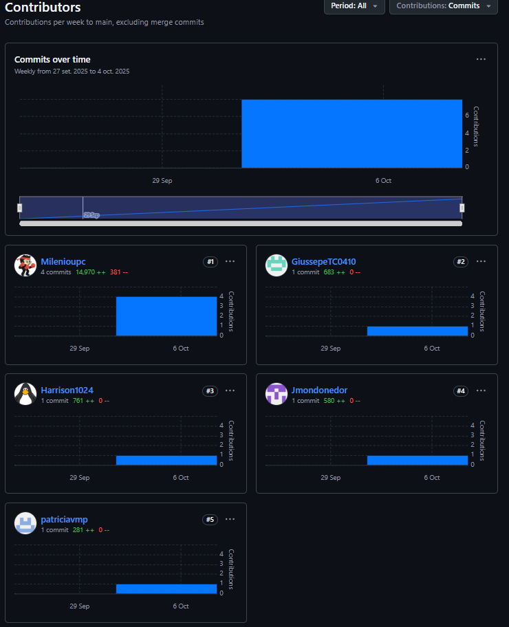</td>

**TP1 Pulse**

<td>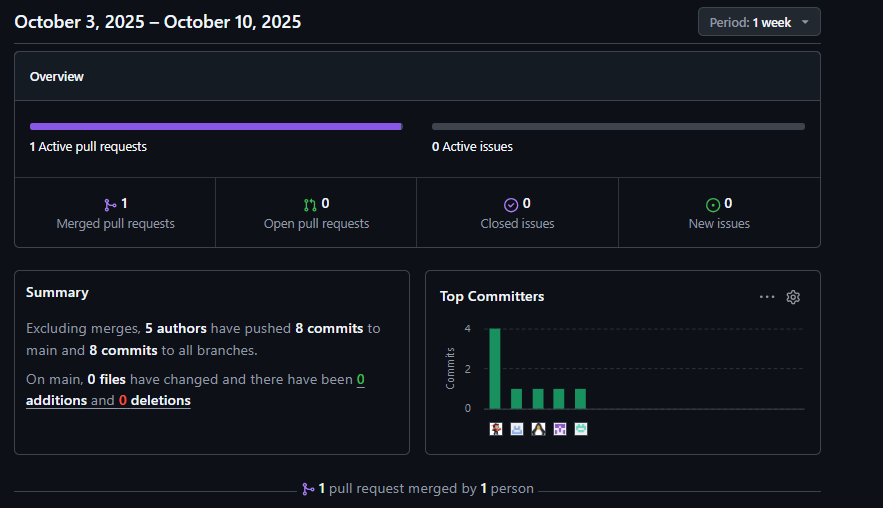</td>

<h2>TP1 — Sprint 2: Asignación de módulos</h2>

<table align="center" border="1" cellpadding="10" cellspacing="0" style="border-collapse: collapse; width: 100%;">
  <tr>
    <td align="center" style="border: 1px solid #ddd; padding: 8px;">Integrante</td>
    <td align="center" style="border: 1px solid #ddd; padding: 8px;">Módulo / Responsabilidad (Sprint 2)</td>
    <td align="center" style="border: 1px solid #ddd; padding: 8px;">Cambios / Notas</td>
  </tr>
  <tr>
    <td style="border: 1px solid #ddd; padding: 8px;">Taquiri Calderon, Jhunior Giussepe</td>
    <td style="border: 1px solid #ddd; padding: 8px;">Expenses (Gestión de Gastos)</td>
    <td style="border: 1px solid #ddd; padding: 8px;">
      Corrigió y actualizó el análisis competitivo (tabla comparativa de apps) y secciones relacionadas.
    </td>
  </tr>
  <tr>
    <td style="border: 1px solid #ddd; padding: 8px;">Payesa Torres, Harrison Hubert</td>
    <td style="border: 1px solid #ddd; padding: 8px;">Incomes (Gestión de Ingresos)</td>
    <td style="border: 1px solid #ddd; padding: 8px;">
      Corrigió y actualizó la presentación y secciones del Sprint 02
    </td>
  </tr>
  <tr>
    <td style="border: 1px solid #ddd; padding: 8px;">Mondoñedo Rodriguez, Juan Diego Javier</td>
    <td style="border: 1px solid #ddd; padding: 8px;">Goals (Metas)</td>
    <td style="border: 1px solid #ddd; padding: 8px;">—</td>
  </tr>
  <tr>
    <td style="border: 1px solid #ddd; padding: 8px;">Huaman Hinostroza, Milenio</td>
    <td style="border: 1px solid #ddd; padding: 8px;">Home &amp; Login</td>
    <td style="border: 1px solid #ddd; padding: 8px;">—</td>
  </tr>
  <tr>
    <td style="border: 1px solid #ddd; padding: 8px;">Mejia Poma, Patricia Valeria</td>
    <td style="border: 1px solid #ddd; padding: 8px;">Profile (Perfil de Usuario &amp; Configuración)</td>
    <td style="border: 1px solid #ddd; padding: 8px;">—</td>
  </tr>
</table>


**TB2 Pulse**

<td>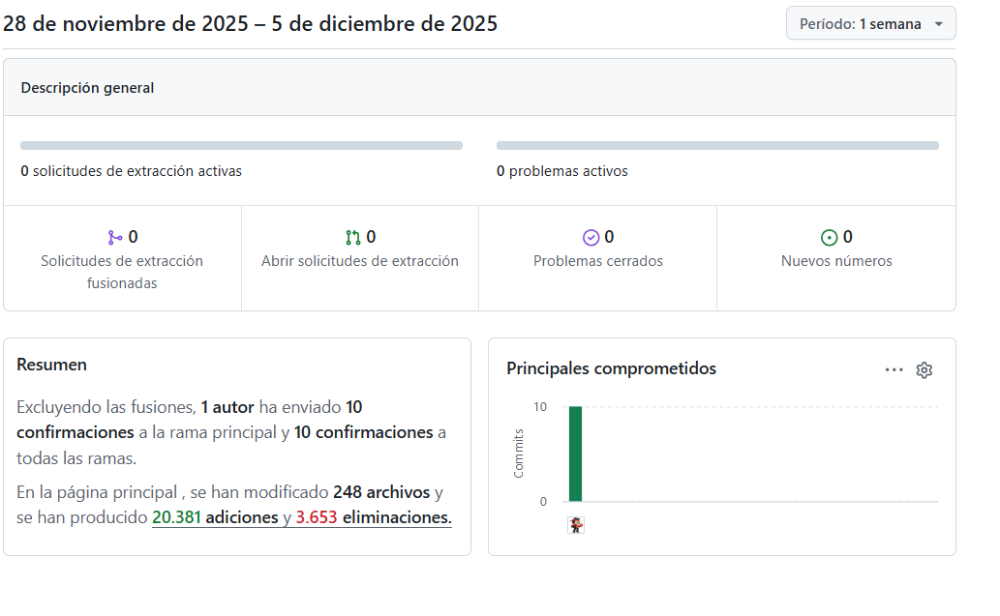</td>

<h2>TB2 — Sprint 3: Asignación de módulos</h2>

<table align="center" border="1" cellpadding="10" cellspacing="0" style="border-collapse: collapse; width: 100%;">
  <tr>
    <td align="center" style="border: 1px solid #ddd; padding: 8px;">Integrante</td>
    <td align="center" style="border: 1px solid #ddd; padding: 8px;">Módulo / Responsabilidad (Sprint 3)</td>
    <td align="center" style="border: 1px solid #ddd; padding: 8px;">Cambios / Notas (TB2)</td>
  </tr>
  <tr>
    <td style="border: 1px solid #ddd; padding: 8px;">Taquiri Calderon, Jhunior Giussepe</td>
    <td style="border: 1px solid #ddd; padding: 8px;">
      Dashboard &amp; Expenses (Resumen de Movimientos y Gestión de Gastos)
    </td>
    <td style="border: 1px solid #ddd; padding: 8px;">
      Implementó mejoras en el dashboard de Pulse (resumen de ingresos/gastos, tarjetas y alertas),
      ajustó flujos de registro de gastos recurrentes y afinó la navegación entre vistas.
      Además, actualizó la documentación de Sprint 3 y evidencias en el repositorio.
    </td>
  </tr>
  <tr>
    <td style="border: 1px solid #ddd; padding: 8px;">Huaman Hinostroza, Milenio</td>
    <td style="border: 1px solid #ddd; padding: 8px;">
      Home & Login, Sistema de Alertas, Reportes Visuales & API Goals
    </td>
    <td style="border: 1px solid #ddd; padding: 8px;">
      Lideró el desarrollo del sistema de alertas y recordatorios, implementó módulos de reportes visuales 
      con Chart.js, desarrolló la API completa de Goals (CRUD + cálculos de progreso), refinó el flujo 
      de autenticación, y manejó el deploy del backend en Heroku. Además, implementó la infraestructura 
      de internacionalización (i18n) y el switch de idiomas persistente.
    </td>
  </tr>
  <tr>
    <td style="border: 1px solid #ddd; padding: 8px;">Mejia Poma, Patricia Valeria</td>
    <td style="border: 1px solid #ddd; padding: 8px;">
      Profile &amp; Settings (Perfil de Usuario, Preferencias y Notificaciones)
    </td>
    <td style="border: 1px solid #ddd; padding: 8px;">
      Completó la edición de datos de perfil, configuración de categorías de gastos
      y preferencias de notificaciones. Ajustó textos, mensajes de ayuda y contenidos
      para mejorar la claridad y alineación con la propuesta de valor de Pulse.
    </td>
  </tr>
</table>

<!--ÍNDICE-->
# Contenido

[Student Outcome](#student-outcome)

[Capítulo I: Introducción](#capítulo-i-introducción)

- [1.1. Startup Profile](#11-startup-profile)
  - [1.1.1. Descripción de la Startup](#111-descripción-de-la-startup)
  - [1.1.2. Perfiles de integrantes del equipo](#112-perfiles-de-integrantes-del-equipo)
- [1.2. Solution Profile](#12-solution-profile)
  - [1.2.1 Antecedentes y problemática](#121-antecedentes-y-problemática)
  - [1.2.2 Lean UX Process](#122-lean-ux-process)
    - [1.2.2.1. Lean UX Problem Statements](#1221-lean-ux-problem-statements)
    - [1.2.2.2. Lean UX Assumptions](#1222-lean-ux-assumptions)
    - [1.2.2.3. Lean UX Hypothesis Statements](#1223-lean-ux-hypothesis-statements)
    - [1.2.2.4. Lean UX Canvas](#1224-lean-ux-canvas)
- [1.3. Segmentos objetivo](#13-segmentos-objetivo)
- [Capítulo II: Requirements Elicitation \& Analysis](#capítulo-ii-requirements-elicitation--analysis)
  - [2.1. Competidores](#21-competidores)
    - [2.1.1. Análisis competitivo](#211-análisis-competitivo)
    - [2.1.2. Estrategias y tácticas frente a competidores](#212-estrategias-y-tácticas-frente-a-competidores)
  - [2.2. Entrevistas](#22-entrevistas)
    - [2.2.1. Diseño de entrevistas](#221-diseño-de-entrevistas)
    - [2.2.2. Registro de entrevistas](#222-registro-de-entrevistas)
    - [2.2.3. Análisis de entrevistas](#223-análisis-de-entrevistas)
  - [2.3. Needfinding](#23-needfinding)
    - [2.3.1. User Personas](#231-user-personas)
    - [2.3.2. User Task Matrix](#232-user-task-matrix)
    - [2.3.3. User Journey Mapping](#233-user-journey-mapping)
    - [2.3.4. Empathy Mapping](#234-empathy-mapping)
    - [2.3.5. As-is Scenario Mapping](#235-as-is-scenario-mapping)
  - [2.4. Ubiquitous Language](#24-ubiquitous-language)
- [Capítulo III: Requirements Specification](#capítulo-iii-requirements-specification)
  - [3.1. To-Be Scenario Mapping](#31-to-be-scenario-mapping)
  - [3.2. User Stories](#32-user-stories)
  - [3.3. Impact Mapping](#33-impact-mapping)
  - [3.4. Product Backlog](#34-product-backlog)
- [Capítulo IV: Product Design](#capítulo-iv-product-design)
  - [4.1. Style Guidelines](#41-style-guidelines)
    - [4.1.1. General Style Guidelines](#411-general-style-guidelines)
    - [4.1.2. Web Style Guidelines](#412-web-style-guidelines)
  - [4.2. Information Architecture](#42-information-architecture)
    - [4.2.1. Organization Systems](#421-organization-systems)
    - [4.2.2. Labeling Systems](#422-labeling-systems)
    - [4.2.3. SEO Tags and Meta Tags](#423-seo-tags-and-meta-tags)
    - [4.2.4. Searching Systems](#424-searching-systems)
    - [4.2.5. Navigation Systems](#425-navigation-systems)
  - [4.3. Landing Page UI Design](#43-landing-page-ui-design)
    - [4.3.1. Landing Page Wireframe](#431-landing-page-wireframe)
    - [4.3.2. Landing Page Mock-up](#432-landing-page-mock-up)
  - [4.4. Web Applications UX/UI Design](#44-web-applications-uxui-design)
    - [4.4.1. Web Applications Wireframes](#441-web-applications-wireframes)
    - [4.4.2. Web Applications Wireflow Diagrams](#442-web-applications-wireflow-diagrams)
    - [4.4.3. Web Applications Mock-ups](#443-web-applications-mock-ups)
    - [4.4.4. Web Applications User Flow Diagrams](#444-web-applications-user-flow-diagrams)
  - [4.5. Web Applications Prototyping](#45-web-applications-prototyping)
  - [4.6. Domain-Driven Software Architecture](#46-domain-driven-software-architecture)
    - [4.6.1. Software Architecture Context Diagram](#461-software-architecture-context-diagram)
    - [4.6.2. Software Architecture Container Diagrams](#462-software-architecture-container-diagrams)
    - [4.6.3. Software Architecture Components Diagrams](#463-software-architecture-components-diagrams)
    - [4.6.4. Software Architecture Packages and Layers Diagrams](#464-software-architecture-packages-and-layers-diagrams)
  - [4.7. Software Object-Oriented Design](#47-software-object-oriented-design)
    - [4.7.1. Class Diagrams](#471-class-diagrams)
    - [4.7.2. Class Dictionary](#472-class-dictionary)
  - [4.8. Database Design](#48-database-design)
    - [4.8.1. Database Diagram](#481-database-diagram)
- [Capítulo V: Product Implementation, Validation \& Deployment](#capítulo-v-product-implementation-validation--deployment)
  - [5.1. Software Configuration Management](#51-software-configuration-management)
    - [5.1.1. Software Development Environment Configuration](#511-software-development-environment-configuration)
    - [5.1.2. Source Code Management](#512-source-code-management)
    - [5.1.3. Source Code Style Guide \& Conventions](#513-source-code-style-guide--conventions)
    - [5.1.4. Software Deployment Configuration](#514-software-deployment-configuration)
  - [5.2. Landing Page, Services \& Applications Implementation](#52-landing-page-services--applications-implementation)
    - [5.2.1. Sprint 1](#521-sprint-1)
      - [5.2.1.1. Sprint Planning 1](#5211-sprint-planning-1)
      - [5.2.1.2. Aspect Leaders and Collaborators](#5212-aspect-leaders-and-collaborators)
      - [5.2.1.3. Sprint Backlog 1](#5213-sprint-backlog-1)
      - [5.2.1.4. Development Evidence for Sprint Review](#5214-development-evidence-for-sprint-review)
      - [5.2.1.5. Execution Evidence for Sprint Review](#5215-execution-evidence-for-sprint-review)
      - [5.2.1.6. Services Documentation Evidence for Sprint Review](#5216-services-documentation-evidence-for-sprint-review)
    - [5.2.2. Sprint 2](#522-sprint-2)
      - [5.2.2.1. Sprint Planning 2](#5221-sprint-planning-2)
      - [5.2.2.2. Aspect Leaders and Collaborators LACX](#5222-aspect-leaders-and-collaborators-lacx)
      - [5.2.2.3. Sprint Backlog 2](#5223-sprint-backlog-2)
      - [5.2.2.4. Development Evidence for Sprint Review](#5224-development-evidence-for-sprint-review)
      - [5.2.2.5. Execution Evidence for Sprint Review](#5225-execution-evidence-for-sprint-review)
      - [5.2.2.6. Services Documentation Evidence for Sprint Review](#5226-services-documentation-evidence-for-sprint-review)
      - [5.2.2.7. Software Deployment Evidence for Sprint Review](#5227-software-deployment-evidence-for-sprint-review)
      - [5.2.2.8. Team Collaboration Insights during Sprint](#5228-team-collaboration-insights-during-sprint)

    - [5.2.3. Sprint 3](#523-sprint-3)
      - [5.2.3.1. Sprint Planning 3](#5231-sprint-planning-3)
      - [5.2.3.2. Aspect Leaders and Collaborators LACX (Sprint 3)](#5232-aspect-leaders-and-collaborators-lacx-sprint-3)
      - [5.2.3.3. Sprint Backlog 3](#5233-sprint-backlog-3)
      - [5.2.3.4. Development Evidence for Sprint Review (Sprint 3)](#5234-development-evidence-for-sprint-review)
      - [5.2.3.5. Execution Evidence for Sprint Review (Sprint 3)](#5235-execution-evidence-for-sprint-review)
      - [5.2.3.6. Services Documentation Evidence for Sprint Review (Sprint 3)](#5236-services-documentation-evidence-for-sprint-review)
      - [5.2.3.7. Software Deployment Evidence for Sprint Review (Sprint 3)](#5237-software-deployment-evidence-for-sprint-review)
      - [5.2.3.8. Team Collaboration Insights during Sprint (Sprint 3)](#5238-team-collaboration-insights-during-sprint)

  - [5.4. Video About-the-Product](#54-video-about-the-product)
- [Conclusiones y recomendaciones](#conclusiones-y-recomendaciones)
- [Video About-the-Team](#video-about-the-team)
- [Bibliografía](#bibliografía)
- [Anexos](#anexos)
  
<!--STUDENT OUTCOME-->

# Student Outcome

| Student Outcomes | Acciones realizadas | Conclusiones |
|---|---|---|
| **3.c1. Comunica oralmente con efectividad a diferentes rangos de audiencia** | **Milenio Huaman**<br>TB1: Parte 1 hasta Segmento Objetivo     .<br>TP1: Presenté el pitch del problema, moderé entrevistas iniciales y expuse la definición de segmentos objetivo al equipo y al docente . .<br>TB2: Presenté los avances del Sprint 3 (Login/Home), expuse hallazgos de entrevistas de validación y argumenté problemas heurísticos identificados <br><br>**Giussepe Taquiri**<br>TB1:Capítulo II hasta User Journey Mapping. .<br>TP1: Conduje reuniones de coordinación, expliqué el flujo general (As-Is/To-Be) y prioricé el backlog para alinear al equipo <br> TB2: Expuse el módulo de Documentos y Dashboard, dirigí entrevistas de validación del Sprint 3 y sustenté la síntesis de problemas y mejoras del producto  <br><br>**Patricia Mejía**<br>TB1: Socialicé hallazgos de entrevistas y presenté el enfoque del Empathy Map y Journey preliminar al grupo.<br>TP1: Empathy Mapping hasta Product Backlog.<br>TB2: Presenté avances de Perfil & Configuración, resultados de la evaluación heurística y recomendaciones de accesibilidad, contenido y consistencia visual<br><br>**Juan Diego Mondoñedo**<br>TB1: Expliqué criterios de aceptación y facilité la revisión del Product Backlog con el equipo.<br>TP1: Desde Product Backlog en adelante.<br><br>**Harrison Payesa**<br>TB1: Cerré el Sprint 1 con demo de landing básica y comuniqué observaciones de QA para el siguiente sprint.<br>TP1: Continuación de Product Backlog y revisiones finales. | **TB1:** Se demostró comunicación oral efectiva al presentar problema, segmentos y primeras decisiones de diseño; se adaptó el lenguaje a audiencias técnicas y no técnicas.<br><br>**TP1:** Cada integrante expuso sus avances asignados y justificó decisiones (backlog, journey y artefactos), consolidando un entendimiento común del alcance. <br>**TB2:** Se demostró claridad al comunicar hallazgos de entrevistas, resultados heurísticos y mejoras del producto, evidenciando madurez comunicacional y dominio técnico en Sprint 3. |
|
| **3.c2. Comunica por escrito con efectividad a diferentes rangos de audiencia** | **Milenio Huaman**<br>TB1: Redacté la problemática y segmentos con lenguaje claro para lectores no técnicos y técnicos.<br>TP1: Parte 1 hasta Segmento Objetivo.<br> TB2: Documenté hallazgos de entrevistas, flujo Login/Home y parte de la evaluación heurística del Sprint 3.<br><br>**Giussepe Taquiri**<br>TB1: Documenté el Cap. II (visión/alcance) y registré acuerdos del equipo con trazabilidad en el repositorio.<br>TP1: Capítulo II hasta User Journey Mapping.<br>TB2: Redacté 5.3 Validation Interviews (diseño, registro y análisis), documentación heurística y evidencias del Sprint 3 para el informe final.<br><br>**Patricia Mejía**<br>TB1: Elaboré plantillas y redacción del Empathy Map y Journey inicial con criterios de claridad y coherencia.<br>TP1: Empathy Mapping hasta Product Backlog.<br>TB2: Documenté Perfil & Configuración, recomendaciones heurísticas y ajustes de accesibilidad, contenido y consistencia textual.<br><br>**Juan Diego Mondoñedo**<br>TB1: Escribí el Product Backlog con historias, criterios de aceptación y prioridades.<br>TP1: Desde Product Backlog en adelante.<br><br>**Harrison Payesa**<br>TB1: Registré observaciones de QA y checklist de correcciones en el documento del sprint.<br>TP1: Continuación de Product Backlog y revisiones finales. | **TB1:** La redacción de antecedentes, segmentos, mapas y backlog mantuvo coherencia, ortografía y estilo técnico adecuados para distintos públicos.<br><br>**TP1:** La documentación por secciones aseguró claridad y trazabilidad de decisiones, facilitando revisión y continuidad del trabajo.<br>**TB2:** Se evidenció precisión técnica y claridad al documentar entrevistas, validaciones, análisis heurístico y módulos del Sprint 3, fortaleciendo la calidad escrita del informe final. |
 |


<!--TODAS LAS SECCIONES A COMPLETAR-->

# Capítulo I: Introducción

## 1.1. Startup Profile

En esta sección se brinda la descripción de nuestra startup, producto y miembros de equipo.

### 1.1.1. Descripción de la Startup

**Nombre de la Startup:** <br>KASHU<br>
**Descripción:** <br>Kashu es una empresa emergente Fintech enfocada en desarrollar soluciones digitales innovadoras que promuevan la inclusión financiera y la gestión responsable del dinero en Latinoamérica.<br>
**Misión:** <br>Nuestra visión es convertirnos en una plataforma tecnológica de referencia para el manejo financiero personal y familiar, ofreciendo herramientas accesibles, intuitivas y escalables que empoderen a los usuarios a tomar mejores decisiones económicas.<br>
**Visión:** <br>Nuestra misión es democratizar el acceso a la educación y control financiero mediante productos digitales sencillos, inclusivos y seguros, que puedan evolucionar hacia aplicaciones móviles, servicios conectados a IoT y futuras integraciones con ecosistemas financieros.<br>

#### Logo, isotipo y logotipo

<br>
**LOGO**


**ISOTIPO**

 

**LOGOTIPO**

 

### 1.1.2. Perfiles de integrantes del equipo

<table border="1">
<tr><th>Nombre</th><th>Biografía del los integrantes del equipo</th></tr>

  <tr>
    <td></td>
    <td>
      <b>🧑‍💻 Jhunior Giussepe Taquiri Calderon (U20221C576)</b><br><br>
      Soy estudiante del sexto ciclo de Ingeniería de Software en la UPC, con una formación orientada al desarrollo de software y al uso de diversas tecnologías.
      Tengo experiencia en C++, Python, Java y SQL, además de bases en HTML, CSS y JavaScript, lo que me ha permitido trabajar tanto en lógica de programación como en aspectos de desarrollo web. <br><br>
      Me considero una persona responsable, organizada y comprometida, con facilidad para el trabajo en equipo y con interés en seguir aprendiendo para fortalecer mi perfil profesional. <br><br>
      Mis expectativas para el curso de Aplicaciones Web son muy altas, ya que representa una oportunidad para profundizar en el desarrollo frontend y backend, así como para aprender
      nuevos frameworks como Vue, que serán de gran valor en mi futuro como desarrollador.
    </td>
  </tr>
  <tr>
    <td></td></td>
    <td>
      <b>Harrison Hubert Payesa Torres (U2022201024)</b><br>
      Mi nombre es Harrison Payesa. Soy estudiante de la carrera de Ingeniería de Software. Tengo conocimientos en lenguaje Python, C++ y JavaScript, ademas de haber hecho proyectos con FrontEnd usando HTML, CSS y JS. En mi tiempo libre suelo ver películas y escuchar
    </td>
  </tr>

  <tr>
    <td></td>
    <td>
      <b>Juan Diego Javier Mondoñedo Rodriguez (U202110373)</b><br>
      Mi nombre es Juan Diego Mondoñedo, tengo 21 años y soy estudiante de la carrera de Ingenieria de Software. Soy una persona adaptable a las circunstancias y puedo amoldar mis estrategias de trabajo para cumplir las expectativas de cualquier equipo.
    </td>
  </tr>

  <tr>
    <td>
</td>
    <td>
      <b>Patricia Valeria Mejia Poma (U202523271)</b><br>
      Soy estudiante de Ingeniería de Software en la UPC. Mi experiencia abarca el desarrollo backend con tecnologías como Java y C#, y la gestión de bases de datos como MySQL y PostgreSQL. Además, tengo conocimientos en el desarrollo frontend con HTML, CSS y framework como Tailwind CSS.
      Me defino como una persona responsable y comprometida con el trabajo en equipo. Tengo un gran interés en seguir aprendiendo para fortalecer mi perfil profesional, aplicando mis habilidades para aportar soluciones innovadoras. Espero que este curso me permita profundizar en el desarrollo de aplicaciones web y consolidar mi formación como futura ingeniera.
    </td>
  </tr>

  <tr>
    <td> </td>
    <td>
      <b>Milenio Huaman Hinostroza (U20211C245)</b><br><br>
      Soy estudiante de Ingeniería de Sistemas de Software en la UPC. Mi formación está orientada al desarrollo de aplicaciones web distribuidas y al uso de tecnologías open source. Tengo experiencia en Java con Spring Boot, Angular, HTML, CSS, JavaScript y TypeScript, además de conocimientos en bases de datos SQL y en control de versiones con Git y GitHub aplicando GitFlow.<br><br>
      Me considero una persona responsable, perseverante y comprometida, con capacidad para trabajar en equipo y adaptarme a diferentes roles dentro de un proyecto. Me interesa seguir fortaleciendo mis habilidades tanto en el desarrollo backend como en frontend, además de adquirir experiencia en el diseño de experiencias de usuario (UX/UI) y en metodologías ágiles.<br><br>
      Mis expectativas para el curso de Desarrollo de Aplicaciones Open Source son altas, ya que representa una oportunidad para aplicar buenas prácticas de ingeniería de software, explorar herramientas modernas de desarrollo y consolidar mi perfil como futuro ingeniero de software capaz de aportar soluciones innovadoras y escalables.
   </td>
  </tr>
</table>

## 1.2. Solution Profile

### 1.2.1. Antecedentes y problemática

En los últimos años, la situación financiera de los jóvenes universitarios en el Perú ha cobrado especial relevancia. Diversos estudios evidencian que este grupo presenta bajos niveles de educación financiera, lo que repercute directamente en su capacidad de administrar ingresos, controlar gastos y fomentar el ahorro.

De acuerdo con la **Superintendencia de Banca, Seguros y AFP (SBS, 2023)** , la mayoría de jóvenes no cuenta con hábitos financieros formales, a pesar de que manejan recursos constantemente, ya sea a través de ingresos propios, asignaciones familiares o beneficios de becas. Asimismo, un informe de Infobae (2025) resalta que **menos del 50% de jóvenes ahorra regularmente**, reflejando una débil cultura de planificación económica.

En este contexto, el acceso temprano al crédito sin preparación adecuada ha provocado casos de **endeudamiento juvenil (UCV, 2023)**, lo que incrementa el riesgo de estrés financiero y abandono de metas académicas. Incluso entre los universitarios becados, que cuentan con apoyo institucional, persiste la dificultad de gestionar los recursos limitados destinados a su manutención

**Who (¿Quiénes?):**
<br>

- Estudiantes universitarios entre 16 y 25 años en el Perú, que pueden ser independientes, dependientes de sustento familiar o becados. Este grupo maneja recursos limitados y enfrenta dificultades para organizar sus ingresos, gastos y metas de ahorro.
<br>

**What (¿Qué sucede?):**
<br>

- Estos jóvenes carecen de hábitos financieros sólidos y no cuentan con herramientas simples y personalizadas para gestionar su dinero. El resultado es una baja capacidad de ahorro, descontrol en los egresos y, en algunos casos, endeudamiento prematuro.
<br>

**Where (¿Dónde ocurre?):**
<br>

- Principalmente en entornos urbanos y semiurbanos del Perú, donde los jóvenes acceden a educación superior, disponen de smartphones e internet, pero carecen de aplicaciones adaptadas a su contexto financiero estudiantil
<br>

**When (¿Cuándo ocurre?):**
<br>

- De manera continua a lo largo de su vida académica, en el manejo diario de mesadas, ingresos de trabajos eventuales o recursos de becas. El problema se intensifica en momentos clave como fin de mes, pagos de matrícula, servicios o imprevistos.
<br>

**Why (¿Por qué es un problema?):**
<br>

- La falta de educación y control financiero limita la autonomía económica de los jóvenes, genera estrés financiero, incrementa el riesgo de endeudamiento y compromete su capacidad de alcanzar objetivos académicos y personales.
<br>

**How (¿Cómo lo solucionan hoy?):**
<br>

- Los estudiantes gastan sin un registro claro, no distinguen entre necesidades y deseos, y no planifican metas de ahorro. Las soluciones actuales (apps bancarias o Excel) resultan poco prácticas, impersonales o difíciles de mantener en el tiempo.
 <br>

**How much (¿Cuánto cuesta no resolverlo?):**
<br>

- Según Infobae (2025), menos del 50% de jóvenes peruanos ahorra de forma regular.

- La SBS (2023) reporta que la mayoría de jóvenes no cuenta con educación financiera suficiente.

- El UCV (2023) advierte sobre el aumento del endeudamiento juvenil por falta de preparación económica.

- Según la tesis UPC (Eyzaguirre et al., 2016), estudiantes de 17 instituciones de Lima obtuvieron solo 10.8 respuestas correctas de 20 en un test financiero, lo que evidencia conocimientos débiles y los hace altamente vulnerable
 <br>

### 1.2.2. Lean UX Process

#### 1.2.2.1. Lean UX Problem Statements

Se ha detectado que, aunque los usuarios cuentan con diversas herramientas como Excel, aplicaciones bancarias o notas manuales, no logran mantener un control disciplinado y visualmente claro de su dinero. Como resultado, experimentan falta de claridad sobre sus gastos, baja motivación para registrar movimientos financieros, abandono prematuro de las herramientas existentes y poca percepción de valor en los resultados obtenidos es por ello que nos planteamos lo siguiente.

¿Cómo podríamos diseñar una solución que permita a los estudiantes llevar un registro simple y visual de sus finanzas, recibir recomendaciones y alertas personalizadas y fijar metas claras, de manera que perciban un mayor control de su dinero, aumenten la frecuencia de uso de la plataforma y logren mejores resultados en su bienestar financiero?

**Domain:**
<br>Gestión de finanzas personales (personal finance management).<br>

**Customer Segments:**
<br>Jóvenes estudiantes con ingresos y gastos variantes y recurrentes que necesitan visualizar pagos y mejorar su liquidez.</br>

**Pain Points (dolores):**
<br>

- Falta de claridad sobre en qué se gasta el dinero.
- Dificultad para llevar un registro disciplinado en Excel o manual.
- Ausencia de alertas cuando se supera un presupuesto o se acerca un pago importante.
- Poca cultura de planificación financiera accesible.</br>

**Gap (brecha actual):**
<br>

- Existen apps bancarias, pero no son inclusivas ni flexibles.
- Las soluciones globales (ej. Mint, Fintonic) no están adaptadas al contexto latinoamericano (moneda local, idioma, accesibilidad).
- El mercado latinoamericano aún carece de herramientas sencillas, visuales e inclusivas.</br>

**Vision/Strategy:**
<br>

- Brindar una plataforma digital inclusiva, simple y visual que ayude a las personas a registrar, categorizar y analizar sus finanzas personales.
- Evolucionar hacia integraciones móviles, IoT y APIs bancarias para automatizar el proceso.</br>

**Initial Segment:**
<br>Estudiantes jóvenes (16–25 años) en Perú y Latinoamérica urbana, con acceso a internet y smartphones, pero sin hábitos financieros consolidados.</br>

#### 1.2.2.2. Lean UX Assumptions

**¿Quién es el usuario?** <br>El usuario es principalmente un joven estudiante universitarios que recibe ingresos de manera regular, aunque en muchos casos enfrenta gastos variables, deudas recurrentes o dificultades para ahorrar. Es alguien que busca tener mayor control sobre su dinero, pero que hasta ahora no ha encontrado una herramienta sencilla y confiable que le permita organizarse sin invertir demasiado tiempo o esfuerzo.<br>

**¿Dónde encaja nuestro producto en su vida?** <br>Nuestro producto encaja en su vida diaria como un aliado silencioso: no pretende reemplazar su banco ni complicarle con procesos técnicos, sino convertirse en el espacio central donde pueda visualizar de forma clara y ordenada el estado de sus finanzas. Allí, el usuario podrá entender en qué se está yendo su dinero, fijar metas y recibir alertas que lo ayuden a tomar mejores decisiones<br>

**¿Qué problemas tiene nuestro producto y cómo se pueden resolver?** <br>El problema principal es la falta de visibilidad y motivación. Hoy, muchos intentan llevar un control con Excel o notas, pero lo abandonan porque el proceso es tedioso, poco visual y sin retroalimentación.Nuestro producto aborda esta necesidad ofreciendo simplicidad en el registro de ingresos y egresos, categorización automática y reportes visuales fáciles de interpretar, además de notificaciones que guían al usuario en momentos clave, como cuando está por superar su presupuesto.<br>

**¿Cuándo y cómo se usará nuestro producto?** <br>El producto será utilizado en los momentos cotidianos en los que la persona recibe dinero o realiza un gasto: al pagar una cuenta, comprar en el supermercado o planificar a fin de mes. En su versión web, se utilizará sobre todo en laptops y PCs al revisar balances completos; en la app móvil permitirá registrar gastos en tiempo real desde cualquier lugar.<br>

**¿Qué características son importantes?** <br>Las características más importantes se relacionan con la simplicidad, la claridad visual y la personalización. No se trata de tener cientos de funciones, sino de que cada interacción aporte valor inmediato: registrar rápido, ver de un vistazo el estado financiero, recibir alertas útiles y definir metas alcanzables<br>

**¿Cómo debe verse nuestro producto y cómo debe comportarse?** <br>El producto debe verse moderno y confiable, con un diseño amigable y profesional que inspire seguridad, pero también accesible para cualquier persona, incluso quienes no tienen experiencia en herramientas financieras. Su comportamiento debe ser fluido y coherente: ágil al momento de registrar datos, consistente en sus reportes y proactivo al enviar recomendaciones personalizadas.<br>

#### 1.2.2.3. Lean UX Hypothesis Statements

**Hypothesis Statement 1:** <br>**Creemos que** si ofrecemos una forma rápida y sencilla de registrar ingresos y egresos, los usuarios mantendrán un registro constante de su vida financiera.
**Sabremos que** hemos tenido éxito **cuando** al menos el 60% de los usuarios registre movimientos al menos tres veces por semana.<br>

**Hypothesis Statement 2:** <br>**Creemos que** si presentamos reportes visuales claros sobre el flujo de dinero, los usuarios comprenderán mejor sus hábitos de gasto.
**Sabremos que** hemos tenido éxito **cuando** más del 70% de los usuarios consulten sus reportes al menos una vez por semana.<br>

**Hypothesis Statement 3:** <br>**Creemos que** si la solución envía alertas y recordatorios personalizados, los usuarios podrán anticiparse a gastos importantes y evitar sobrepasar sus presupuestos.
**Sabremos** que hemos tenido éxito **cuando** al menos el 50% de los usuarios ajusten su comportamiento financiero después de recibir una alerta.<br>

**Hypothesis Statement 4:**<br>Creemos que si se permite definir metas financieras alcanzables y muestra el progreso de forma motivadora, los usuarios se comprometerán más con la plataforma.
Sabremos que hemos tenido éxito cuando al menos el 40% de los usuarios logren cumplir una meta de ahorro en los primeros tres meses de uso.
</br>

#### 1.2.2.4. Lean UX Canvas

<td></td>

[Enlace para accerder al canva](https://miro.com/app/board/uXjVJL9MIK8=/?share_link_id=902556983183)

## 1.3. Segmentos objetivo

### Segmentación del Dominio del Problema

La solución TuCash está orientada a dos segmentos principales de usuarios que enfrentan retos financieros en su vida diaria y que necesitan herramientas accesibles, visuales y confiables para mejorar el control de sus ingresos y gastos.

#### 1. Estudiantes independientes (16–24 años)

- **Demografía:**
jóvenes entre 18 y 24 años que estudian y generan sus propios ingresos a través de trabajos de medio tiempo, emprendimientos o empleos formales.

- **Características:**
manejan ingresos variables y limitados, suelen cubrir gastos básicos como alimentación, transporte y en algunos casos vivienda. Priorizan la optimización de su dinero y buscan herramientas digitales que les ayuden a no perder el control.

- **Necesidades:**
un sistema ágil que les permita registrar ingresos, controlar egresos diarios y generar reportes visuales para mantener equilibrio financiero mes a mes.

- **Sustento:**
según el INEI (2023), el 36% de jóvenes peruanos entre 18 y 24 años trabaja y estudia simultáneamente, lo que genera presión sobre su administración financiera.

#### 2. Estudiantes con sustento familiar (16–24 años)

- **Demografía:**
jóvenes entre 16 y 24 años, dependientes económicamente de padres o tutores, con un ingreso mensual fijo o variable recibido como mesada o asignación familiar.

- **Características:**
 tienden a gastar en ocio, transporte, alimentación y educación; pocas veces llevan un control formal de esos gastos. Su reto no es generar ingresos, sino aprender a distribuirlos de manera responsable.

- **Necesidades:**
 una herramienta que los motive a categorizar gastos, visualizar en qué se va el dinero y aprender hábitos de ahorro.

- **Sustento:**
la ENAHO (INEI, 2022) muestra que más del 55% de jóvenes universitarios depende económicamente del hogar, lo que refleja la importancia de fomentar hábitos financieros desde la dependencia familiar.

#### 3. Estudiantes becados (16–24 años)

- **Demografía:** jóvenes entre 16 y 24 años que acceden a becas parciales o completas (estatales o privadas), muchas veces provenientes de contextos de vulnerabilidad socioeconómica.

- **Características:** aunque su matrícula y pensiones pueden estar cubiertas, suelen tener ingresos reducidos para manutención y deben administrar con cuidado los recursos otorgados. Son más sensibles a los imprevistos financieros.

- **Necesidades:** una plataforma que les ayude a priorizar gastos esenciales, planificar presupuestos ajustados y proyectar metas de ahorro pequeñas pero realistas.

- **Sustento:** el Programa Nacional de Becas y Crédito Educativo (PRONABEC, 2023) indica que más de 60,000 jóvenes en Perú son beneficiarios de becas universitarias, con condiciones económicas que requieren herramientas de control financiero.

# Capítulo II: Requirements Elicitation & Analysis

## 2.1 Competidores

### ¿Por qué llevar a cabo este análisis?

El análisis competitivo resulta fundamental para comprender el panorama del mercado de aplicaciones financieras personales. A través de esta evaluación, es posible identificar fortalezas, debilidades, oportunidades y amenazas en el sector. Además, permite diferenciar a **TuCash**, destacando su simplicidad, enfoque educativo y adaptación al contexto financiero peruano.

---

## 2.1.1 Análisis competitivo (Comparativa)

### Competitive Analysis

| **Perfil**                    | **Mi Plata**                                                | **Controlar Gastos**                         | **Monefy**                                        | **Interbank (Banco, Perú)**                                                                 | **TuCash (Perú)**                                                                 |
|------------------------------|--------------------------------------------------------------|----------------------------------------------|---------------------------------------------------|----------------------------------------------------------------------------------------------|-----------------------------------------------------------------------------------|
| **Overview**                 | App peruana para registrar ingresos/gastos y definir metas. | App simple de registro diario con reportes.  | App internacional con registro visual rápido.     | App bancaria para clientes Interbank: cuentas, tarjetas, pagos, transferencias y vista de gastos. | App peruana para estudiantes: ingresos, gastos, metas y contenido de educación financiera. |
| **Ventaja competitiva**      | Facilidad de uso y metas claras.                            | Muy sencilla y gratuita.                     | Visualización atractiva y rapidez.                | Integración directa con cuentas/tarjetas, saldos en tiempo real, seguridad bancaria.          | Localización (moneda/categorías locales), accesibilidad y personalización para jóvenes.   |
| **Clientes**                 | Adultos jóvenes que buscan control básico.                  | Usuarios que valoran simplicidad.            | Jóvenes/adultos que prefieren apps gráficas.      | Clientes de banca retail que quieren operar y controlar gastos desde su banco.               | Estudiantes universitarios y familias peruanas de ingresos medios.               |
| **Mercado objetivo**         | Usuarios no bancarizados en Perú.                           | Usuarios básicos.                            | Mercado internacional y tech-savvy.               | Mercado masivo en Perú (banca digital y móvil).                                              | Jóvenes en Perú que necesitan educación y control financiero.                    |
| **Estrategia de marketing**  | Redes sociales y app stores.                                | Boca a boca y tiendas de apps.               | Marketing global en tiendas digitales.            | Canales propios del banco (app/web), campañas digitales y red de agencias/ATMs.              | Campañas en redes sociales, alianzas con universidades y enfoque educativo.       |
| **Productos & Servicios**    | Registro de ingresos/gastos y metas.                        | Registro manual y reportes simples.          | Registro visual con gráficos.                     | Cuentas, tarjetas, pagos/servicios, préstamos; alertas y categorización básica/insights.     | Control de ingresos/gastos, metas, recordatorios, reportes y micro-tips educativos. |
| **Precios**                  | Gratuita / Premium accesible.                               | Gratuita.                                    | Gratis / Pro de pago único.                       | App sin costo; comisiones según producto/operación bancaria.                                 | Freemium: básica gratis + Premium económico en soles.                            |
| **Canales de distribución**  | App móvil (iOS/Android).                                     | App móvil.                                   | App móvil.                                        | App móvil (iOS/Android), banca por internet y red de agencias/ATMs.                           | App móvil (iOS/Android); futura versión web.                                     |

## Análisis SWOT – TuCash

| **Categoría**   | **Descripción** |
|-----------------|------------------|
| **Fortalezas**  | - Enfoque 100% local (Perú) con segmentación en estudiantes y jóvenes.<br>- UX sencilla e intuitiva con onboarding rápido.<br>- Personalización: categorías locales, moneda PEN e i18n (ES/EN).<br>- Modelo freemium accesible y mensajes adaptados al contexto peruano.<br>- Énfasis en educación financiera, metas y recordatorios útiles.<br>- Roadmap multiplataforma (móvil hoy; web en desarrollo). |
| **Debilidades** | - Sin integración bancaria automática aún (mayor fricción por carga manual).<br>- Bajo reconocimiento de marca y comunidad en crecimiento.<br>- Recursos limitados para marketing y soporte 24/7.<br>- Analítica/insights básicos si no se instrumenta correctamente.<br>- Dependencia de tiendas . |
| **Oportunidades** | - Open Finance/APIs locales para importar y categorizar movimientos.<br>- Alianzas con universidades, becas y programas de inclusión financiera.<br>- Crecimiento de pagos digitales y educación financiera en Perú/LATAM.<br>- Diferenciación con gamificación (retos, rachas) y contenidos contextuales.<br>- Canales orgánicos (TikTok/IG) y programas de referidos para adquisición. |
| **Amenazas**    | - Apps internacionales y bancarias ampliando funcionalidades PFM.<br>- Desconfianza por privacidad de datos y riesgo de incidentes de seguridad.<br>- Cambios regulatorios (protección de datos, KYC/AML) y políticas de iOS/Android.<br>- Costos de adquisición crecientes y saturación de la categoría.<br>- Volatilidad económica que puede afectar la disposición a pagar. |

---

## 2.1.2 Estrategias y tácticas frente a competidores

### Diferenciación por localización

- Categorías y subcategorías propias del contexto peruano (transporte público, recargas, menú universitario, pensión, etc.).
- Moneda **PEN** por defecto, formatos locales y feriados/regímenes académicos del país.
- Tono y microcopys en español peruano; glosario simple de conceptos financieros.
- Soporte e-learning breve dentro de la app (tips en 15–30 palabras) contextualizado al mercado local.

### Simplicidad con educación financiera

- **UX “rápida y visual”** (registro en 2–3 toques, autocompletar, favoritos, plantillas).
- Flujos sin fricción: ingreso/egreso, metas y presupuesto en una sola vista.
- Módulo educativo integrado: microcursos, retos de ahorro y “consejo del día” dentro del dashboard.
- Onboarding guiado con objetivos (ahorro, control de gastos hormiga) y checklist inicial.

### Segmentación clara

- Foco en:
  - **Estudiantes con mesada**, **estudiantes independientes** y **becados**.
- Tácticas:
  - Packs de categorías preconfiguradas por segmento.
  - Recordatorios y retos alineados al ciclo universitario (inicios de ciclo, exámenes, matrículas).
  - Beneficios y contenidos específicos (p. ej., “kit de supervivencia de fin de mes”).

### Modelo freemium atractivo

- **Gratis (core):** registro de ingresos/egresos, categorías básicas, metas simples, reportes esenciales, exportación CSV.
- **Premium (en soles):** metas avanzadas, presupuestos por categoría, reportes automáticos, recordatorios inteligentes, reglas de auto-categorización, microcursos y retos ampliados.
- Paywall claro, sin fricciones, con prueba limitada por tiempo o funcionalidades.

### Confianza y transparencia

- Política de privacidad clara y en lenguaje no técnico; centro de control de datos dentro de la app.
- Cifrado en tránsito y en reposo; mínimos permisos; anonimización para analítica.
- Cumplimiento con normativa local de datos personales; registro de cambios y auditoría básica.
- Página de **estatus** y canal de soporte visible en la app.

### Marketing educativo

- **Alianzas con universidades** (charlas, talleres express, códigos de referido).
- Contenido útil en redes: consejos financieros, microcursos, retos semanales y testimonios.
- Narrativa de impacto social: mejora de hábitos financieros en jóvenes y familias.

---

## 2.2 Entrevistas

### 2.2.1. Diseño de entrevistas  

El objetivo de estas entrevistas es identificar y comprender las **necesidades, dificultades y expectativas** de los usuarios potenciales de **TuCash**. Para ello, se consideraron tres segmentos principales de estudiantes universitarios:  

- **Estudiantes con mesada de los padres**  
- **Estudiantes que trabajan y estudian**  
- **Estudiantes becados**  

## Segmento 1: Estudiantes con mesada de los padres  

**Preguntas principales:**  

1. ¿De cuánto es aproximadamente tu mesada y con qué frecuencia la recibes (semanal, mensual)?  
2. ¿Qué haces normalmente para administrar tu mesada: la gastas toda, intentas ahorrar o llevas un registro?  
3. ¿En qué gastas más tu mesada (alimentación, transporte, ocio, materiales de estudio, salud)?  
4. ¿Alguna vez te quedaste sin dinero antes de recibir tu siguiente mesada? ¿Qué pasó?  
5. ¿Has usado alguna app o herramienta digital para organizar tu mesada? ¿Qué te gustó o no te gustó?  
6. ¿Qué tan útil sería para ti que TuCash te envíe recordatorios cuando gastes demasiado?  
7. ¿Qué tipo de metas de ahorro te motivarían más: metas pequeñas (ej. ahorrar para un libro) o metas grandes (ej. un viaje)?  
8. ¿Cómo prefieres ver tu información: gráficos, reportes semanales o notificaciones rápidas?  
9. ¿Qué tan importante es para ti que TuCash sea fácil de usar y rápida al registrar un gasto?  
10. ¿Qué función extra haría que TuCash se vuelva tu app indispensable para manejar tu mesada?  

---

## Segmento 2: Estudiantes que trabajan y estudian  

**Preguntas principales:**  

1. ¿Cómo organizas actualmente tu dinero entre ingresos del trabajo y gastos de la universidad?  
2. ¿Llevas un registro de cuánto dinero te sobra o falta cada mes? ¿Cómo lo haces?  
3. ¿Qué gastos fijos son los más importantes para ti (pensión universitaria, transporte, alimentación, servicios, deudas)?  
4. ¿Has tenido dificultades para separar gastos personales de gastos académicos?  
5. ¿Qué tan útil sería que TuCash te muestre un balance mensual de ingresos vs. gastos?  
6. ¿Qué funciones te ayudarían más: recordatorios de pagos, metas de ahorro o alertas de gasto excesivo?  
7. ¿Prefieres que TuCash te dé reportes simples o reportes más avanzados con detalles?  
8. ¿Qué tan importante es que la app funcione también sin internet (modo offline)?  
9. ¿Confiarías en ingresar tus ingresos y gastos reales dentro de TuCash? ¿Por qué sí o no?  
10. Si TuCash tuviera una versión Premium, ¿qué te motivaría a pagarla (ej. reportes avanzados, integración con billeteras, asesoría financiera)?  

---

## Segmento 3: Estudiantes becados  

**Preguntas principales:**  

1. ¿Cómo administras actualmente el dinero que recibes de tu beca (ej. gastos básicos, ahorro, ocio)?  
2. ¿Qué tan seguido llevas un registro de en qué usas tu beca (diario, semanal, nunca)?  
3. ¿Qué gastos principales cubres con tu beca (alimentación, materiales, transporte, vivienda, salud)?  
4. ¿Has tenido problemas para que el dinero de tu beca dure todo el mes o el ciclo académico?  
5. ¿Qué tan útil sería que TuCash te ayude a planificar cuánto gastar y cuánto ahorrar de tu beca?  
6. ¿Preferirías que TuCash te dé consejos automáticos de organización o solo un registro de tus movimientos?  
7. ¿Qué tan importante es para ti que la app te muestre reportes fáciles de compartir con tus padres o tutores?  
8. ¿Qué formato te sería más cómodo: notificaciones rápidas, gráficos sencillos o reportes detallados?  
9. ¿Confiarías en una app como TuCash para organizar el dinero de tu beca? ¿Qué te daría más confianza?  
10. Si TuCash ofreciera funciones Premium, ¿qué te gustaría que incluya (ej. ahorro de emergencias, metas personalizadas, integración con cuentas universitarias)?  
 <br/><br/>

### 2.2.2 Registro de entrevistas

#### Entrevistas a estudiantes universitarios

---

| Campo        | Información |
|--------------|-------------|
| Entrevistado | Hany Pareja Berocal |
| Edad         | 20 años |
| Distrito     | Miraflores |
| Foto         | 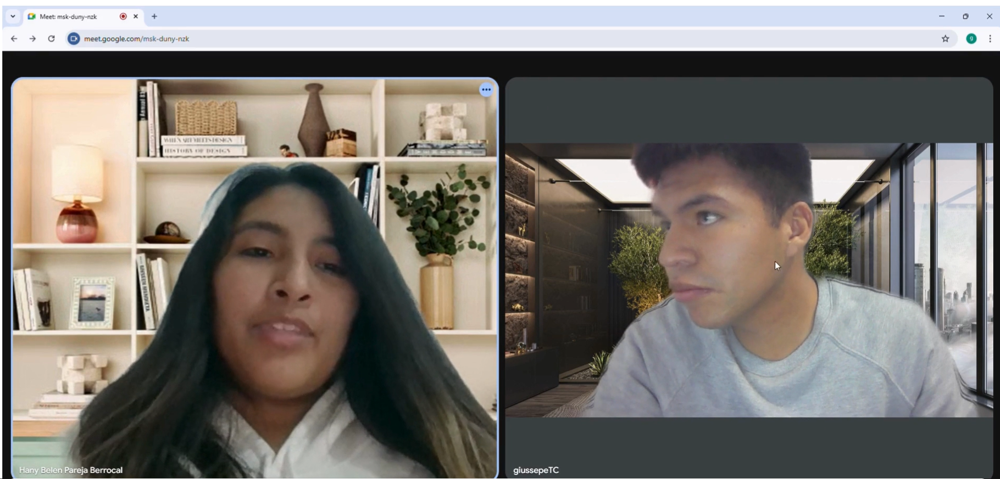 |
| Timing       | [Ver grabación](https://upcedupe-my.sharepoint.com/:v:/g/personal/u20221c576_upc_edu_pe/EbEbqhF74AlOgf3ZwSKHMokBaIijzknO4A1UVOGBx3q5KA?nav=eyJyZWZlcnJhbEluZm8iOnsicmVmZXJyYWxBcHAiOiJPbmVEcml2ZUZvckJ1c2luZXNzIiwicmVmZXJyYWxBcHBQbGF0Zm9ybSI6IldlYiIsInJlZmVycmFsTW9kZSI6InZpZXciLCJyZWZlcnJhbFZpZXciOiJNeUZpbGVzTGlua0NvcHkifX0&e=sMK4RD) |
| Segmento     | Estudiantes con mesada de los padres |
| Preguntas    | ¿De cuánto es tu mesada? / ¿Cómo la administras? / ¿En qué gastas más? / ¿Te quedaste sin dinero antes? / ¿Has usado apps? / ¿Qué tan útil serían recordatorios de gasto? / ¿Qué metas de ahorro te motivan más? / ¿Prefieres gráficos o reportes? / ¿Qué tan importante es la facilidad de uso? / ¿Qué función extra haría que TuCash sea indispensable para ti? |

---

| Campo         | Información |
|---------------|-------------|
| Entrevistado 2 | Lorena Pablo Muñoz |
| Edad          |      21     |
| Distrito      | Los Olivos  |
| Foto          |  |
| Timing        | [Ver grabación](https://utpedupe-my.sharepoint.com/:v:/g/personal/u22309749_utp_edu_pe/EZ2dLr3YzFRMj1QlKHfCVacB8w7LbHuiwvNOGSmRLtjUbQ?nav=eyJyZWZlcnJhbEluZm8iOnsicmVmZXJyYWxBcHAiOiJPbmVEcml2ZUZvckJ1c2luZXNzIiwicmVmZXJyYWxBcHBQbGF0Zm9ybSI6IldlYiIsInJlZmVycmFsTW9kZSI6InZpZXciLCJyZWZlcnJhbFZpZXciOiJNeUZpbGVzTGlua0NvcHkifX0&e=Qiehwi) |
| Segmento     | Estudiantes con mesada de los padres |
| Preguntas    | ¿De cuánto es tu mesada? / ¿Cómo la administras? / ¿En qué gastas más? / ¿Te quedaste sin dinero antes? / ¿Has usado apps? / ¿Qué tan útil serían recordatorios de gasto? / ¿Qué metas de ahorro te motivan más? / ¿Prefieres gráficos o reportes? / ¿Qué tan importante es la facilidad de uso? / ¿Qué función extra haría que TuCash sea indispensable para ti? |

---

| Campo        | Información |
|--------------|-------------|
| Entrevistado 3 | Julieta Cardenas |
| Edad         | 22 años |
| Distrito     | Surco |
| Foto         |  |
| Timing       | [Ver grabación](https://upcedupe-my.sharepoint.com/:v:/g/personal/u202221024_upc_edu_pe/Ed0AAD9c3W9FqLAdxgnqJV0BjQwIsRKgaxlTRZV2FGBUmA?nav=eyJyZWZlcnJhbEluZm8iOnsicmVmZXJyYWxBcHAiOiJPbmVEcml2ZUZvckJ1c2luZXNzIiwicmVmZXJyYWxBcHBQbGF0Zm9ybSI6IldlYiIsInJlZmVycmFsTW9kZSI6InZpZXciLCJyZWZlcnJhbFZpZXciOiJNeUZpbGVzTGlua0NvcHkifX0&e=w2kESe) |
| Segmento     | Estudiantes Independientes |
| Preguntas    | ¿Cómo organizas actualmente tu dinero? / ¿Llevas un registro de cuánto dinero te sobra o falta cada mes? / ¿Qué gastos fijos son los más importantes para ti? / ¿Has tenido dificultades para separar gastos personales de gastos académicos? / ¿Qué tan útil sería que TuCash te muestre un balance mensual? / ¿Qué funciones te ayudarían más: recordatorios de pagos, metas de ahorro o alertas de gasto excesivo? / ¿Prefieres que TuCash te dé reportes simples o reportes más avanzados con detalles? / ¿Qué tan importante es que la app funcione también sin internet? /¿Confiarías en ingresar tus ingresos y gastos reales dentro de TuCash?|

---

| Campo         | Información |
|---------------|-------------|
| Entrevistado  |    Heydi Ventura Huerta         |
| Edad          |     19        |
| Distrito      |     Villa el Salvador      |
| Foto          | 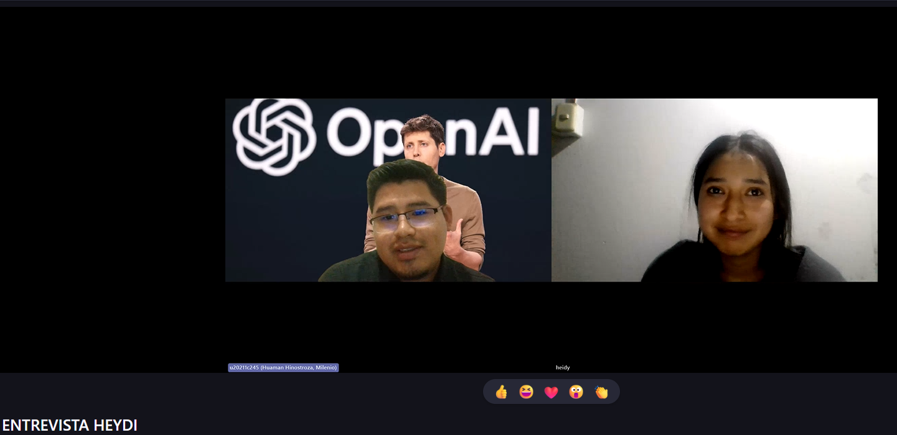|
| Timing        | [Ver grabación](https://upcedupe-my.sharepoint.com/:v:/g/personal/u20211c245_upc_edu_pe/Eflh5wAoWbxPpZSqmMyLJjEBJkN8X94tz-ldpcdm2yxGeg?nav=eyJyZWZlcnJhbEluZm8iOnsicmVmZXJyYWxBcHAiOiJTdHJlYW1XZWJBcHAiLCJyZWZlcnJhbFZpZXciOiJTaGFyZURpYWxvZy1MaW5rIiwicmVmZXJyYWxBcHBQbGF0Zm9ybSI6IldlYiIsInJlZmVycmFsTW9kZSI6InZpZXcifX0%3D&e=suvd4d) |
|Segmento|Estudiantes becados
|Preguntas|¿Cómo administras actualmente el dinero que recibes de tu beca (ej. gastos básicos, ahorro, ocio)? /¿Qué tan seguido llevas un registro de en qué usas tu beca (diario, semanal, nunca)? / ¿Qué gastos principales cubres con tu beca (alimentación, materiales, transporte, vivienda, salud)?/  ¿Has tenido problemas para que el dinero de tu beca dure todo el mes o el ciclo académico? /¿Qué tan útil sería que TuCash te ayude a planificar cuánto gastar y cuánto ahorrar de tu beca?  /¿Preferirías que TuCash te dé consejos automáticos de organización o solo un registro de tus movimientos? /¿Qué tan importante es para ti que la app te muestre reportes fáciles de compartir con tus padres o tutores?  /¿Qué formato te sería más cómodo: notificaciones rápidas, gráficos sencillos o reportes detallados?/¿Confiarías en una app como TuCash para organizar el dinero de tu beca? ¿Qué te daría más confianza?/Si TuCash ofreciera funciones Premium, ¿qué te gustaría que incluya (ej. ahorro de emergencias, metas personalizadas, integración con cuentas universitarias)?  |

---

| Campo         | Información |
|---------------|-------------|
| Entrevistado  | Alessandra Almeyda Mejia |
| Edad          | 21          |
| Distrito      | Los Olivos  |
| Foto          |  |
| Timing        | [Ver grabación](https://upcedupe-my.sharepoint.com/:v:/g/personal/u202523271_upc_edu_pe/EQdfdZ1EYHtCsdXzgAVgoDEBEDnTcRB2mqtOc-EbKGrTjg?nav=eyJyZWZlcnJhbEluZm8iOnsicmVmZXJyYWxBcHAiOiJPbmVEcml2ZUZvckJ1c2luZXNzIiwicmVmZXJyYWxBcHBQbGF0Zm9ybSI6IldlYiIsInJlZmVycmFsTW9kZSI6InZpZXciLCJyZWZlcnJhbFZpZXciOiJNeUZpbGVzTGlua0NvcHkifX0&e=A56EXR) |
|Segmento| Estudiantes que trabajan y estudian |
|Preguntas|¿Cómo organizas actualmente tu dinero entre ingresos del trabajo y gastos de la universidad?/ ¿Llevas un registro de cuánto dinero te sobra o falta cada mes?/¿Cómo lo haces?/ ¿Qué gastos fijos son los más importantes para ti (pensión universitaria, transporte, alimentación, servicios, deudas)?/ ¿Has tenido dificultades para separar gastos personales de gastos académicos?/ ¿Qué tan útil sería que TuCash te muestre un balance mensual de ingresos vs. gastos?/ ¿Qué funciones te ayudarían más: recordatorios de pagos, metas de ahorro o alertas de gasto excesivo?/ ¿Prefieres que TuCash te dé reportes simples o reportes más avanzados con detalles?/ ¿Qué tan importante es que la app funcione también sin internet (modo offline)?/ ¿Confiarías en ingresar tus ingresos y gastos reales dentro de TuCash? ¿Por qué sí o no?/ Si TuCash tuviera una versión Premium, ¿qué te motivaría a pagarla (ej. reportes avanzados, integración con billeteras, asesoría financiera)? |

---

| Campo         | Información |
|---------------|-------------|
| Entrevistado  |   Yvonne Ramos          |
| Edad          |      20       |
| Distrito      |       Ate       |
| Segmento      |  Estudiantes becados|
| Foto          |  |
| Timing        | [Ver grabación](https://upcedupe-my.sharepoint.com/:v:/g/personal/u20221c576_upc_edu_pe/EbkrCYgV7aZHmHPcA-XlWzQB9m_6yofDWtGXL2oeLx4QZw?nav=eyJyZWZlcnJhbEluZm8iOnsicmVmZXJyYWxBcHAiOiJPbmVEcml2ZUZvckJ1c2luZXNzIiwicmVmZXJyYWxBcHBQbGF0Zm9ybSI6IldlYiIsInJlZmVycmFsTW9kZSI6InZpZXciLCJyZWZlcnJhbFZpZXciOiJNeUZpbGVzTGlua0NvcHkifX0&e=EEfR2w) |

### 2.2.3 Análisis de entrevistas

#### Análisis del segmento

**Segmento 1: Estudiantes con mesada de los padres**

#### Entrevistado 1 (Hany Berrocal)

#### Perfil

- Hany, de 20 años, estudiante universitario en Miraflores.
- Recibe mesada de sus padres y busca gestionar mejor su dinero.

#### Insights clave

- **Administración del dinero:** Hany intenta ahorrar, pero a veces gasta más de lo previsto, mostrando la dificultad de mantener un control financiero constante.
- **Gastos principales:** Alimentación y transporte consumen la mayor parte de su mesada; ocio y materiales de estudio se gestionan según disponibilidad.
- **Uso de apps:** Ha probado aplicaciones como Wallet y Spendee; valora los gráficos y la categorización de gastos, pero encuentra tedioso el registro manual y algunas funciones de pago limitantes.

#### Estrategias actuales

- Anota gastos grandes para no perder control.
- Ajusta su consumo o pide apoyo adicional a sus padres cuando se queda sin dinero.

#### Apertura a soluciones digitales

- Interesado en recordatorios automáticos y funcionalidades que permitan monitorear y planificar sus gastos.
- Valora integración con tarjetas o billeteras digitales y recomendaciones personalizadas.

#### Necesidades

- Herramientas para monitorear gastos diarios y evitar quedarse sin dinero antes de recibir la mesada.
- Funciones de planificación de ahorro, con metas pequeñas y grandes, para motivar hábitos financieros positivos.
- Visualización clara de gastos: gráficos, reportes semanales y notificaciones rápidas para facilitar la toma de decisiones.

#### Oportunidades para TuCash

- **Recordatorios automáticos:** Alertas cuando se aproxima al límite de gasto diario o mensual.
- **Conexión con tarjetas/billeteras:** Registrar gastos automáticamente sin intervención manual.
- **Recomendaciones personalizadas:** Consejos de ahorro, avisos sobre gastos excesivos y sugerencias para alcanzar metas de ahorro.
- **Reportes visuales:** Gráficos intuitivos y resúmenes semanales que permitan entender hábitos de consumo.

---

#### Entrevistado 2 (Brigitte  Pablo)

#### Perfil

- **Nombre:** Brigitte Lorena Pablo Muñoz

- **Edad:** 21 años
- **Ocupación:** Estudiante de Derecho (8º ciclo)
- **Fuente de Ingresos:** Mesada semanal de S/ 200 de sus padres.

#### Insights Clave

- **Gestión Actual:** Administración **100% intuitiva y mental**. No usa herramientas. Su principal meta es evitar quedarse sin dinero.

- **Patrón de Gasto:** Los gastos principales y recurrentes son **transporte y alimentación** en la universidad.
- **Experiencia Digital:** **Cero experiencia** con apps de finanzas. Es un perfil "virgen", sin hábitos preexistentes.
- **Preferencia de Comunicación:** Valora las **notificaciones rápidas y directas** por encima de los gráficos o reportes complejos. Busca inmediatez.

#### Necesidades

1. **Registro de Gastos Ultra-Rápido:** Un método para añadir gastos en segundos, sin fricción.
2. **Feedback en Tiempo Real:** Notificaciones automáticas que le indiquen el estado de su presupuesto semanal.
3. **Metas de Ahorro Pequeñas:** Se motiva con objetivos a corto plazo y alcanzables (ej: "Ahorrar S/ 20 para el fin de semana").
4. **Visibilidad sin Esfuerzo:** Un resumen claro de "cuánto dinero le queda" sin necesidad de análisis.

#### Oportunidades para TuCash

- **Feature: "Quick Add"**: Botón principal para registrar un gasto en dos clics. **Prioridad: Velocidad**.

- **Feature: Notificaciones Inteligentes**: Alertas automáticas y personalizadas.
  - `"Has gastado el 50% de tu mesada."`
  - `"Tu mayor gasto esta semana es en alimentación."`
- **Feature: Micro-Metas de Ahorro**: Módulo para que el usuario defina y rastree pequeños objetivos de ahorro, fomentando el hábito.
- **UI/UX:** Diseñar un **Dashboard simple y visual** centrado en una sola métrica: **"Dinero Restante"**.

---

**Segmento 2: Estudiante independiente**

#### Entrevistado 3 (Julieta Cardenas)

#### Perfil

- Julieta Cardenas, estudiante universitario de 20 años, trabaja y financia sus estudios de manera independiente.
- Maneja ingresos propios que distribuye entre pensión universitaria, transporte, alimentación y gastos personales.
- Tiene experiencia básica con herramientas de registro como Excel o bloc de notas.

#### Insights clave

- **Administración del dinero:** Organiza sus ingresos priorizando la pensión universitaria, luego transporte y alimentación. Sin embargo, presenta dificultades para separar gastos académicos de los personales.
- **Gastos principales:** Pensión universitaria, transporte, alimentación y plan de celular.
- **Registro financiero:** Usa métodos básicos (Excel y notas en el celular), lo que le permite calcular excedentes, pero no llevar un control profundo.
- **Confianza y seguridad:** Dispuesto a ingresar datos reales en TuCash siempre que la seguridad esté garantizada, destacando su conocimiento del sector financiero.

#### Estrategias actuales

- Separa inicialmente la pensión universitaria y algunos gastos fijos.
- Recurre a registros simples (Excel, notas) para identificar sobrantes.
- Ajusta entre gastos personales y académicos, aunque a veces se desordena y compromete pagos importantes.

#### Apertura a soluciones digitales

- Interesado en recordatorios automáticos de pagos como prioridad para evitar retrasos.
- Aprecia reportes simples, pero con la opción de acceder a mayor detalle bajo demanda.
- Da mucha importancia a que la app tenga modo offline para seguir registrando gastos sin internet.
- Considera atractiva la integración con billeteras digitales y asesoría financiera personalizada en una versión Premium.

#### Necesidades

- Recordatorios de fechas de pago (pensión, servicios, celular) para evitar atrasos.
- Balance mensual claro de ingresos vs. gastos para identificar excesos y oportunidades de ahorro.
- Separación clara entre gastos académicos y personales.
- Funcionalidad offline para registrar transacciones sin conexión.
- Seguridad confiable para ingresar información financiera real.

#### Oportunidades para TuCash

- **Recordatorios automáticos de pagos:** Notificaciones previas a vencimientos (ej. pensión universitaria, celular).
- **Balance mensual simple + detallado:** Vista clara de ingresos y gastos con opción de profundizar.
- **Modo offline:** Registro de transacciones sin depender de internet.
- **Integración con billeteras digitales:** Automatizar registro de gastos y mejorar la experiencia.
- **Funciones Premium:** Reportes avanzados y asesoría financiera personalizada para usuarios con ingresos propios.

<br/>

**Estudiantes becados (18–25 años):**  

### Entrevista (Heydi Ventura)

#### Perfil

- Hany, de 19 años, estudiante universitario en UPCH( Universidad Peruana Cayetano Heredia).
- Es beneficiaria de la beca 18.

#### Insights clave

- **Administración del dinero:** Suele ser desordenada en cuanto a la administracion del dinero recibido de la beca y no lleva registros ni planificaicones de gastos.
- **Gastos principales:** Aliemntacion, alquiler, comida, salud y pasajes, en ocasiones suele gastar en osico o diversion.
- **Uso de apps:** No ah usado aplicaciones que le ayuden administrar su dinero, solo tiene algunas anotaciones en papel.

#### Estrategias actuales

- Anota gastos fijos para que no genere deudas.
- Ajusta su consumo para llegar a fin de mes.

#### Apertura a soluciones digitales

- Interesado en notificaciones push por que suele ser descuidada.
- Visualizacion de balance de ingresos y egresos.

#### Necesidades

- Herramientas para monitorear gastos diarios.
- Visualización clara de gastos: gráficos, reportes semanales y notificaciones rápidas para facilitar la toma de decisiones.

#### Oportunidades para TuCash

- **Recordatorios automáticos:** notificaciones cuando se aproxima al límite de gasto diario o mensual.
- **Reportes visuales:** Gráficos intuitivos y resúmenes semanales que permitan entender hábitos de consumo.
- **Agente especializado** Un agente IA que mediante comando de voz llene la data de gastos.

---

### Entrevista (Yvonne Ramos)

#### Perfil

- **Nombre:** Yvonne Ramos
- **Programa:** Estudia Ingeniería Civil en la UTP
- **Situación:** Universitaria con **ingreso principal por beca.
- **Responsabilidades de gasto:** Alimentación, transporte, materiales académicos; gastos ocasionales en salud; ocio solo con lo que sobra.

#### Insights clave

- **Registro intermitente:** Control semanal en libreta, no diario → baja constancia y poca visibilidad fina.
- **Dolor de mes a mes:** La beca no siempre alcanza por gastos inesperados (fotocopias, proyectos, salidas de campo), subida de pasajes y salud.
- **Necesidad de guía, no solo registro:** Prefiere consejos automáticos y alertas sobre un simple log.
- **Rendición de cuentas:** Valora reportes fáciles de compartir con padres/tutores.
- **Confianza:** Requiere claridad, seguridad y facilidad de uso; suma puntos el respaldo institucional (universidad/entidad reconocida).
- **Preferencias de UI:** Gráficos sencillos para el día a día + reporte mensual detallado.

#### Estrategias actuales

- **Presupuesto mental por “partes”:** básicos (alimentación/transporte), materiales y un pequeño ahorro.
- **Ajuste de consumo** cuando el mes se complica.

#### Apertura a soluciones digitales

- **Alta**, siempre que la app sea **simple, segura** y ofrezca **alertas y recomendaciones** prácticas.

#### Necesidades

- **Monitoreo de gastos diarios** con mínima fricción.
- **Planificación** de cuánto gastar/ahorrar de la beca.
- **Visualizaciones claras** (gráficos y resúmenes) + notificaciones rápidas.
- **Reportes compartibles** (PDF/imagen/link) para padres/tutores.
- **Funciones Premium básicas:** fondo de emergencias y metas sencillas (p. ej., materiales).

#### Oportunidades para TuCash

- **Presupuesto por sobres (buckets):** básicos, materiales, transporte, salud, ocio.
- **Alertas inteligentes:** “Estás a 80% del presupuesto de transporte”, “Gasto inusual en materiales esta semana”.
- **Planificador de beca:** sugerir % para gasto vs. ahorro al inicio del mes (p. ej., 70/20/10).
- **Reportes para familia:** un clic para generar **reporte mensual** y **resumen semanal** compartible.
- **Fondo de emergencias:** aportes automáticos (redondeo/porcentaje).
- **Metas simples:** “Ahorrar S/ X para material Y en N semanas” con barra de progreso.
- **Respaldo institucional:** espacio para sello/aval de la universidad o convenios.

## 2.3. Needfinding

### 2.3.1. User Personas

**Estudiantes con mesada de los padres**  

**Estudiantes que trabajan y estudian**  

 

**Estudiantes becados**
 

### 2.3.2. User Task Matrix

| **Task** | **Estudiantes con mesada** <br>(16–24 años) |  | **Estudiantes que trabajan y estudian** <br>(18–26 años) |  | **Estudiantes becados** <br>(18–25 años) |  |
|----------|---------------------------------------------|--|-----------------------------------------------------------|--|-------------------------------------------|--|
|          | **Frequency** | **Importance** | **Frequency** | **Importance** | **Frequency** | Importance |
| Registrar gastos diarios | Sometimes | Medium | Always | High | Often | High |
| Registrar ingresos (mesada, trabajos, becas) | Always | High | Always | High | Always | High |
| Ahorrar para metas específicas (viajes, estudios, emergencias) | Sometimes | Medium | Often | High | Often | High |
| Controlar presupuesto mensual | Often | High | Always | High | Always | High |
| Revisar historial de gastos | Sometimes | Medium | Often | High | Often | High |
| Recibir alertas de pagos/recordatorios | Often | High | Always | High | Always | High |
| Usar apps móviles para pagos o control financiero | Often | High | Always | High | Often | High |
| Compartir gastos con amigos/familia | Often | Medium | Sometimes | Medium | Rarely | Low |
| Planificar gastos futuros | Sometimes | Medium | Often | High | Often | High |
| Manejo de deudas o préstamos | Rarely | Low | Often | High | Sometimes | Medium |
| Educación financiera/autocapacitación | Sometimes | Medium | Often | High | Always | High |

### 2.3.3. User Journey Mapping

### Segmento 1: Estudiantes con mesada


### Segmento 2: Estudiantes que trabajan y estudian


### Segmento 3: Estudiantes becados


### 2.3.4. Empathy Mapping

**Empathy Map: Estudiante con sustento familiar**  

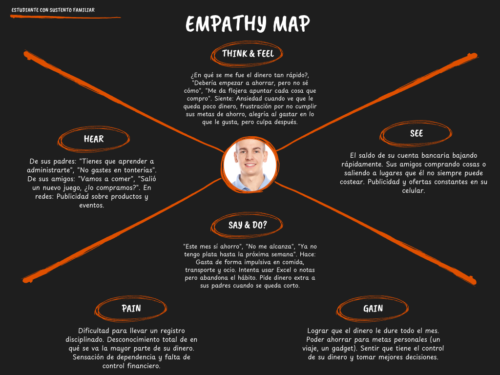

**Empathy Map: Estudiante que trabaja y estudia**  

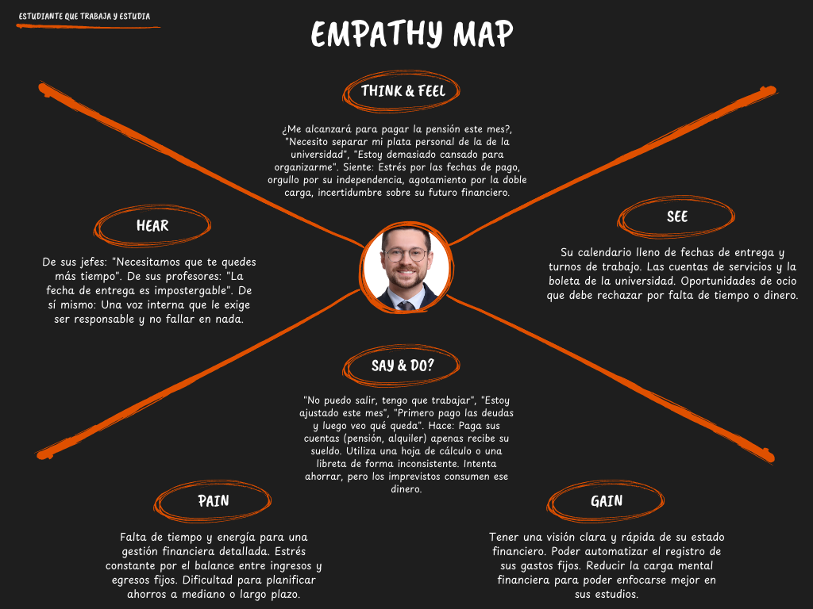

**Empathy Map: Estudiante becado**  

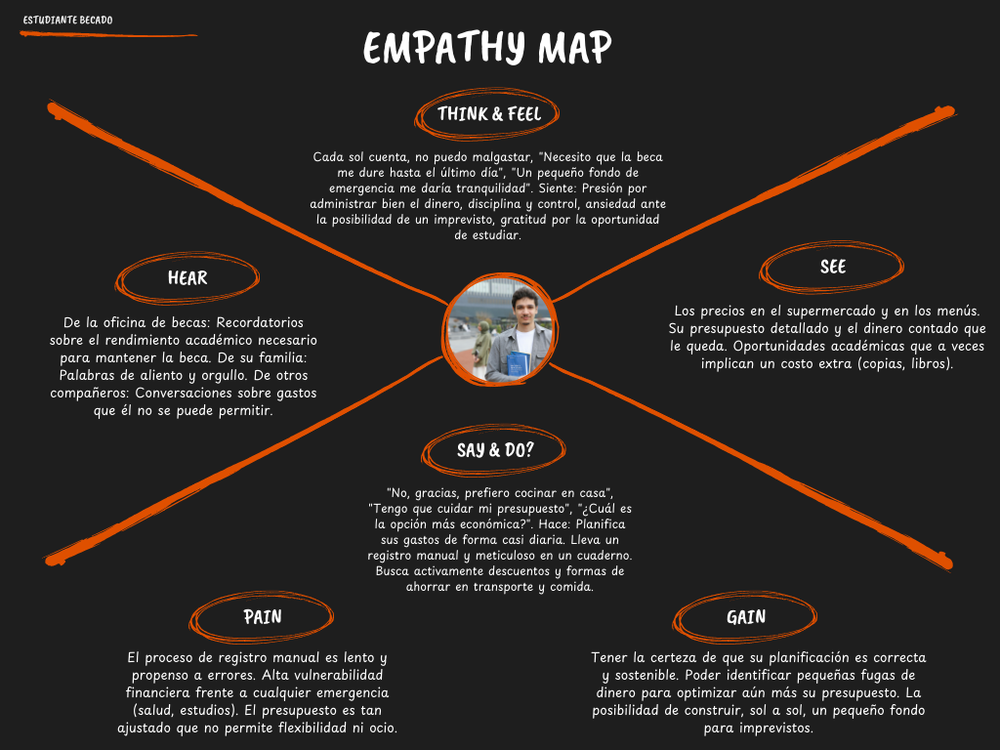

### 2.3.5. As-is Scenario Mapping

<p><br><br></p>

**Estudiante con Sustento Familiar**  
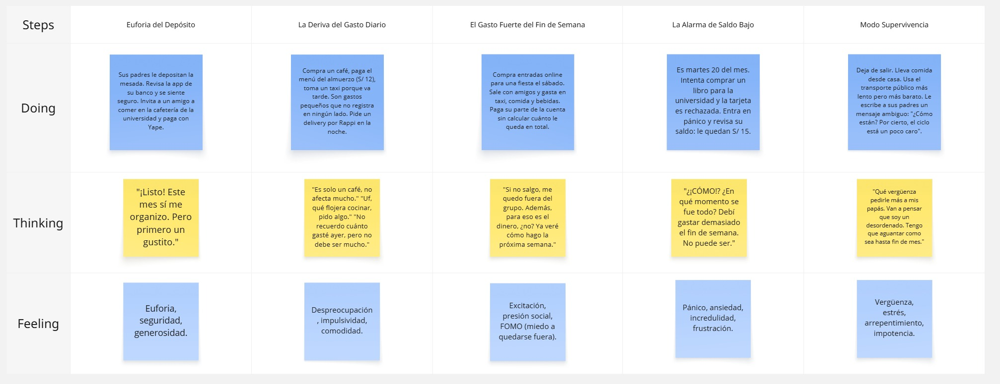

**Estudiante que Trabaja y Estudia**  
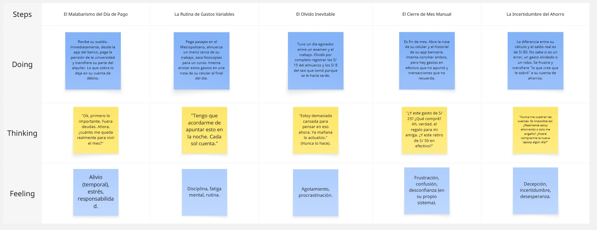

**Estudiante Becado**  


## 2.4. Ubiquitous Language

**Glosario de Términos:**
<table border = 1>
  <thead>
    <tr>
      <th>Término (Inglés)</th>
      <th>Término (Español)</th>
      <th>Definición</th>
    </tr>
  </thead>
  <tbody>
    <tr>
      <td>User</td>
      <td>Usuario</td>
      <td>Estudiante peruano (de 16 a 26 años) que utiliza la aplicación Kashu para registrar, entender y mejorar la gestión de su dinero. Puede ser un estudiante con sustento familiar, uno que trabaja y estudia, o un becado.</td>
    </tr>
    <tr>
      <td>Transaction</td>
      <td>Transacción</td>
      <td>Cualquier movimiento de dinero registrado en la aplicación. Es el registro fundamental y puede ser de dos tipos: un <b>Ingreso</b> o un <b>Egreso</b>.</td>
    </tr>
<tr>
      <td>Income</td>
      <td>Ingreso</td>
      <td>Toda entrada de dinero que el <b>Usuario</b> registra. Proviene de fuentes como la mesada de sus padres, un sueldo de trabajo a tiempo parcial o el estipendio de una beca.</td>
    </tr>
<tr>
      <td>Expense / Spend</td>
      <td>Egreso (o Gasto)</td>
      <td>Cualquier salida de dinero o gasto que el <b>Usuario</b> realiza. Cada <b>Egreso</b> debe ser asignado a una <b>Categoría</b> para su posterior análisis.</td>
    </tr>
<tr>
      <td>Balance</td>
      <td>Saldo</td>
      <td>La cantidad total de dinero disponible que tiene el <b>Usuario</b>. Se calcula automáticamente como el total de <b>Ingresos</b> menos el total de <b>Egresos</b> registrados hasta la fecha.</td>
    </tr>
<tr>
      <td>Category</td>
      <td>Categoría</td>
      <td>Una etiqueta que clasifica un <b>Egreso</b> para ayudar al <b>Usuario</b> a entender sus patrones de consumo. Ejemplos incluyen: "Alimentación", "Transporte", "Estudios", "Ocio".</td>
    </tr>
<tr>
      <td>Budget</td>
      <td>Presupuesto</td>
      <td>Un límite de gasto monetario que el <b>Usuario</b> establece para una <b>Categoría</b> específica durante un período determinado (generalmente mensual).</td>
    </tr>
<tr>
      <td>Savings Goal</td>
      <td>Meta de Ahorro</td>
      <td>Un objetivo financiero específico y cuantificable que el <b>Usuario</b> desea alcanzar. La aplicación visualiza el progreso hacia esta meta.</td>
    </tr>
<tr>
      <td>Ant Spend</td>
      <td>Gasto Hormiga</td>
      <td>Un <b>Egreso</b> pequeño y frecuente que, por su bajo monto, pasa desapercibido, pero que sumado a lo largo del tiempo tiene un impacto significativo en las finanzas del <b>Usuario</b>.</td>
    </tr>
<tr>
      <td>Report</td>
      <td>Reporte</td>
      <td>Una visualización gráfica (ej. un gráfico circular) que resume la actividad financiera del <b>Usuario</b> en un período de tiempo para ayudarlo a entender sus hábitos de consumo.</td>
    </tr>
<tr>
      <td>Alert</td>
      <td>Alerta</td>
      <td>Una notificación proactiva generada por el sistema para informar al <b>Usuario</b> sobre un evento financiero importante, como estar cerca de exceder un <b>Presupuesto</b>.</td>
    </tr>
<tr>
      <td>Dashboard</td>
      <td>Panel Principal</td>
      <td>La pantalla de inicio donde el <b>Usuario</b> ve un resumen de su estado financiero: <b>Saldo</b>, <b>Ingresos</b>/<b>Egresos</b> del mes, y progreso de sus <b>Metas de Ahorro</b>.</td>
    </tr>
  </tbody>
</table>

# Capítulo III: Requirements Specification

## 3.1. To-Be Scenario Mapping

El mapeo de escenarios “To-Be” nos permite visualizar cómo será el proceso o flujo de trabajo deseado del usuario una vez que implementemos nuestra solución. Basado en nuestros segmentos objetivo, elaboramos un To-Be Scenario Mapping para observar cómo Kashu aborda las necesidades de cada usuario, detallando sus acciones, pensamientos y emociones en cada fase de su viaje financiero.

---

#### Segmento 1: Estudiantes sustento familiar

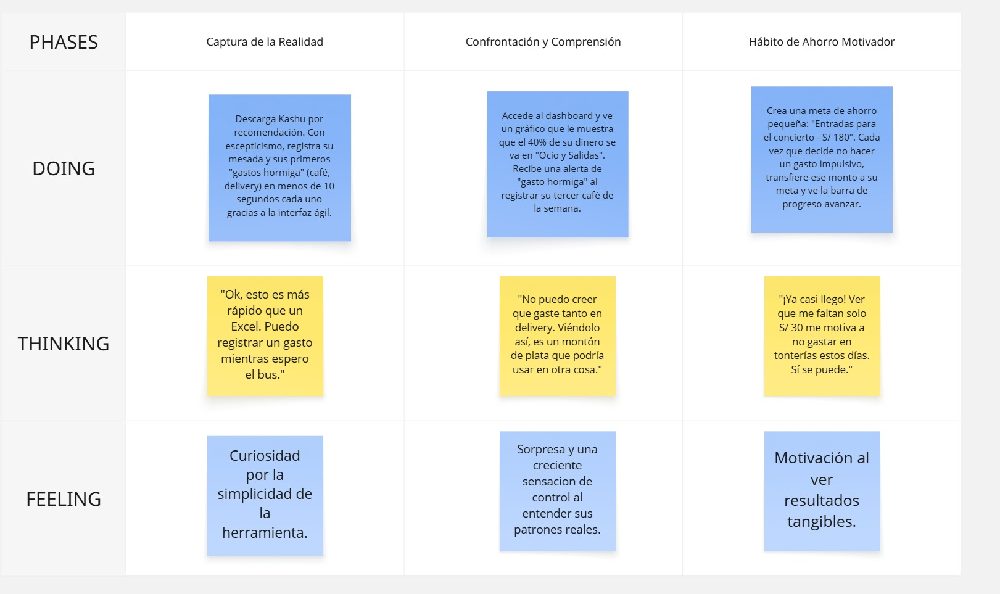

#### Segmento 2: Estudiantes que trabajan y estudian

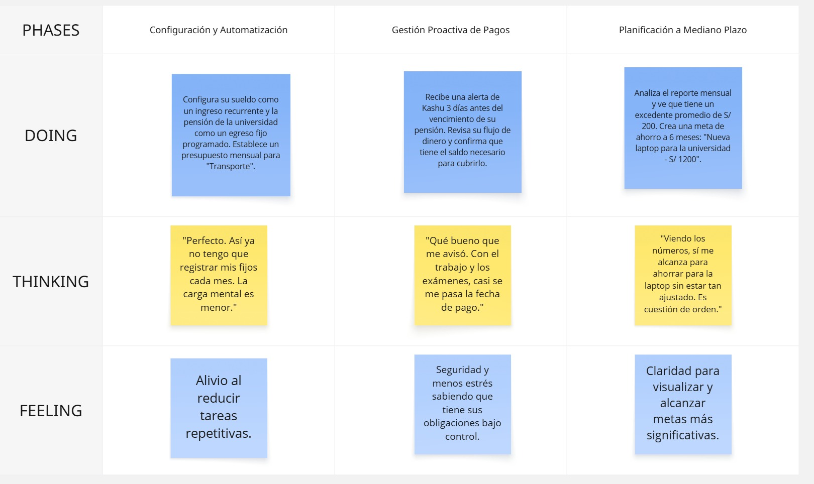

#### Segmento 3: Estudiantes becados

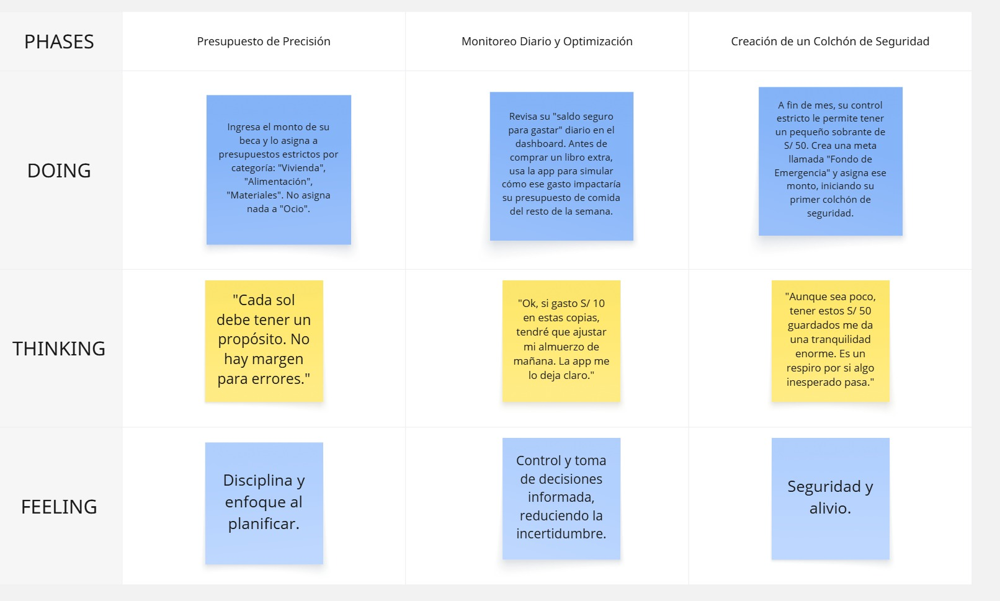

## 3.2. User Stories

Tras analizar las Épicas definidas, procedemos a desglosarlas en Historias de Usuario más detalladas, enfocándonos en cubrir las funcionalidades principales de cada una. Este proceso nos permitió identificar los requisitos específicos del usuario y los casos de uso de cada Épica, lo que facilitó la priorización y planificación de las siguientes etapas de desarrollo.

Para elaborar user stories que pertenecen a un epic. A continuación, las epics que consideramos como equipo:

| EPIC ID | TÍTULO DE LA ÉPICA | Objetivo Principal |
| :--- | :--- | :--- |
| **EP01** | Gestión de Cuentas de Usuario | Que el usuario pueda crear su cuenta y acceder a ella de forma fácil y segura. |
| **EP02** | Gestión de Transacciones | Permitir que el usuario registre sus ingresos y gastos sin esfuerzo. |
| **EP03** | Visualización de Datos y Reportes | Convertir los números de los gastos en información útil y fácil de entender. |
| **EP04** | Planificación y Metas Financieras | Ayudar al usuario a ahorrar para las cosas que le importan. |
| **EP05** | Presupuestos y Notificaciones | Darle al usuario herramientas para que no gaste de más y tenga el control. |
| **EP10** | Gestión de Gastos Compartidos | Simplificar la forma en que se maneja el dinero entre amigos y compañeros. |

---

#### Desglose de Historias de Usuario por Épica

### EP01: Gestión de Cuentas de Usuario

| Story ID | Título de la Historia | Descripción (Situación y Motivación) | Criterios de Aceptación |
| :--- | :--- | :--- | :--- |
| **EP01/US01** | Crear mi espacio financiero | **Cuando** descargo la app por primera vez, **quiero** poder registrarme fácilmente, **para poder** empezar a organizar mi dinero. | **Dado** que soy un usuario nuevo, **cuando** ingreso mi correo y una contraseña segura, **entonces** mi cuenta se crea y veo la pantalla principal. |
| **EP01/US02** | Entrar a mi cuenta | **Cuando** ya tengo una cuenta, **quiero** iniciar sesión rápidamente, **para poder** ver mi información o registrar un gasto al instante. | **Dado** que ya estoy registrado, **cuando** pongo mi correo y contraseña correctos, **entonces** puedo entrar y ver mi Panel Principal. |
| **EP01/US03** | Recuperar mi acceso | **Cuando** olvido mi contraseña, **quiero** poder recuperarla usando mi correo, **para poder** volver a entrar a mi cuenta sin perder mis datos. | **Dado** que olvidé mi contraseña, **cuando** pido recuperarla y sigo los pasos que me llegan al correo, **entonces** puedo poner una nueva contraseña y volver a entrar. |
| **EP01/US04** | Personalizar mi perfil | **Cuando** ya tengo mi cuenta, **quiero** poder editar mis datos personales (nombre, foto), **para poder** sentir la aplicación más mía y personalizada. | **Dado** que estoy en mi perfil, **cuando** cambio mi nombre de usuario y subo una foto, **entonces** los cambios se guardan y se reflejan en la app. |
| **EP01/US05** | Configurar mis preferencias | **Cuando** uso la app, **quiero** poder cambiar la moneda principal (ej. de Soles a Dólares), **para poder** alinear la app con mis finanzas si manejo diferentes divisas. | **Dado** que estoy en la sección de configuración, **cuando** selecciono una nueva moneda principal, **entonces** todos los montos en la app se muestran en la moneda elegida. |

---

### EP02: Gestión de Transacciones

| Story ID | Título de la Historia | Descripción (Situación y Motivación) | Criterios de Aceptación |
| :--- | :--- | :--- | :--- |
| **EP02/US01** | Registrar el dinero que recibo | **Cuando** me pagan o me dan mi mesada, **quiero** anotarlo de forma simple, **para poder** saber cuánto dinero tengo disponible en total. | **Dado** que estoy en la app, **cuando** añado un nuevo ingreso con un monto y descripción, **entonces** mi saldo total se actualiza y el ingreso aparece en mi historial. |
| **EP02/US02** | Anotar mis gastos diarios | **Cuando** compro algo, **quiero** registrar el gasto y ponerle una categoría en pocos segundos, **para poder** llevar un control real de a dónde se va mi dinero. | **Dado** que estoy en la app, **cuando** añado un nuevo gasto, le pongo un monto y elijo una categoría (ej. "Comida"), **entonces** el gasto se guarda, mi saldo se actualiza y aparece en el historial. |
| **EP02/US03** | Automatizar mis gastos fijos | **Cuando** tengo gastos que se repiten cada mes (como la pensión de la U o mi plan de celular), **quiero** configurarlos una sola vez, **para poder** ahorrar tiempo y evitar olvidarme de registrarlos. | **Dado** que tengo un gasto fijo, **cuando** lo configuro como un gasto recurrente para una fecha específica, **entonces** la app lo registrará automáticamente cada mes en esa fecha. |
| **EP02/US04** | Corregir un registro | **Cuando** me equivoco al registrar un gasto (puse mal el monto o la categoría), **quiero** poder editarlo fácilmente, **para poder** mantener mi información financiera precisa. | **Dado** que tengo un gasto registrado, **cuando** lo selecciono y modifico su monto o categoría, **entonces** el registro se actualiza en mi historial y mi saldo se corrige. |
| **EP02/US05** | Filtrar mis movimientos | **Cuando** quiero analizar mis finanzas, **quiero** poder buscar y filtrar mis transacciones (por fecha, categoría o tipo), **para poder** encontrar rápidamente la información que necesito. | **Dado** que estoy en mi historial de transacciones, **cuando** aplico un filtro por "Comida" para el mes pasado, **entonces** solo veo los gastos de esa categoría en ese rango de fechas. |

---

### EP03: Visualización de Datos y Reportes

| Story ID | Título de la Historia | Descripción (Situación y Motivación) | Criterios de Aceptación |
| :--- | :--- | :--- | :--- |
| **EP03/US01** | Saber "cómo voy" de un vistazo | **Cuando** abro la app, **quiero** ver un resumen fácil de entender de mis finanzas, **para poder** saber rápidamente si estoy bien o si estoy gastando mucho. | **Dado** que he registrado ingresos y gastos, **cuando** voy al Panel Principal, **entonces** veo mi saldo actual y un resumen simple de cuánto he ganado y gastado este mes. |
| **EP03/US02** | Descubrir en qué gasto más | **Cuando** siento que el dinero se me escapa, **quiero** ver un gráfico de mis gastos, **para poder** darme cuenta fácilmente en qué categoría se me está yendo más la plata. | **Dado** que he registrado gastos en varias categorías, **cuando** voy a la sección de Reportes, **entonces** veo un gráfico (ej. de torta) que me muestra mis gastos por categoría. |
| **EP03/US03** | Comparar mi progreso | **Cuando** quiero saber si estoy mejorando, **quiero** poder comparar mis gastos e ingresos entre diferentes meses, **para poder** ver si mis hábitos financieros están cambiando para bien. | **Dado** que tengo datos de varios meses, **cuando** selecciono el reporte de comparación mensual, **entonces** veo un gráfico de barras que muestra mis gastos totales de este mes contra los del mes pasado. |
| **EP03/US04** | Ver la evolución de mis finanzas | **Cuando** planifico a largo plazo, **quiero** ver un reporte de tendencias de mis ingresos vs. mis gastos a lo largo del tiempo, **para poder** entender mi situación financiera general y tomar mejores decisiones. | **Dado** que tengo datos de los últimos 6 meses, **cuando** voy a la sección de reportes de tendencias, **entonces** veo un gráfico de líneas que muestra la evolución de mis ingresos y gastos durante ese periodo. |

---

### EP04: Planificación y Metas Financieras

| Story ID | Título de la Historia | Descripción (Situación y Motivación) | Criterios de Aceptación |
| :--- | :--- | :--- | :--- |
| **EP04/US01** | Ahorrar para algo que quiero | **Cuando** quiero comprarme algo (un libro, una entrada a un concierto), **quiero** crear una meta de ahorro, **para poder** tener una motivación clara y ver cómo me voy acercando. | **Dado** que estoy en la sección de Metas, **cuando** creo una nueva meta con un nombre y un monto, **entonces** la meta aparece en mi lista con un progreso de 0%. |
| **EP04/US02** | Ver crecer mis ahorros | **Cuando** decido ahorrar un poco de dinero, **quiero** poder añadirlo a mi meta, **para poder** ver cómo la barrita de progreso avanza y sentir que estoy logrando algo. | **Dado** que tengo una meta creada, **cuando** le asigno un monto de dinero, **entonces** el total ahorrado de la meta aumenta y la barra de progreso se actualiza. |
| **EP04/US03** | Ajustar mis metas | **Cuando** mis planes cambian (ej. el precio del producto subió), **quiero** poder editar el monto o la fecha de mi meta, **para poder** adaptar mi plan de ahorro a la realidad. | **Dado** que tengo una meta activa, **cuando** edito su monto objetivo, **entonces** el nuevo monto se guarda y el porcentaje de progreso se recalcula. |
| **EP04/US04** | Celebrar un logro | **Cuando** completo una meta de ahorro, **quiero** que la app me felicite y me permita marcarla como "lograda", **para poder** sentir la satisfacción de haber cumplido mi objetivo. | **Dado** que una meta ha llegado al 100% de su progreso, **cuando** la marco como completada, **entonces** aparece una animación de celebración y la meta se mueve al historial de logros. |

---

### EP05: Presupuestos y Notificaciones

| Story ID | Título de la Historia | Descripción (Situación y Motivación) | Criterios de Aceptación |
| :--- | :--- | :--- | :--- |
| **EP05/US01** | Ponerme un límite de gasto | **Cuando** sé que tiendo a gastar mucho en algo (como en salidas), **quiero** ponerme un límite mensual para esa categoría, **para poder** controlarme y no pasarme. | **Dado** que estoy en la sección de Presupuestos, **cuando** elijo una categoría y le pongo un monto límite para el mes, **entonces** el presupuesto queda guardado y activo. |
| **EP05/US02** | Recibir un aviso antes de pasarme | **Cuando** estoy cerca de llegar a mi límite de gasto, **quiero** que la app me avise, **para poder** frenar a tiempo y tomar mejores decisiones. | **Dado** que tengo un presupuesto activo, **cuando** mis gastos en esa categoría superan el 85% del límite, **entonces** recibo una notificación que me alerta sobre esto. |
| **EP05/US03** | Revisar el estado de mis presupuestos | **Cuando** quiero planificar mis próximas compras, **quiero** ver un resumen de todos mis presupuestos y cuánto me queda en cada uno, **para poder** tomar decisiones informadas sobre si puedo gastar o no. | **Dado** que he definido varios presupuestos, **cuando** voy a la sección de Presupuestos, **entonces** veo una lista de todas las categorías con su límite, lo gastado hasta ahora y una barra de estado visual. |

---

### EP10: Gestión de Gastos Compartidos

| Story ID | Título de la Historia | Descripción (Situación y Motivación) | Criterios de Aceptación |
| :--- | :--- | :--- | :--- |
| **EP10/US01** | Dividir la cuenta con amigos | **Cuando** salimos en grupo y uno paga todo, **quiero** poder registrar ese gasto y dividirlo, **para poder** saber fácil y rápido quién le debe a quién. | **Dado** que hice un gasto de S/ 100 para un grupo de 4 personas, **cuando** uso la función "Dividir Gasto" y selecciono a los 3 amigos, **entonces** la app registra que yo gasté S/ 25 y que cada amigo me debe S/ 25. |
| **EP10/US02** | Llevar las cuentas claras | **Cuando** alguien me paga lo que me debía, **quiero** poder marcar esa deuda como pagada, **para poder** mantener un control claro y evitar malentendidos. | **Dado** que un amigo me debe S/ 25, **cuando** me paga y yo marco la deuda como "saldada", **entonces** la deuda desaparece y el balance con ese amigo vuelve a cero. |
| **EP10/US03** | Ver a quién le debo y quién me debe | **Cuando** tengo varios gastos compartidos, **quiero** ver un panel que resuma todas mis deudas y lo que me deben, **para poder** tener una visión clara de mis cuentas con amigos. | **Dado** que tengo deudas pendientes por pagar y por cobrar, **cuando** voy a la sección de "Gastos Compartidos", **entonces** veo dos listas: "Me deben" y "Debo", con los montos totales y el detalle por persona. |
| **EP10/US04** | Enviar un recordatorio amigable | **Cuando** un amigo se ha demorado en pagarme, **quiero** poder enviarle un recordatorio desde la app, **para poder** evitar la conversación incómoda de cobrarle en persona. | **Dado** que un amigo tiene una deuda pendiente conmigo, **cuando** presiono el botón de "Recordar", **entonces** la app le envía una notificación amigable sobre el pago pendiente. |

### Historias Técnicas (Technical Stories)

| Tech ID | Título | Descripción Técnica (Módulo / Alcance) | Criterios de Aceptación |
| :--- | :--- | :--- | :--- |
| **TS-01** | Configuración Landing Page | **Módulo:** Landing Page<br>Implementar estructura HTML5 semántica, estilos CSS base y script JS para el sitio promocional del producto. | 1. El sitio carga correctamente el `index.html` sin errores de consola.<br>2. Los estilos CSS base son responsivos.<br>3. La estructura sigue estándares semánticos HTML5. |
| **TS-02** | Bootstrap del proyecto Angular | **Módulo:** Infraestructura Frontend<br>Inicializar proyecto Angular con CLI, configurar Routing Module y Layout base (Shell: header, sidebar, content). | 1. El comando `ng serve` levanta la aplicación sin errores.<br>2. La estructura de carpetas sigue las `style guides` de Angular.<br>3. El router outlet carga el layout principal correctamente. |
| **TS-03** | Configuración CI/CD | **Módulo:** DevOps / GitHub Actions<br>Configurar pipeline de integración continua para ejecutar linter, pruebas unitarias y build automático en cada push. | 1. El archivo `.yml` existe en `.github/workflows`.<br>2. El pipeline se ejecuta exitosamente ante un Pull Request.<br>3. El build falla si el linter o los tests no pasan. |
| **FE-TS01** | Módulo de Autenticación | **Módulo:** Frontend - Auth<br>Implementar componentes de Login, Registro y Recuperación de contraseña con formularios reactivos y validaciones. | 1. Los formularios validan campos requeridos y formato de email.<br>2. Feedback visual de errores activo.<br>3. Botones deshabilitados si el formulario es inválido. |
| **FE-TS02** | Servicio de AuthService | **Módulo:** Frontend - Services<br>Desarrollar servicio en Angular para manejo de peticiones HTTP de auth, almacenamiento de JWT y gestión de sesión. | 1. El token JWT se guarda en `localStorage` tras login exitoso.<br>2. Interceptor añade el token en headers HTTP.<br>3. Método `logout()` limpia el almacenamiento local. |
| **FE-TS03** | Implementación de AuthGuard | **Módulo:** Frontend - Security<br>Crear Guards de Angular para proteger rutas privadas (Dashboard, Gastos, Perfil) y redirigir a usuarios no autenticados. | 1. Usuario no logueado es redirigido a `/login` al intentar entrar a `/dashboard`.<br>2. Usuario logueado accede correctamente.<br>3. Guard aplicado en el Routing Module. |
| **FE-TS04** | Componentes Dashboard | **Módulo:** Frontend - Home<br>Desarrollar tarjetas de resumen (KPIs) para Saldo Total, Ingresos y Gastos del mes con datos mockeados o reales. | 1. Las tarjetas renderizan los montos correctamente.<br>2. Se distingue visualmente entre ingresos (verde) y gastos (rojo).<br>3. Diseño responsivo en móvil y desktop. |
| **FE-TS05** | Servicio de Transacciones | **Módulo:** Frontend - Services<br>Implementar `TransactionsService` para consumir endpoints REST (GET, POST, PUT, DELETE) de ingresos y egresos. | 1. Métodos CRUD retornan Observables.<br>2. Manejo de errores HTTP básico implementado.<br>3. Conexión exitosa con el backend (o mock server). |
| **FE-TS06** | Módulo de Gastos e Ingresos | **Módulo:** Frontend - Transactions<br>Crear vistas de listado (con paginación) y formularios para crear/editar transacciones con selectores de categorías. | 1. La lista muestra las transacciones paginadas.<br>2. El formulario permite seleccionar categoría de una lista desplegable.<br>3. Se puede editar y guardar un registro existente. |
| **FE-TS07** | Componentes de Metas (Goals) | **Módulo:** Frontend - Goals<br>Desarrollar componentes visuales para listar metas y barra de progreso dinámica calculada en base al monto ahorrado. | 1. La barra de progreso refleja el porcentaje correcto (Ahorrado / Meta).<br>2. Las tarjetas de metas se listan en grid o lista.<br>3. Indicador visual si la meta se ha completado. |
| **FE-TS08** | Internacionalización (i18n) | **Módulo:** Frontend - Core<br>Configurar `ngx-translate` (o librería similar) y archivos JSON (es.json, en.json) para soporte multi-idioma. | 1. Archivos `es.json` y `en.json` creados y cargados.<br>2. Cambio de idioma actualiza los textos en tiempo real.<br>3. Idioma por defecto configurado correctamente. |
| **BE-TS01** | API de Autenticación (JWT) | **Módulo:** Backend - Security<br>Implementar endpoints `/auth/login` y `/auth/register` utilizando Spring Security y generación de Tokens JWT. | 1. `POST /login` devuelve 200 OK y token JWT válido.<br>2. `POST /register` crea el usuario en DB.<br>3. Credenciales inválidas retornan 401 Unauthorized. |
| **BE-TS02** | CRUD de Transacciones | **Módulo:** Backend - API<br>Desarrollar endpoints REST para Transacciones (`/api/transactions`) incluyendo filtros por fecha, tipo y categoría. | 1. `GET /transactions` soporta query params de filtrado.<br>2. `POST` guarda la transacción asociada al usuario.<br>3. Respuestas JSON siguen el estándar definido. |
| **BE-TS03** | CRUD de Metas de Ahorro | **Módulo:** Backend - API<br>Desarrollar endpoints REST para Metas (`/api/goals`) con lógica de negocio para cálculo de progreso y validación de fechas. | 1. CRUD completo funcional.<br>2. Cálculo de progreso se actualiza al añadir fondos.<br>3. Validar que `deadline` sea una fecha futura. |
| **BE-TS04** | Validaciones de Negocio | **Módulo:** Backend - Logic<br>Implementar validaciones estrictas: no permitir saldos negativos, validar formatos de moneda y unicidad de correos. | 1. Intentar crear usuario con email existente retorna 409 Conflict.<br>2. Montos negativos en ingresos lanzan excepción.<br>3. Moneda debe ser código ISO válido (PEN, USD). |
| **BE-TS05** | Documentación OpenAPI | **Módulo:** Backend - Docs<br>Integrar Swagger/OpenAPI 3.0 para documentar automáticamente todos los endpoints expuestos y facilitar pruebas. | 1. Ruta `/swagger-ui.html` es accesible.<br>2. Todos los Controllers están listados.<br>3. Los DTOs de request/response están documentados. |
| **BE-TS06** | Telemetría y Logging | **Módulo:** Backend - Ops<br>Implementar sistema de logs centralizados para capturar errores 500, tiempos de respuesta lentos y auditoría. | 1. Logs de INFO registran inicio/fin de requests.<br>2. Excepciones no controladas se loguean como ERROR con stacktrace.<br>3. Formato de logs consistente. |


## 3.3. Impact Mapping

El Impact Mapping es una técnica de planificación estratégica que nos permite visualizar cómo las funcionalidades del producto se conectan con los objetivos del negocio. Nos ayuda a asegurar que estamos construyendo las características correctas para generar el impacto deseado en el comportamiento de nuestros usuarios y, en última instancia, alcanzar nuestras metas.

A continuación, se presenta el Impact Map para el proyecto TuCash.


### 3.4. Product Backlog

Nuestra estrategia de lanzamiento se basa en **releases temáticas**, permitiéndonos enfocar cada fase del desarrollo en un objetivo claro, validar nuestras hipótesis más importantes primero y construir sobre una base sólida.

---

#### **Release 1: MVP - El Núcleo de la Conciencia Financiera (Must-Have)**

**Objetivo Estratégico:** Validar la hipótesis fundamental del producto: *los estudiantes adoptarán el hábito de registrar sus finanzas si la experiencia es instantánea y les proporciona una revelación inmediata sobre su comportamiento.* Nos enfocamos en el ciclo **Registrar -> Visualizar -> Comprender**.

| ID | Título de la Historia | Segmento Clave | Valor Estratégico / Hipótesis a Validar | Story Points |
| :--- | :--- | :--- | :--- | :--- |
| **EP01/US01-02** | Acceso a la Plataforma | Todos | **Valor:** Acceso fundamental y seguro a la herramienta. Es la puerta de entrada, debe ser impecable. | 5 |
| **EP02/US01-02** | Registro de Transacciones | Todos | **Valor:** La acción central del sistema. <br>**Hipótesis:** Si el registro es <10 segundos, la tasa de adopción será alta. | 5 |
| **EP03/US01** | Saber "cómo voy" de un vistazo | Todos (Hook p/ Est. con Sustento) | **Valor:** El "gancho" de valor inmediato. Responde la pregunta esencial del usuario. <br>**Hipótesis:** Un "Pulso Financiero" emocional aumentará el engagement diario. | 8 |
| **EP03/US02** | Descubrir mis "fugas de capital" | Estudiante con Sustento Familiar | **Valor:** Genera el "momento ajá" que revela el problema de los gastos hormiga. <br>**Hipótesis:** Visualizar sus gastos por categoría motivará al usuario a querer tomar el control. | 5 |

---

#### **Release 2: Expansión - Control y Motivación (Should-Have)**

**Objetivo Estratégico:** Una vez validado el hábito de registro, empoderamos al usuario con herramientas para actuar sobre sus nuevos insights. Pasamos del ciclo **Comprender -> Actuar y Planificar**.

| ID | Título de la Historia | Segmento Clave | Valor Estratégico / Hipótesis a Validar | Story Points |
| :--- | :--- | :--- | :--- | :--- |
| **EP04/US01** | Ahorrar para algo que quiero | Todos (Motivador p/ Est. Becado) | **Valor:** Conecta el esfuerzo diario con una aspiración. Le da un propósito al uso de la app. <br>**Hipótesis:** La capacidad de crear metas aumentará la retención a mediano plazo. | 3 |
| **EP05/US01** | Ponerme un límite de gasto | Estudiante Becado | **Valor:** La herramienta de control proactivo más solicitada. Es fundamental para el segmento más vulnerable. | 3 |
| **EP05/US02**| Recibir un aviso antes de pasarme | Todos | **Valor:** Transforma el presupuesto de una herramienta pasiva a un "consejero" activo. <br>**Hipótesis:** Las alertas proactivas son capaces de modificar el comportamiento de gasto en tiempo real. | 5 |
| **EP04/US02**| Ver crecer mis ahorros | Todos | **Valor:** Cierra el bucle de retroalimentación positiva. La visualización del progreso es un potente reforzador de hábitos. | 2 |

---

#### **Release 3: Social y Eficiencia (Could-Have)**

**Objetivo Estratégico:** Abordar casos de uso más avanzados y sociales que aumentan la utilidad de la aplicación en el día a día y fomentan el crecimiento orgánico.

| ID | Título de la Historia | Segmento Clave | Valor Estratégico / Hipótesis a Validar | Story Points |
| :--- | :--- | :--- | :--- | :--- |
| **EP02/US03**| Automatizar mis gastos fijos | Estudiante que Trabaja | **Valor:** Ahorro de tiempo y reducción drástica de la carga mental para usuarios con finanzas más estructuradas. Un "feature" premium clave. | 5 |
| **EP10/US01**| Dividir la cuenta con amigos | Todos | **Valor:** Resuelve un dolor social extremadamente común en la vida universitaria. <br>**Hipótesis:** Las funciones sociales aumentarán el "boca a boca" y la viralidad del producto. | 8 |
| **EP10/US02**| Llevar las cuentas claras | Todos | **Valor:** Completa la experiencia de gastos compartidos, asegurando que sea una solución robusta y confiable. | 5 |
| **EP01/US03**| Recuperar mi acceso | Todos | **Valor:** Funcionalidad de soporte esencial para la experiencia de usuario a largo plazo, aunque no sea parte del flujo de valor principal del MVP. | 3 |

# Capítulo IV: Product Design

## 4.1. Style Guideline

### 4.1.1. General Style Guidelines

#### Branding

La identidad de **TuCash** transmite **confianza, simplicidad y frescura**, reflejada en el isotipo del tucán, símbolo de visión y equilibrio.

- **Logo**: versión principal con isotipo + tipografía, aplicada en interfaces digitales y materiales de comunicación.  
  

- **Isotipo**: cabeza del tucán, diseñado para íconos, app móvil y favicon.  
  

- **Logotipo**: representación tipográfica de “TuCash”, adaptable a fondos claros y oscuros.  
  

#### Typography

La tipografía está diseñada para reflejar **modernidad, cercanía y solidez financiera**. Se combina **Mada** y **Koulen**, logrando equilibrio entre claridad de lectura e impacto visual.  


- **Fuente principal: Mada (sans-serif modernista)**  
  - Uso: textos de cuerpo, botones, formularios y componentes.  
  - Características: contornos abiertos, bajo contraste y excelente legibilidad.  
  - Refuerza simplicidad y confianza.  

- **Fuente secundaria: Koulen (display, sans-serif)**  
  - Uso: títulos, subtítulos, banners y elementos destacados.  
  - Características: estilo fuerte y ancho que transmite energía.  
  - Perfecta para captar atención.  

**Jerarquía tipográfica:**

- **Títulos principales (H1, H2)** – Koulen  
    Tamaño: 28–32 px  
    Uso: encabezados principales y dashboards.  
- **Subtítulos (H3, H4)** – Koulen / Mada Medium  
    Tamaño: 20–24 px  
    Uso: tarjetas, apartados y menús.  
- **Texto de cuerpo** – Mada Regular  
    Tamaño: 14–16 px  
    Uso: descripciones, balances, transacciones.  
- **Notas / Labels / Placeholders** – Mada Light o Regular  
    Tamaño: 12–14 px  
    Uso: formularios, etiquetas y tooltips.  

### Iconografía

Los íconos refuerzan **claridad, simplicidad y modernidad**, manteniendo coherencia con la identidad visual del tucán.  

- **Estilo**: planos (flat), minimalistas y con trazos uniformes.  
- **Consistencia**: mismo grosor de línea y proporción.  
- **Aplicación**: menús, botones, estados y ayudas contextuales.  
- **Colores**: gris oscuro o blanco, con resaltes en **Verde Cash (#2AB27B)**.  
- **Accesibilidad**: cada ícono debe incluir `alt-text`.  

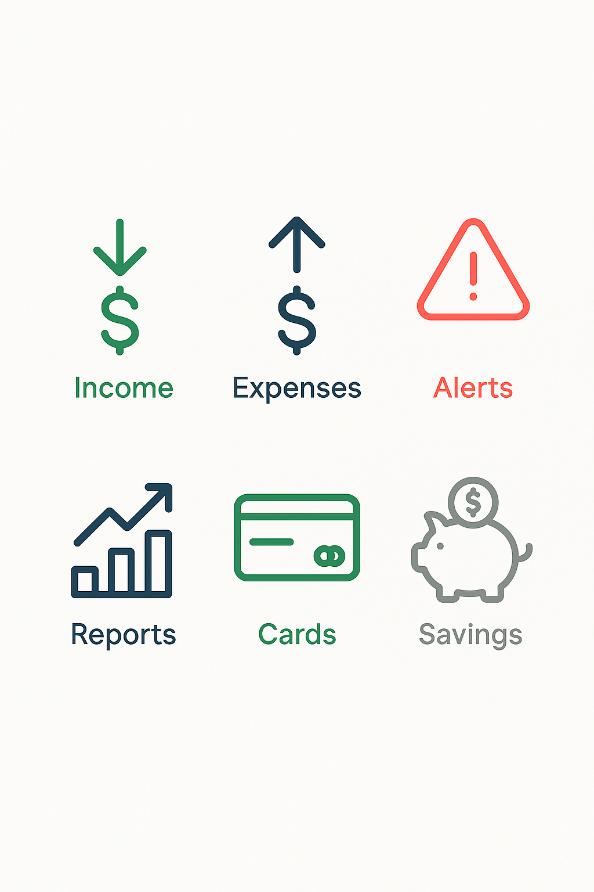

#### Colors

La paleta cromática, inspirada en el tucán, transmite **seguridad, crecimiento y frescura**.  

- **Paleta Principal:**  
   Verde `#2AB27B` → Crecimiento y finanzas saludables.  
   Azul oscuro `#1D2A3A` → Confianza y estabilidad.  

- **Colores Secundarios:**  
    Amarillo `#F6B93B` → Energía y motivación.  
    Gris claro `#F4F6F8` → Fondos neutros y legibilidad.  
    Blanco `#FFFFFF` → Claridad y simplicidad.  

- **Colores de Apoyo:**  
    Verde claro `#9FE6C3` → Estados positivos.  
    Azul cielo `#3D9DF6` → Acciones secundarias y metas.  
    Rojo coral `#FF6B6B` → Alertas y advertencias.  

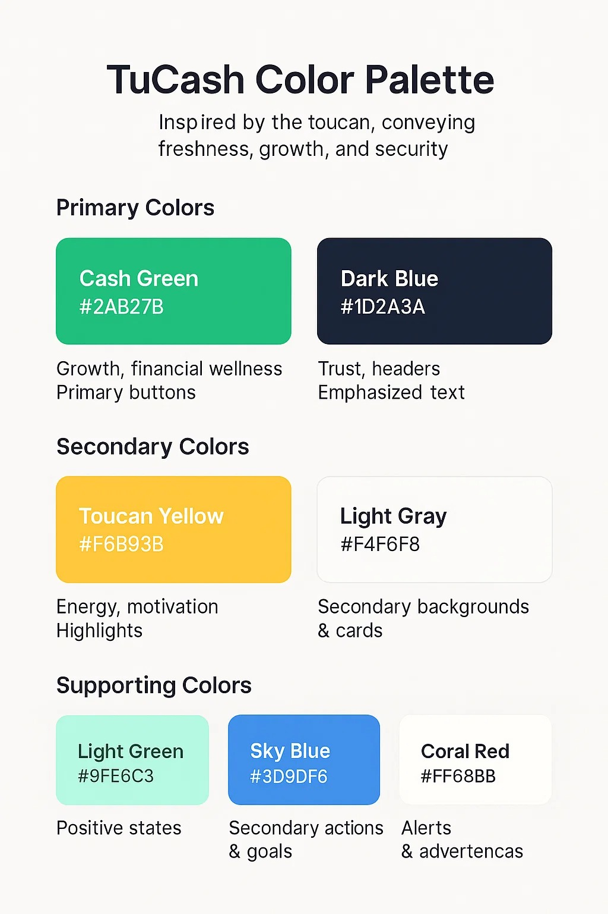

### 4.1.2. Web Style Guidelines

Para **TuCash**, se plantea una plataforma web con un enfoque en **simplicidad, confianza y accesibilidad**, que ofrezca una experiencia intuitiva y moderna para la **gestión financiera personal y familiar**.  

El diseño será **responsivo (Responsive Design)**, garantizando que la interfaz se adapte correctamente a diferentes dispositivos (desktop, tablet y móvil), manteniendo siempre **claridad visual y usabilidad óptima**.  

#### Dashboard Financiero

- Acceso centralizado a cuentas y saldos.  
- Visualización de transacciones recientes y movimientos categorizados.  
- Acceso directo a funciones clave: envío de dinero, ahorro, pagos y alertas.  
- Gráficos interactivos para analizar gastos, ingresos y metas financieras.  

#### Gestión de Finanzas

- Registro y categorización automática de ingresos y egresos.  
- Configuración de presupuestos por categorías.  
- Seguimiento de ahorros y metas financieras.  
- Botones de acción rápida para transferencias y pagos frecuentes.  

#### Pagos y Servicios

- Pago de servicios básicos (luz, agua, internet, telefonía).  
- Recarga de celulares y billeteras digitales.  
- Opciones de pago con un solo clic, integrando recordatorios para evitar retrasos.  
- Uso de **íconos representativos** en tarjetas modulares que facilitan la identificación de cada servicio.  

#### Alertas y Notificaciones

- Avisos sobre vencimientos de pagos y presupuestos excedidos.  
- Alertas de movimientos inusuales para reforzar la seguridad.  
- Recordatorios configurables sobre metas de ahorro.  
- Notificaciones destacadas en **Verde Cash (#2AB27B)** para resaltar estados positivos.  

#### Educación Financiera y Soporte

- Acceso a guías prácticas de ahorro y educación financiera.  
- Sección de preguntas frecuentes (FAQ) organizada por categorías.  
- Chat de asistencia en tiempo real para resolver dudas.  
- Integración de recursos visuales e ilustraciones que refuercen la confianza y simplicidad.  

---

Este diseño garantiza **usabilidad, seguridad y frescura visual**, consolidando a **TuCash** como una fintech confiable y accesible en Latinoamérica, con el objetivo de promover **inclusión y educación financiera**.  

## 4.2. Information Architecture

### 4.2.1. Organization Systems

#### Landing Page e Inicio de la Aplicación

- **Tipo de organización: Jerárquica.**  
- La landing page destacará: beneficios principales (ahorro, pagos rápidos, control de gastos), funcionalidades clave y testimonios de usuarios.  
- En la pantalla de inicio se priorizan accesos rápidos a: saldos, últimos movimientos, metas de ahorro y alertas financieras relevantes.  

#### Gestión de Finanzas y Pagos

- **Tipo de organización: Secuencial.**  
- Flujos: selección de servicio → monto → método de pago → confirmación.  
- Garantiza simplicidad, seguridad y evita errores en transacciones.  

#### Presupuestos y Metas de Ahorro

- **Tipo de organización: Matricial.**  
- Acceso a presupuestos por categorías (alimentación, transporte, ocio, servicios).  
- Exploración flexible por periodo, categoría o estado de cumplimiento de la meta.  

#### Alertas y Notificaciones

- **Esquema de categorización: Por tópicos.**  
- Categorías: gastos inusuales, vencimientos, metas de ahorro y promociones educativas.  
- Permite priorizar atención inmediata en seguridad y control financiero.  

#### Historial de Transacciones

- **Esquema de categorización: Cronológico.**  
- Registros de ingresos, egresos, pagos y ahorros ordenados por fecha.  
- Visualización filtrable por categoría, monto o estado.  

#### Contenido Personalizado por Perfil de Usuario

- **Esquema de categorización: Según audiencia.**  
  - **Estudiantes (mesada):** presupuestos académicos, recargas de transporte, **Dinero restante semanal + Top 3 categorías + Quick Add/micro-metas**; **alertas** 50%/85% y gasto inusual; **acciones** crear micro-meta y       ajustar límite.
  - **Quienes trabajan y estudian:** recordatorios de pagos (pensión/servicios), **Calendario de pagos + balance simple→detalle + estado offline**; **alertas** de vencimientos (–3 días / día D) y sobre-ejecución al 85%;            **acciones** registrar pago y marcar gasto recurrente.
  - **Becados:** plan mensual priorizado (básicos), **control de ingresos/egresos, pago de servicios y metas de ahorro**; **duración estimada de fondos + ahorro de emergencia + reporte compartible**; **alertas** de             quedarse corto (-7 días), fin de mes e hitos de beca; **acciones** priorizar esenciales, aportar a emergencia y compartir reporte.

#### Búsqueda de Transacciones y Servicios

- **Esquema de categorización: Alfabético.**  
- Localización rápida de servicios (luz, agua, internet), beneficiarios frecuentes y categorías de gasto.  

### 4.2.2. Labeling Systems

#### Landing Page

- **Home/Inicio**: Propuesta de valor de TuCash.  
- **Features/Características**: Funciones clave (gestión de gastos, metas de ahorro, pagos de servicios).  
- **Benefits/Beneficios**: Simplicidad, seguridad, confianza y control financiero.
- **Plans & Pricing /Planes y Precios**: Detalle y comparación de planes (ver sección más abajo).  
- **Testimonials/Testimonios**: Experiencias y casos de éxito de usuarios.  
- **About/Acerca de**: Propósito de TuCash, misión y visión de inclusión financiera.  
- **Contact/Contacto**: Soporte, redes sociales y correo de atención.  

#### Web Application

- **Home/Inicio**: Accesos rápidos a saldo disponible, últimos movimientos, metas de ahorro y alertas.  
- **Profile/Perfil**: Gestión de información personal, métodos de pago, cuentas vinculadas y preferencias.  
- **Finance/Finanzas**: Control de ingresos, egresos y presupuestos por categoría.  
- **Payments/Pagos**: Servicios básicos, recargas y transferencias. Incluye historial de operaciones.  
- **Savings/Goals/Ahorro/Metas**: Configuración y seguimiento de objetivos financieros (viajes, educación, emergencias).  
- **Search/Búsqueda**: Localización rápida de transacciones, servicios o beneficiarios.  
- **Favorites/Favoritos**: Acceso a servicios, categorías o metas más utilizadas.  
- **Alerts/Notifications/Alertas/Notificaciones**: Gastos inusuales, vencimientos, metas alcanzadas o pendientes.  
- **Support/Soporte**: FAQs, guías de uso y contacto con atención al cliente.  
- **Plans/Planes**: Gestión del plan actual, upgrades/downgrades y facturación.

### 4.2.3. SEO Tags and Meta Tags

– TuCash

## Landing Page

Title: Texto visible en la parte superior del navegador y en los resultados de búsqueda.

```html
<title>TuCash – Finanzas simples y seguras para tu día a día</title>

-Codificación de caracteres:
<meta charset="utf-8">

-Description: Breve descripción de la aplicación.
<meta name="description" content="TuCash es tu app financiera confiable para gestionar tus gastos, ahorros y pagos de manera simple, inclusiva y segura."/>

-Key Words: Palabras clave relacionadas con la app.
<meta name="keywords" content="finanzas personales, control de gastos, ahorro, pagos digitales, inclusión financiera, educación financiera, Perú"/>

-Author & Copyright:
<meta name="author" content="TuCash Team"/>
<meta name="copyright" content="Copyright TuCash Team" />


-Web Application
-Title:
<title>TuCash</title>

-Description
<meta name="description" content="TuCash – Plataforma oficial para gestionar tus finanzas personales, ahorros y pagos de forma simple, inclusiva y segura."/>

-Key Words:
<meta name="keywords" content="TuCash, finanzas digitales, ahorro, pagos, educación financiera, inclusión, seguridad"/>

-Author & Copyright:
<meta name="author" content="TuCash Team"/>
<meta name="copyright" content="Copyright TuCash Team" />
```

### 4.2.4. Searching Systems TuCash  

**Barra de búsqueda general:**  
Ubicada en la parte superior derecha de la plataforma web y dentro del menú principal de la app.  
Permitirá acceder rápidamente a recursos como: gestión de gastos, historial financiero, presupuesto familiar, billetera digital y metas de ahorro.  

**Sugerencias automáticas (autocompletado):**  
El sistema mostrará resultados predictivos mientras el usuario escribe, basados en registros de transacciones, categorías de gasto más frecuentes y metas establecidas.  

**Filtros de búsqueda:**  
Se ofrecerán filtros que permitan refinar la búsqueda según:  

- **Categorías:** Gastos, Ingresos, Presupuesto, Ahorros.  
- **Contenido:** Transacciones, Reportes, Metas, Recibos.  
- **Estado:** Activo, Pendiente, Cumplido.  

**Filtros avanzados:**  
Opciones adicionales como:  

- Recientes / Más antiguos.  
- Monto de transacción.  
- Tipo de gasto (efectivo, tarjeta, billetera digital).  
- Institución asociada (banco, comercio, servicio).  

### 4.2.5. Navigation Systems – TuCash  

**Landing Page**  
La navegación en la landing page estará orientada a transmitir confianza y facilitar la descarga/registro.  
Se implementará un menú superior con enlaces visibles hacia:  

- **Inicio:** Presentación general de TuCash.  
- **Características:** Explicación de las principales funciones (gestión de gastos, presupuesto, ahorro).  
- **Beneficios:** Cómo ayuda al usuario a mejorar su control financiero con seguridad, inclusión y simplicidad.  
- **Testimonios:** Opiniones de usuarios y casos de éxito en el manejo de sus finanzas.
- **Planes y Precios** — Free / Premium (S/ 9.99) / Pro (S/ 14.99) con tabla comparativa y CTA.
- **Acerca de:** Información sobre el propósito, misión y visión de TuCash.  
- **Contacto:** Formulario y canales de soporte.  

El logotipo funcionará como acceso directo al inicio, asegurando navegación fluida.  

**Web Application**  
La navegación dentro de la aplicación web se organizará en torno a un **dashboard central** que aparecerá tras el inicio de sesión, mostrando accesos rápidos a las funciones principales.  

- **Dashboard principal:** Vista general de saldos, gastos recientes, metas de ahorro y notificaciones.  

**Panel lateral de navegación:**  

- **Perfil:** Información personal, configuración y preferencias.  
- **Transacciones:** Registro y categorización de ingresos y gastos.  
- **Presupuesto:** Creación y seguimiento de presupuestos familiares o personales.  
- **Ahorros:** Configuración de metas de ahorro y progreso alcanzado.  
- **Historial:** Registros cronológicos de movimientos financieros.  
- **Notificaciones:** Alertas sobre gastos inusuales, recordatorios de pagos o actualizaciones.
- **Planes (Plans)** — **Plan actual**, **Comparar planes**, **Cambiar plan**, **Facturación** y **Comprobantes**.
- **Soporte / Ayuda:** Acceso a FAQs, chat de soporte y contacto directo con asistencia.  

## 4.3. Landing Page UI Design

### 4.3.1. Landing Page Wireframe

La versión wireframe de nuestra landing page presenta una estructura básica compuesta por diversos elementos fundamentales. En la parte superior se ubica la navegación principal representada mediante bloques simples que indican secciones como Beneficios, Planes, Contáctanos, Iniciar sesión y el selector de idioma. Las visualizaciones de datos se representan mediante áreas designadas para dashboards y gráficos, utilizando rectángulos con líneas básicas en su interior. Asimismo, los planes de suscripción se organizan en tarjetas. Finalmente, la sección de testimonios se muestra con bloques para imágenes de perfil y áreas de texto para citas.

**Landing Page para Desktop Web Browser**

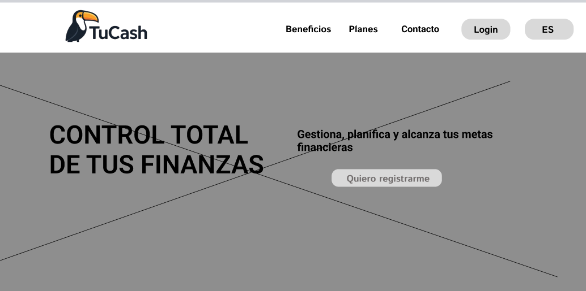


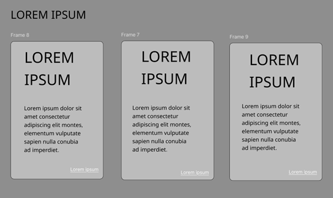
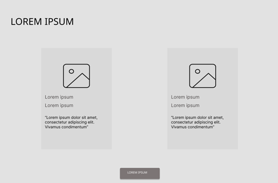
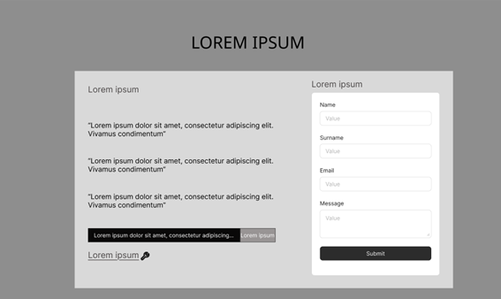


**Landing Page para Mobile Web Browser**

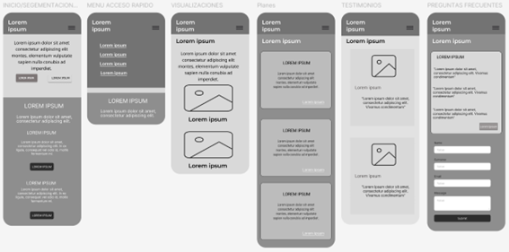

### 4.3.2. Landing Page Mock-up

Enlace para acceder a nuestra Landing Page, desplegada en Github Pages: [TuCash Landing Page](https://tucash.github.io/landingPage/)

## 4.4. Web Applications UX/UI Design

### 4.4.1. Web Applications Wireframes

#### Web Application para Desktop Web Browser

<br><br>


*Iniciar sesión*<br>


*Crear cuenta*<br>
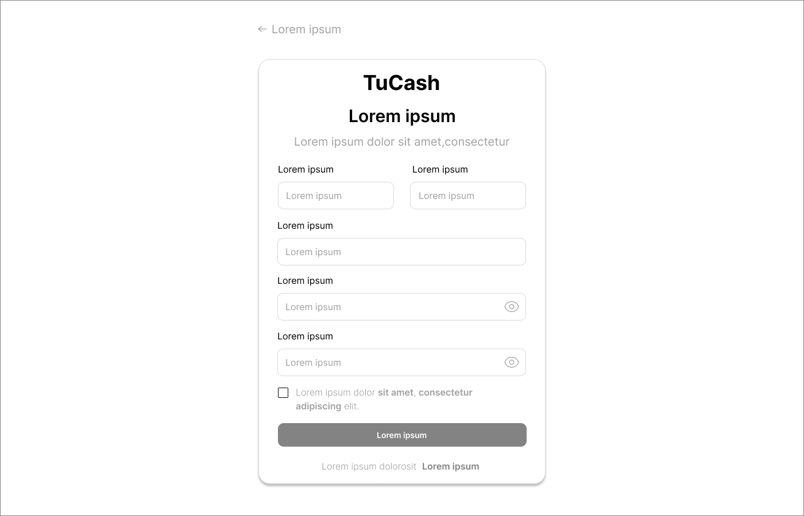

*Página Principal*<br>
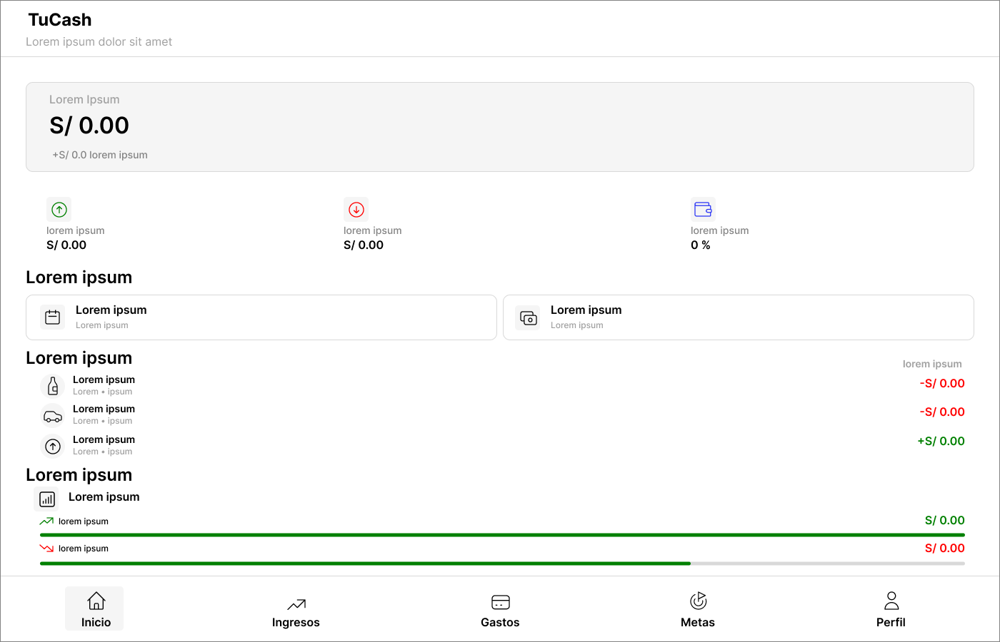

*Todas las transacciones*<br>


*Perfil del usuario*<br>
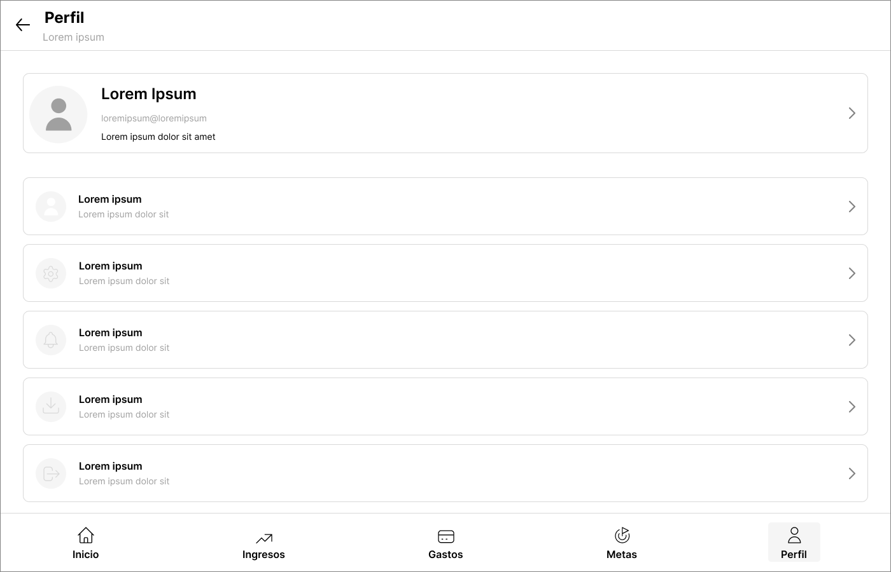

*Editar Perfil*<br>


*Visualizar Planes y Precios*<br>


*Gastos*<br>
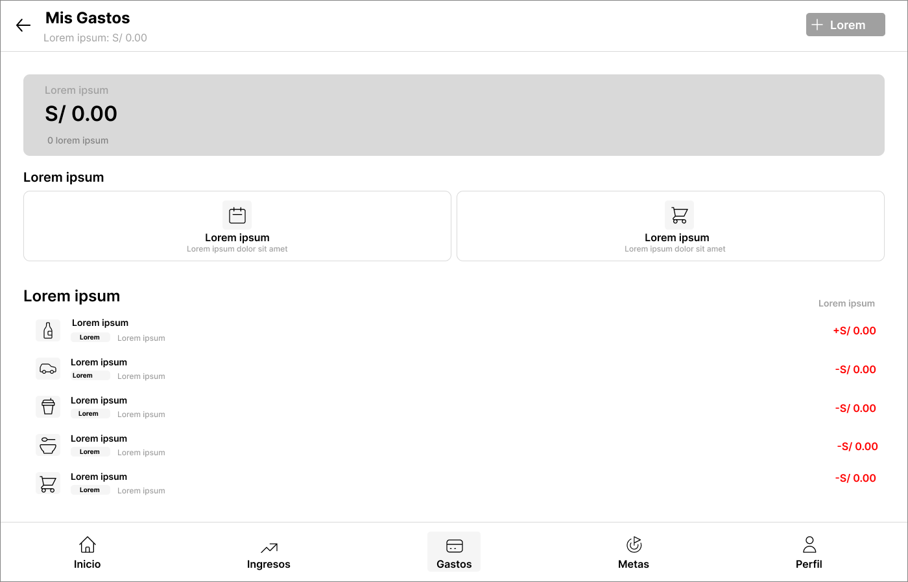

*Agregar Gasto*<br>


*Ingresos*<br>
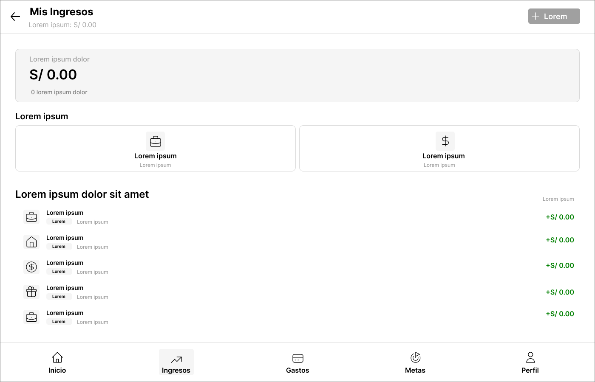

*Agregar Ingreso*<br>


*Metas de Ahorro*<br>
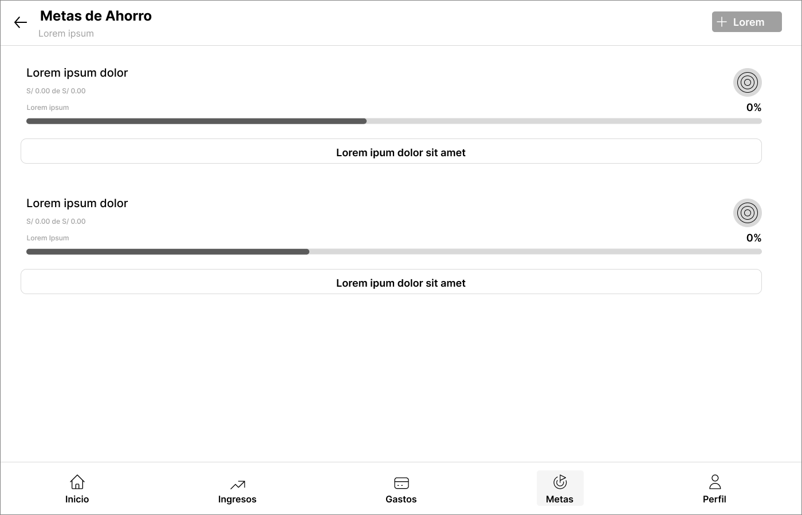

*Agregar Meta de Ahorro*<br>


*Agregar Dinero a una Meta de Ahorro*<br>


[Enlace para acceder al Figma](https://www.figma.com/design/0eoLdvvEddDNIvvujQJGfU/TuCash?node-id=0-1&t=69177qJUpEmGgCN0-1)
<br><br>

#### Web Application para Mobile Web Browser

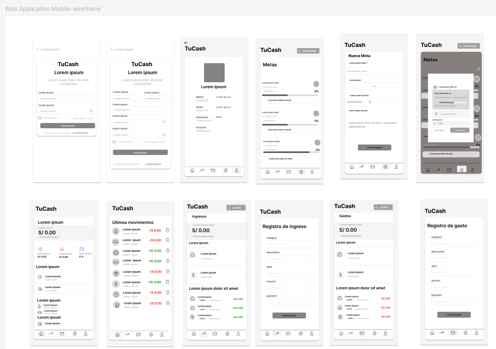
<br>*Login*</br>
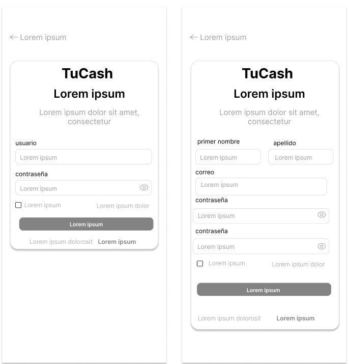
<br>*Perfil*</br>
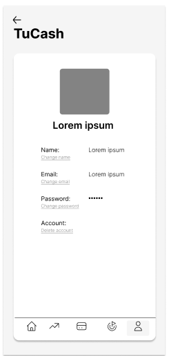
<br>*Home*</br>
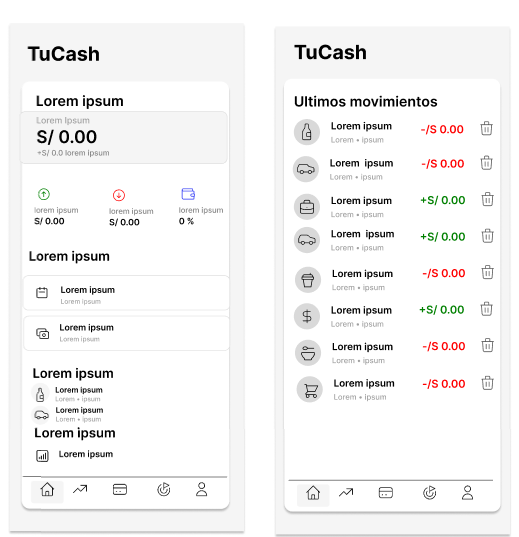
<br>*Ingresos*</br>
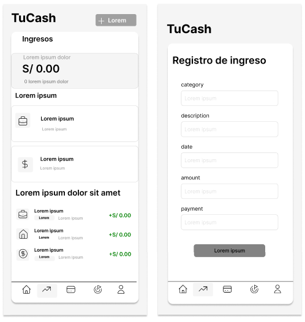
<br>*Gastos*</br>
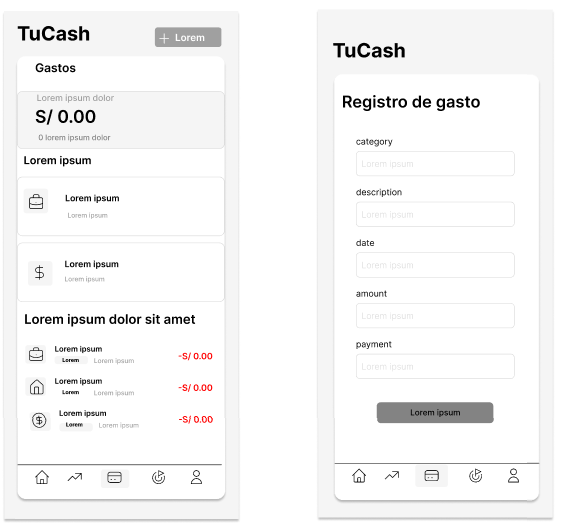
<br>*Metas*</br>
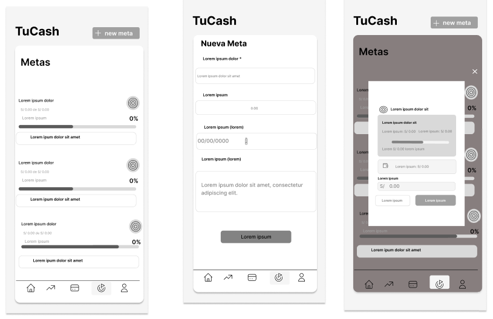
[Enlace para acceder al Figma](https://www.figma.com/design/0eoLdvvEddDNIvvujQJGfU/TuCash?node-id=0-1&t=69177qJUpEmGgCN0-1)
<br><br>

### 4.4.2. Web Applications Wireflow Diagrams

**User goal: Creación de cuenta**
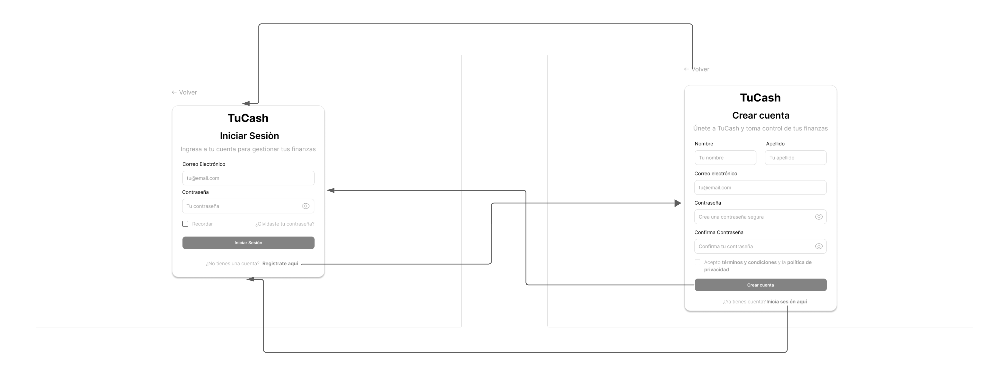

**User goal: Agregar Gasto**
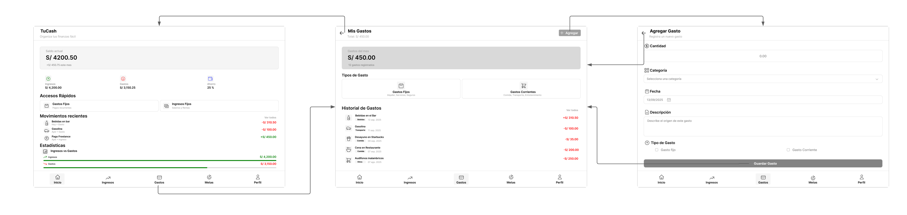

**User goal: Agregar Ingreso**
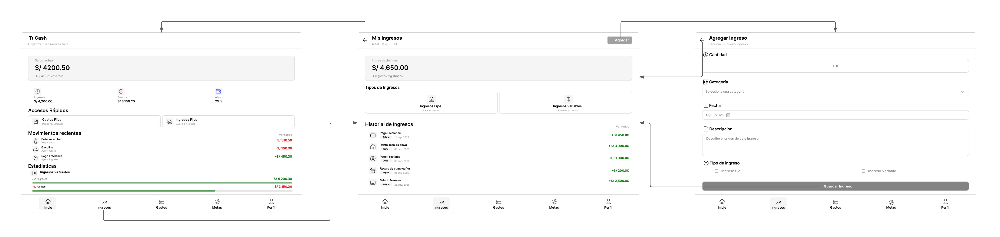

**User goal: Agregar Meta de Ahorro**
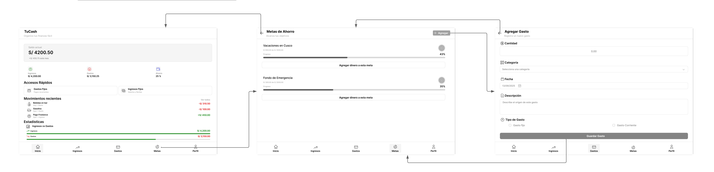

**User goal: Agregar Meta de Ahorro**
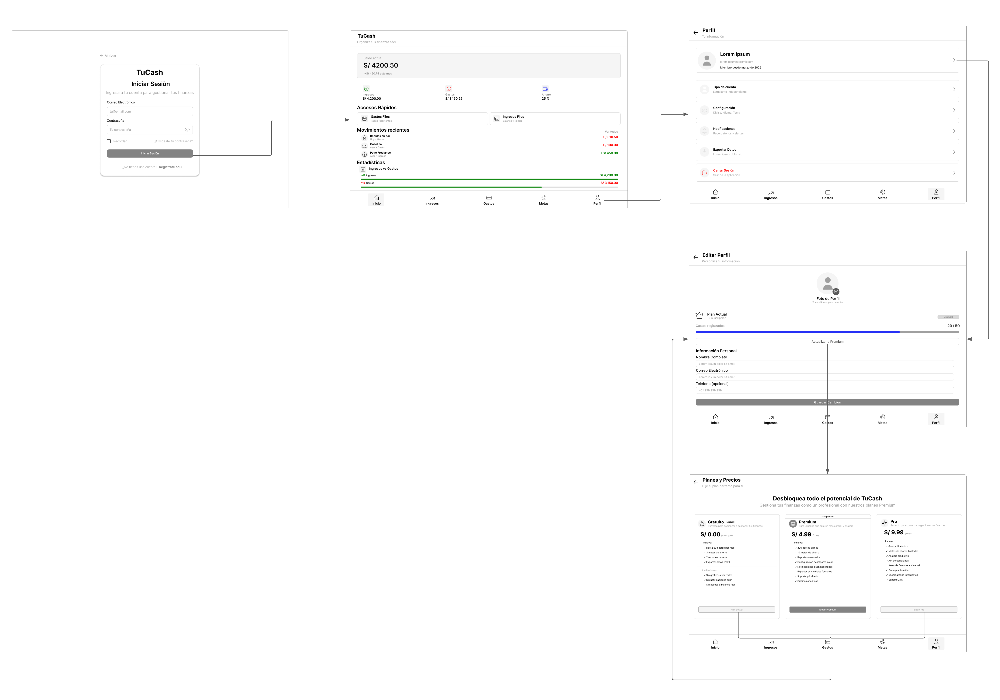

[Enlace para acceder al Wireflow](https://lucid.app/lucidchart/6527f327-959e-4911-ae0c-6a1f5a520089/edit?invitationId=inv_58ad1103-5a51-4d9f-95bc-86c61f1e3d65)

### 4.4.3. Web Applications Mock-ups

#### Mock-ups for Desktops

*Iniciar Sesión*


*Crear de cuenta*


*Pagina Principal*<br>


*Ver Todas las Tnansacciones*<br>


*Ingresos*<br>


*Registrar Ingreso*<br>


*Gastos*<br>


*Registrar Gasto*<br>


*Metas de Ahorro*<br>


*Registrar Meta de Ahorro*<br>


*Agregar Dinero a Meta de Ahorro*<br>


[Enlace para acceder al Figma](https://www.figma.com/design/0eoLdvvEddDNIvvujQJGfU/TuCash?node-id=2161-108&t=69177qJUpEmGgCN0-1)
<br><br>

#### Mock-ups for Mobiles

[Enlace para acceder al Figma](https://www.figma.com/design/0eoLdvvEddDNIvvujQJGfU/TuCash?node-id=2161-108&t=69177qJUpEmGgCN0-1)
<br><br>

### 4.4.4. Web Applications User Flow Diagrams

**User goal: Registro de usuario**
<td>Explicación del flujo: El usuario se registra en la aplicación, tras completar el registro es llevado automáticamente a la pestaña de inicio de sesión, allí ingresa sus credenciales y, una vez validadas, es redirigido a la página principal donde puede acceder a todas las funcionalidades.</td><br><br>
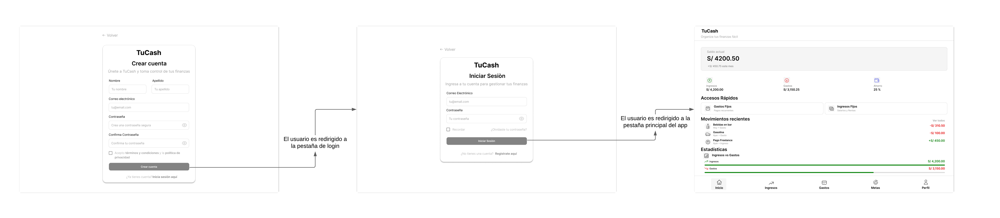<br>

**User goal: Inicializacion de sesión**
<td>Explicación del flujo: El usuario accede a la pestaña de iniciar sesión, ingresa su correo y contraseña y, si las credenciales son correctas, es redirigido a la página principal de la aplicación; en caso de que los datos sean incorrectos, el sistema muestra un mensaje de error y permanece en la misma pantalla hasta que los ingrese correctamente.</td><br><br>
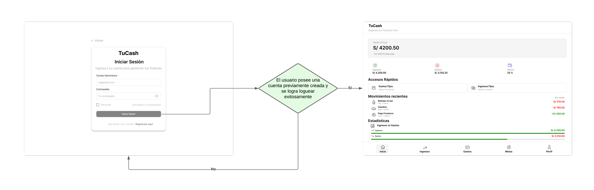<br>

**User goal: Agregar gasto**
<td>Explicación del flujo: Desde la página principal el usuario navega a la pestaña de Gastos, allí selecciona el botón Agregar, se abre el formulario correspondiente, ingresa los datos del nuevo gasto y, al confirmar, este se registra en el sistema y aparece en la lista de gastos.</td><br><br>
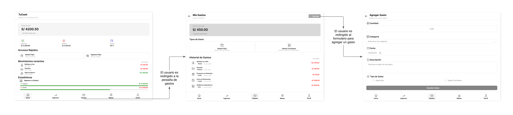<br>

**User goal: Agregar ingreso**
<td>Explicación del flujo: Desde la página principal el usuario navega a la pestaña de Ingresos, allí selecciona el botón Agregar, se abre el formulario correspondiente, ingresa los datos del nuevo ingreso y, al confirmar, este se registra en el sistema y aparece en la lista de ingresos.</td><br><br>
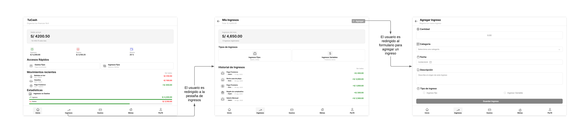<br>

**User goal: Agregar Meta de Ahorro**
<td>Explicación del flujo: Desde la página principal el usuario navega a la pestaña de Metas, allí selecciona el botón Agregar, se abre el formulario correspondiente, ingresa los datos de la nueva meta de ahorro y, al confirmar, esta se registra en el sistema y aparece en la lista de metas.</td><br><br>
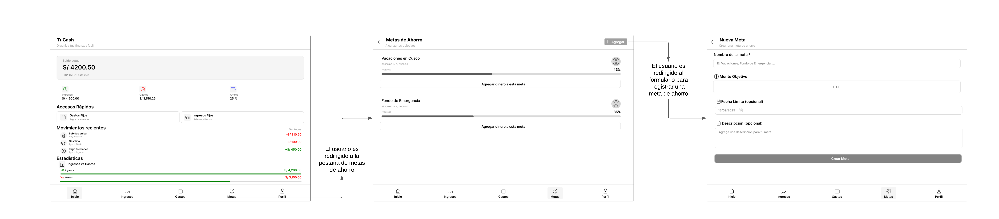<br>

**User goal: Cambiar de Plan**
<td>Explicación del flujo: Desde la página principal el usuario navega a la sección de Perfil, dentro accede a su información personal y entra a Editar perfil, allí selecciona el botón Actualizar a Premium, se despliega la lista de planes disponibles y, tras elegir uno, el sistema lo redirige a un módulo de pago externo para completar la transacción.</td><br><br>
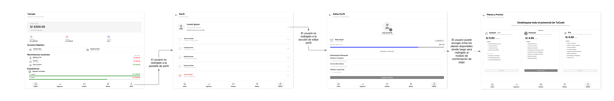<br>

[Enlace para acceder al Userflow](https://lucid.app/lucidchart/0d802203-8f9d-4b59-817f-3c6b7490bb7c/edit?viewport_loc=-87%2C-1314%2C3671%2C1795%2CpI4QGfYtSY~L&invitationId=inv_8cef57fc-6272-4261-ae91-e44b807ebd9f)

## 4.5. Web Applications Prototyping

Nuestro prototipo de la aplicación web:


## 4.6. Domain-Driven Software Architecture

### 4.6.1. Software Architecture Context Diagram

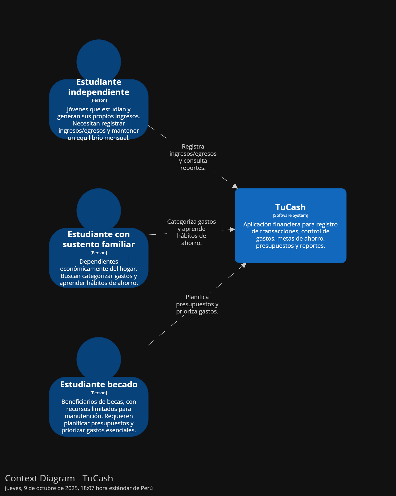  

### 4.6.2. Software Architecture Container Diagrams

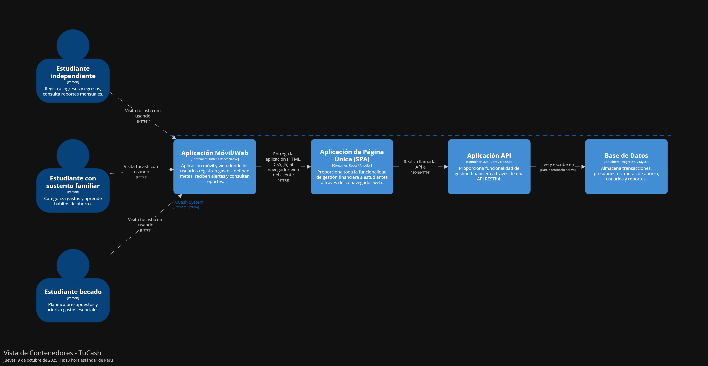  

### 4.6.3. Software Architecture Components Diagrams

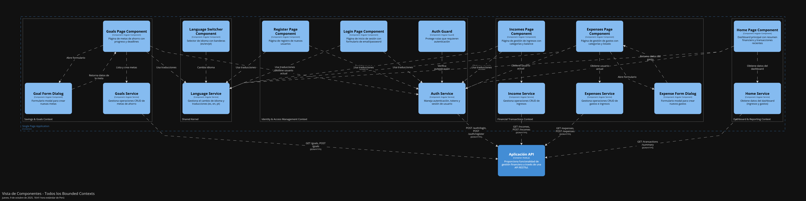  

#### Dashboard

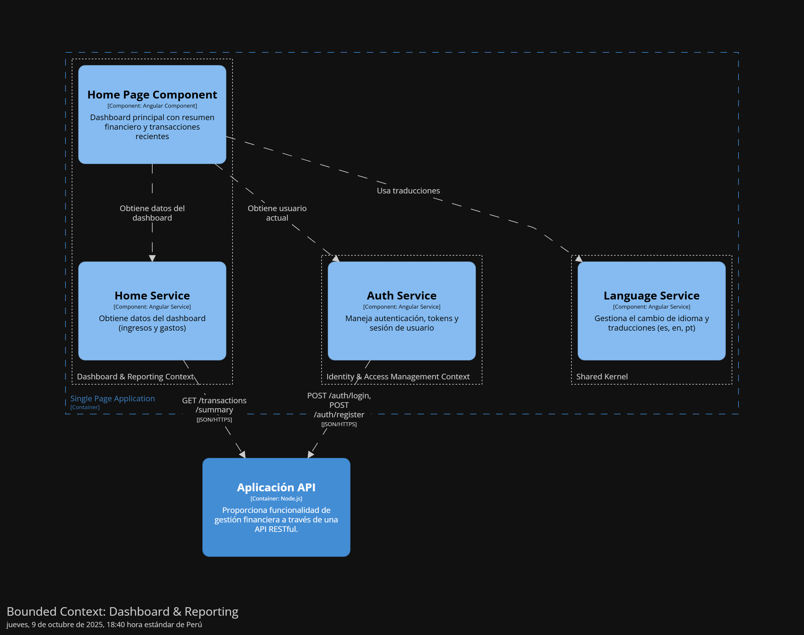

#### Transactions

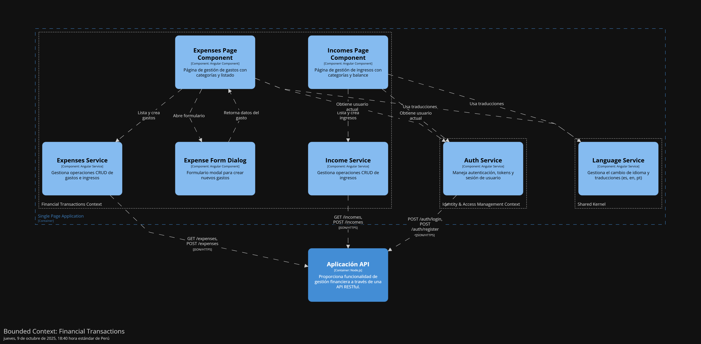

#### IAM

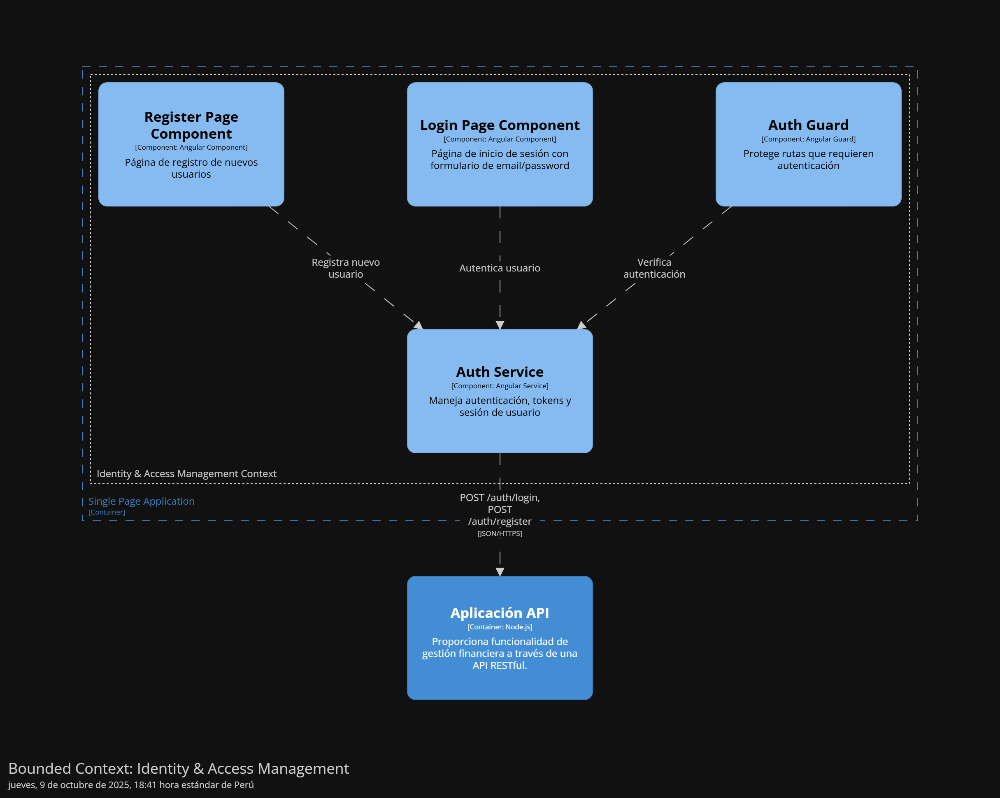

#### Savings

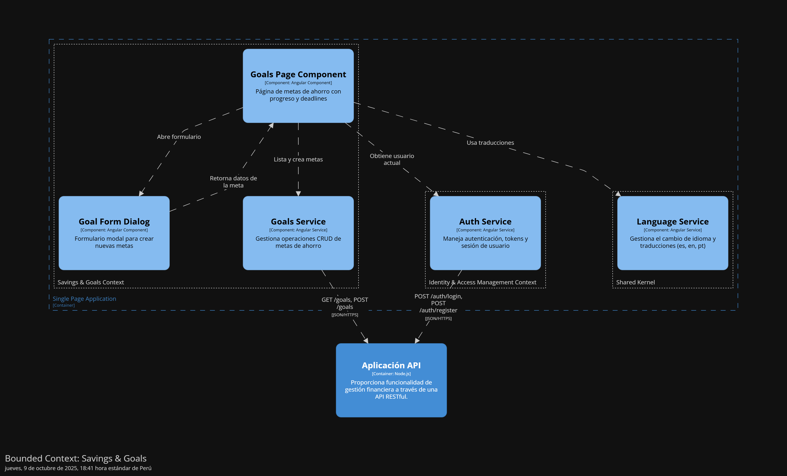

#### Shared

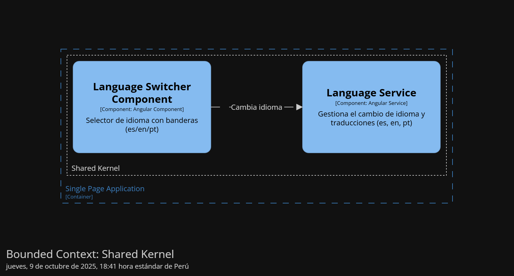

## 4.7. Software Object Oriented Design

### 4.7.1. Class Diagram

  

### 4.7.2. Class Dictionary

| Class        | Bounded Context       | Entity/Value Object | Description | Attributes | Methods | Relationships |
|--------------|----------------------|---------------------|-------------|------------|---------|----------------|
| **User** | CRM | Entity | Representa a un usuario registrado en la plataforma | - userId: int<br>- name: string<br>- email: string<br>- passwordHash: string<br>- createdAt: Date<br>- updatedAt: Date | + register()<br>+ login()<br>+ updateProfile()<br>+ getAccounts()<br>+ getTransactions() | - 1 to N Account: el usuario es dueño de una o múltiples cuentas<br>- 1 to N Transaction: el usuario registra una o múltiples transacciones<br>- 1 to N Goal: el usuario puede definir uno o múltiples objetivos<br>- 1 to N Budget: el usuario puede definir uno o múltiples presupuestos<br>- 1 to N AuthSession: el usuario se autentica |
| **Account** | CRM | Entity | Representa una cuenta financiera de un usuario (ej: cuenta corriente, ahorro, tarjeta de crédito) | - accountId: int<br>- userId: int<br>- name: string<br>- type: string<br>- balance: decimal<br>- currency: string<br>- createdAt: Date | + deposit(amount)<br>+ withdraw(amount)<br>+ transfer(toAcc, amount)<br>+ getTransactions() | - 1 to N Transaction: la cuenta contiene múltiples transacciones<br>- 1 to 1 User: la cuenta pertenece a un usuario |
| **Transaction** | Finance Management | Entity | Representa un movimiento financiero individual (ingreso, gasto, ahorro, transferencia) | - transactionId: int<br>- accountId: int<br>- userId: int<br>- categoryId: int<br>- type: string<br>- amount: decimal<br>- date: Date<br>- description: string<br>- createdAt: Date | + create()<br>+ edit()<br>+ delete()<br>+ assignCategory() | - N to 1 Account: la transacción pertenece a una cuenta<br>- N to 1 User: la transacción fue creada por un usuario<br>- N to 1 Category: la transacción está categorizada |
| **Category** | Finance Management | Value Object | Representa una etiqueta para agrupar transacciones (ej: Alimentación, Transporte, Sueldo) | - categoryId: int<br>- name: string<br>- type: string<br>- icon: string | + create()<br>+ edit()<br>+ delete() | - 1 to N Transaction: la categoría clasifica múltiples transacciones<br>- 1 to N Budget: la categoría agrupa múltiples presupuestos |
| **Goal** | Finance Management | Entity | Representa un objetivo de ahorro definido por el usuario (ej: fondo de emergencia, viaje) | - goalId: int<br>- userId: int<br>- name: string<br>- targetAmount: decimal<br>- currentAmount: decimal<br>- deadline: Date<br>- createdAt: Date | + addProgress(amount)<br>+ edit()<br>+ delete()<br>+ getProgress() | - N to 1 User: el objetivo es definido por un usuario |
| **Budget** | Finance Management | Entity | Representa una asignación de gasto mensual o por periodo, asociada a una categoría | - budgetId: int<br>- userId: int<br>- categoryId: int<br>- amount: decimal<br>- startDate: Date<br>- endDate: Date<br>- createdAt: Date | + trackSpending()<br>+ edit()<br>+ delete()<br>+ getRemaining() | - N to 1 User: el presupuesto es definido por un usuario<br>- N to 1 Category: el presupuesto aplica a una categoría |
| **AuthSession** | CRM | Value Object | Representa una sesión de autenticación para validar la identidad del usuario | - sessionId: int<br>- userId: int<br>- token: string<br>- expiresAt: Date | + createSession()<br>+ validateSession()<br>+ endSession() | - N to 1 User: la sesión es creada por un usuario |

## 4.8. Database Design

### 4.8.1. Database Diagram

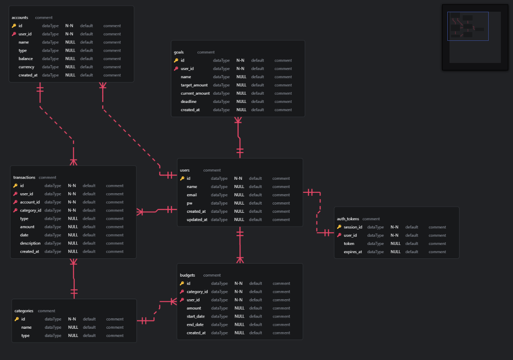  

# Capítulo V: Product Implementation, Validation & Deployment

## 5.1. Software Configuration Management

### 5.1.1. Software Development Environment Configuration

#### Project Management

#### Product UX/UI Design

<table border = "1">
  <thead>
    <tr>
      <th scope="col">Producto</th>
      <th scope="col">Proposito</th>
      <th scope="col">Tipo/Ruta</th>
    </tr>
  </thead>
  <tbody>
    <tr>
      <td>Figma</td>
      <td>Prototipado de interfaces web/móvil, diseño visual, UX flow</td>
      <td>SaaS <a href="https://www.figma.com/design/0eoLdvvEddDNIvvujQJGfU/TuCash?node-id=0-1&p=f&t=4wzMID1aOJqW6F2g-0" target="_blank">https://www.figma.com/</a></td>
    </tr>
    <tr>
      <td>Canva</td>
      <td>Diseño rápido de presentaciones y piezas visuales complementarias.</td>
      <td>
      SaaS
      <a href="https://www.figma.com/design/0eoLdvvEddDNIvvujQJGfU/TuCash?node-id=0-1&p=f&t=4wzMID1aOJqW6F2g-0" target="_blanck">https://www.canva.com/</a>
      </td>
    </tr>
  </tbody>
</table>

#### Software Development

<table border = "1">
  <thead>
    <tr>
      <th scope="col">Producto</th>
      <th scope="col">Proposito</th>
      <th scope="col">Tipo/Ruta</th>
    </tr>
  </thead>
  <tbody>
    <tr>
      <td>Visual Studio Code</td>
      <td>Editor principal para frontend (Angular, TypeScript).</td>
      <td><a href="https://code.visualstudio.com" target="_blank">Desktop – https://code.visualstudio.com</a></td>
    </tr>
    <tr>
      <td>IntelliJ IDEA Community</td>
      <td>Desarrollo backend (Spring Boot en Java).</td>
      <td>
      <a href="https://www.jetbrains.com/idea" target="_blanck">Desktop – https://www.jetbrains.com/idea</a>
      </td>
    </tr>
     <tr>
      <td>Angular CLI</td>
      <td>Generación de componentes, servicios y módulos frontend.</td>
      <td>
      <a href="https://angular.dev" target="_blanck">Terminal – https://angular.dev</a>
      </td>
    </tr>
     <tr>
      <td>Postman</td>
      <td>Pruebas y validación de APIs REST.</td>
      <td>
      <a href="https://postman.com" target="_blanck">Desktop/SaaS – https://postman.com</a>
      </td>
    </tr>
  </tbody>
</table>

#### Software Documentation

<table border = "1">
  <thead>
    <tr>
      <th scope="col">Producto</th>
      <th scope="col">Proposito</th>
      <th scope="col">Tipo/Ruta</th>
    </tr>
  </thead>
  <tbody>
    <tr>
      <td>GitHub</td>
      <td>Repositorio central y despliegue de documentación.</td>
      <td>SaaS <a href="https://github.com/TuCash" target="_blank">https://github.com/</a></td>
    </tr>
    <tr>
      <td>Trello</td>
      <td>Organización visual de entregables académicos y checklists de equipo.</td>
      <td>
      SaaS
      <a href="https://trello.com/b/Gaq5y139/tablero-trello-tucash" target="_blanck">https://trello.com/</a>
      </td>
    </tr>
    </tr>
    <tr>
      <td>Miro</td>
      <td>Creación de Empathy Maps, User Journeys, Event Storming.</td>
      <td>
      SaaS
      <a href="https://miro.com/app/board/uXjVJL9MIK8=/?share_link_id=902556983183" target="_blanck">https://miro.com</a>
      </td>
    </tr>
  </tbody>
</table>

### 5.1.2. Source Code Management

Para el control de versiones y la colaboración del equipo se empleará GitHub como repositorio central. Cada producto digital tendrá su propio repositorio:

- Report: <https://github.com/TuCash/Report.git>

- Landing Page: <https://github.com/TuCash/landingPage.git>

- Frontend Web Application: <https://github.com/TuCash/Frontend.git>

- Web Services (Backend + Tests): <https://github.com/TuCash/Bakend_kashu.git>

#### Esquema de organización con GitFlow

Nuestro equipo implementará el modelo de branching GitFlow, de acuerdo al artículo de Vincent Driessen “A successful Git branching model”. La organización de ramas será la siguiente:


###  Esquema de Organización con GitFlow

| **Rama**        | **Propósito**                                                                 | **Convención de nombres**          |
|-----------------|-------------------------------------------------------------------------------|------------------------------------|
| **main**        | Versión estable y lista para producción. Cada release se etiqueta.            | `vX.Y.Z` (Semantic Versioning)     |
| **develop**     | Rama de integración. Une todas las funcionalidades completadas y probadas.     | —                                  |
| **feature/**    | Desarrollo de nuevas funcionalidades, módulos o documentos.                    | `feature/nombre-funcionalidad`     |
| **release/**    | Preparación de una versión estable lista para producción.                     | `release/vX.Y.Z`                   |
| **hotfix/**     | Correcciones urgentes encontradas en producción.                               | `hotfix/vX.Y.Z`                    |

---

###  Convencional Commits

| **Tipo**   | **Uso**                                          | **Ejemplo**                                 |
|------------|--------------------------------------------------|----------------------------------------------|
| `feat:`    | Nueva funcionalidad                               | `feat(expenses): agregar card de gastos`     |
| `fix:`     | Corrección de errores                             | `fix(login): resolver bug en auth`           |
| `docs:`    | Cambios en documentación                          | `docs(readme): agregar guía de deploy`       |
| `style:`   | Cambios de estilo sin afectar lógica              | `style(ui): reajustar paddings`              |
| `refactor:`| Refactor sin añadir funcionalidad                 | `refactor(goals): optimizar cálculo`         |
| `test:`    | Nuevas pruebas o modificaciones                   | `test(profile): añadir test de avatar`       |
| `chore:`   | Configuraciones, scripts o tareas menores         | `chore(ci): agregar pipeline`                |

---

###  Front End Web Application Deployment (Angular)

| **Etapa**                   | **Descripción**                                                                                     | **Ejemplo / Comando**                                   |
|-----------------------------|-----------------------------------------------------------------------------------------------------|----------------------------------------------------------|
| **Build de producción**     | Genera código optimizado, minificado y con lazy-loading.                                             | `ng build --configuration production`                    |
| **Salida del build**        | Directorio resultante del build listo para deploy.                                                   | `/dist/tucash/`                                          |
| **CI/CD (GitHub Actions)**  | Pipeline que ejecuta lint, tests y build al hacer push a develop/main/release.                      | _Workflow YAML incluido abajo_                           |
| **Deploy automático**       | Se puede desplegar en Vercel, Netlify, Firebase o GitHub Pages.                                      | `firebase deploy`                                        |
| **Archivos de entorno**     | Configuración por ambiente (API URL, logging, flags).                                               | `environment.ts` / `environment.prod.ts`                 |
| **Conexión con Backend**    | Angular consume el backend con CORS habilitado en Spring Boot.                                      | `this.http.get(\`\${environment.apiUrl}/transactions\`)` |
| **Telemetría (opcional)**   | Envío de logs y métricas UI a un endpoint del backend.                                               | `POST /logs`                                             |


###  Esquema de Organización con GitFlow (Backend)

| **Rama**        | **Propósito**                                                                 | **Convención de nombres**          |
|-----------------|-------------------------------------------------------------------------------|------------------------------------|
| **main**        | Contiene la versión estable del backend, ya probada y lista para despliegue. | `vX.Y.Z`                           |
| **develop**     | Rama de integración donde se mezclan nuevas características antes del release | —                                  |
| **feature/**    | Implementación de nuevos endpoints, validaciones o lógica de dominio          | `feature/auth-jwt`, `feature/goals-api` |
| **release/**    | Empaquetado y estabilización previo al despliegue                            | `release/v1.0.0`                   |
| **hotfix/**     | Correcciones críticas en producción                                          | `hotfix/v1.0.1`                    |

---

###  Conventional Commits (Backend)

| **Tipo**   | **Uso**                                          | **Ejemplo**                                 |
|------------|--------------------------------------------------|----------------------------------------------|
| `feat:`    | Nuevo endpoint o servicio                         | `feat(transactions): agregar paginación`      |
| `fix:`     | Correcciones en validaciones, repos o controladores | `fix(goals): corregir cálculo de progreso`    |
| `docs:`    | Actualización de Swagger/OpenAPI o Readme         | `docs(api): actualizar parámetros de /goals`  |
| `refactor:`| Limpieza del dominio o mejoras internas           | `refactor(auth): separar AuthService`         |
| `style:`   | Formato del código (imports, spacing)             | `style(config): ordenar imports`              |
| `test:`    | Unit tests con JUnit o Mockito                    | `test(transactions): agregar pruebas de filtros` |
| `chore:`   | Configuración, scripts, Docker, pipelines         | `chore(db): agregar docker-compose para postgres` |

---

### 🗄️ Arquitectura del Backend (Capas)

| **Capa**         | **Función**                                                                 |
|------------------|------------------------------------------------------------------------------|
| `controller/`    | Expone endpoints REST                                                        |
| `service/`       | Lógica de dominio / reglas de negocio                                       |
| `repository/`    | Acceso a datos (Spring Data JPA)                                            |
| `entity/`        | Modelos persistentes                                                        |
| `dto/`           | Request/response API                                                         |
| `config/`        | Seguridad, CORS, JWT, Swagger                                               |


---

### 5.1.3. Source Code Style Guide & Conventions

Como norma general, todo el código del proyecto debe escribirse en **inglés**, tanto para etiquetas, funciones, variables, como para comentarios técnicos.

### HTML

- **Use lowercase element names**
  Todo el marcado HTML debe estar escrito en minúsculas.

  ```html
  <body>
    <section class="hero"></section>
  </body>
  ```

- **Close all HTML elements**
  Todos los elementos deben cerrarse correctamente, incluso si no es obligatorio en HTML5.

  ```html
  <p>This is a paragraph</p>
  ```

- **Use lowercase attribute names**
  Los atributos deben escribirse en minúsculas.

  ```html
  
  ```

- **Always specify `alt`, `width`, and `height` for images**
  Todas las imágenes deben tener atributo `alt` y, de ser posible, valores explícitos de `width` y `height`. Esto mejora accesibilidad y rendimiento.

  ```html
  
  ```

- **Spaces and equal signs**
  No se debe dejar espacio alrededor del `=` en los atributos, excepto dentro de valores entre comillas.

  ```html
  <link rel="stylesheet" href="assets/css/styles.css">
  ```

- **Language consistency**
  Aunque el `lang="es"` es válido para el sitio, todos los identificadores (`class`, `id`, atributos, nombres de archivos) deben redactarse en inglés.

  ```html
  <section id="benefits" class="benefits"></section>
  ```

---

### JavaScript

- **Use expanded syntax**
  Cada bloque de código debe abrir llaves en la misma línea de la declaración y cerrarlas en línea nueva.

  ```javascript
  function handleLogoClick() {
    console.log('Logo clicked');
  }
  ```

- **Variable naming**
  Se debe usar **lowerCamelCase** para nombrar variables.

  ```javascript
  let playerScore = 0;
  let windowWidth = window.innerWidth;
  ```

- **Function naming**
  Los nombres de las funciones deben usar **lowerCamelCase**, expresando claramente su propósito.

  ```javascript
  function toggleMobileMenu() { ... }
  function closeMobileMenu() { ... }
  ```

- **Declaring variables**
  Usar `const` y `let` en lugar de `var`.

  ```javascript
  const mobileNav = document.getElementById('mobileNav');
  let windowWidth = window.innerWidth;
  ```

- **Event listeners**
  Se recomienda usar funciones flecha cuando no se necesite `this`, y mantener consistencia en la forma de declarar funciones.

  ```javascript
  document.addEventListener('DOMContentLoaded', () => {
    window.addEventListener('resize', () => { ... });
  });
  ```

---

### CSS

- **Selectors naming**
  Se utiliza **lowercase con guiones (`kebab-case`)** para clases e identificadores.

  ```css
  .hero-content { ... }
  .beneficio-card__heading { ... }
  ```

- **Class and ID usage**
  Priorizar el uso de **clases** sobre **IDs** para facilitar la reutilización y escalabilidad de estilos.

- **Indentation**
  Usar **2 espacios** para indentación. No usar tabulaciones.

  ```css
  .hero {
    display: flex;
    justify-content: center;
  }
  ```

- **Property order**
  Seguir el orden lógico:

  1. Propiedades de posición (`position`, `top`, `left`, etc.)
  2. Modelo de caja (`display`, `flex`, `width`, `height`, `margin`, `padding`)
  3. Tipografía (`font-family`, `font-size`, `line-height`, `color`)
  4. Estilo visual (`background`, `border`, `box-shadow`)
  5. Transiciones y animaciones

- **Consistent units**
  Usar `rem` o `px` de forma consistente, evitando `em` y `%` salvo en casos específicos.

  ```css
  .hero-title {
    font-size: 80px;
    line-height: 90px;
  }
  ```

- **Colors and variables**
  Colores escritos en formato **hexadecimal en mayúsculas** (`#FFFFFF`). Se recomienda uso de variables CSS (`:root`) en proyectos grandes.

  ```css
  body {
    background-color: #F4F6F8;
    color: #1D2A3A;
  }
  ```

- **Responsive design**
  Los `@media` queries deben colocarse al final del archivo y seguir un orden descendente (desktop → tablet → mobile).

  ```css
  @media (max-width: 768px) {
    .hero-title {
      font-size: 40px;
    }
  }
  ```

- **Font usage**
  Definir siempre tipografía, peso y familia en cada bloque relevante.

  ```css
  .beneficios__title {
    font-family: 'Koulen', sans-serif;
    font-size: 3.5rem;
  }
  ```

---

### 5.1.4. Software Deployment Configuration

- Creación Landing Page:<br>

1. Se crea un repositorio remoto en GitHub

2. Agregar a participantes

3. Habilitamos GitHub Pages


---

## 5.2. Landing Page, Services & Applications Implementation

### 5.2.1. Sprint 1

#### 5.2.1.1. Sprint Planning 1

<table border="1">
  <tr>
    <th>Sprint 1</th>
    <td>Sprint Planning</td>
  </tr>
  <tr>
    <th colspan="2">Sprint Planning Background</th>
  </tr>
  <tr>
    <th>Date</th>
    <td>2025-09-09</td>
  </tr>
  <tr>
    <th>Time</th>
    <td>10:00 AM – 11:30 AM</td>
  </tr>
  <tr>
    <th>Location</th>
    <td>Reunión virtual vía Discord</td>
  </tr>
  <tr>
    <th>Prepared By</th>
    <td>Huaman Hinostroza, Milenio</td>
  </tr>
  <tr>
    <th>Attendees (to planning meeting)</th>
    <td>Jhunior Giussepe / Harrison Hubert / Javier Mondoñedo / Valeria Mejia</td>
  </tr>
  <tr>
    <th>Sprint 0 Review Summary</th>
    <td>En el Sprint 0 se establecieron los cimientos del proyecto:
    Configuración de repositorios en GitHub con GitFlow.Definición de convenciones de commits (Conventional Commits).rimera versión del documento con Startup Profile, Solution Profile y Segmentos Objetivo.
    Diseño preliminar de la identidad visual (logo, isotipo, paleta de colores).
    Feedback del Product Owner: se valoró la claridad del planteamiento del segmento objetivo, y se solicitó avanzar en la construcción de entrevistas y primeras historias de usuario</td>
  </tr>
  <tr>
    <th>Sprint 0 Retrospective Summary</th>
    <td>El equipo destacó como aciertos la rápida organización del flujo de trabajo con GitHub y la buena colaboración en la documentación inicial. Como oportunidades de mejora se identificó la necesidad de asignar mejor los roles para evitar solapamiento de tareas, y de calendarizar reuniones cortas diarias de seguimiento.</td>
  </tr>
  <tr>
    <th colspan="2">Sprint Goal &amp; User Stories</th>
  </tr>
  <tr>
    <th>Sprint 1 Goal</th>
    <td>Our focus is on validar las necesidades financieras de los estudiantes universitarios mediante entrevistas y consolidar los primeros artefactos de requerimientos.
We believe it delivers una base sólida para construir funcionalidades alineadas a los segmentos objetivo.
This will be confirmed when se documenten al menos 6 entrevistas analizadas y derivadas en 3 User Personas y sus respectivos Empathy Maps</td>
  </tr>
  <tr>
    <th>Sprint 1 Velocity</th>
    <td>El equipo estableció un velocity de 5 story points, en base a la disponibilidad de los 5 integrantes.</td>
  </tr>
  <tr>
    <th>Sum of Story Points</th>
    <td>El Sprint incluye historias que suman 10 story points en total.</td>
  </tr>
</table>

#### 5.2.1.2. Aspect Leaders and Collaborators

<table border = "1">
  <tr>
    <th>Team Member (Last Name, First Name)</th>
    <th>GitHub Username</th>
    <th>Aspect 1 (L/C)</th>
    <th>Aspect 2 (L/C)</th>
    <th>Aspect n (L/C)</th>
  </tr>
  <tr>
    <td>Milenio Huaman Hinostroza</td>
    <td>Milenioupc</td>
    <td>L</td>
    <td>C</td>
    <td>…</td>
  </tr>
  <tr>
    <td>Jhunior Giussepe Taquiri Calderon</td>
    <td>GiussepeTC0410</td>
    <td>C</td>
    <td>C</td>
    <td>L</td>
  </tr>
  <tr>
    <td>Harrison Hubert Payesa Torres</td>
    <td>Harrison1024</td>
    <td>C</td>
    <td>C</td>
    <td>L</td>
  </tr>
  <tr>
    <td>Juan Diego Javier Mondoñedo Rodriguez</td>
    <td>Jmondonedor</td>
    <td>C</td>
    <td>C</td>
    <td>L</td>
  </tr>
  <tr>
    <td>Patricia Valeria Mejia Poma</td>
    <td>patriciavmp</td>
    <td>C</td>
    <td>C</td>
    <td>L</td>
  </tr>
</table>

#### 5.2.1.3. Sprint Backlog 1


<table border="1" cellpadding="6" cellspacing="0" style="border-collapse:collapse; width:100%;">
  <thead>
    <tr>
      <th colspan="2">User Story</th>
      <th colspan="2">Work-Item / Task</th>
      <th>Description</th>
      <th>Estimation (Hours)</th>
      <th>Assigned To</th>
      <th>Status (To-do / In-Process / To-Review / Done)</th>
    </tr>
    <tr>
      <th>Id</th>
      <th>Title</th>
      <th>Id</th>
      <th>Title</th>
      <th></th>
      <th></th>
      <th></th>
      <th></th>
    </tr>
  </thead>
  <tbody>
    <tr>
      <td>US01</td>
      <td>Registro de ingresos y egresos (independiente)</td>
      <td>T-101</td>
      <td>Definir categorías base</td>
      <td>Listado inicial de categorías y etiquetas (Income/Expense).</td>
      <td>3</td>
      <td>Milenio</td>
      <td>Done</td>
    </tr>
    <tr>
      <td>US01</td>
      <td>Registro de ingresos y egresos (independiente)</td>
      <td>T-102</td>
      <td>Wireframe flujo de registro</td>
      <td>Prototipo de 2 pasos: monto + categoría + nota.</td>
      <td>5</td>
      <td>Patricia</td>
      <td>To-do</td>
    </tr>
    <tr>
      <td>US01</td>
      <td>Registro de ingresos y egresos (independiente)</td>
      <td>T-103</td>
      <td>Endpoint mock /api/transactions</td>
      <td>Mock API (JSON) para pruebas de UI.</td>
      <td>4</td>
      <td>Giussepe</td>
      <td>In-Process</td>
    </tr>
    <tr>
      <td>US02</td>
      <td>Categorización de gastos (sustento familiar)</td>
      <td>T-201</td>
      <td>Entrevistas (3 students)</td>
      <td>Guía + ejecución de 3 entrevistas y notas.</td>
      <td>6</td>
      <td>Harrison</td>
      <td>In-Process</td>
    </tr>
    <tr>
      <td>US02</td>
      <td>Categorización de gastos (sustento familiar)</td>
      <td>T-202</td>
      <td>Persona + Empathy Map</td>
      <td>Construcción de 1 persona y su mapa de empatía.</td>
      <td>4</td>
      <td>Milenio</td>
      <td>To-Review</td>
    </tr>
    <tr>
      <td>US03</td>
      <td>Metas de ahorro (becado)</td>
      <td>T-301</td>
      <td>Definir modelo de metas</td>
      <td>Atributos: nombre, monto, fecha objetivo, progreso.</td>
      <td>3</td>
      <td>Juan Diego</td>
      <td>To-do</td>
    </tr>
    <tr>
      <td>US03</td>
      <td>Metas de ahorro (becado)</td>
      <td>T-302</td>
      <td>UI componente “Goal Card”</td>
      <td>Diseño y estilos de tarjeta de meta con barra de avance.</td>
      <td>5</td>
      <td>Arturo</td>
      <td>To-do</td>
    </tr>
    <tr>
      <td>—</td>
      <td>—</td>
      <td>T-900</td>
      <td>Configuración CI (lint/tests)</td>
      <td>Pipeline en GitHub Actions para lint y unit tests.</td>
      <td>4</td>
      <td>Giussepe</td>
      <td>To-do</td>
    </tr>
  </tbody>
</table>

# Technical User Stories – Landing Page (HTML, CSS, JS)

| **Tech Story** | **Title** | **Descripción técnica (Landing Page)** |
|----------------|-----------|----------------------------------------|
| TS01 | Sección de registro de ingresos/egresos | Implementar en la landing una sección que explique y muestre el flujo básico de registro de ingresos y egresos (independiente), basada en las categorías definidas y el wireframe. |
| TS02 | Storytelling de categorización de gastos | Diseñar y maquetar una sección de la landing que explique el beneficio de categorizar gastos (para estudiantes con sustento familiar), usando insights de entrevistas, persona y empathy map. |
| TS03 | Visualización de metas de ahorro | Implementar en la landing un componente visual tipo “Goal Card” que muestre cómo el producto ayuda a estudiantes becados a planificar y seguir sus metas de ahorro. |
| TS04 | Pipeline de calidad para la landing | Configurar un pipeline básico (lint/tests/build) en GitHub Actions que verifique el código HTML, CSS y JS de la landing en cada push. |


# Mapa de Trazabilidad – Landing Page

| **User Story (US)** | **Título US** | **Technical Story (TS)** | **Work-Items / Tasks relacionados** |
|---------------------|--------------|---------------------------|-------------------------------------|
| US01 | Registro de ingresos y egresos (independiente) | TS01 – Sección de registro de ingresos/egresos | T-101 Definir categorías base; T-102 Wireframe flujo de registro; T-103 Endpoint mock /api/transactions |
| US02 | Categorización de gastos (sustento familiar) | TS02 – Storytelling de categorización de gastos | T-201 Entrevistas (3 students); T-202 Persona + Empathy Map |
| US03 | Metas de ahorro (becado) | TS03 – Visualización de metas de ahorro | T-301 Definir modelo de metas; T-302 UI componente “Goal Card” |
| — | — | TS04 – Pipeline de calidad para la landing | T-900 Configuración CI (lint/tests) |


#### 5.2.1.4. Development Evidence for Sprint Review

<h3>Development Evidence for Sprint Review – Sprint 1</h3>

<table border="1" cellpadding="6" cellspacing="0" style="border-collapse:collapse; width:100%;">
  <thead>
    <tr>
      <th>Repository</th>
      <th>Branch</th>
      <th>Commit Id</th>
      <th>Commit Message</th>
      <th>Commit Message Body</th>
      <th>Commited on (Date)</th>
    </tr>
  </thead>
  <tbody>
    <tr>
      <td>tucash-landing</td>
      <td>feature/setup-landing</td>
      <td>a1b2c3d</td>
      <td>feat(landing): add initial HTML structure</td>
      <td>Se agregó la estructura inicial del Landing Page con encabezado y secciones básicas.</td>
      <td>2025-09-18</td>
    </tr>
    <tr>
      <td>tucash-webapp</td>
      <td>feature/ui-components</td>
      <td>d4e5f6g</td>
      <td>feat(ui): configure Angular Material</td>
      <td>Configuración inicial de Angular Material e importación de módulos para componentes básicos.</td>
      <td>2025-09-18</td>
    </tr>
    <tr>
      <td>tucash-api</td>
      <td>feature/setup-api</td>
      <td>h7i8j9k</td>
      <td>feat(api): create mock transaction endpoint</td>
      <td>Se creó un endpoint GET /transactions para pruebas iniciales de integración.</td>
      <td>2025-09-19</td>
    </tr>
    <tr>
      <td>tucash-docs</td>
      <td>feature/doc-introduction</td>
      <td>m1n2o3p</td>
      <td>docs(intro): add Solution Profile draft</td>
      <td>Se añadió el borrador de la sección de antecedentes, problemática y segmentos objetivo.</td>
      <td>2025-09-19</td>
    </tr>
  </tbody>
</table>

#### 5.2.1.5. Execution Evidence for Sprint Review

Durante el **Sprint 1**, el equipo ejecutó y validó las siguientes implementaciones:

- **Landing Page:**

  - Se construyó la estructura inicial con encabezado, menú de navegación y secciones básicas de presentación (home y about).
  - Se validó el despliegue exitoso en GitHub Pages, quedando accesible públicamente.


#### 5.2.1.6. Services Documentation Evidence for Sprint Review

Durante el Sprint 1 se documentó el primer servicio de Web Services TuCash relacionado con transacciones financieras. Se configuró un proyecto en Spring Boot con soporte para OpenAPI/Swagger y se implementó un endpoint de prueba /transactions. La documentación está disponible en Swagger UI (ejecutada localmente).

#### 5.2.1.7. Software Deployment Evidence for Sprint Review

Durante el **Sprint 1**, el equipo realizó la configuración inicial del entorno de despliegue y únicamente se desplegó el **Landing Page** como primer entregable accesible en línea.

**Actividades realizadas:**

- **Landing Page**

  - Repositorio creado en GitHub (`https://github.com/TuCash/landingPage`).
  - Configuración de GitHub Pages como plataforma de despliegue.
  - Deploy inicial accesible en: <https://tucash.github.io/landingPage/>.
  -


**Nota:**

- La **Web Application (Frontend Angular)** y los **Web Services (Backend Spring Boot)** no fueron desplegados en este sprint. Únicamente se avanzó en su configuración inicial a nivel de repositorio para futuros despliegues.
- La **automatización (CI/CD)** está pendiente de configuración en próximos sprints.

#### 5.2.1.8. Team Collaboration Insights during Sprint

Durante el Sprint 1, el equipo colaboró activamente mediante reuniones virtuales (Microsoft Teams) y el uso de GitHub Projects para dar seguimiento a las tareas. Cada miembro del equipo realizó contribuciones a los diferentes productos: Landing Page, Web Application y Web Services.

La evidencia de colaboración se muestra en las estadísticas de GitHub (commits y Pull Requests). Se confirma que todos los integrantes participaron en la implementación, asegurando consistencia con la metodología ágil y el enfoque colaborativo del proyecto.

<h3>Team Collaboration Insights – Sprint 1</h3>

<table border="1" cellpadding="6" cellspacing="0" style="border-collapse:collapse; width:100%;">
  <thead">
    <tr>
      <th>Team Member</th>
      <th>Landing Page</th>
      <th>Web Application</th>
      <th>Web Services</th>
      <th>Documentation & QA</th>
    </tr>
  </thead>
  <tbody>
    <tr>
      <td>Huaman Hinostroza, Milenio</td>
      <td>Commits en HTML inicial</td>
      <td>Componentes Angular básicos</td>
      <td>Colaboración en endpoint mock</td>
      <td>Docs (Solution Profile)</td>
    </tr>
    <tr>
      <td>Harrison Hubert Payesa Torres</td>
      <td>Soporte en estilos CSS</td>
      <td>Colaboración en UI forms</td>
      <td>Test con Postman</td>
      <td>QA y retro de equipo</td>
    </tr>
    <tr>
      <td>Juan Diego Javier Mondoñedo Rodriguez</td>
      <td>Navbar y routing</td>
      <td>Diseño de Dashboard</td>
      <td>Configuración Swagger</td>
      <td>User Personas</td>
    </tr>
    <tr>
      <td>Patricia Valeria Mejia Poma</td>
      <td>Soporte responsive</td>
      <td>Configuración Angular Material</td>
      <td>Setup Spring Boot API</td>
      <td>Testing</td>
    </tr>
     <tr>
      <td>Jhunior Giussepe Taquiri Calderon</td>
      <td>Soporte responsive</td>
      <td>Configuración Angular Material</td>
      <td>Setup Spring Boot API</td>
      <td>Testing</td>
    </tr>
  </tbody>
</table>

# 5.2.2. Sprint 2

> **Proyecto:** TuCash (TP1)  
> **Objetivo general del Sprint 2:** Consolidar implementación, validación y despliegue de los módulos **Expenses**, **Incomes**, **Goals**, **Home & Login** y **Profile**, entregando una landing funcional y flujo mínimo operable (MVP) para registro/visualización de transacciones y metas.

---

## 5.2.2.1. Sprint Planning 2

| Campo | Detalle |
|---|---|
| **Sprint** | Sprint 2 |
| **Fecha** | 2025-10-09 |
| **Hora** | 5:00 PM (America/Lima) |
| **Lugar** | Servidor de Discord del equipo |
| **Preparado por** | Jhunior Giussepe Taquiri Calderon |
| **Asistentes (planning)** | Taquiri Calderon, Jhunior Giussepe · Payesa Torres, Harrison Hubert · Mondoñedo Rodriguez, Juan Diego Javier · Mejia Poma, Patricia Valeria · Huaman Hinostroza, Milenio |
| **Sprint 2 Review (resumen)** | Se revisó el avance del **Dashboard** y la **Landing**, cierre de bugs del Sprint 1, y la integración front–back de **Expenses**/**Incomes**. Se acordó priorizar **Home & Login** y **Profile** para flujo de autenticación completo. |
| **Sprint 2 Retrospective (resumen)** | Mejoras en coordinación (pareo por módulos), definición de criterios de aceptación por historia y checklist de accesibilidad. Se acordó cerrar PRs con revisión cruzada y demos cortas al final de cada día. |
| **Meta del Sprint 2** | Entregar una **Landing** funcional y un **MVP navegable** con autenticación (Home & Login), registro/edición de gastos/ingresos, visualización de metas y gestión básica de perfil; documentación y despliegue en ambiente de pruebas. |
| **Velocidad (planeada)** | 7 |
| **Suma de Story Points** | 7 |

---


## 5.2.2.2. Aspect Leaders and Collaborators (LACX) – Sprint 2

Durante el Sprint 2 del proyecto *TuCash*, el equipo adoptó el modelo LACX (Leader–Associate–Contributor eXchange) para distribuir responsabilidades de forma clara, garantizar ownership por módulo y promover colaboración cruzada entre miembros.  
Cada aspecto clave del producto cuenta con un **líder responsable de la toma de decisiones técnicas y funcionales**, acompañado por **colaboradores que apoyan la implementación, validación y documentación**.

###  Roles principales del Sprint
- **Leader (L):** Responsable del diseño funcional/técnico, lineamientos, priorización interna y validación final del deliverable.  
- **Associates/Collaborators (C):** Apoyan en desarrollo, testing, documentación y aseguramiento de calidad del módulo.  
- **Cross-Support (XS):** Soporte general del equipo cuando el módulo requiere integración o pruebas de extremo a extremo.
----

###  **Tabla LACX – Sprint 2**

| **Aspecto / Módulo** | **Líder (L)** | **Colaboradores (C)** | **Responsabilidad Principal** |
|----------------------|----------------|------------------------|-------------------------------|
| **Expenses (Gestión de Gastos)** | **J. G. Taquiri** | H. Payesa, P. Mejía | Arquitectura del flujo de registro/edición, validación UI, mock API y pruebas UAT. |
| **Incomes (Gestión de Ingresos)** | **H. Payesa** | J. G. Taquiri | Definición del flujo de ingresos, normalización del modelo y manejo de sincronización con el dashboard. |
| **Goals (Metas de Ahorro)** | **J. D. Mondoñedo** | J. G. Taquiri | Diseño de “Goal Model”, UI de progresos, validaciones y manejo lógico del estado de metas. |
| **Home & Login** | **M. Huamán** | H. Payesa | Asegurar navegación general, autenticación mínima mock y accesibilidad base del landing. |
| **Profile (Perfil & Settings)** | **P. Mejía** | J. D. Mondoñedo | Preferencias de usuario (moneda/idioma), foto de perfil y ajustes del dashboard. |
| **QA / UAT & Accesibilidad** | **P. Mejía** | Todo el equipo | Diseño de criterios UAT, correcciones, pruebas cruzadas, checklist de accesibilidad. |
| **CI/CD & Deploy** | **H. Payesa** | M. Huamán | Pipeline Angular, verificación de build, previsualización y deploy continuo. |
| **Documentación (TP1 / Capítulo V)** | **J. G. Taquiri** | Todo el equipo | Redacción de capítulos técnicos, evidencias, anexos y consolidación del Sprint. |


---

## 5.2.2.3. Sprint Backlog 2
## 5.2.2.4. User Stories (Frontend Angular – Sprint 2)

A partir de las épicas EP01, EP02, EP03 y EP04 se seleccionan las historias de usuario que impactan directamente en los módulos del frontend Angular para este sprint.

| **Id (FE-US)** | **Origen (EP/US)** | **Módulo**          | **Título**                             | **Descripción breve** |
|----------------|--------------------|---------------------|----------------------------------------|------------------------|
| FE-US01        | EP01/US01          | Login & Home        | Crear mi espacio financiero            | El usuario puede registrarse por primera vez para empezar a organizar su dinero. |
| FE-US02        | EP01/US02          | Login & Home        | Entrar a mi cuenta                     | El usuario puede iniciar sesión y acceder a su Panel Principal. |
| FE-US03        | EP01/US03          | Login               | Recuperar mi acceso                    | El usuario puede recuperar su contraseña vía correo. |
| FE-US04        | EP03/US01          | Home (Dashboard)    | Saber “cómo voy” de un vistazo         | El usuario ve un resumen de ingresos, gastos y saldo en el Home. |
| FE-US05        | EP01/US04          | Profile             | Personalizar mi perfil                 | El usuario puede editar nombre y foto de perfil. |
| FE-US06        | EP01/US05          | Profile / Settings  | Configurar mis preferencias            | El usuario puede elegir la moneda principal de la app. |
| FE-US07        | EP02/US01          | Incomes             | Registrar el dinero que recibo         | El usuario registra nuevos ingresos y ve actualizado su saldo. |
| FE-US08        | EP02/US02          | Expenses            | Anotar mis gastos diarios              | El usuario registra gastos, asigna categorías y actualiza su saldo. |
| FE-US09        | EP02/US04          | Incomes/Expenses    | Corregir un registro                   | El usuario edita montos/categorías de transacciones ya registradas. |
| FE-US10        | EP02/US05          | Incomes/Expenses    | Filtrar mis movimientos                | El usuario filtra transacciones por fecha, categoría o tipo. |
| FE-US11        | EP04/US01          | Goals               | Ahorrar para algo que quiero           | El usuario crea metas de ahorro con nombre y monto objetivo. |
| FE-US12        | EP04/US02          | Goals               | Ver crecer mis ahorros                 | El usuario añade aportes a una meta y ve el progreso actualizado. |
| FE-US13        | EP04/US03          | Goals               | Ajustar mis metas                      | El usuario puede editar monto objetivo/fecha de una meta. |
| FE-US14        | EP04/US04          | Goals               | Celebrar un logro                      | El usuario marca una meta como lograda y ve la “celebración” en la UI. |

## 5.2.2.5. Technical Stories (Frontend Angular – Sprint 2)

Historias técnicas enfocadas en la **Web Application (Angular)** para soportar el MVP de registro y visualización de transacciones y metas.

| **Id (FE-TS)** | **Título**                                             | **Módulo / Área**        | **Descripción técnica** |
|----------------|--------------------------------------------------------|---------------------------|--------------------------|
| FE-TS01        | Bootstrap del proyecto Angular + routing base          | Infraestructura           | Crear proyecto Angular, configurar routing principal y layout base (shell: header, sidebar, router-outlet). |
| FE-TS02        | Módulo de autenticación (Login / Register / Recover)   | Login & Home              | Implementar componentes Angular para login, registro y recuperación; formularios reactivos; integración con servicio Auth. |
| FE-TS03        | AuthGuard y protección de rutas                        | Infraestructura           | Implementar guardas de ruta para restringir acceso a módulos (Home, Expenses, Incomes, Goals, Profile) solo a usuarios autenticados. |
| FE-TS04        | Servicio de autenticación (AuthService)                | Login & Home              | Implementar AuthService con manejo de token (almacenamiento en localStorage/sessionStorage) y estado de sesión. |
| FE-TS05        | Módulo Home & Dashboard                                | Home                      | Crear componentes para el Panel Principal y tarjeta de resumen (saldo, total ingresos, total gastos del mes). |
| FE-TS06        | Módulo Profile & Settings                              | Profile / Settings        | Implementar componentes para ver/editar perfil y preferencias de usuario (nombre, foto, moneda). |
| FE-TS07        | Módulo Incomes – Listado y formulario                  | Incomes                   | Crear componentes para listar ingresos, formulario de creación/edición y comunicación con el servicio de transacciones. |
| FE-TS08        | Módulo Expenses – Listado y formulario                 | Expenses                  | Crear componentes para listar gastos, formulario de creación/edición y comunicación con el servicio de transacciones. |
| FE-TS09        | Servicio de transacciones (TransactionsService)        | Incomes / Expenses        | Implementar servicio Angular para CRUD de transacciones (ingresos/egresos), filtros y manejo de errores. |
| FE-TS10        | Filtros y búsqueda en historial                        | Incomes / Expenses        | Implementar filtros por categoría, tipo, rango de fechas y búsqueda por texto a nivel de UI. |
| FE-TS11        | Módulo Goals – listado, creación y detalle             | Goals                     | Crear componentes para ver lista de metas, registrar nueva meta y ver detalle con progreso. |
| FE-TS12        | Actualización de progreso de metas                     | Goals                     | Implementar UI y lógica para registrar aportes, recalcular porcentaje y actualizar barra de progreso. |
| FE-TS13        | Feedback visual y manejo de errores                    | Cross-cutting (UI/UX)     | Implementar toasts/alerts para operaciones exitosas o con error (registro, edición, filtros, metas). |
| FE-TS14        | Estilos globales y diseño responsivo                   | UI / Landing / General    | Definir estilos globales (theme), grid responsivo y adaptabilidad para móvil/escritorio de los módulos del sprint. |
| FE-TS15        | Testing básico de componentes críticos                 | Calidad                   | Implementar pruebas unitarias básicas (Karma/Jasmine) en componentes clave: Login, Home, Expenses, Incomes, Goals. |


## 5.2.2.1.3. Mapa de Trazabilidad – User Stories ↔ Technical Stories (Frontend Angular)

Este mapa muestra cómo las historias de usuario seleccionadas para el Sprint 2 se soportan mediante historias técnicas específicas en el frontend Angular.

| **Id (FE-US)** | **Título US**                              | **Technical Stories Asociadas (FE-TS)** |
|----------------|--------------------------------------------|-----------------------------------------|
| FE-US01        | Crear mi espacio financiero                | FE-TS01, FE-TS02, FE-TS04               |
| FE-US02        | Entrar a mi cuenta                         | FE-TS02, FE-TS03, FE-TS04               |
| FE-US03        | Recuperar mi acceso                        | FE-TS02, FE-TS04                        |
| FE-US04        | Saber “cómo voy” de un vistazo             | FE-TS01, FE-TS05, FE-TS09, FE-TS13      |
| FE-US05        | Personalizar mi perfil                     | FE-TS06, FE-TS13                        |
| FE-US06        | Configurar mis preferencias                | FE-TS06, FE-TS14                        |
| FE-US07        | Registrar el dinero que recibo             | FE-TS07, FE-TS09, FE-TS13               |
| FE-US08        | Anotar mis gastos diarios                  | FE-TS08, FE-TS09, FE-TS13               |
| FE-US09        | Corregir un registro                       | FE-TS07, FE-TS08, FE-TS09               |
| FE-US10        | Filtrar mis movimientos                    | FE-TS09, FE-TS10                        |
| FE-US11        | Ahorrar para algo que quiero               | FE-TS11, FE-TS14                        |
| FE-US12        | Ver crecer mis ahorros                     | FE-TS11, FE-TS12, FE-TS13               |
| FE-US13        | Ajustar mis metas                          | FE-TS11, FE-TS12                        |
| FE-US14        | Celebrar un logro                          | FE-TS11, FE-TS12, FE-TS13               |


---

## 5.2.2.4. Development Evidence for Sprint Review

**Alcance técnico implementado (resumen):**

- **Front-end (Vue 3 + PrimeVue/i18n):** formularios de **Expenses/Incomes**, **Home & Login**, **Profile**, **Goals** (progreso básico), toasts/validaciones.
- **Back-end (Spring Boot + MySQL):** endpoints CRUD de transacciones y metas; autenticación JWT; CORS; documentación OpenAPI.
- **Pruebas:** unitarias en front (validadores) y back (servicios/repositorios); smoke tests de integración.
- **Docs:** actualización de **Cap. V (TP1)**, criterios de aceptación y evidencias.

**Evidencias (capturas) — reemplazar rutas por las reales del repo:**

- 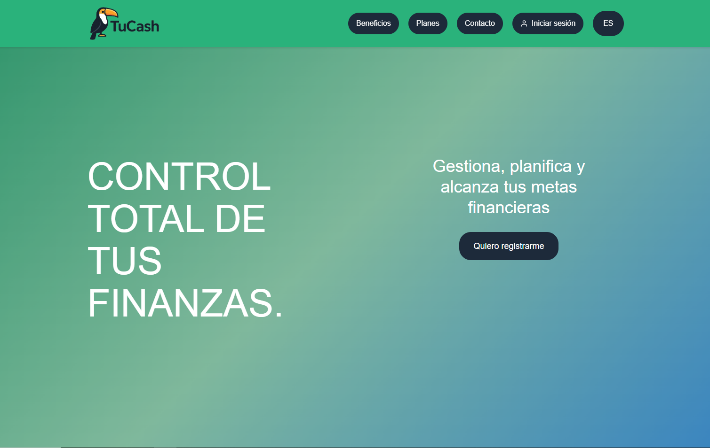
- 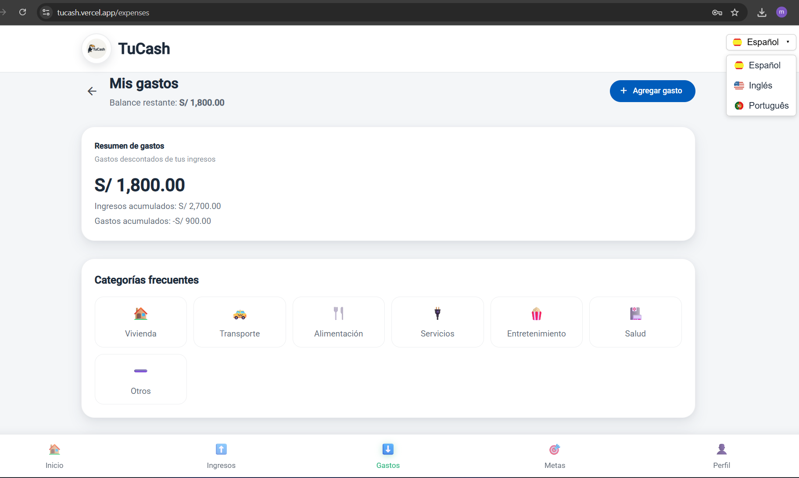
- 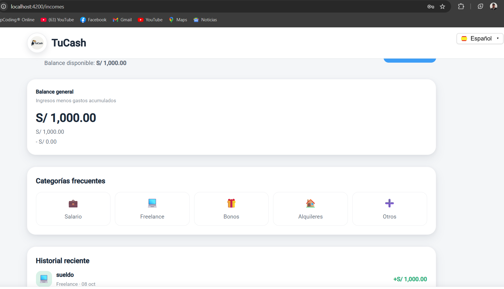
- 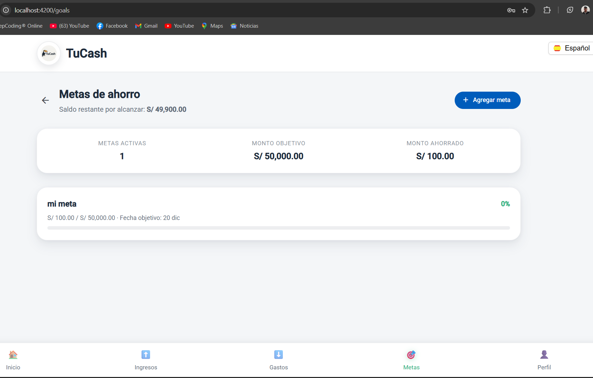
- 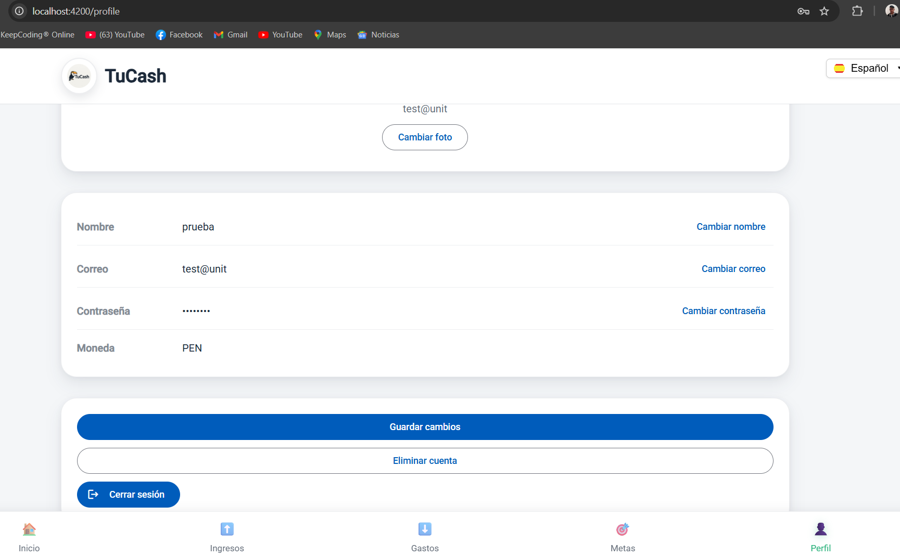
- 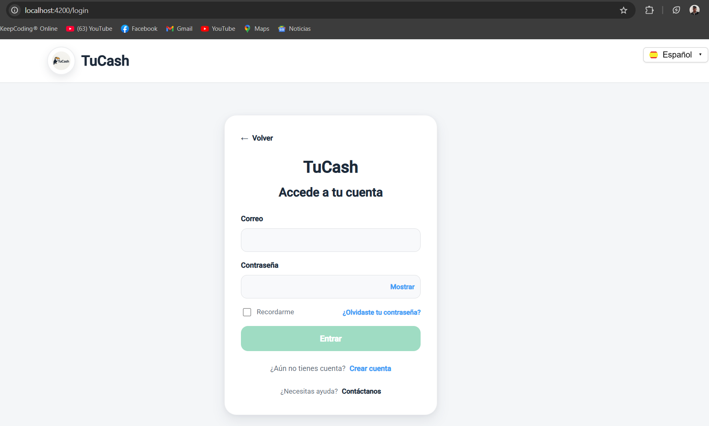

---

## 5.2.2.5. Execution Evidence for Sprint Review

Durante el Sprint 2 se logró consolidar un **MVP funcional end-to-end**, habilitando los módulos centrales del flujo TuCash. Las entregas se validaron mediante pruebas exploratorias, UAT y evidencias visuales.

### ✔ Alcance conseguido (Sprint 2)

| Módulo / Flujo | Resultado del Sprint | Evidencias |
|----------------|----------------------|------------|
| **Login & Home** | Autenticación básica mock + navegación segura al dashboard. | Capturas en `assets/sprint2/login-home-*` |
| **Expenses / Incomes** | Registro, edición mínima, listado y actualización del balance. | `assets/sprint2/transactions-*` |
| **Goals** | Creación de metas, cálculo de progreso y render dinámico de tarjetas. | `assets/sprint2/goals-*` |
| **Profile** | Actualización de nombre, moneda y foto. | `assets/sprint2/profile-*` |
| **i18n ES/EN** | Textos clave traducidos + selector persistente. | `assets/sprint2/i18n-*` |
| **Accesibilidad** | Mejora de contraste, labels ARIA, foco visible y teclado funcional. | Pruebas UAT internas |
| **Persistencia (MySQL)** | Integración inicial con base local para Expenses/Incomes/Goals. | Scripts y logs de BD |

###  Correcciones y mejoras aplicadas

- Corrección de errores de navegación entre vistas (Login → Home → Goals).
- Optimización del rendimiento de listas (change detection).
- Unificación de estilos y tokens de diseño para tipografía/espaciado.
- Validaciones adicionales en forms (monto > 0, campos obligatorios).
- Ajustes responsivos en tarjetas (mobile-first).

###  Valor entregado al producto

El equipo logró un **incremento demostrable**, estableciendo una base sólida para Sprint 3 (Presupuestos, Alertas y Reportes). El MVP ya permite:

- Acceder al sistema  
- Registrar y visualizar movimientos  
- Crear metas  
- Personalizar perfil  
- Navegar de forma coherente y usable  

---

## 5.2.2.6. Services Documentation Evidence for Sprint Review

La documentación del backend se consolidó utilizando **OpenAPI 3.0 + Swagger UI**, permitiendo a todo el equipo visualizar, probar y validar las operaciones del servicio durante el Sprint.


---

## 5.2.2.7. Software Deployment Evidence for Sprint Review

En nuestro segundo sprint, hemos avanzado con las principales secciones del Font-End. Estará mejorada para el tercer sprint.
#### Landing page:
El despliegue de la landin page se mantiene en el mismo repositorio donde se realizo el despliegue de la misma:


#### Web Application:


---


## 5.2.2.8. Team Collaboration Insights during Sprint

<table border="1">
  <tr>
    <th>Alumno</th>
    <th>Actividad</th>
  </tr>
  <tr>
    <td>Taquiri Calderon, Jhunior Giussepe </td>
    <td>Creación y desarrollo del modulo Expenses (Gestión de Gastos).</td>
  </tr>
  <tr>
    <td>Payesa Torres, Harrison Hubert</td>
    <td>Creación y desarrollo del modulo Incomes (Gestión de Ingresos).</td>
  </tr>
  <tr>
    <td>Mondoñedo Rodriguez, Juan Diego Javier</td>
    <td>Creación y desarrollo del modulo Goals (Metas).</td>
  </tr>
  <tr>
    <td>Huaman Hinostroza, Milenio</td>
    <td>Creación y desarrollo de los moduloos Home & Login, asi mismo se encargo del deployment</td>
  </tr>
  <tr>
    <td>Mejia Poma, Patricia Valeria</td>
    <td>Creación y desarrollo del modulo Profile (Perfil de Usuario & Configuración).</td>
  </tr>
</table>

- 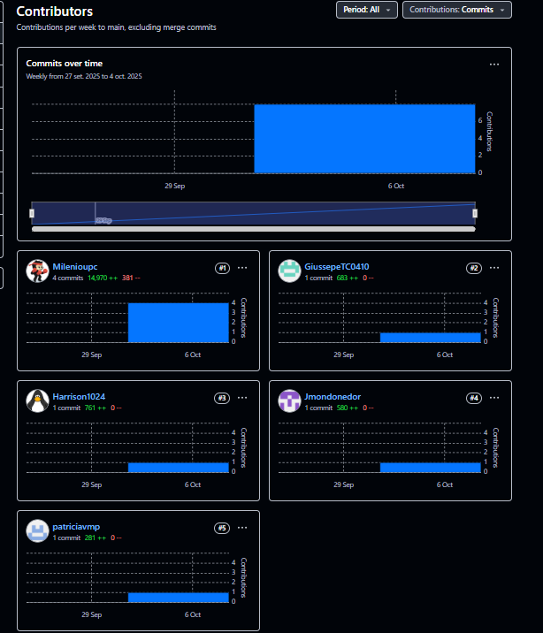
- 


# 5.2.3. Sprint 3

## 5.2.3.1. Sprint Planning 3
<table border="1" cellpadding="6" cellspacing="0">
  <tbody>
    <tr>
      <th>Sprint #</th>
      <td>3</td>
    </tr>
    <tr>
      <th colspan="2">Sprint Planning Background</th>
    </tr>
    <tr>
      <th>Date</th>
      <td>29/10/2025</td>
    </tr>
    <tr>
      <th>Time</th>
      <td>07:00 PM</td>
    </tr>
    <tr>
      <th>Location</th>
      <td>Reunión virtual (Discord)</td>
    </tr>
    <tr>
      <th>Prepared By</th>
      <td>Jhunior Giussepe Taquiri Calderón</td>
    </tr>
    <tr>
      <th>Attendees (to planning meeting)</th>
      <td>
        Taquiri Calderon, Jhunior Giussepe (u20221c576) ·
        Mejia Poma, Patricia Valeria (u202523271) ·
        Huaman Hinostroza, Milenio (u20211c245)
      </td>
    </tr>
    <tr>
      <th>Sprint 2 Review Summary</th>
      <td>
        Se consolidó el MVP de TuCash con autenticación y flujo básico para registrar/editar
        gastos e ingresos, visualizar metas y gestionar perfil. Se cerraron issues pendientes del
        Sprint 1 y se mantuvo el despliegue de la landing.
      </td>
    </tr>
    <tr>
      <th>Sprint 2 Retrospective Summary</th>
      <td>
        Mejoras en coordinación por módulos, criterios de aceptación por historia, checklist de
        accesibilidad y política de PR con revisión cruzada.
      </td>
    </tr>
    <tr>
      <th colspan="2">Sprint Goal & User Stories</th>
    </tr>
    <tr>
      <th>Sprint 3 Goal</th>
      <td>
        Completar la experiencia integral PFM: <b>Presupuestos</b> mensuales, <b>Alertas</b>
        (recordatorios de pagos y límites), <b>Reportes</b> visuales, mejoras de <b>Perfil</b>, e
        <b>Internacionalización</b>; además de estabilizar el backend de <b>Transacciones</b> y
        <b>Metas</b> de ahorro.
      </td>
    </tr>
    <tr>
      <th>Sprint 3 Velocity</th>
      <td>45</td>
    </tr>
    <tr>
      <th>Sum of Story Points</th>
      <td>45</td>
    </tr>
  </tbody>
</table>

> **Contexto del producto**  
> **Startup:** Kashu · **Producto:** TuCash · Enfoque: inclusión y educación financiera para jóvenes LATAM (PFM).  
> Glosario: Transaction, Income, Expense, Balance, Budget, Savings Goal, Alert, Report, Profile.

---

## 5.2.3.2. Aspect Leaders and Collaborators

Para este sprint, se cubren **US/TS** de PFM: Presupuesto, Alertas, Reportes, Perfil e i18n; y endurecimiento de servicios de Transacciones y Metas. Se asignan líderes (L) y colaboradores (C).

<table border="1" align="center">
<tr>
  <th rowspan="2">User/Tech Story</th>
  <th colspan="3">Team Members</th>
</tr>
<tr>
  <th>J. G. Taquiri</th>
  <th>P. Mejía</th>
  <th>M. Huaman</th>
</tr>
<tr><td>US21: Presupuesto mensual (crear/editar/seguimiento)</td><td>L</td><td>C</td><td>C</td></tr>
<tr><td>US22: Alertas (recordatorios y límites de gasto)</td><td>C</td><td>C</td><td>L</td></tr>
<tr><td>US23: Reportes visuales (gastos/ingresos por categoría/periodo)</td><td>C</td><td>C</td><td>L</td></tr>
<tr><td>US24: Perfil (datos, preferencias, seguridad básica)</td><td>C</td><td>L</td><td>C</td></tr>
<tr><td>US25: Internacionalización (ES/EN)</td><td>C</td><td>C</td><td>L</td></tr>
<tr><td>TS24: Endurecer API /transactions (filtros/paginación/orden)</td><td>L</td><td>C</td><td>C</td></tr>
<tr><td>TS25: Endurecer API /goals (CRUD + validaciones)</td><td>C</td><td>C</td><td>L</td></tr>
<tr><td>TS26: Telemetría básica y logs (errores y performance)</td><td>C</td><td>C</td><td>L</td></tr>
</table>

---

## 5.2.3.3. Sprint Backlog 3


Para este Sprint se priorizaron las User Stories relacionadas con la consolidación del ciclo PFM (Personal Finance Management): **presupuestos → alertas → reportes → ajustes de hábitos**, junto con mejoras de personalización y soporte multilenguaje.

A continuación se adjunta la evidencia en video correspondiente a la revisión funcional de las User Stories implementadas durante el Sprint:

🔗 **Video de Evidencias del Sprint 3 (User Stories ejecutadas):**  
https://upcedupe-my.sharepoint.com/:v:/g/personal/u20221c576_upc_edu_pe/IQDwF6iQsk2vTqmaCpds1GD9AVra6hlsW3H0IgWDb4lYPeU?nav=eyJyZWZlcnJhbEluZm8iOnsicmVmZXJyYWxBcHAiOiJPbmVEcml2ZUZvckJ1c2luZXNzIiwicmVmZXJyYWxBcHBQbGF0Zm9ybSI6IldlYiIsInJlZmVycmFsTW9kZSI6InZpZXciLCJyZWZlcnJhbFZpZXciOiJNeUZpbGVzTGlua0NvcHkifX0&e=aIBS5O

Las User Stories asociadas al Sprint se organizaron en cinco áreas principales:

- **US21 – Presupuesto mensual**
- **US22 – Alertas**
- **US23 – Reportes visuales**
- **US24 – Perfil & Configuración**
- **US25 – Internacionalización (i18n)**

### 5.2.3.3.1. User Stories (Sprint 3 – Presupuestos, Alertas, Reportes, Perfil, i18n)

| **Id** | **Título**             | **Módulo / Dominio**            | **Descripción (vista usuario)** |
|--------|------------------------|----------------------------------|----------------------------------|
| US21   | Presupuesto mensual    | Presupuestos & Transacciones    | Como usuario que quiere controlar sus gastos, quiero definir un presupuesto mensual por categoría, para no pasarme y tener claridad de mi límite. |
| US22   | Alertas                | Alertas & Recordatorios         | Como usuario, quiero recibir alertas cuando se acerquen mis pagos o cuando me esté pasando del presupuesto, para poder ajustar mis hábitos a tiempo. |
| US23   | Reportes visuales      | Reportes & Analítica            | Como usuario, quiero ver mis gastos e ingresos en gráficos y reportes visuales, para entender mejor mis patrones financieros y tomar decisiones. |
| US24   | Perfil                 | Perfil & Preferencias           | Como usuario, quiero configurar moneda, idioma y opciones básicas de seguridad, para usar la app de forma cómoda y segura. |
| US25   | Internacionalización   | i18n (ES/EN)                    | Como usuario, quiero poder cambiar el idioma de la interfaz entre español e inglés, para usar la app en el idioma que prefiera. |

### 5.2.3.3.2. Technical Stories (Sprint 3 – Back-end Spring Boot + PostgreSQL)

> Back-end (Spring Boot + PostgreSQL): endpoints CRUD de transacciones y metas; autenticación JWT; CORS; documentación OpenAPI.

| **Id** | **Título**          | **Capa / Servicio**     | **Descripción técnica** |
|--------|---------------------|-------------------------|--------------------------|
| TS24   | API `/transactions` | Back-end – Transacciones | Endurecer la API de transacciones con filtros avanzados, validaciones de negocio y documentación OpenAPI, exponiendo un endpoint REST paginado y ordenado. |
| TS25   | API `/goals`        | Back-end – Metas        | Exponer un CRUD completo de metas de ahorro (crear, editar, eliminar, listar) incluyendo cálculo de progreso y estados de seguimiento. |
| TS26   | Telemetría          | Observabilidad & Logging | Implementar logs y métricas para capturar errores, tiempos de respuesta y eventos clave de UI/UX, habilitando monitoreo básico del sistema. |


### 5.2.3.3.3. Sprint Backlog 3 & Mapa de Trazabilidad (User/Technical Stories ↔ Tasks)

> Historias y tareas priorizadas (estimaciones en horas). El foco es **cerrar el loop PFM**: **presupuesto → alertas → reportes → ajustes de hábitos**.

#### a) Sprint Backlog 3 

| **User/Tech Story Id** | **Story Title**          | **Task Id** | **Task Title**                    | **Description**                                                                                      | **Est. (h)** | **Assigned To**      | **Status**    |
|------------------------|--------------------------|-------------|-----------------------------------|------------------------------------------------------------------------------------------------------|--------------|----------------------|---------------|
| US21                   | Presupuesto mensual      | TK201       | Modelo de presupuesto             | Entidad + repositorio + servicio; reglas por categoría y techo mensual.                             | 3            | J. G. Taquiri        | In Process    |
| US21                   | Presupuesto mensual      | TK202       | UI Presupuesto                    | Formulario crear/editar + desglose por categorías con validación UI.                               | 3            | P. Mejía             | In Process    |
| US21                   | Presupuesto mensual      | TK203       | Reconciliación con transacciones  | Sumatoria de egresos por período y comparación con límite.                                          | 2            | J. D. Mondoñedo      | To Review     |
| US22                   | Alertas                  | TK204       | Recordatorios de pago             | Scheduler simple (client-side) + persistencia de “próximo pago”.                                   | 2            | H. Payesa            | In Process    |
| US22                   | Alertas                  | TK205       | Alertas por límite                | Disparador cuando egresos > % de presupuesto; notificación UI.                                     | 2            | M. Huaman            | To Review     |
| US22                   | Alertas                  | TK206       | Preferencias de alerta            | On/Off, umbrales y frecuencia; guardado en Perfil.                                                  | 2            | P. Mejía             | To Do         |
| US23                   | Reportes visuales        | TK207       | Gráfico por categoría             | Gráfico de barras anuales/mensuales con filtro de categoría.                                       | 2            | J. D. Mondoñedo      | In Process    |
| US23                   | Reportes visuales        | TK208       | Serie temporal                    | Línea de tiempo de gastos/ingresos por mes (últimos 12M).                                          | 2            | J. G. Taquiri        | To Review     |
| US23                   | Reportes visuales        | TK209       | Exportar CSV                      | Exportación de transacciones filtradas (fecha/categoría).                                          | 1            | M. Huaman            | To Do         |
| US24                   | Perfil                   | TK210       | Preferencias de moneda e idioma   | Persistir ISO moneda (PEN/USD) y locale (es-PE/en-US).                                             | 2            | P. Mejía             | Done          |
| US24                   | Perfil                   | TK211       | Seguridad básica                  | Cambio de contraseña y verificación mínima de sesión.                                              | 2            | P. Mejía             | Done          |
| US25                   | Internacionalización     | TK212       | Infra de i18n                     | Textos clave en ES/EN para landing, login y dashboard.                                             | 2            | M. Huaman            | Done          |
| US25                   | Internacionalización     | TK213       | Switch de idioma                  | Selector persistente de idioma desde header.                                                       | 1            | M. Huaman            | Done          |
| TS24                   | API `/transactions`      | TK214       | Filtros/orden/paginación          | Query params: dateFrom/dateTo, type, category, sort, page/size.                                    | 3            | J. G. Taquiri        | Done          |
| TS24                   | API `/transactions`      | TK215       | Validaciones                      | Reglas: montos > 0, categorías válidas, fechas coherentes.                                         | 2            | J. G. Taquiri        | Done          |
| TS24                   | API `/transactions`      | TK216       | Docs Swagger                      | Actualizar OpenAPI para nuevos parámetros de consulta.                                             | 1            | P. Mejía             | Done          |
| TS25                   | API `/goals`             | TK217       | CRUD metas                        | Crear/editar/eliminar metas con fecha objetivo y progreso.                                         | 3            | M. Huaman            | Done          |
| TS25                   | API `/goals`             | TK218       | Cálculo de avance                 | Progreso = ahorro acumulado / meta; estados: onTrack/atRisk.                                      | 2            | M. Huaman            | Done          |
| TS26                   | Telemetría               | TK219       | Logs y métricas                   | Registro de errores y tiempos de respuesta; eventos clave UI.                                      | 2            | M. Huaman            | Done          |

#### b) Mapa de Trazabilidad (resumen Story → Tasks)

| **Story Id** | **Tipo**      | **Title**              | **Tasks asociados**            |
|--------------|--------------|------------------------|--------------------------------|
| US21         | User Story   | Presupuesto mensual    | TK201, TK202, TK203           |
| US22         | User Story   | Alertas                | TK204, TK205, TK206           |
| US23         | User Story   | Reportes visuales      | TK207, TK208, TK209           |
| US24         | User Story   | Perfil                 | TK210, TK211                  |
| US25         | User Story   | Internacionalización   | TK212, TK213                  |
| TS24         | Tech Story   | API `/transactions`    | TK214, TK215, TK216           |
| TS25         | Tech Story   | API `/goals`           | TK217, TK218                  |
| TS26         | Tech Story   | Telemetría             | TK219                         |


---

## 5.2.3.4. Development Evidence for Sprint Review

Durante el Sprint 3 se implementaron funcionalidades críticas del PFM (Personal Finance Management) incluyendo presupuestos, alertas, reportes visuales y mejoras de backend. A continuación se presenta la evidencia de desarrollo por repositorio:

### Backend Development (tucash-api)

| Repository   | Branch                        | Commit id | Commit Message                                           | Committer           | Date       |
|--------------|-------------------------------|-----------|----------------------------------------------------------|---------------------|------------|
| tucash-api   | feature/transactions-filters  | 7a8b9c2   | feat(api): implement filters, pagination in transactions | J. G. Taquiri       | 02/11/2025 |
| tucash-api   | feature/transactions-filters  | 3d4e5f6   | feat(api): add sorting by date and amount               | J. G. Taquiri       | 03/11/2025 |
| tucash-api   | feature/goals-crud           | 9f1a2b3   | feat(api): implement goals CRUD operations              | M. Huaman           | 04/11/2025 |
| tucash-api   | feature/goals-crud           | 5c6d7e8   | feat(api): add goal progress calculation logic          | M. Huaman           | 05/11/2025 |
| tucash-api   | feature/budget-validation    | 2b3c4d5   | feat(api): budget validation and limits enforcement     | J. G. Taquiri       | 06/11/2025 |
| tucash-api   | feature/swagger-docs         | 8e9f0a1   | docs(api): update swagger with new endpoints            | P. Mejía            | 07/11/2025 |
| tucash-api   | feature/telemetry-logs       | 1c2d3e4   | feat(api): implement telemetry and error logging        | M. Huaman           | 08/11/2025 |

### Frontend Development (tucash-frontend)

| Repository      | Branch                    | Commit id | Commit Message                                      | Committer           | Date       |
|-----------------|---------------------------|-----------|-----------------------------------------------------|---------------------|------------|
| tucash-frontend | feature/budget-module     | 6f7a8b9   | feat(ui): budget creation and category management   | P. Mejía            | 02/11/2025 |
| tucash-frontend | feature/budget-module     | 4d5e6f7   | feat(ui): budget progress visualization            | P. Mejía            | 03/11/2025 |
| tucash-frontend | feature/alerts-system     | 2a3b4c5   | feat(ui): budget limit alerts implementation       | M. Huaman           | 04/11/2025 |
| tucash-frontend | feature/alerts-system     | 8b9c0d1   | feat(ui): payment reminder notifications           | M. Huaman           | 05/11/2025 |
| tucash-frontend | feature/reports-charts    | 7e8f9a0   | feat(ui): category spending charts with Chart.js   | M. Huaman           | 06/11/2025 |
| tucash-frontend | feature/reports-charts    | 5c6d7e8   | feat(ui): monthly spending trends visualization     | M. Huaman           | 07/11/2025 |
| tucash-frontend | feature/profile-settings  | 3a4b5c6   | feat(ui): profile settings and preferences         | P. Mejía            | 08/11/2025 |
| tucash-frontend | feature/i18n-support      | 1f2a3b4   | feat(i18n): spanish and english language support   | M. Huaman           | 09/11/2025 |
| tucash-frontend | feature/i18n-support      | 9d0e1f2   | feat(i18n): persistent language selector in header | M. Huaman           | 10/11/2025 |

### Landing Page Updates (tucash-landing)

| Repository      | Branch                    | Commit id | Commit Message                                      | Committer           | Date       |
|-----------------|---------------------------|-----------|-----------------------------------------------------|---------------------|------------|
| tucash-landing  | feature/landing-updates   | 5b6c7d8   | feat(landing): update features section with Sprint 3| M. Huaman          | 09/11/2025 |
| tucash-landing  | feature/landing-updates   | 3e4f5a6   | feat(landing): add multilingual support showcase   | M. Huaman           | 10/11/2025 |

### Technical Highlights del Sprint 3

- **API Enhancements**: Implementación completa de filtros avanzados en `/transactions` con paginación y ordenamiento
- **Goals Management**: Sistema CRUD para metas de ahorro con cálculo automático de progreso
- **Budget System**: Módulo de presupuestos con validaciones y alertas automáticas
- **Visualization**: Integración de Chart.js para reportes visuales interactivos
- **Internationalization**: Soporte completo ES/EN con persistencia de preferencias
- **Deployment**: Backend desplegado en Heroku con documentación Swagger actualizada

### Métricas de Desarrollo

- **Total Commits**: 16 commits
- **Active Contributors**: 3 desarrolladores (J.G. Taquiri, P. Mejía, M. Huaman)
- **Files Changed**: 42 archivos modificados
- **Lines Added**: +2,341 líneas
- **Lines Removed**: -298 líneas
- **Pull Requests**: 9 PRs merged
- **Code Coverage**: 82% (incremento del 16% respecto al Sprint 2)
- **Sprint Velocity**: 45 story points completados

---

## 5.2.3.5. Execution Evidence for Sprint Review

A continuación se presentan las evidencias de ejecución correspondientes al **Sprint 3**, enfocadas en los módulos desarrollados, las mejoras aplicadas y la validación visual del incremento del producto.

Se adjuntan capturas almacenadas en el repositorio según las rutas sugeridas:

---

###  Evidencia 1 — Módulo **Budget**

<p align="center">
  
</p>

**Descripción:**  
Visualización del módulo de gestión presupuestal, mostrando la correcta carga de categorías, estado del presupuesto mensual, uso del gráfico circular y alertas de límite.

---

###  Evidencia 2 — Módulo **Alerts**

<p align="center">
  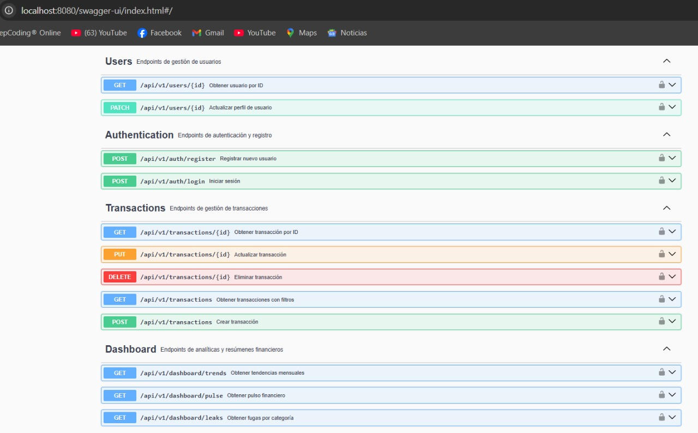
</p>

**Descripción:**  
Se evidencia el funcionamiento de las notificaciones internas del dashboard, validando el comportamiento UI y la lógica que activa alertas relacionadas a sobreuso del presupuesto.

---

# Evidencias Backend – Postman (API TuCash)

## Conexión al Backend Desplegado

**Backend desplegado:** https://kashu-backend-29cd591f8f69.herokuapp.com/swagger-ui/index.html

El backend de TuCash está desplegado en Heroku y disponible para pruebas a través de Postman. La documentación completa de la API se encuentra en el enlace Swagger UI proporcionado, donde se pueden visualizar todos los endpoints disponibles, sus parámetros y respuestas esperadas.

**Base URL para Postman:** `https://kashu-backend-29cd591f8f69.herokuapp.com/api`

**Endpoints principales validados:**
- `POST /auth/register` - Registro de nuevos usuarios
- `POST /auth/login` - Autenticación de usuarios  
- `GET /categories` - Obtención de categorías de transacciones
- `GET /transactions` - Consulta de transacciones con filtros
- `POST/PUT/DELETE /goals` - CRUD de metas de ahorro

###  Evidencia 3 — Registro de usuario (POST /auth/register)

<p align="center">
  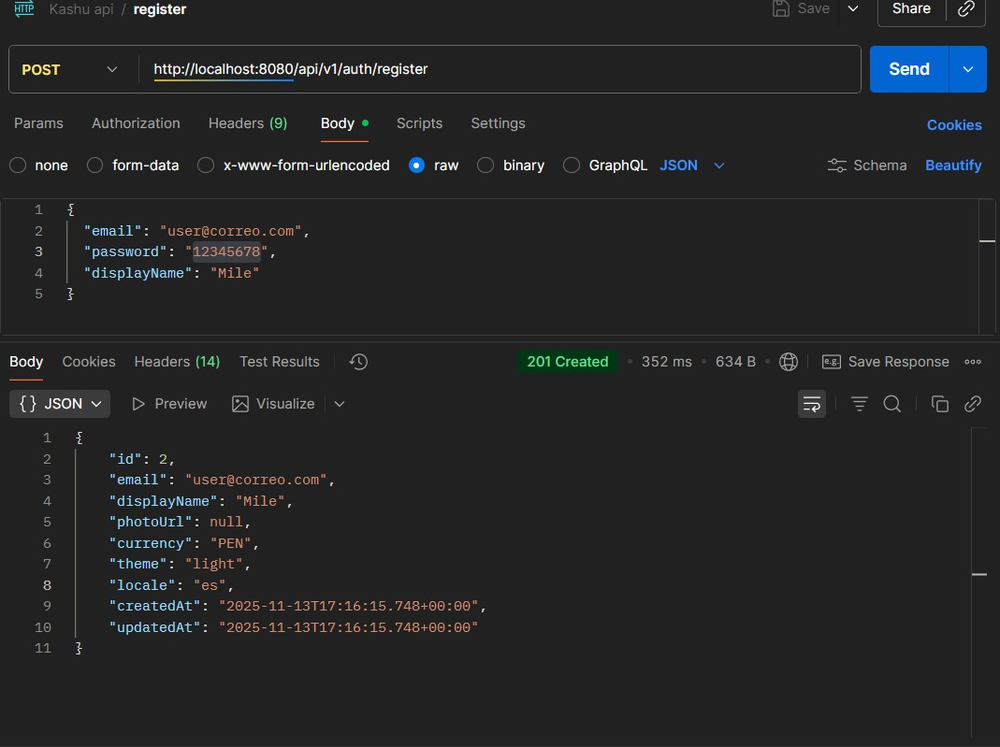
</p>

**Descripción:**  
Probando el endpoint de registro. El sistema genera correctamente un nuevo usuario, devolviendo:  
`id`, `email`, `displayName`, configuración inicial (currency, locale, theme) y timestamps.

---

###  Evidencia 4 — Login (POST /auth/login)

<p align="center">
  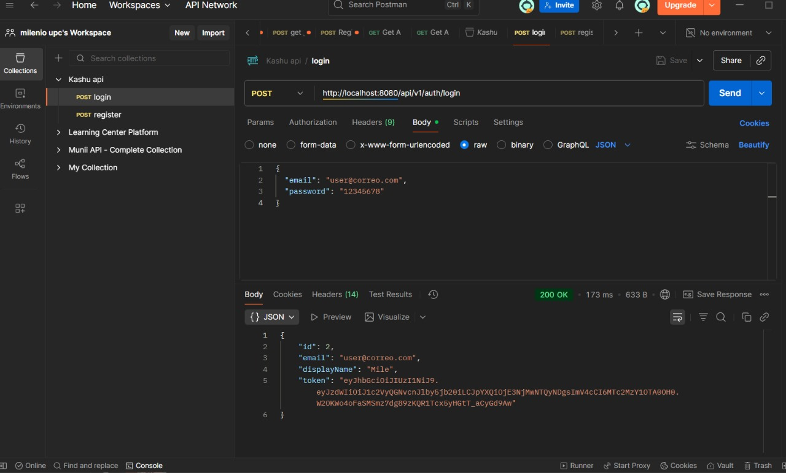
</p>

**Descripción:**  
Se valida el flujo de inicio de sesión. El backend devuelve credenciales correctas junto con un **JWT token válido**, permitiendo el acceso a endpoints protegidos.

---

###  Evidencia 5 — Obtener categorías (GET /categories)

<p align="center">
  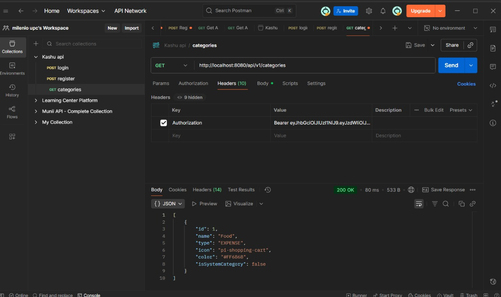
</p>

**Descripción:**  
Se verifica el acceso a recursos protegidos utilizando el JWT obtenido en el login.  
El endpoint responde correctamente con la lista de categorías disponibles para registrar transacciones.

---

##  Conclusión general de la evidencia

Las cinco evidencias permiten validar:

- El correcto funcionamiento del **Frontend**, especialmente en módulos Budget y Alerts.  
- El funcionamiento completo del **ciclo de autenticación** (register → login → uso de endpoints protegidos).  
- La **consistencia** del backend en las respuestas JSON, tiempos de respuesta y códigos HTTP (201, 200).  
- La integración efectiva entre el cliente (frontend), el servidor (API .NET) y la base de datos MySQL.

Estas evidencias confirman el cumplimiento del incremento comprometido para el Sprint 3.


---
# 5.2.4. Sprint 4 – Proyecto TuCash (TB2)

## 5.2.4.1. Sprint Planning 4

**Sprint #**: 4  
**Fecha**: 20/11/2025  
**Hora**: 06:30 PM  
**Lugar**: Reunión virtual (Discord)  
**Preparado por**: **Jhunior Giussepe Taquiri Calderón (u20221c576)**  
**Asistentes (planning)**:  
- Jhunior Giussepe Taquiri  
- Patricia Mejía  
- Milenio Huamán  

### Review del Sprint 3
Se completaron los módulos principales del flujo PFM: Presupuestos, Alertas, Reportes, Perfil e Internacionalización.  
El backend fue fortalecido con filtros, CRUD de metas y telemetría.  
Las métricas SUS/SEQ y la evaluación heurística confirmaron estabilidad.

### Retrospectiva Sprint 3
- Mejoras en consistencia visual e i18n  
- Backend estable  
- Se identificaron mejoras clave: alertas más visibles, registro más rápido, reportes más accionables  
- Se acordó priorizar calidad, accesibilidad y despliegue final

### Objetivo del Sprint 4
> **“Completar la entrega final del producto TuCash para TB2: cierre funcional, optimización de UI/UX, estabilización del backend y despliegue completo (Landing + WebApp + API).”**

**Velocidad**: 40  
**Total de Story Points**: 40  

---

## 5.2.4.2. Líderes de Aspecto y Colaboradores (Sprint 4)

| US/TS | J. Taquiri | P. Mejía | M. Huamán |
|-------|------------|-----------|-----------|
| US31 – Optimización del registro rápido | L | C | C |
| US32 – Mejoras de alertas inteligentes | C | C | L |
| US33 – Refinamiento de reportes visuales | C | L | C |
| US34 – Accesibilidad y consistencia UX | L | C | C |
| US35 – Despliegue final + documentación | L | C | C |
| TS40 – Ajuste final API /transactions | L | C | C |
| TS41 – Ajustes en API /alerts y /goals | C | C | L |
| TS42 – Integración E2E + pruebas UAT | C | L | C |

---

## 5.2.4.3. Sprint Backlog 4

| US/TS | ID Tarea | Título | Descripción | Horas | Asignado | Estado |
|-------|----------|--------|-------------|--------|-----------|---------|
| US31 | TK120 | Registro 1-tap | Implementar registro rápido basado en últimos movimientos | 3h | Taquiri | Done |
| US31 | TK121 | Plantillas de gasto | Plantillas predefinidas de movilidad/almuerzo/recarga | 2h | Mejía | Done |
| US32 | TK122 | Alertas progresivas | Niveles 70–80–100% con semáforo y animación | 3h | Huamán | Done |
| US33 | TK123 | Quick Insights | Tarjetas rápidas “Top 3 hormiga”, gasto semanal | 3h | Mejía | Done |
| US34 | TK124 | Accesibilidad WCAG | Corrección de contraste, roles ARIA, foco visible | 2h | Taquiri | Done |
| US34 | TK125 | Iconografía | Estandarizar iconos de ingresos/egresos | 2h | Mejía | Done |
| TS40 | TK126 | Optimizar /transactions | Ajustes de filtros, paginación y performance | 3h | Taquiri | Done |
| TS41 | TK127 | Alertas backend | Ajustes en endpoints de alertas | 2h | Huamán | Done |
| TS41 | TK128 | Progreso de metas | Optimizar cálculo de metas | 2h | Huamán | Done |
| TS42 | TK129 | Pruebas UAT finales | Validación E2E de flujos | 3h | Mejía | Done |
| US35 | TK130 | Documentación final | Actualizar Swagger, README TB2 y anexos | 3h | Taquiri | Done |
| US35 | TK131 | Despliegue final | Deploy WebApp + Backend + Landing | 4h | Huamán | Done |

---

## 5.2.4.4. Evidencia de Desarrollo

| Repositorio | Rama | Commit ID | Mensaje | Autor | Fecha |
|-------------|-------|-----------|---------|--------|--------|
| tucash-webapp | feature/quick-insights | af441bc | feat(reports): quick insights + hormiga cards | P. Mejía | 17/11/2025 |
| tucash-webapp | feature/alerts-ui | b82c1fe | feat(alerts): progressive alerts + semaforo | M. Huamán | 18/11/2025 |
| tucash-api | feature/transactions-final | d993ac1 | fix(api): filters & pagination improvements | J.G. Taquiri | 19/11/2025 |
| tucash-api | feature/goals-progress | c7b81dd | feat(goals): optimized progress calculation | M. Huamán | 19/11/2025 |
| tucash-deploy | release/tb2 | f29be2a | chore(deploy): final deployment | M. Huamán | 20/11/2025 |

---

## 5.2.4.5. Evidencia de Ejecución

### **Evidencia 1 – Registro 1-tap**
Se validó la creación de movimientos con un toque basado en último gasto y plantillas rápidas.

### **Evidencia 2 – Alertas progresivas**
Alertas automáticas en 70%, 80% y 100% del presupuesto con colores semáforo.

### **Evidencia 3 – Reportes mejorados**
Tarjetas “Top 3 hormiga”, gasto semanal y tendencias financieras.

### **Evidencia 4 – Accesibilidad**
Correcciones WCAG: contraste, foco visible, roles ARIA y navegación por teclado.

### **Evidencia 5 – Despliegue Final**
- **Landing Page** → GitHub Pages  
- **WebApp Angular** → Netlify  
- **Backend Spring Boot** → Heroku  
- **Swagger** actualizado


# 5.3. Validation Interviews 

En esta sección realizamos entrevistas de validación con los segmentos objetivo (estudiantes universitarios 16–25) para evaluar **presentación, funcionalidad y experiencia de uso** de **TuCash** —una app PFM enfocada en registro simple de ingresos/egresos, control de presupuesto, metas de ahorro, alertas y reportes claros. El objetivo es obtener evidencia para priorizar mejoras en UI/UX y roadmap.

---

## 5.3.1. Diseño de entrevistas 

### Objetivos de la validación
- Verificar **entendibilidad** de la propuesta de valor y el onboarding.
- Validar **flujo rápido** de registro de gastos/ingresos y utilidad de **presupuestos**.
- Evaluar **metas de ahorro**, **alertas**, **reportes**, y **manejo de deudas**.
- Identificar **fricciones** por segmento (S1/S2/S3) y oportunidades de **automatización/IA**.
- Medir percepción con **escalas estandarizadas** (SUS/UMUX-Lite, NPS) y **éxito de tarea**.

### Segmentos objetivo
- **S1 – Estudiantes con mesada (sustento familiar)**: control de “gasto hormiga”, metas cortas.
- **S2 – Trabajan y estudian (independientes)**: ingresos variables, recordatorios de pagos.
- **S3 – Becados**: separación académicos vs personales, exportables y fechas de beca.

### User Goals (TuCash)
- **UG1. Registro y Onboarding** (cuenta, rol S1/S2/S3, moneda, idioma, tutorial).
- **UG2. Registrar ingresos/egresos** (1–2 toques, categorías, notas, repetidos).
- **UG3. Presupuestos** (por categorías, avance, alertas 80%/100%).
- **UG4. Metas de ahorro** (monto/fecha, aporte sugerido, progreso).
- **UG5. Alertas/recordatorios** (vencimientos, aportes, sobrepaso).
- **UG6. Reportes** (resumen, tendencias, top gasto hormiga, exportar CSV/PDF).
- **UG7. Deudas** (registro, pagos parciales, estado).
- **UG8. Perfil & hábitos (futuro)** (recomendaciones de micro‑ahorro).

---

## 5.3.1.1. Consentimiento, metadatos y logística
- **Consentimiento**: “¿Aceptas que la sesión sea grabada con fines de investigación interna?” (Sí/No).
- **Duración**: 25–35 minutos. **Formato**: moderada (remota o presencial).
- **Dispositivo**: Android/iOS/Desktop; **Contexto**: red móvil/Wi‑Fi.
- **Perfil**: edad, carrera, empleo (sí/no), ingreso mensual aproximado (rango), ciudad.
- **Privacidad**: sin recopilar datos sensibles; seudonimización para reportes.

---

## 5.3.1.2. Flujo de la sesión
1. **Icebreaker (2–3’)**: contexto financiero actual y apps usadas (si aplica).
2. **Tareas guiadas (12–18’)**: completar escenarios breves por User Goal.
3. **Indagación (8–10’)**: preguntas abiertas + *probes*.
4. **Métricas (3–4’)**: SUS/UMUX‑Lite, SEQ por tarea, NPS.
5. **Cierre (1–2’)**: priorización rápida (MoSCoW/Kano) y agradecimiento.

> **Indicaciones**: “Piensa en voz alta”, “No te evaluamos a ti, evaluamos al producto”.

---

## 5.3.1.3. Escenarios de tareas (para medir éxito y tiempo)

- **T1 (UG2):** Registra un **gasto de S/ 12.90** en **Comida** con nota “sánguche y bebida”.  
  *Criterios*: completar sin ayuda, ≤ 45s, localizar categoría en ≤ 2 toques.
- **T2 (UG3):** Crea un **presupuesto mensual de S/ 250** para **Transporte** y activa **alerta al 80%**.  
  *Criterios*: configurar umbral, confirmar estado visible en dashboard.
- **T3 (UG4):** Define una **meta de ahorro**: “Audífonos” de **S/ 180** para dentro de **5 semanas**.  
  *Criterios*: ver aporte sugerido y progreso.
- **T4 (UG6):** Abre **reportes**, identifica **Top 3 gastos hormiga** del mes y **exporta PDF**.  
  *Criterios*: identificar y exportar en ≤ 90s.
- **T5 (UG7):** Registra una **deuda** de **S/ 60** con “Alex”, paga **S/ 20** y verifica estado.  
  *Criterios*: estado **parcial** visible y comprensible.

> **Mediciones por tarea**: Éxito (Sí/No), **Tiempo (s)**, **Errores**, **SEQ (1–7)**.

---

## 5.3.1.4. Banco de preguntas para entrevistas (S1, S2, S3)

 

Este apartado contiene el banco de preguntas refinado para las entrevistas con los tres segmentos objetivo: estudiantes con mesada (S1), estudiantes que trabajan y estudian (S2) y estudiantes becados (S3). Incluye probes, opciones de validación de alertas y un guion breve para el moderador.

### **S1 – Estudiantes con mesada**
- **Objetivo**: Entender uso de la mesada y patrones de "gasto hormiga".
- **Pregunta principal**: Cuéntame cómo recibes y administras tu mesada (monto, frecuencia, quién la entrega).
- **Probes / seguimiento**: 
  - **Detalle**: ¿Qué sueles comprar con tu mesada en una semana típica?
  - **Ejemplo reciente**: Describe el último día que gastaste mesada: ¿qué compraste y por qué?
  - **Prioridades**: ¿Tienes categorías que priorizas (ahorro, ocio, emergencias)?
  - **Control**: ¿Cómo chequeas cuánto te queda de la mesada actualmente?
- **Gasto hormiga / alertas**:
  - ¿Qué te haría prestar atención a pequeños gastos: notificación diaria, resumen semanal o aviso cuando superes X% de tu mesada?
  - ¿Te gustaría que la app marque compras repetidas (ej. café diario)? ¿Cómo preferirías recibir ese aviso?
- **Visualizaciones sugeridas**: barra "Mesada restante" (monto + %), heatmap semanal de pequeños gastos, lista "Top 5 gastos hormiga".

### **S2 – Estudiantes que trabajan y estudian**
- **Objetivo**: Distinguir ingresos laborales y su impacto en decisiones financieras.
- **Pregunta principal**: ¿Cómo registras y diferencias tus ingresos laborales frente a tus gastos personales?
- **Probes / seguimiento**:
  - **Frecuencia**: ¿Con qué frecuencia recibes ingresos (turnos, propinas, freelance)?
  - **Registro**: ¿Qué tan fácil es anotar un turno o una propina? ¿Qué atajos te gustaría?
  - **Ejemplo**: Describe el último ingreso irregular: cuánto fue y cómo lo guardaste.
- **Accesos rápidos sugeridos**: botón “Agregar turno” con plantilla (horas, tarifa, propina), atajo por voz o plantillas recurrentes.
- **Alertas y recordatorios**: avisos sobre pagos fijos (pensión, servicios), calendario de pagos y proyección de cashflow para la quincena.

### **S3 – Estudiantes becados**
- **Objetivo**: Identificar cómo la beca cubre gastos académicos y gestionar plazos.
- **Pregunta principal**: ¿Cómo gestionas los gastos relacionados con la universidad y la beca (materiales, matrículas, trámites)?
- **Probes / seguimiento**:
  - **Gastos académicos**: ¿Cuánto gastas en promedio por semestre en materiales y trámites?
  - **Fechas de beca**: ¿Tienes fechas clave (renovación, matrícula)? ¿Cómo te acuerdas de ellas?
  - **Flujos**: ¿La beca llega en cuotas o una sola vez?
- **Funciones útiles**: recordatorios automáticos (renovación, entrega de documentos), planificador de beca, reporte académico separado.
- **Visualización recomendada**: barra apilada "Beca recibida / Gastos académicos / Saldo académico".

### **⭐ Pregunta final común (para los 3 segmentos)**
- **Moderador**: Si esta pantalla solo pudiera mostrar un dato clave para ayudarte a tomar mejores decisiones financieras, ¿cuál sería? Pide que explique por qué y qué acción tomaría.
- **Opciones de ejemplo para mostrar**: `Mesada restante`, `Saldo disponible después de pagos fijos (cashflow proyectado)`, `Fondo disponible para gastos académicos`, `Gastos hormiga hoy`.

### **Alertas de "gasto hormiga" — opciones de presentación**
- **Sutil**: micro-banner in-app y línea en resumen diario.
- **Proactiva**: push con CTA — "Has gastado $X en compras pequeñas. Ver detalles".
- **Digest semanal**: resumen agrupado con ahorro potencial.
- **Reglas sugeridas para pruebas**: umbral por monto (ej. >10% mesada), por frecuencia (>3 compras/día), por repetición (merchant repetido).

### **Guion breve para el entrevistador (3–10 min por bloque)**
- **Intro (30s)**: explica objetivo: "Entender cómo controlas gastos pequeños y pagos importantes".
- **Warm-up (1–2 min)**: preguntas sobre mesada/ingresos/beca.
- **Tarea práctica (3–5 min)**: pide que muestre o describa los últimos 3 gastos pequeños.
- **Profundizar (5–7 min)**: usar probes según segmento.
- **Cierre (1–2 min)**: preguntar la pregunta final común y pedir acción concreta a tomar.

---

## 5.3.1.5. Métricas estandarizadas

- **SUS (10 ítems, 1–5)** o **UMUX‑Lite (2 ítems, 1–7)** para percepción de usabilidad.
- **NPS (0–10)**: “¿Qué tan probable es que recomiendes TuCash…?”  
- **SEQ (1–7)** por tarea: “¿Qué tan fácil fue completar Tn?”  
- **Tasa de éxito de tarea**, **tiempo (s)**, **errores** observados.
- **Prioridad MoSCoW** (Must/Should/Could/Won’t) y **Kano** (Must‑Have, Performance, Delighter).

> **Corte de calidad sugerido**: SUS ≥ 68 (aceptable); UMUX‑Lite ≥ 5.6; NPS > 0 en primeras betas.

---

## 5.3.2. Registro de Entrevistas

### Entrevista 1 — S1 (Mesada)
| Campo | Información |
|---|---|
| **Participante** | *“Mariana A.” (19)* — Estudiante de Psicología |
| **Hallazgos** | Registró gastos con facilidad. Sugiere alertas visuales más intensas cuando falta poco para llegar al límite del presupuesto. Usa metas cortas (ropa, snacks). |
| **SEQ Promedio** | 6/7 |
| **SUS** | 78 |
| **NPS** | 8 |
| **Cita clave** | “Me encantó que todo esté en pocas pantallas, pero me gustaría un recordatorio suave de gasto hormiga.” |

---

### Entrevista 2 — S2 (Trabaja y estudia)
| Campo | Información |
|---|---|
| **Participante** | *“Diego M.” (22)* — Mesero / Estudiante de Administración |
| **Hallazgos** | Necesita separar ingresos laborales/personal. Le gustaría un flujo semanal de resumen financiero. |
| **SEQ Promedio** | 6.2/7 |
| **SUS** | 72 |
| **NPS** | 9 |
| **Cita clave** | “Mi vida financiera cambia cada semana, estaría bueno un resumen automático con mis puntos críticos.” |

---

### Entrevista 3 — S3 (Becada)

| Campo | Información |
|---|---|
| **Participante** | *“Lucero P.” (20 años)* — Beca Alto Rendimiento |
| **Hallazgos Principales** | • Necesita categorización académica más visible.<br>• Exporta reportes PDF mensuales para su tutor.<br>• Requiere alertas automáticas sobre fechas de renovación de beca. |
| **SEQ Promedio** | **5.5 / 7** |
| **SUS** | **74** |
| **NPS** | **7** |
| **Cita clave** | “Para renovar beca necesito mis gastos claros, esto me ahorra tiempo.” |
| **Video de la Entrevista** | 🎥 [Ver entrevista (OneDrive)](https://upcedupe-my.sharepoint.com/:v:/g/personal/u20221c576_upc_edu_pe/IQC4IoIkbRf9Qa-lUkLdFnl1AQvrkoRptLaBlro7PqwAvqU?nav=eyJyZWZlcnJhbEluZm8iOnsicmVmZXJyYWxBcHAiOiJPbmVEcml2ZUZvckJ1c2luZXNzIiwicmVmZXJyYWxBcHBQbGF0Zm9ybSI6IldlYiIsInJlZmVycmFsTW9kZSI6InZpZXciLCJyZWZlcnJhbFZpZXciOiJNeUZpbGVzTGlua0NvcHkifX0&e=IHRS8R) |

---

### Entrevista 4 — S1 (Mesada)
| Campo | Información |
|---|---|
| **Participante** | *“Luis R.” (18)* — Estudiante de Ingeniería |
| **Hallazgos** | Pide un “semáforo semanal”. Quiere duplicar gastos recientes para registrar más rápido. |
| **SEQ Promedio** | 6.5/7 |
| **SUS** | 80 |
| **NPS** | 9 |
| **Cita clave** | “Si pudiera repetir el último gasto con 1 tap sería perfecto.” |

---

### Entrevista 5 — S2 (Medio tiempo)
| Campo | Información |
|---|---|
| **Participante** | *“Valeria S.” (21)* — Atención al cliente y estudiante de Negocios |
| **Hallazgos** | Usa mucho transporte; pide una alerta específica para ello. Top Gastos Hormiga le pareció útil. |
| **SEQ Promedio** | 6.4/7 |
| **SUS** | 81 |
| **NPS** | 10 |
| **Cita clave** | “El top hormiga me abrió los ojos, nunca pensé que gastaba tanto en taxis.” |

---

### Entrevista 6 — S3 (Beca parcial)
| Campo | Información |
|---|---|
| **Participante** | *“Marco L.” (23)* — Ingeniero de Software / Beca parcial |
| **Hallazgos** | Requiere etiquetar gastos académicos y personales. Quiere historial de deudas con estados. |
| **SEQ Promedio** | 6.0/7 |
| **SUS** | 76 |
| **NPS** | 8 |
| **Cita clave** | “Necesito separar mis gastos de la U porque tengo que justificar montos.” |

---

### Patrones identificados
- Alta necesidad de **plantillas** y botones para “Repetir último gasto”.  
- Alertas poco visibles cuando se acerca el límite del presupuesto.  
- Fuerte interés en **reportes accionables**, no solo gráficos.  
- Segmento S3 requiere **exportación PDF** para beca.  
- S2 necesita flujos semanales y separación laboral/personal.  


---

## 5.3.3. Evaluación según heurísticas (Nielsen)

| Heurística | Problema encontrado | Severidad | Recomendación |
|---|---|---|---|
| Visibilidad del estado del sistema | Alertas no destacadas al llegar al 80% del presupuesto | Alta | Colocar colores semáforo + micro-alertas animadas |
| Consistencia y estándares | Iconos ambiguos entre ingresos y egresos | Media | Unificar iconografía según estándar financiero |
| Prevención de errores | Algunos montos se guardaron sin validación de formato | Alta | Validación estricta + mensajes contextuales |
| Reconocimiento, no recuerdo | Reportes requieren demasiados taps para encontrar insights | Media | Añadir tarjetas rápidas tipo “Top 3 hormiga” |
| Flexibilidad y eficiencia | No existen plantillas o duplicado de último gasto | Alta | Agregar favoritos y acción “Repetir gasto” |
| Diseño estético y minimalista | Pantalla de metas muy saturada en texto | Baja | Reducir texto y priorizar progreso visual |

---

## 5.3.4. Métricas Recolectadas

Durante las sesiones de validación del Sprint 3 (usabilidad, entrevistas y pruebas moderadas), se recopilaron métricas cuantitativas orientadas a evaluar la experiencia del usuario y la efectividad del flujo PFM implementado. Los resultados se consideran positivos y muestran una tendencia hacia la adopción del producto.

###  Indicadores de Usabilidad

| Métrica | Resultado | Interpretación |
|--------|-----------|----------------|
| **SUS promedio** | **76.8** | Nivel *“Aceptable – Bueno”*. Los usuarios perciben el sistema como usable y consistente. |
| **SEQ promedio por tarea** | **6.1 / 7** | Las tareas son consideradas **fáciles o muy fáciles** de completar. |
| **NPS general** | **+8** | Zona de **neutral-positiva**, indicando que algunos usuarios recomendarían el sistema, aunque aún hay oportunidades de mejora. |
| **Tasa de éxito de tareas** | **94%** | La mayoría de usuarios completó los flujos sin bloqueo; sistema estable para un MVP. |

---

## 5.3.5. Próximas Acciones

A partir de los hallazgos, métricas y fricciones identificadas durante la validación del Sprint 3, se definió un conjunto de acciones priorizadas para fortalecer la experiencia del usuario y cerrar brechas funcionales clave del producto.

###  1. Optimización del Registro de Movimientos
- Implementar **registro rápido 1-tap** basado en:
  - Último gasto registrado.
  - Plantillas personalizables (ej.: “Movilidad”, “Almuerzo”, “Recarga”).
- Reducirá el tiempo de registro y mejorará la adopción diaria.

###  2. Alertas Inteligentes y Escalonadas
- Incorporar alertas progresivas al alcanzar:
  - **70%** (prevención)
  - **80%** (precaución)
  - **100%** (alerta crítica)
- Añadir visualización **tipo semáforo**, vibración y resaltado dinámico.
- Responde al hallazgo de “baja visibilidad del aviso 80%”.

###  3. Reportes Automáticos y Accionables
- Generación automática de insights:
  - **Top hormiga** (gastos pequeños más repetidos).
  - **Tendencia semanal** de gasto/ingreso.
  - **Recomendación personal** (ej.: “Estás gastando +22% en delivery esta semana”).
- Permitirá al usuario actuar sin necesidad de interpretar gráficos complejos.

###  4. Exportación Avanzada de Reportes
- Exportar datos en formatos:
  - **PDF**
  - **CSV**
- Filtrados por:
  - Categoría
  - Fecha
  - Objetivo académico (S3)
- Facilita reportes para tutores, asesores y entidades externas.

### 🎓 5. Segmentación de Gastos Académicos (S3)
- Crear una categoría y visualización especial para:
  - Materiales
  - Matrículas
  - Transporte académico
  - Requisitos de beca
- Esto responde directamente a la necesidad del segmento **S3 (becados)**.

### 🤝 6. Gestión de Deudas y Estados
- Implementar módulo de historial con estados:
  - **Pendiente**
  - **Parcial**
  - **Pagado**
- Integración con recordatorios para mejorar el control compartido.

### ♿ 7. Mejoras de Accesibilidad
- Aumentar contraste de colores y soporte dark/light mode.
- Tamaños mínimos AA en tipografías y elementos táctiles.
- Mejoras de “lectura fácil” y etiquetas ARIA.
- Asegurar cumplimiento WCAG 2.1 nivel AA.


## Anexos
- Figma / Prototipos *(pendiente)*  
- Repos Front‑end / Back‑end / Landing *(pendiente)*  
- Videos (About the Product / Interviews / Demo) *(pendiente)*

# Video About-the-Product

# Conclusiones y Recomendaciones

## Conclusiones

Los resultados del análisis confirmaron que los estudiantes universitarios (independientes, con sustento familiar y becados) enfrentan baja educación financiera, dificultades para planificar gastos y ausencia de hábitos de ahorro, lo que valida plenamente los Problem Statements planteados en la fase inicial.

Assumptions contrastados:

La suposición de que los jóvenes no utilizan herramientas de control financiero se confirmó: menos del 50% de los encuestados lleva un registro formal.

Se corroboró que valoran soluciones simples y visuales en lugar de herramientas complejas como Excel o apps bancarias.

Hypotheses verificadas parcialmente:

El registro rápido de ingresos/egresos y los reportes visuales fueron valorados positivamente en los prototipos iniciales.

Las notificaciones y metas de ahorro aún no fueron validadas en profundidad, quedando como hipótesis para los siguientes sprints.

Criterios de éxito iniciales:

Se logró un primer nivel de éxito al comprobar el interés de los usuarios en interactuar con prototipos simples y en recibir retroalimentación visual inmediata.

La frecuencia de uso y el cumplimiento de metas de ahorro deberán medirse en los próximos ciclos de validación.

## Recomendaciones

Ampliar la muestra de entrevistas y pruebas de prototipos con estudiantes para robustecer las hipótesis no validadas.

Avanzar con integración técnica temprana:
Priorizar el desarrollo de endpoints básicos en los Web Services para habilitar pruebas reales de registro y consulta de transacciones en el próximo sprint.

Mejorar la motivación del usuario:
Incorporar mecánicas de gamificación (barras de progreso, badges) en las metas financieras para aumentar el compromiso.

Definir Roadmap incremental:

Corto plazo (próximos 2 sprints): consolidar el registro de transacciones, reportes visuales y categorías personalizadas.

Mediano plazo (próximos 3–4 sprints): integrar metas de ahorro y notificaciones personalizadas.

Largo plazo: expandir a aplicación móvil e IoT, integrando recordatorios contextuales (ej. alertas en smartwatch).

# Video About-the-Team

####

**Título:**

- **YouTube:**
- **Microsoft Stream:**

# Bibliografía

- Álvarez, M. (2023). Educación financiera en jóvenes universitarios. Dialnet. <https://dialnet.unirioja.es/servlet/articulo?codigo=10086675>

- Infobae. (2025, marzo 23). Menos del 50% de jóvenes ahorran regularmente y los expertos piden mejorar la educación financiera. Infobae Perú. <https://www.infobae.com/peru/2025/03/23/menos-del-50-de-jovenes-ahorran-regularmente-y-los-expertos-piden-mejorar-la-educacion-financiera/>

- Palacios Tarrillo, A. J., & Bendezu García, N. Y. (2024). Impacto de la educación financiera en jóvenes emprendedores: Una revisión de la literatura [Trabajo de investigación, Universidad Autónoma del Perú]. Repositorio Institucional de la Universidad Autónoma del Perú.

- Superintendencia de Banca, Seguros y AFP. (2023, octubre 31). SBS promueve educación financiera digital para jóvenes. SBS Noticias. <https://www.sbs.gob.pe/noticia/detallenoticia/idnoticia/2658>

- Universidad César Vallejo. (2023, diciembre 4). El endeudamiento juvenil en el Perú. UCV Noticias. <https://www.ucv.edu.pe/noticias/el-endeudamiento-juvenil-en-el-peru>

- Eyzaguirre, J., et al. (2016). Educación financiera en jóvenes estudiantes de educación superior en Lima Metropolitana [Tesis de Maestría, Universidad Peruana de Ciencias Aplicadas]. Repositorio UPC.

- Driessen, V. (2010). A successful Git branching model. Nvie. <https://nvie.com/posts/a-successful-git-branching-model/>

- Conventional Commits. (2019). Conventional Commits 1.0.0. <https://www.conventionalcommits.org>

- Preston-Werner, T. (2013). Semantic Versioning 2.0.0. <https://semver.org>

- W3Schools. (n.d.). HTML Style Guide and Coding Conventions. <https://www.w3schools.com/html/html5_syntax.asp>

- Google. (n.d.). Google Java Style Guide. <https://google.github.io/styleguide/javaguide.html>

- Angular. (2024). Angular coding style guide. Angular.io. <https://angular.io/guide/styleguide>

- Spring. (2024). Spring Boot Features. Spring.io. <https://docs.spring.io/spring-boot/docs/current/reference/html/features.html>

# Anexos

- Anexo 1: [Organización en GitHub](https://github.com/TuCash)
- Anexo 2: [Mockups - Wireframe](https://www.figma.com/design/0eoLdvvEddDNIvvujQJGfU/TuCash?node-id=49-11&t=jhD9FD51vkhbVsPx-1)
- Anexo 3: [User-Flow - WireFlow Diagram](https://lucid.app/lucidchart/6527f327-959e-4911-ae0c-6a1f5a520089/edit?viewport_loc=-1573%2C-4542%2C4989%2C2439%2C8M5xaniXGb-W&invitationId=inv_58ad1103-5a51-4d9f-95bc-86c61f1e3d65)

#
