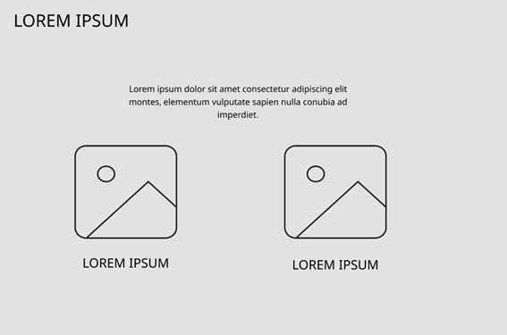

<div align="center">

### Universidad Peruana de Ciencias Aplicadas


**CARRERA** </br> Ingeniería de Software

**CICLO** </br> 2025-02

**CURSO** </br> Desarrollo de Aplicaciones Open Source

**NRC** </br> 7369

**DOCENTE** </br> Wilder Julio Espinoza Bravo

### "INFORME DE TRABAJO FINAL"

**STARTUP** </br> Kashu
<!--Desarrollo de aplicaciones open source-->

**PRODUCTO** </br> TuCash
<!--Nombres de integrantes-->

| Código | Nombre |
|:----------:|-------------------------------|
| u20221c576 | Taquiri Calderon, Jhunior Giussepe |
| u2022201024 | Payesa Torres, Harrison Hubert |
| u202110373 | Mondoñedo Rodriguez, Juan Diego Javier |
| u202523271 | Mejia Poma, Patricia Valeria |
| u20211c245 | Huaman Hinostroza, Milenio |


## DICIEMBRE

**2025**
</br>

</div>

---
<!--Registro de versiones-->
<h1 align="left">Registro de versiones del Informe</h1>
</br>

TB1 — Network Graph
<p align="center">
  
</p>

TB1 — Contributors
<p align="center">
  
</p>

TB1 — Pulse
<p align="center">
  
</p>

TB1 — Asignación de responsabilidades
| Integrante | Tareas Asignadas |
|-----------|------------------|
| Milenio Huamán Hinostroza | Redacción desde la Parte 1 del informe hasta el Segmento Objetivo. |
| Jhunior Giussepe Taquiri Calderón | Capítulo II completo: Requirements Elicitation & Analysis (User Personas, User Task Matrix, User Journey Mapping). Secciones del Capítulo IV: Product Design (Style Guidelines a Navigation Systems). |
| Patricia Mejía Poma | Empathy Mapping, As-Is/To-Be Scenario Mapping, y Product Backlog. |
| Juan Diego Mondoñedo | Capítulo III: Requirements Specification, wireframes y mockups. |
| Harrison Payesa | Entrevistas, To-Be Mapping, user stories y apoyo en mockups. |

-------------------------------------------------------------

TP1 — Network Graph
<p align="center">
  
</p>

TP1 — Contributors
<p align="center">
  
</p>

TP1 — Pulse
<p align="center">
  
</p>

TP1 — Asignación de módulos (Sprint 2)
| Integrante | Módulo / Responsabilidad | Cambios / Notas |
|-----------|---------------------------|------------------|
| Jhunior Giussepe Taquiri Calderón | Expenses | Desarrollo completo del módulo de gastos y actualización del análisis competitivo. |
| Harrison Payesa | Incomes | Ajustes al contenido de presentación del Sprint 2. |
| Juan Diego Mondoñedo | Goals | Desarrollo inicial del módulo. |
| Milenio Huamán Hinostroza | Home, Login, Incomes base, Goals UI, Integración Frontend | Implementación del Home, Login, estructura global, layout, navegación y diseño responsivo. |
| Patricia Mejía | Profile | Implementación base. |

-------------------------------------------------------------

TB2 — Network Graph
<p align="center">
  
</p>

TB2 — Contributors
<p align="center">
  
</p>

TB2 — Pulse
<p align="center">
  
</p>

TB2 — Asignación de responsabilidades (Sprint 3)
| Integrante | Módulo / Responsabilidad | Cambios (TB2) |
|-----------|---------------------------|----------------|
| Jhunior Giussepe Taquiri Calderón | Dashboard & Expenses | Mejoras del dashboard, gastos recurrentes, navegación y documentación del sprint. |
| Milenio Huamán Hinostroza | Alertas, Reportes Visuales, API Goals, Home & Login | Desarrollo total de alertas, reportes con Chart.js, API Goals (CRUD + progreso), autenticación e internacionalización. |
| Patricia Mejía | Profile & Settings | Edición de perfil, categorías y contenidos. |

-------------------------------------------------------------

TF1 — Network Graph
<p align="center">
  
</p>

TF1 — Contributors
<p align="center">
  
</p>

TF1 — Pulse
<p align="center">
  
</p>

TF1 — Asignación de responsabilidades (Sprint 4)
| Integrante | Módulo / Responsabilidad | Cambios / Aportes (TF1) |
|-----------|---------------------------|--------------------------|
| Jhunior Giussepe Taquiri Calderón | Expenses, Dashboard, Accesibilidad, API Transactions | Desarrollo de Expenses, Quick Insights, accesibilidad WCAG, optimización de /transactions, registro 1-tap, Swagger y documentación final. |
| Milenio Huamán Hinostroza | Home & Login, Alertas, Goals, Reportes, Deploy General | Alertas progresivas, progreso de metas, arquitectura Home/Login, reportes Chart.js, i18n completo y deploy general (Backend Azure, WebApp Netlify, Landing GitHub Pages). |


<!--ÍNDICE-->
# Contenido

[Student Outcome](#student-outcome)

[Capítulo I: Introducción](#capítulo-i-introducción)

- [1.1. Startup Profile](#11-startup-profile)
  - [1.1.1. Descripción de la Startup](#111-descripción-de-la-startup)
  - [1.1.2. Perfiles de integrantes del equipo](#112-perfiles-de-integrantes-del-equipo)
- [1.2. Solution Profile](#12-solution-profile)
  - [1.2.1 Antecedentes y problemática](#121-antecedentes-y-problemática)
  - [1.2.2 Lean UX Process](#122-lean-ux-process)
    - [1.2.2.1. Lean UX Problem Statements](#1221-lean-ux-problem-statements)
    - [1.2.2.2. Lean UX Assumptions](#1222-lean-ux-assumptions)
    - [1.2.2.3. Lean UX Hypothesis Statements](#1223-lean-ux-hypothesis-statements)
    - [1.2.2.4. Lean UX Canvas](#1224-lean-ux-canvas)
- [1.3. Segmentos objetivo](#13-segmentos-objetivo)
- [Capítulo II: Requirements Elicitation \& Analysis](#capítulo-ii-requirements-elicitation--analysis)
  - [2.1. Competidores](#21-competidores)
    - [2.1.1. Análisis competitivo](#211-análisis-competitivo)
    - [2.1.2. Estrategias y tácticas frente a competidores](#212-estrategias-y-tácticas-frente-a-competidores)
  - [2.2. Entrevistas](#22-entrevistas)
    - [2.2.1. Diseño de entrevistas](#221-diseño-de-entrevistas)
    - [2.2.2. Registro de entrevistas](#222-registro-de-entrevistas)
    - [2.2.3. Análisis de entrevistas](#223-análisis-de-entrevistas)
  - [2.3. Needfinding](#23-needfinding)
    - [2.3.1. User Personas](#231-user-personas)
    - [2.3.2. User Task Matrix](#232-user-task-matrix)
    - [2.3.3. User Journey Mapping](#233-user-journey-mapping)
    - [2.3.4. Empathy Mapping](#234-empathy-mapping)
    - [2.3.5. As-is Scenario Mapping](#235-as-is-scenario-mapping)
  - [2.4. Ubiquitous Language](#24-ubiquitous-language)
- [Capítulo III: Requirements Specification](#capítulo-iii-requirements-specification)
  - [3.1. To-Be Scenario Mapping](#31-to-be-scenario-mapping)
  - [3.2. User Stories](#32-user-stories)
  - [3.3. Impact Mapping](#33-impact-mapping)
  - [3.4. Product Backlog](#34-product-backlog)
- [Capítulo IV: Product Design](#capítulo-iv-product-design)
  - [4.1. Style Guidelines](#41-style-guidelines)
    - [4.1.1. General Style Guidelines](#411-general-style-guidelines)
    - [4.1.2. Web Style Guidelines](#412-web-style-guidelines)
  - [4.2. Information Architecture](#42-information-architecture)
    - [4.2.1. Organization Systems](#421-organization-systems)
    - [4.2.2. Labeling Systems](#422-labeling-systems)
    - [4.2.3. SEO Tags and Meta Tags](#423-seo-tags-and-meta-tags)
    - [4.2.4. Searching Systems](#424-searching-systems)
    - [4.2.5. Navigation Systems](#425-navigation-systems)
  - [4.3. Landing Page UI Design](#43-landing-page-ui-design)
    - [4.3.1. Landing Page Wireframe](#431-landing-page-wireframe)
    - [4.3.2. Landing Page Mock-up](#432-landing-page-mock-up)
  - [4.4. Web Applications UX/UI Design](#44-web-applications-uxui-design)
    - [4.4.1. Web Applications Wireframes](#441-web-applications-wireframes)
    - [4.4.2. Web Applications Wireflow Diagrams](#442-web-applications-wireflow-diagrams)
    - [4.4.3. Web Applications Mock-ups](#443-web-applications-mock-ups)
    - [4.4.4. Web Applications User Flow Diagrams](#444-web-applications-user-flow-diagrams)
  - [4.5. Web Applications Prototyping](#45-web-applications-prototyping)
  - [4.6. Domain-Driven Software Architecture](#46-domain-driven-software-architecture)
    - [4.6.1. Software Architecture Context Diagram](#461-software-architecture-context-diagram)
    - [4.6.2. Software Architecture Container Diagrams](#462-software-architecture-container-diagrams)
    - [4.6.3. Software Architecture Components Diagrams](#463-software-architecture-components-diagrams)
    - [4.6.4. Software Architecture Packages and Layers Diagrams](#464-software-architecture-packages-and-layers-diagrams)
  - [4.7. Software Object-Oriented Design](#47-software-object-oriented-design)
    - [4.7.1. Class Diagrams](#471-class-diagrams)
    - [4.7.2. Class Dictionary](#472-class-dictionary)
  - [4.8. Database Design](#48-database-design)
    - [4.8.1. Database Diagram](#481-database-diagram)
- [Capítulo V: Product Implementation, Validation \& Deployment](#capítulo-v-product-implementation-validation--deployment)
  - [5.1. Software Configuration Management](#51-software-configuration-management)
    - [5.1.1. Software Development Environment Configuration](#511-software-development-environment-configuration)
    - [5.1.2. Source Code Management](#512-source-code-management)
    - [5.1.3. Source Code Style Guide \& Conventions](#513-source-code-style-guide--conventions)
    - [5.1.4. Software Deployment Configuration](#514-software-deployment-configuration)
  - [5.2. Landing Page, Services \& Applications Implementation](#52-landing-page-services--applications-implementation)
    - [5.2.1. Sprint 1](#521-sprint-1)
      - [5.2.1.1. Sprint Planning 1](#5211-sprint-planning-1)
      - [5.2.1.2. Aspect Leaders and Collaborators](#5212-aspect-leaders-and-collaborators)
      - [5.2.1.3. Sprint Backlog 1](#5213-sprint-backlog-1)
      - [5.2.1.4. Development Evidence for Sprint Review](#5214-development-evidence-for-sprint-review)
      - [5.2.1.5. Execution Evidence for Sprint Review](#5215-execution-evidence-for-sprint-review)
      - [5.2.1.6. Services Documentation Evidence for Sprint Review](#5216-services-documentation-evidence-for-sprint-review)
    - [5.2.2. Sprint 2](#522-sprint-2)
      - [5.2.2.1. Sprint Planning 2](#5221-sprint-planning-2)
      - [5.2.2.2. Aspect Leaders and Collaborators LACX](#5222-aspect-leaders-and-collaborators-lacx)
      - [5.2.2.3. Sprint Backlog 2](#5223-sprint-backlog-2)
      - [5.2.2.4. Development Evidence for Sprint Review](#5224-development-evidence-for-sprint-review)
      - [5.2.2.5. Execution Evidence for Sprint Review](#5225-execution-evidence-for-sprint-review)
      - [5.2.2.6. Services Documentation Evidence for Sprint Review](#5226-services-documentation-evidence-for-sprint-review)
      - [5.2.2.7. Software Deployment Evidence for Sprint Review](#5227-software-deployment-evidence-for-sprint-review)
      - [5.2.2.8. Team Collaboration Insights during Sprint](#5228-team-collaboration-insights-during-sprint)

    - [5.2.3. Sprint 3](#523-sprint-3)
      - [5.2.3.1. Sprint Planning 3](#5231-sprint-planning-3)
      - [5.2.3.2. Aspect Leaders and Collaborators LACX (Sprint 3)](#5232-aspect-leaders-and-collaborators-lacx-sprint-3)
      - [5.2.3.3. Sprint Backlog 3](#5233-sprint-backlog-3)
      - [5.2.3.4. Development Evidence for Sprint Review (Sprint 3)](#5234-development-evidence-for-sprint-review)
      - [5.2.3.5. Execution Evidence for Sprint Review (Sprint 3)](#5235-execution-evidence-for-sprint-review)
      - [5.2.3.6. Services Documentation Evidence for Sprint Review (Sprint 3)](#5236-services-documentation-evidence-for-sprint-review)
      - [5.2.3.7. Software Deployment Evidence for Sprint Review (Sprint 3)](#5237-software-deployment-evidence-for-sprint-review)
      - [5.2.3.8. Team Collaboration Insights during Sprint (Sprint 3)](#5238-team-collaboration-insights-during-sprint)
    - [5.2.4. Sprint 4](#524-sprint-4)
      - [5.2.4.2. Aspect Leaders and Collaborators LACX (Sprint 4)](#5242-aspect-leaders-and-collaborators-lacx-sprint-4)
      - [5.2.4.3. Sprint Backlog 4](#5243-sprint-backlog-4)
      - [5.2.4.4. Development Evidence for Sprint Review (Sprint 4)](#5244-development-evidence-for-sprint-review-sprint-4)
      - [5.2.4.5. Execution Evidence for Sprint Review (Sprint 4)](#5245-execution-evidence-for-sprint-review-sprint-4)
      - [5.2.4.6. Services Documentation Evidence for Sprint Review (Sprint 4)](#5246-services-documentation-evidence-for-sprint-review-sprint-4)
      - [5.2.4.7. Software Deployment Evidence for Sprint Review (Sprint 4)](#5247-software-deployment-evidence-for-sprint-review-sprint-4)
      - [5.2.4.8. Team Collaboration Insights during Sprint (Sprint 4)](#5248-team-collaboration-insights-during-sprint-4)

  - [5.4. Video About-the-Product](#54-video-about-the-product)
- [Conclusiones y recomendaciones](#conclusiones-y-recomendaciones)
- [Video About-the-Team](#video-about-the-team)
- [Bibliografía](#bibliografía)
- [Anexos](#anexos)
  
<!--STUDENT OUTCOME-->


# Student Outcome

| Student Outcomes | Acciones realizadas | Conclusiones |
|---|---|---|
| **3.c1. Comunica oralmente con efectividad a diferentes rangos de audiencia** | **Milenio Huaman**<br>TB1: Parte 1 hasta Segmento Objetivo.<br>TP1: Presenté el pitch del problema, moderé entrevistas iniciales y expuse la definición de segmentos objetivo al equipo y al docente.<br>TB2: Presenté los avances del Sprint 3 (Login/Home), expuse hallazgos de entrevistas de validación y argumenté problemas heurísticos identificados.<br>TF1: Expuse mejoras finales del Sprint 4, sustenté accesibilidad, reportes y participé en la presentación final del proyecto.<br><br>**Giussepe Taquiri**<br>TB1: Capítulo II hasta User Journey Mapping.<br>TP1: Conduje reuniones de coordinación, expliqué el flujo general (As-Is/To-Be) y prioricé el backlog para alinear al equipo.<br>TB2: Expuse el módulo de Documentos y Dashboard, dirigí entrevistas de validación del Sprint 3 y sustenté problemas y mejoras del producto.<br>TF1: Lideré la sustentación completa del Sprint 4, presenté decisiones técnicas del backend, despliegue final y cierre general del proyecto.<br><br>**Patricia Mejía**<br>TB1: Socialicé hallazgos de entrevistas y presenté el enfoque del Empathy Map y Journey preliminar.<br>TP1: Empathy Mapping hasta Product Backlog.<br>TB2: Presenté avances de Perfil & Configuración, resultados de la evaluación heurística y recomendaciones de accesibilidad y consistencia visual.<br>TF1: Expliqué las mejoras finales de UI/UX, reportes y participé en la exposición del entregable final.<br><br>**Juan Diego Mondoñedo**<br>TB1: Expliqué criterios de aceptación y facilité la revisión del Product Backlog con el equipo.<br>TP1: Desde Product Backlog en adelante.<br><br>**Harrison Payesa**<br>TB1: Cerré el Sprint 1 con demo de landing básica y comuniqué observaciones de QA para el siguiente sprint.<br>TP1: Continuación de Product Backlog y revisiones finales. |La comunicación oral del equipo fue efectiva y consistente, permitiendo transmitir ideas, avances y hallazgos con claridad frente a distintos públicos, tanto técnicos como no técnicos. Las presentaciones realizadas durante los sprints evidenciaron seguridad, dominio del contenido y capacidad para explicar decisiones clave del producto de forma estructurada y entendible.  |
| **3.c2. Comunica por escrito con efectividad a diferentes rangos de audiencia** | **Milenio Huaman**<br>TB1: Redacté la problemática y segmentos con lenguaje claro para lectores técnicos y no técnicos.<br>TP1: Parte 1 hasta Segmento Objetivo.<br>TB2: Documenté hallazgos de entrevistas, Login/Home y evaluación heurística.<br>TF1: Redacté secciones del Sprint 4 y evidencias finales del proyecto.**<br><br>**Giussepe Taquiri**<br>TB1: Documenté el Cap. II (visión/alcance) y registré acuerdos del equipo con trazabilidad.<br>TP1: Capítulo II hasta User Journey Mapping.<br>TB2: Redacté 5.3 Validation Interviews, análisis heurístico y evidencias del Sprint 3.<br>TF1: Redacté el Sprint 4 completo, anexos técnicos, conclusiones y consolidación del documento final.<br><br>**Patricia Mejía**<br>TB1: Redacté Empathy Map y Journey inicial.<br>TP1: Empathy Mapping hasta Product Backlog.<br>TB2: Documenté Perfil & Configuración, recomendaciones heurísticas y ajustes de accesibilidad y consistencia textual.<br>TF1: Redacté mejoras finales de UI/UX, reportes, accesibilidad y secciones conclusivas.<br><br>**Juan Diego Mondoñedo**<br>TB1: Escribí el Product Backlog con historias, criterios de aceptación y prioridades.<br>TP1: Desde Product Backlog en adelante.<br><br>**Harrison Payesa**<br>TB1: Registré observaciones de QA y checklist de correcciones.<br>TP1: Continuación de Product Backlog y revisiones finales. | La comunicación escrita se mantuvo clara, organizada y precisa, facilitando la comprensión del progreso del proyecto en cada etapa. La documentación generada reflejó coherencia técnica, uso adecuado del lenguaje y un estilo profesional que permitió registrar decisiones, validaciones y resultados de manera trazable, contribuyendo significativamente a la calidad del informe final. |


<!--TODAS LAS SECCIONES A COMPLETAR-->

# Capítulo I: Introducción

## 1.1. Startup Profile

En esta sección se brinda la descripción de nuestra startup, producto y miembros de equipo.

### 1.1.1. Descripción de la Startup

**Nombre de la Startup:** <br>KASHU<br>
**Descripción:** <br>Kashu es una empresa emergente Fintech enfocada en desarrollar soluciones digitales innovadoras que promuevan la inclusión financiera y la gestión responsable del dinero en Latinoamérica.<br>
**Misión:** <br>Nuestra visión es convertirnos en una plataforma tecnológica de referencia para el manejo financiero personal y familiar, ofreciendo herramientas accesibles, intuitivas y escalables que empoderen a los usuarios a tomar mejores decisiones económicas.<br>
**Visión:** <br>Nuestra misión es democratizar el acceso a la educación y control financiero mediante productos digitales sencillos, inclusivos y seguros, que puedan evolucionar hacia aplicaciones móviles, servicios conectados a IoT y futuras integraciones con ecosistemas financieros.<br>

#### Logo, isotipo y logotipo

<br>
**LOGO**


**ISOTIPO**

 

**LOGOTIPO**

 


### 1.1.2. Perfiles de integrantes del equipo

<table border="1">
<tr><th>Nombre</th><th>Biografía de los integrantes del equipo</th></tr>

  <!-- GIUSSEPE -->
  <tr>
    <td></td>
    <td>
      <b>  Jhunior Giussepe Taquiri Calderon (U20221C576)</b><br><br>
Soy estudiante del sexto ciclo de Ingeniería de Software en la UPC, con una formación orientada al desarrollo de software y al uso de diversas tecnologías.
Tengo experiencia en C++, Python, Java y SQL, además de bases en HTML, CSS y JavaScript, lo que me ha permitido trabajar tanto en lógica de programación como en aspectos de desarrollo web.<br><br>
Me considero una persona responsable, organizada y comprometida, con facilidad para el trabajo en equipo y con interés en seguir aprendiendo para fortalecer mi perfil profesional.<br><br>
Mis expectativas para el curso de Desarrollo de Aplicaciones Open Source son adquirir experiencia práctica en la construcción de aplicaciones web distribuidas, fortalecer mi dominio en herramientas modernas de frontend y backend, y aplicar buenas prácticas de ingeniería utilizando metodologías ágiles, control de versiones con GitFlow y tecnologías open source. Espero que este curso me permita consolidar mi perfil como desarrollador full-stack capaz de construir soluciones escalables y de impacto real.


  </tr>

  <!-- MILENIO -->
  <tr>
    <td></td>
    <td>
      <b>Huaman Hinostroza, Milenio (U20211C245)</b><br><br>
      Soy estudiante de Ingeniería de Sistemas de Software en la UPC. Mi formación está orientada al desarrollo de aplicaciones web distribuidas y al uso de tecnologías open source. Tengo experiencia en Java con Spring Boot, Angular, HTML, CSS, JavaScript y TypeScript, además de conocimientos en bases de datos SQL y en control de versiones con Git y GitHub aplicando GitFlow.<br><br>
      Me considero una persona responsable, perseverante y comprometida, con capacidad para trabajar en equipo y adaptarme a diferentes roles dentro de un proyecto. Me interesa seguir fortaleciendo mis habilidades tanto en backend como en frontend, además de adquirir experiencia en el diseño de experiencias de usuario (UX/UI) y metodologías ágiles.<br><br>
      Mis expectativas para el curso de Desarrollo de Aplicaciones Open Source son altas, ya que representa una oportunidad para aplicar buenas prácticas, explorar herramientas modernas de desarrollo y consolidar mi perfil como futuro ingeniero de software capaz de aportar soluciones innovadoras y escalables.
   </td>
  </tr>

</table>


## 1.2. Solution Profile

### 1.2.1. Antecedentes y problemática

En los últimos años, la situación financiera de los jóvenes universitarios en el Perú ha cobrado especial relevancia. Diversos estudios evidencian que este grupo presenta bajos niveles de educación financiera, lo que repercute directamente en su capacidad de administrar ingresos, controlar gastos y fomentar el ahorro.

De acuerdo con la **Superintendencia de Banca, Seguros y AFP (SBS, 2023)** , la mayoría de jóvenes no cuenta con hábitos financieros formales, a pesar de que manejan recursos constantemente, ya sea a través de ingresos propios, asignaciones familiares o beneficios de becas. Asimismo, un informe de Infobae (2025) resalta que **menos del 50% de jóvenes ahorra regularmente**, reflejando una débil cultura de planificación económica.

En este contexto, el acceso temprano al crédito sin preparación adecuada ha provocado casos de **endeudamiento juvenil (UCV, 2023)**, lo que incrementa el riesgo de estrés financiero y abandono de metas académicas. Incluso entre los universitarios becados, que cuentan con apoyo institucional, persiste la dificultad de gestionar los recursos limitados destinados a su manutención

**Who (¿Quiénes?):**
<br>

- Estudiantes universitarios entre 16 y 25 años en el Perú, que pueden ser independientes, dependientes de sustento familiar o becados. Este grupo maneja recursos limitados y enfrenta dificultades para organizar sus ingresos, gastos y metas de ahorro.
<br>

**What (¿Qué sucede?):**
<br>

- Estos jóvenes carecen de hábitos financieros sólidos y no cuentan con herramientas simples y personalizadas para gestionar su dinero. El resultado es una baja capacidad de ahorro, descontrol en los egresos y, en algunos casos, endeudamiento prematuro.
<br>

**Where (¿Dónde ocurre?):**
<br>

- Principalmente en entornos urbanos y semiurbanos del Perú, donde los jóvenes acceden a educación superior, disponen de smartphones e internet, pero carecen de aplicaciones adaptadas a su contexto financiero estudiantil
<br>

**When (¿Cuándo ocurre?):**
<br>

- De manera continua a lo largo de su vida académica, en el manejo diario de mesadas, ingresos de trabajos eventuales o recursos de becas. El problema se intensifica en momentos clave como fin de mes, pagos de matrícula, servicios o imprevistos.
<br>

**Why (¿Por qué es un problema?):**
<br>

- La falta de educación y control financiero limita la autonomía económica de los jóvenes, genera estrés financiero, incrementa el riesgo de endeudamiento y compromete su capacidad de alcanzar objetivos académicos y personales.
<br>

**How (¿Cómo lo solucionan hoy?):**
<br>

- Los estudiantes gastan sin un registro claro, no distinguen entre necesidades y deseos, y no planifican metas de ahorro. Las soluciones actuales (apps bancarias o Excel) resultan poco prácticas, impersonales o difíciles de mantener en el tiempo.
 <br>

**How much (¿Cuánto cuesta no resolverlo?):**
<br>

- Según Infobae (2025), menos del 50% de jóvenes peruanos ahorra de forma regular.

- La SBS (2023) reporta que la mayoría de jóvenes no cuenta con educación financiera suficiente.

- El UCV (2023) advierte sobre el aumento del endeudamiento juvenil por falta de preparación económica.

- Según la tesis UPC (Eyzaguirre et al., 2016), estudiantes de 17 instituciones de Lima obtuvieron solo 10.8 respuestas correctas de 20 en un test financiero, lo que evidencia conocimientos débiles y los hace altamente vulnerable
 <br>

### 1.2.2. Lean UX Process

#### 1.2.2.1. Lean UX Problem Statements

Se ha detectado que, aunque los usuarios cuentan con diversas herramientas como Excel, aplicaciones bancarias o notas manuales, no logran mantener un control disciplinado y visualmente claro de su dinero. Como resultado, experimentan falta de claridad sobre sus gastos, baja motivación para registrar movimientos financieros, abandono prematuro de las herramientas existentes y poca percepción de valor en los resultados obtenidos es por ello que nos planteamos lo siguiente.

¿Cómo podríamos diseñar una solución que permita a los estudiantes llevar un registro simple y visual de sus finanzas, recibir recomendaciones y alertas personalizadas y fijar metas claras, de manera que perciban un mayor control de su dinero, aumenten la frecuencia de uso de la plataforma y logren mejores resultados en su bienestar financiero?

**Domain:**
<br>Gestión de finanzas personales (personal finance management).<br>

**Customer Segments:**
<br>Jóvenes estudiantes con ingresos y gastos variantes y recurrentes que necesitan visualizar pagos y mejorar su liquidez.</br>

**Pain Points (dolores):**
<br>

- Falta de claridad sobre en qué se gasta el dinero.
- Dificultad para llevar un registro disciplinado en Excel o manual.
- Ausencia de alertas cuando se supera un presupuesto o se acerca un pago importante.
- Poca cultura de planificación financiera accesible.</br>

**Gap (brecha actual):**
<br>

- Existen apps bancarias, pero no son inclusivas ni flexibles.
- Las soluciones globales (ej. Mint, Fintonic) no están adaptadas al contexto latinoamericano (moneda local, idioma, accesibilidad).
- El mercado latinoamericano aún carece de herramientas sencillas, visuales e inclusivas.</br>

**Vision/Strategy:**
<br>

- Brindar una plataforma digital inclusiva, simple y visual que ayude a las personas a registrar, categorizar y analizar sus finanzas personales.
- Evolucionar hacia integraciones móviles, IoT y APIs bancarias para automatizar el proceso.</br>

**Initial Segment:**
<br>Estudiantes jóvenes (16–25 años) en Perú y Latinoamérica urbana, con acceso a internet y smartphones, pero sin hábitos financieros consolidados.</br>

#### 1.2.2.2. Lean UX Assumptions

**¿Quién es el usuario?** <br>El usuario es principalmente un joven estudiante universitarios que recibe ingresos de manera regular, aunque en muchos casos enfrenta gastos variables, deudas recurrentes o dificultades para ahorrar. Es alguien que busca tener mayor control sobre su dinero, pero que hasta ahora no ha encontrado una herramienta sencilla y confiable que le permita organizarse sin invertir demasiado tiempo o esfuerzo.<br>

**¿Dónde encaja nuestro producto en su vida?** <br>Nuestro producto encaja en su vida diaria como un aliado silencioso: no pretende reemplazar su banco ni complicarle con procesos técnicos, sino convertirse en el espacio central donde pueda visualizar de forma clara y ordenada el estado de sus finanzas. Allí, el usuario podrá entender en qué se está yendo su dinero, fijar metas y recibir alertas que lo ayuden a tomar mejores decisiones<br>

**¿Qué problemas tiene nuestro producto y cómo se pueden resolver?** <br>El problema principal es la falta de visibilidad y motivación. Hoy, muchos intentan llevar un control con Excel o notas, pero lo abandonan porque el proceso es tedioso, poco visual y sin retroalimentación.Nuestro producto aborda esta necesidad ofreciendo simplicidad en el registro de ingresos y egresos, categorización automática y reportes visuales fáciles de interpretar, además de notificaciones que guían al usuario en momentos clave, como cuando está por superar su presupuesto.<br>

**¿Cuándo y cómo se usará nuestro producto?** <br>El producto será utilizado en los momentos cotidianos en los que la persona recibe dinero o realiza un gasto: al pagar una cuenta, comprar en el supermercado o planificar a fin de mes. En su versión web, se utilizará sobre todo en laptops y PCs al revisar balances completos; en la app móvil permitirá registrar gastos en tiempo real desde cualquier lugar.<br>

**¿Qué características son importantes?** <br>Las características más importantes se relacionan con la simplicidad, la claridad visual y la personalización. No se trata de tener cientos de funciones, sino de que cada interacción aporte valor inmediato: registrar rápido, ver de un vistazo el estado financiero, recibir alertas útiles y definir metas alcanzables<br>

**¿Cómo debe verse nuestro producto y cómo debe comportarse?** <br>El producto debe verse moderno y confiable, con un diseño amigable y profesional que inspire seguridad, pero también accesible para cualquier persona, incluso quienes no tienen experiencia en herramientas financieras. Su comportamiento debe ser fluido y coherente: ágil al momento de registrar datos, consistente en sus reportes y proactivo al enviar recomendaciones personalizadas.<br>

#### 1.2.2.3. Lean UX Hypothesis Statements

**Hypothesis Statement 1:** <br>**Creemos que** si ofrecemos una forma rápida y sencilla de registrar ingresos y egresos, los usuarios mantendrán un registro constante de su vida financiera.
**Sabremos que** hemos tenido éxito **cuando** al menos el 60% de los usuarios registre movimientos al menos tres veces por semana.<br>

**Hypothesis Statement 2:** <br>**Creemos que** si presentamos reportes visuales claros sobre el flujo de dinero, los usuarios comprenderán mejor sus hábitos de gasto.
**Sabremos que** hemos tenido éxito **cuando** más del 70% de los usuarios consulten sus reportes al menos una vez por semana.<br>

**Hypothesis Statement 3:** <br>**Creemos que** si la solución envía alertas y recordatorios personalizados, los usuarios podrán anticiparse a gastos importantes y evitar sobrepasar sus presupuestos.
**Sabremos** que hemos tenido éxito **cuando** al menos el 50% de los usuarios ajusten su comportamiento financiero después de recibir una alerta.<br>

**Hypothesis Statement 4:**<br>Creemos que si se permite definir metas financieras alcanzables y muestra el progreso de forma motivadora, los usuarios se comprometerán más con la plataforma.
Sabremos que hemos tenido éxito cuando al menos el 40% de los usuarios logren cumplir una meta de ahorro en los primeros tres meses de uso.
</br>

#### 1.2.2.4. Lean UX Canvas

<td></td>

[Enlace para accerder al canva](https://miro.com/app/board/uXjVJL9MIK8=/?share_link_id=902556983183)

## 1.3. Segmentos objetivo

### Segmentación del Dominio del Problema

La solución TuCash está orientada a dos segmentos principales de usuarios que enfrentan retos financieros en su vida diaria y que necesitan herramientas accesibles, visuales y confiables para mejorar el control de sus ingresos y gastos.

#### 1. Estudiantes independientes (16–24 años)

- **Demografía:**
jóvenes entre 18 y 24 años que estudian y generan sus propios ingresos a través de trabajos de medio tiempo, emprendimientos o empleos formales.

- **Características:**
manejan ingresos variables y limitados, suelen cubrir gastos básicos como alimentación, transporte y en algunos casos vivienda. Priorizan la optimización de su dinero y buscan herramientas digitales que les ayuden a no perder el control.

- **Necesidades:**
un sistema ágil que les permita registrar ingresos, controlar egresos diarios y generar reportes visuales para mantener equilibrio financiero mes a mes.

- **Sustento:**
según el INEI (2023), el 36% de jóvenes peruanos entre 18 y 24 años trabaja y estudia simultáneamente, lo que genera presión sobre su administración financiera.

#### 2. Estudiantes con sustento familiar (16–24 años)

- **Demografía:**
jóvenes entre 16 y 24 años, dependientes económicamente de padres o tutores, con un ingreso mensual fijo o variable recibido como mesada o asignación familiar.

- **Características:**
 tienden a gastar en ocio, transporte, alimentación y educación; pocas veces llevan un control formal de esos gastos. Su reto no es generar ingresos, sino aprender a distribuirlos de manera responsable.

- **Necesidades:**
 una herramienta que los motive a categorizar gastos, visualizar en qué se va el dinero y aprender hábitos de ahorro.

- **Sustento:**
la ENAHO (INEI, 2022) muestra que más del 55% de jóvenes universitarios depende económicamente del hogar, lo que refleja la importancia de fomentar hábitos financieros desde la dependencia familiar.

#### 3. Estudiantes becados (16–24 años)

- **Demografía:** jóvenes entre 16 y 24 años que acceden a becas parciales o completas (estatales o privadas), muchas veces provenientes de contextos de vulnerabilidad socioeconómica.

- **Características:** aunque su matrícula y pensiones pueden estar cubiertas, suelen tener ingresos reducidos para manutención y deben administrar con cuidado los recursos otorgados. Son más sensibles a los imprevistos financieros.

- **Necesidades:** una plataforma que les ayude a priorizar gastos esenciales, planificar presupuestos ajustados y proyectar metas de ahorro pequeñas pero realistas.

- **Sustento:** el Programa Nacional de Becas y Crédito Educativo (PRONABEC, 2023) indica que más de 60,000 jóvenes en Perú son beneficiarios de becas universitarias, con condiciones económicas que requieren herramientas de control financiero.

# Capítulo II: Requirements Elicitation & Analysis

## 2.1 Competidores

### ¿Por qué llevar a cabo este análisis?

El análisis competitivo resulta fundamental para comprender el panorama del mercado de aplicaciones financieras personales. A través de esta evaluación, es posible identificar fortalezas, debilidades, oportunidades y amenazas en el sector. Además, permite diferenciar a **TuCash**, destacando su simplicidad, enfoque educativo y adaptación al contexto financiero peruano.

---

## 2.1.1 Análisis competitivo (Comparativa)

### Competitive Analysis

| **Perfil**                    | **Mi Plata**                                                | **Controlar Gastos**                         | **Monefy**                                        | **Interbank (Banco, Perú)**                                                                 | **TuCash (Perú)**                                                                 |
|------------------------------|--------------------------------------------------------------|----------------------------------------------|---------------------------------------------------|----------------------------------------------------------------------------------------------|-----------------------------------------------------------------------------------|
| **Overview**                 | App peruana para registrar ingresos/gastos y definir metas. | App simple de registro diario con reportes.  | App internacional con registro visual rápido.     | App bancaria para clientes Interbank: cuentas, tarjetas, pagos, transferencias y vista de gastos. | App peruana para estudiantes: ingresos, gastos, metas y contenido de educación financiera. |
| **Ventaja competitiva**      | Facilidad de uso y metas claras.                            | Muy sencilla y gratuita.                     | Visualización atractiva y rapidez.                | Integración directa con cuentas/tarjetas, saldos en tiempo real, seguridad bancaria.          | Localización (moneda/categorías locales), accesibilidad y personalización para jóvenes.   |
| **Clientes**                 | Adultos jóvenes que buscan control básico.                  | Usuarios que valoran simplicidad.            | Jóvenes/adultos que prefieren apps gráficas.      | Clientes de banca retail que quieren operar y controlar gastos desde su banco.               | Estudiantes universitarios y familias peruanas de ingresos medios.               |
| **Mercado objetivo**         | Usuarios no bancarizados en Perú.                           | Usuarios básicos.                            | Mercado internacional y tech-savvy.               | Mercado masivo en Perú (banca digital y móvil).                                              | Jóvenes en Perú que necesitan educación y control financiero.                    |
| **Estrategia de marketing**  | Redes sociales y app stores.                                | Boca a boca y tiendas de apps.               | Marketing global en tiendas digitales.            | Canales propios del banco (app/web), campañas digitales y red de agencias/ATMs.              | Campañas en redes sociales, alianzas con universidades y enfoque educativo.       |
| **Productos & Servicios**    | Registro de ingresos/gastos y metas.                        | Registro manual y reportes simples.          | Registro visual con gráficos.                     | Cuentas, tarjetas, pagos/servicios, préstamos; alertas y categorización básica/insights.     | Control de ingresos/gastos, metas, recordatorios, reportes y micro-tips educativos. |
| **Precios**                  | Gratuita / Premium accesible.                               | Gratuita.                                    | Gratis / Pro de pago único.                       | App sin costo; comisiones según producto/operación bancaria.                                 | Freemium: básica gratis + Premium económico en soles.                            |
| **Canales de distribución**  | App móvil (iOS/Android).                                     | App móvil.                                   | App móvil.                                        | App móvil (iOS/Android), banca por internet y red de agencias/ATMs.                           | App móvil (iOS/Android); futura versión web.                                     |

## Análisis SWOT – TuCash

| **Categoría**   | **Descripción** |
|-----------------|------------------|
| **Fortalezas**  | - Enfoque 100% local (Perú) con segmentación en estudiantes y jóvenes.<br>- UX sencilla e intuitiva con onboarding rápido.<br>- Personalización: categorías locales, moneda PEN e i18n (ES/EN).<br>- Modelo freemium accesible y mensajes adaptados al contexto peruano.<br>- Énfasis en educación financiera, metas y recordatorios útiles.<br>- Roadmap multiplataforma (móvil hoy; web en desarrollo). |
| **Debilidades** | - Sin integración bancaria automática aún (mayor fricción por carga manual).<br>- Bajo reconocimiento de marca y comunidad en crecimiento.<br>- Recursos limitados para marketing y soporte 24/7.<br>- Analítica/insights básicos si no se instrumenta correctamente.<br>- Dependencia de tiendas . |
| **Oportunidades** | - Open Finance/APIs locales para importar y categorizar movimientos.<br>- Alianzas con universidades, becas y programas de inclusión financiera.<br>- Crecimiento de pagos digitales y educación financiera en Perú/LATAM.<br>- Diferenciación con gamificación (retos, rachas) y contenidos contextuales.<br>- Canales orgánicos (TikTok/IG) y programas de referidos para adquisición. |
| **Amenazas**    | - Apps internacionales y bancarias ampliando funcionalidades PFM.<br>- Desconfianza por privacidad de datos y riesgo de incidentes de seguridad.<br>- Cambios regulatorios (protección de datos, KYC/AML) y políticas de iOS/Android.<br>- Costos de adquisición crecientes y saturación de la categoría.<br>- Volatilidad económica que puede afectar la disposición a pagar. |

---

## 2.1.2 Estrategias y tácticas frente a competidores

### Diferenciación por localización

- Categorías y subcategorías propias del contexto peruano (transporte público, recargas, menú universitario, pensión, etc.).
- Moneda **PEN** por defecto, formatos locales y feriados/regímenes académicos del país.
- Tono y microcopys en español peruano; glosario simple de conceptos financieros.
- Soporte e-learning breve dentro de la app (tips en 15–30 palabras) contextualizado al mercado local.

### Simplicidad con educación financiera

- **UX “rápida y visual”** (registro en 2–3 toques, autocompletar, favoritos, plantillas).
- Flujos sin fricción: ingreso/egreso, metas y presupuesto en una sola vista.
- Módulo educativo integrado: microcursos, retos de ahorro y “consejo del día” dentro del dashboard.
- Onboarding guiado con objetivos (ahorro, control de gastos hormiga) y checklist inicial.

### Segmentación clara

- Foco en:
  - **Estudiantes con mesada**, **estudiantes independientes** y **becados**.
- Tácticas:
  - Packs de categorías preconfiguradas por segmento.
  - Recordatorios y retos alineados al ciclo universitario (inicios de ciclo, exámenes, matrículas).
  - Beneficios y contenidos específicos (p. ej., “kit de supervivencia de fin de mes”).

### Modelo freemium atractivo

- **Gratis (core):** registro de ingresos/egresos, categorías básicas, metas simples, reportes esenciales, exportación CSV.
- **Premium (en soles):** metas avanzadas, presupuestos por categoría, reportes automáticos, recordatorios inteligentes, reglas de auto-categorización, microcursos y retos ampliados.
- Paywall claro, sin fricciones, con prueba limitada por tiempo o funcionalidades.

### Confianza y transparencia

- Política de privacidad clara y en lenguaje no técnico; centro de control de datos dentro de la app.
- Cifrado en tránsito y en reposo; mínimos permisos; anonimización para analítica.
- Cumplimiento con normativa local de datos personales; registro de cambios y auditoría básica.
- Página de **estatus** y canal de soporte visible en la app.

### Marketing educativo

- **Alianzas con universidades** (charlas, talleres express, códigos de referido).
- Contenido útil en redes: consejos financieros, microcursos, retos semanales y testimonios.
- Narrativa de impacto social: mejora de hábitos financieros en jóvenes y familias.

---

## 2.2 Entrevistas

### 2.2.1. Diseño de entrevistas  

El objetivo de estas entrevistas es identificar y comprender las **necesidades, dificultades y expectativas** de los usuarios potenciales de **TuCash**. Para ello, se consideraron tres segmentos principales de estudiantes universitarios:  

- **Estudiantes con mesada de los padres**  
- **Estudiantes que trabajan y estudian**  
- **Estudiantes becados**  

## Segmento 1: Estudiantes con mesada de los padres  

**Preguntas principales:**  

1. ¿De cuánto es aproximadamente tu mesada y con qué frecuencia la recibes (semanal, mensual)?  
2. ¿Qué haces normalmente para administrar tu mesada: la gastas toda, intentas ahorrar o llevas un registro?  
3. ¿En qué gastas más tu mesada (alimentación, transporte, ocio, materiales de estudio, salud)?  
4. ¿Alguna vez te quedaste sin dinero antes de recibir tu siguiente mesada? ¿Qué pasó?  
5. ¿Has usado alguna app o herramienta digital para organizar tu mesada? ¿Qué te gustó o no te gustó?  
6. ¿Qué tan útil sería para ti que TuCash te envíe recordatorios cuando gastes demasiado?  
7. ¿Qué tipo de metas de ahorro te motivarían más: metas pequeñas (ej. ahorrar para un libro) o metas grandes (ej. un viaje)?  
8. ¿Cómo prefieres ver tu información: gráficos, reportes semanales o notificaciones rápidas?  
9. ¿Qué tan importante es para ti que TuCash sea fácil de usar y rápida al registrar un gasto?  
10. ¿Qué función extra haría que TuCash se vuelva tu app indispensable para manejar tu mesada?  

---

## Segmento 2: Estudiantes que trabajan y estudian  

**Preguntas principales:**  

1. ¿Cómo organizas actualmente tu dinero entre ingresos del trabajo y gastos de la universidad?  
2. ¿Llevas un registro de cuánto dinero te sobra o falta cada mes? ¿Cómo lo haces?  
3. ¿Qué gastos fijos son los más importantes para ti (pensión universitaria, transporte, alimentación, servicios, deudas)?  
4. ¿Has tenido dificultades para separar gastos personales de gastos académicos?  
5. ¿Qué tan útil sería que TuCash te muestre un balance mensual de ingresos vs. gastos?  
6. ¿Qué funciones te ayudarían más: recordatorios de pagos, metas de ahorro o alertas de gasto excesivo?  
7. ¿Prefieres que TuCash te dé reportes simples o reportes más avanzados con detalles?  
8. ¿Qué tan importante es que la app funcione también sin internet (modo offline)?  
9. ¿Confiarías en ingresar tus ingresos y gastos reales dentro de TuCash? ¿Por qué sí o no?  
10. Si TuCash tuviera una versión Premium, ¿qué te motivaría a pagarla (ej. reportes avanzados, integración con billeteras, asesoría financiera)?  

---

## Segmento 3: Estudiantes becados  

**Preguntas principales:**  

1. ¿Cómo administras actualmente el dinero que recibes de tu beca (ej. gastos básicos, ahorro, ocio)?  
2. ¿Qué tan seguido llevas un registro de en qué usas tu beca (diario, semanal, nunca)?  
3. ¿Qué gastos principales cubres con tu beca (alimentación, materiales, transporte, vivienda, salud)?  
4. ¿Has tenido problemas para que el dinero de tu beca dure todo el mes o el ciclo académico?  
5. ¿Qué tan útil sería que TuCash te ayude a planificar cuánto gastar y cuánto ahorrar de tu beca?  
6. ¿Preferirías que TuCash te dé consejos automáticos de organización o solo un registro de tus movimientos?  
7. ¿Qué tan importante es para ti que la app te muestre reportes fáciles de compartir con tus padres o tutores?  
8. ¿Qué formato te sería más cómodo: notificaciones rápidas, gráficos sencillos o reportes detallados?  
9. ¿Confiarías en una app como TuCash para organizar el dinero de tu beca? ¿Qué te daría más confianza?  
10. Si TuCash ofreciera funciones Premium, ¿qué te gustaría que incluya (ej. ahorro de emergencias, metas personalizadas, integración con cuentas universitarias)?  
 <br/><br/>

### 2.2.2 Registro de entrevistas

#### Entrevistas a estudiantes universitarios

---

| Campo        | Información |
|--------------|-------------|
| Entrevistado | Hany Pareja Berocal |
| Edad         | 20 años |
| Distrito     | Miraflores |
| Foto         |  |
| Timing       | [Ver grabación](https://upcedupe-my.sharepoint.com/:v:/g/personal/u20221c576_upc_edu_pe/EbEbqhF74AlOgf3ZwSKHMokBaIijzknO4A1UVOGBx3q5KA?nav=eyJyZWZlcnJhbEluZm8iOnsicmVmZXJyYWxBcHAiOiJPbmVEcml2ZUZvckJ1c2luZXNzIiwicmVmZXJyYWxBcHBQbGF0Zm9ybSI6IldlYiIsInJlZmVycmFsTW9kZSI6InZpZXciLCJyZWZlcnJhbFZpZXciOiJNeUZpbGVzTGlua0NvcHkifX0&e=sMK4RD) |
| Segmento     | Estudiantes con mesada de los padres |
| Preguntas    | ¿De cuánto es tu mesada? / ¿Cómo la administras? / ¿En qué gastas más? / ¿Te quedaste sin dinero antes? / ¿Has usado apps? / ¿Qué tan útil serían recordatorios de gasto? / ¿Qué metas de ahorro te motivan más? / ¿Prefieres gráficos o reportes? / ¿Qué tan importante es la facilidad de uso? / ¿Qué función extra haría que TuCash sea indispensable para ti? |

---

| Campo         | Información |
|---------------|-------------|
| Entrevistado 2 | Lorena Pablo Muñoz |
| Edad          |      21     |
| Distrito      | Los Olivos  |
| Foto          |  |
| Timing        | [Ver grabación](https://utpedupe-my.sharepoint.com/:v:/g/personal/u22309749_utp_edu_pe/EZ2dLr3YzFRMj1QlKHfCVacB8w7LbHuiwvNOGSmRLtjUbQ?nav=eyJyZWZlcnJhbEluZm8iOnsicmVmZXJyYWxBcHAiOiJPbmVEcml2ZUZvckJ1c2luZXNzIiwicmVmZXJyYWxBcHBQbGF0Zm9ybSI6IldlYiIsInJlZmVycmFsTW9kZSI6InZpZXciLCJyZWZlcnJhbFZpZXciOiJNeUZpbGVzTGlua0NvcHkifX0&e=Qiehwi) |
| Segmento     | Estudiantes con mesada de los padres |
| Preguntas    | ¿De cuánto es tu mesada? / ¿Cómo la administras? / ¿En qué gastas más? / ¿Te quedaste sin dinero antes? / ¿Has usado apps? / ¿Qué tan útil serían recordatorios de gasto? / ¿Qué metas de ahorro te motivan más? / ¿Prefieres gráficos o reportes? / ¿Qué tan importante es la facilidad de uso? / ¿Qué función extra haría que TuCash sea indispensable para ti? |

---

| Campo        | Información |
|--------------|-------------|
| Entrevistado 3 | Julieta Cardenas |
| Edad         | 22 años |
| Distrito     | Surco |
| Foto         |  |
| Timing       | [Ver grabación](https://upcedupe-my.sharepoint.com/:v:/g/personal/u202221024_upc_edu_pe/Ed0AAD9c3W9FqLAdxgnqJV0BjQwIsRKgaxlTRZV2FGBUmA?nav=eyJyZWZlcnJhbEluZm8iOnsicmVmZXJyYWxBcHAiOiJPbmVEcml2ZUZvckJ1c2luZXNzIiwicmVmZXJyYWxBcHBQbGF0Zm9ybSI6IldlYiIsInJlZmVycmFsTW9kZSI6InZpZXciLCJyZWZlcnJhbFZpZXciOiJNeUZpbGVzTGlua0NvcHkifX0&e=w2kESe) |
| Segmento     | Estudiantes Independientes |
| Preguntas    | ¿Cómo organizas actualmente tu dinero? / ¿Llevas un registro de cuánto dinero te sobra o falta cada mes? / ¿Qué gastos fijos son los más importantes para ti? / ¿Has tenido dificultades para separar gastos personales de gastos académicos? / ¿Qué tan útil sería que TuCash te muestre un balance mensual? / ¿Qué funciones te ayudarían más: recordatorios de pagos, metas de ahorro o alertas de gasto excesivo? / ¿Prefieres que TuCash te dé reportes simples o reportes más avanzados con detalles? / ¿Qué tan importante es que la app funcione también sin internet? /¿Confiarías en ingresar tus ingresos y gastos reales dentro de TuCash?|

---

| Campo         | Información |
|---------------|-------------|
| Entrevistado  |    Heydi Ventura Huerta         |
| Edad          |     19        |
| Distrito      |     Villa el Salvador      |
| Foto          | |
| Timing        | [Ver grabación](https://upcedupe-my.sharepoint.com/:v:/g/personal/u20211c245_upc_edu_pe/Eflh5wAoWbxPpZSqmMyLJjEBJkN8X94tz-ldpcdm2yxGeg?nav=eyJyZWZlcnJhbEluZm8iOnsicmVmZXJyYWxBcHAiOiJTdHJlYW1XZWJBcHAiLCJyZWZlcnJhbFZpZXciOiJTaGFyZURpYWxvZy1MaW5rIiwicmVmZXJyYWxBcHBQbGF0Zm9ybSI6IldlYiIsInJlZmVycmFsTW9kZSI6InZpZXcifX0%3D&e=suvd4d) |
|Segmento|Estudiantes becados
|Preguntas|¿Cómo administras actualmente el dinero que recibes de tu beca (ej. gastos básicos, ahorro, ocio)? /¿Qué tan seguido llevas un registro de en qué usas tu beca (diario, semanal, nunca)? / ¿Qué gastos principales cubres con tu beca (alimentación, materiales, transporte, vivienda, salud)?/  ¿Has tenido problemas para que el dinero de tu beca dure todo el mes o el ciclo académico? /¿Qué tan útil sería que TuCash te ayude a planificar cuánto gastar y cuánto ahorrar de tu beca?  /¿Preferirías que TuCash te dé consejos automáticos de organización o solo un registro de tus movimientos? /¿Qué tan importante es para ti que la app te muestre reportes fáciles de compartir con tus padres o tutores?  /¿Qué formato te sería más cómodo: notificaciones rápidas, gráficos sencillos o reportes detallados?/¿Confiarías en una app como TuCash para organizar el dinero de tu beca? ¿Qué te daría más confianza?/Si TuCash ofreciera funciones Premium, ¿qué te gustaría que incluya (ej. ahorro de emergencias, metas personalizadas, integración con cuentas universitarias)?  |

---

| Campo         | Información |
|---------------|-------------|
| Entrevistado  | Alessandra Almeyda Mejia |
| Edad          | 21          |
| Distrito      | Los Olivos  |
| Foto          |  |
| Timing        | [Ver grabación](https://upcedupe-my.sharepoint.com/:v:/g/personal/u202523271_upc_edu_pe/EQdfdZ1EYHtCsdXzgAVgoDEBEDnTcRB2mqtOc-EbKGrTjg?nav=eyJyZWZlcnJhbEluZm8iOnsicmVmZXJyYWxBcHAiOiJPbmVEcml2ZUZvckJ1c2luZXNzIiwicmVmZXJyYWxBcHBQbGF0Zm9ybSI6IldlYiIsInJlZmVycmFsTW9kZSI6InZpZXciLCJyZWZlcnJhbFZpZXciOiJNeUZpbGVzTGlua0NvcHkifX0&e=A56EXR) |
|Segmento| Estudiantes que trabajan y estudian |
|Preguntas|¿Cómo organizas actualmente tu dinero entre ingresos del trabajo y gastos de la universidad?/ ¿Llevas un registro de cuánto dinero te sobra o falta cada mes?/¿Cómo lo haces?/ ¿Qué gastos fijos son los más importantes para ti (pensión universitaria, transporte, alimentación, servicios, deudas)?/ ¿Has tenido dificultades para separar gastos personales de gastos académicos?/ ¿Qué tan útil sería que TuCash te muestre un balance mensual de ingresos vs. gastos?/ ¿Qué funciones te ayudarían más: recordatorios de pagos, metas de ahorro o alertas de gasto excesivo?/ ¿Prefieres que TuCash te dé reportes simples o reportes más avanzados con detalles?/ ¿Qué tan importante es que la app funcione también sin internet (modo offline)?/ ¿Confiarías en ingresar tus ingresos y gastos reales dentro de TuCash? ¿Por qué sí o no?/ Si TuCash tuviera una versión Premium, ¿qué te motivaría a pagarla (ej. reportes avanzados, integración con billeteras, asesoría financiera)? |

---

| Campo         | Información |
|---------------|-------------|
| Entrevistado  |   Yvonne Ramos          |
| Edad          |      20       |
| Distrito      |       Ate       |
| Segmento      |  Estudiantes becados|
| Foto          |  |
| Timing        | [Ver grabación](https://upcedupe-my.sharepoint.com/:v:/g/personal/u20221c576_upc_edu_pe/EbkrCYgV7aZHmHPcA-XlWzQB9m_6yofDWtGXL2oeLx4QZw?nav=eyJyZWZlcnJhbEluZm8iOnsicmVmZXJyYWxBcHAiOiJPbmVEcml2ZUZvckJ1c2luZXNzIiwicmVmZXJyYWxBcHBQbGF0Zm9ybSI6IldlYiIsInJlZmVycmFsTW9kZSI6InZpZXciLCJyZWZlcnJhbFZpZXciOiJNeUZpbGVzTGlua0NvcHkifX0&e=EEfR2w) |

### 2.2.3 Análisis de entrevistas

#### Análisis del segmento

**Segmento 1: Estudiantes con mesada de los padres**

#### Entrevistado 1 (Hany Berrocal)

#### Perfil

- Hany, de 20 años, estudiante universitario en Miraflores.
- Recibe mesada de sus padres y busca gestionar mejor su dinero.

#### Insights clave

- **Administración del dinero:** Hany intenta ahorrar, pero a veces gasta más de lo previsto, mostrando la dificultad de mantener un control financiero constante.
- **Gastos principales:** Alimentación y transporte consumen la mayor parte de su mesada; ocio y materiales de estudio se gestionan según disponibilidad.
- **Uso de apps:** Ha probado aplicaciones como Wallet y Spendee; valora los gráficos y la categorización de gastos, pero encuentra tedioso el registro manual y algunas funciones de pago limitantes.

#### Estrategias actuales

- Anota gastos grandes para no perder control.
- Ajusta su consumo o pide apoyo adicional a sus padres cuando se queda sin dinero.

#### Apertura a soluciones digitales

- Interesado en recordatorios automáticos y funcionalidades que permitan monitorear y planificar sus gastos.
- Valora integración con tarjetas o billeteras digitales y recomendaciones personalizadas.

#### Necesidades

- Herramientas para monitorear gastos diarios y evitar quedarse sin dinero antes de recibir la mesada.
- Funciones de planificación de ahorro, con metas pequeñas y grandes, para motivar hábitos financieros positivos.
- Visualización clara de gastos: gráficos, reportes semanales y notificaciones rápidas para facilitar la toma de decisiones.

#### Oportunidades para TuCash

- **Recordatorios automáticos:** Alertas cuando se aproxima al límite de gasto diario o mensual.
- **Conexión con tarjetas/billeteras:** Registrar gastos automáticamente sin intervención manual.
- **Recomendaciones personalizadas:** Consejos de ahorro, avisos sobre gastos excesivos y sugerencias para alcanzar metas de ahorro.
- **Reportes visuales:** Gráficos intuitivos y resúmenes semanales que permitan entender hábitos de consumo.

---

#### Entrevistado 2 (Brigitte  Pablo)

#### Perfil

- **Nombre:** Brigitte Lorena Pablo Muñoz

- **Edad:** 21 años
- **Ocupación:** Estudiante de Derecho (8º ciclo)
- **Fuente de Ingresos:** Mesada semanal de S/ 200 de sus padres.

#### Insights Clave

- **Gestión Actual:** Administración **100% intuitiva y mental**. No usa herramientas. Su principal meta es evitar quedarse sin dinero.

- **Patrón de Gasto:** Los gastos principales y recurrentes son **transporte y alimentación** en la universidad.
- **Experiencia Digital:** **Cero experiencia** con apps de finanzas. Es un perfil "virgen", sin hábitos preexistentes.
- **Preferencia de Comunicación:** Valora las **notificaciones rápidas y directas** por encima de los gráficos o reportes complejos. Busca inmediatez.

#### Necesidades

1. **Registro de Gastos Ultra-Rápido:** Un método para añadir gastos en segundos, sin fricción.
2. **Feedback en Tiempo Real:** Notificaciones automáticas que le indiquen el estado de su presupuesto semanal.
3. **Metas de Ahorro Pequeñas:** Se motiva con objetivos a corto plazo y alcanzables (ej: "Ahorrar S/ 20 para el fin de semana").
4. **Visibilidad sin Esfuerzo:** Un resumen claro de "cuánto dinero le queda" sin necesidad de análisis.

#### Oportunidades para TuCash

- **Feature: "Quick Add"**: Botón principal para registrar un gasto en dos clics. **Prioridad: Velocidad**.

- **Feature: Notificaciones Inteligentes**: Alertas automáticas y personalizadas.
  - `"Has gastado el 50% de tu mesada."`
  - `"Tu mayor gasto esta semana es en alimentación."`
- **Feature: Micro-Metas de Ahorro**: Módulo para que el usuario defina y rastree pequeños objetivos de ahorro, fomentando el hábito.
- **UI/UX:** Diseñar un **Dashboard simple y visual** centrado en una sola métrica: **"Dinero Restante"**.

---

**Segmento 2: Estudiante independiente**

#### Entrevistado 3 (Julieta Cardenas)

#### Perfil

- Julieta Cardenas, estudiante universitario de 20 años, trabaja y financia sus estudios de manera independiente.
- Maneja ingresos propios que distribuye entre pensión universitaria, transporte, alimentación y gastos personales.
- Tiene experiencia básica con herramientas de registro como Excel o bloc de notas.

#### Insights clave

- **Administración del dinero:** Organiza sus ingresos priorizando la pensión universitaria, luego transporte y alimentación. Sin embargo, presenta dificultades para separar gastos académicos de los personales.
- **Gastos principales:** Pensión universitaria, transporte, alimentación y plan de celular.
- **Registro financiero:** Usa métodos básicos (Excel y notas en el celular), lo que le permite calcular excedentes, pero no llevar un control profundo.
- **Confianza y seguridad:** Dispuesto a ingresar datos reales en TuCash siempre que la seguridad esté garantizada, destacando su conocimiento del sector financiero.

#### Estrategias actuales

- Separa inicialmente la pensión universitaria y algunos gastos fijos.
- Recurre a registros simples (Excel, notas) para identificar sobrantes.
- Ajusta entre gastos personales y académicos, aunque a veces se desordena y compromete pagos importantes.

#### Apertura a soluciones digitales

- Interesado en recordatorios automáticos de pagos como prioridad para evitar retrasos.
- Aprecia reportes simples, pero con la opción de acceder a mayor detalle bajo demanda.
- Da mucha importancia a que la app tenga modo offline para seguir registrando gastos sin internet.
- Considera atractiva la integración con billeteras digitales y asesoría financiera personalizada en una versión Premium.

#### Necesidades

- Recordatorios de fechas de pago (pensión, servicios, celular) para evitar atrasos.
- Balance mensual claro de ingresos vs. gastos para identificar excesos y oportunidades de ahorro.
- Separación clara entre gastos académicos y personales.
- Funcionalidad offline para registrar transacciones sin conexión.
- Seguridad confiable para ingresar información financiera real.

#### Oportunidades para TuCash

- **Recordatorios automáticos de pagos:** Notificaciones previas a vencimientos (ej. pensión universitaria, celular).
- **Balance mensual simple + detallado:** Vista clara de ingresos y gastos con opción de profundizar.
- **Modo offline:** Registro de transacciones sin depender de internet.
- **Integración con billeteras digitales:** Automatizar registro de gastos y mejorar la experiencia.
- **Funciones Premium:** Reportes avanzados y asesoría financiera personalizada para usuarios con ingresos propios.

<br/>

**Estudiantes becados (18–25 años):**  

### Entrevista (Heydi Ventura)

#### Perfil

- Hany, de 19 años, estudiante universitario en UPCH( Universidad Peruana Cayetano Heredia).
- Es beneficiaria de la beca 18.

#### Insights clave

- **Administración del dinero:** Suele ser desordenada en cuanto a la administracion del dinero recibido de la beca y no lleva registros ni planificaicones de gastos.
- **Gastos principales:** Aliemntacion, alquiler, comida, salud y pasajes, en ocasiones suele gastar en osico o diversion.
- **Uso de apps:** No ah usado aplicaciones que le ayuden administrar su dinero, solo tiene algunas anotaciones en papel.

#### Estrategias actuales

- Anota gastos fijos para que no genere deudas.
- Ajusta su consumo para llegar a fin de mes.

#### Apertura a soluciones digitales

- Interesado en notificaciones push por que suele ser descuidada.
- Visualizacion de balance de ingresos y egresos.

#### Necesidades

- Herramientas para monitorear gastos diarios.
- Visualización clara de gastos: gráficos, reportes semanales y notificaciones rápidas para facilitar la toma de decisiones.

#### Oportunidades para TuCash

- **Recordatorios automáticos:** notificaciones cuando se aproxima al límite de gasto diario o mensual.
- **Reportes visuales:** Gráficos intuitivos y resúmenes semanales que permitan entender hábitos de consumo.
- **Agente especializado** Un agente IA que mediante comando de voz llene la data de gastos.

---

### Entrevista (Yvonne Ramos)

#### Perfil

- **Nombre:** Yvonne Ramos
- **Programa:** Estudia Ingeniería Civil en la UTP
- **Situación:** Universitaria con **ingreso principal por beca.
- **Responsabilidades de gasto:** Alimentación, transporte, materiales académicos; gastos ocasionales en salud; ocio solo con lo que sobra.

#### Insights clave

- **Registro intermitente:** Control semanal en libreta, no diario → baja constancia y poca visibilidad fina.
- **Dolor de mes a mes:** La beca no siempre alcanza por gastos inesperados (fotocopias, proyectos, salidas de campo), subida de pasajes y salud.
- **Necesidad de guía, no solo registro:** Prefiere consejos automáticos y alertas sobre un simple log.
- **Rendición de cuentas:** Valora reportes fáciles de compartir con padres/tutores.
- **Confianza:** Requiere claridad, seguridad y facilidad de uso; suma puntos el respaldo institucional (universidad/entidad reconocida).
- **Preferencias de UI:** Gráficos sencillos para el día a día + reporte mensual detallado.

#### Estrategias actuales

- **Presupuesto mental por “partes”:** básicos (alimentación/transporte), materiales y un pequeño ahorro.
- **Ajuste de consumo** cuando el mes se complica.

#### Apertura a soluciones digitales

- **Alta**, siempre que la app sea **simple, segura** y ofrezca **alertas y recomendaciones** prácticas.

#### Necesidades

- **Monitoreo de gastos diarios** con mínima fricción.
- **Planificación** de cuánto gastar/ahorrar de la beca.
- **Visualizaciones claras** (gráficos y resúmenes) + notificaciones rápidas.
- **Reportes compartibles** (PDF/imagen/link) para padres/tutores.
- **Funciones Premium básicas:** fondo de emergencias y metas sencillas (p. ej., materiales).

#### Oportunidades para TuCash

- **Presupuesto por sobres (buckets):** básicos, materiales, transporte, salud, ocio.
- **Alertas inteligentes:** “Estás a 80% del presupuesto de transporte”, “Gasto inusual en materiales esta semana”.
- **Planificador de beca:** sugerir % para gasto vs. ahorro al inicio del mes (p. ej., 70/20/10).
- **Reportes para familia:** un clic para generar **reporte mensual** y **resumen semanal** compartible.
- **Fondo de emergencias:** aportes automáticos (redondeo/porcentaje).
- **Metas simples:** “Ahorrar S/ X para material Y en N semanas” con barra de progreso.
- **Respaldo institucional:** espacio para sello/aval de la universidad o convenios.

## 2.3. Needfinding

### 2.3.1. User Personas

**Estudiantes con mesada de los padres**  

**Estudiantes que trabajan y estudian**  

 

**Estudiantes becados**
 

### 2.3.2. User Task Matrix

| **Task** | **Estudiantes con mesada** <br>(16–24 años) |  | **Estudiantes que trabajan y estudian** <br>(18–26 años) |  | **Estudiantes becados** <br>(18–25 años) |  |
|----------|---------------------------------------------|--|-----------------------------------------------------------|--|-------------------------------------------|--|
|          | **Frequency** | **Importance** | **Frequency** | **Importance** | **Frequency** | Importance |
| Registrar gastos diarios | Sometimes | Medium | Always | High | Often | High |
| Registrar ingresos (mesada, trabajos, becas) | Always | High | Always | High | Always | High |
| Ahorrar para metas específicas (viajes, estudios, emergencias) | Sometimes | Medium | Often | High | Often | High |
| Controlar presupuesto mensual | Often | High | Always | High | Always | High |
| Revisar historial de gastos | Sometimes | Medium | Often | High | Often | High |
| Recibir alertas de pagos/recordatorios | Often | High | Always | High | Always | High |
| Usar apps móviles para pagos o control financiero | Often | High | Always | High | Often | High |
| Compartir gastos con amigos/familia | Often | Medium | Sometimes | Medium | Rarely | Low |
| Planificar gastos futuros | Sometimes | Medium | Often | High | Often | High |
| Manejo de deudas o préstamos | Rarely | Low | Often | High | Sometimes | Medium |
| Educación financiera/autocapacitación | Sometimes | Medium | Often | High | Always | High |

### 2.3.3. User Journey Mapping

### Segmento 1: Estudiantes con mesada


### Segmento 2: Estudiantes que trabajan y estudian


### Segmento 3: Estudiantes becados


### 2.3.4. Empathy Mapping

**Empathy Map: Estudiante con sustento familiar**  


**Empathy Map: Estudiante que trabaja y estudia**  


**Empathy Map: Estudiante becado**  


### 2.3.5. As-is Scenario Mapping

<p><br><br></p>

**Estudiante con Sustento Familiar**  


**Estudiante que Trabaja y Estudia**  


**Estudiante Becado**  


## 2.4. Ubiquitous Language

**Glosario de Términos:**
<table border = 1>
  <thead>
    <tr>
      <th>Término (Inglés)</th>
      <th>Término (Español)</th>
      <th>Definición</th>
    </tr>
  </thead>
  <tbody>
    <tr>
      <td>User</td>
      <td>Usuario</td>
      <td>Estudiante peruano (de 16 a 26 años) que utiliza la aplicación Kashu para registrar, entender y mejorar la gestión de su dinero. Puede ser un estudiante con sustento familiar, uno que trabaja y estudia, o un becado.</td>
    </tr>
    <tr>
      <td>Transaction</td>
      <td>Transacción</td>
      <td>Cualquier movimiento de dinero registrado en la aplicación. Es el registro fundamental y puede ser de dos tipos: un <b>Ingreso</b> o un <b>Egreso</b>.</td>
    </tr>
<tr>
      <td>Income</td>
      <td>Ingreso</td>
      <td>Toda entrada de dinero que el <b>Usuario</b> registra. Proviene de fuentes como la mesada de sus padres, un sueldo de trabajo a tiempo parcial o el estipendio de una beca.</td>
    </tr>
<tr>
      <td>Expense / Spend</td>
      <td>Egreso (o Gasto)</td>
      <td>Cualquier salida de dinero o gasto que el <b>Usuario</b> realiza. Cada <b>Egreso</b> debe ser asignado a una <b>Categoría</b> para su posterior análisis.</td>
    </tr>
<tr>
      <td>Balance</td>
      <td>Saldo</td>
      <td>La cantidad total de dinero disponible que tiene el <b>Usuario</b>. Se calcula automáticamente como el total de <b>Ingresos</b> menos el total de <b>Egresos</b> registrados hasta la fecha.</td>
    </tr>
<tr>
      <td>Category</td>
      <td>Categoría</td>
      <td>Una etiqueta que clasifica un <b>Egreso</b> para ayudar al <b>Usuario</b> a entender sus patrones de consumo. Ejemplos incluyen: "Alimentación", "Transporte", "Estudios", "Ocio".</td>
    </tr>
<tr>
      <td>Budget</td>
      <td>Presupuesto</td>
      <td>Un límite de gasto monetario que el <b>Usuario</b> establece para una <b>Categoría</b> específica durante un período determinado (generalmente mensual).</td>
    </tr>
<tr>
      <td>Savings Goal</td>
      <td>Meta de Ahorro</td>
      <td>Un objetivo financiero específico y cuantificable que el <b>Usuario</b> desea alcanzar. La aplicación visualiza el progreso hacia esta meta.</td>
    </tr>
<tr>
      <td>Ant Spend</td>
      <td>Gasto Hormiga</td>
      <td>Un <b>Egreso</b> pequeño y frecuente que, por su bajo monto, pasa desapercibido, pero que sumado a lo largo del tiempo tiene un impacto significativo en las finanzas del <b>Usuario</b>.</td>
    </tr>
<tr>
      <td>Report</td>
      <td>Reporte</td>
      <td>Una visualización gráfica (ej. un gráfico circular) que resume la actividad financiera del <b>Usuario</b> en un período de tiempo para ayudarlo a entender sus hábitos de consumo.</td>
    </tr>
<tr>
      <td>Alert</td>
      <td>Alerta</td>
      <td>Una notificación proactiva generada por el sistema para informar al <b>Usuario</b> sobre un evento financiero importante, como estar cerca de exceder un <b>Presupuesto</b>.</td>
    </tr>
<tr>
      <td>Dashboard</td>
      <td>Panel Principal</td>
      <td>La pantalla de inicio donde el <b>Usuario</b> ve un resumen de su estado financiero: <b>Saldo</b>, <b>Ingresos</b>/<b>Egresos</b> del mes, y progreso de sus <b>Metas de Ahorro</b>.</td>
    </tr>
  </tbody>
</table>

# Capítulo III: Requirements Specification

## 3.1. To-Be Scenario Mapping

El mapeo de escenarios “To-Be” nos permite visualizar cómo será el proceso o flujo de trabajo deseado del usuario una vez que implementemos nuestra solución. Basado en nuestros segmentos objetivo, elaboramos un To-Be Scenario Mapping para observar cómo Kashu aborda las necesidades de cada usuario, detallando sus acciones, pensamientos y emociones en cada fase de su viaje financiero.

---

#### Segmento 1: Estudiantes sustento familiar


#### Segmento 2: Estudiantes que trabajan y estudian


#### Segmento 3: Estudiantes becados


## 3.2. User Stories

Tras analizar las Épicas definidas, procedemos a desglosarlas en Historias de Usuario más detalladas, enfocándonos en cubrir las funcionalidades principales de cada una. Este proceso nos permitió identificar los requisitos específicos del usuario y los casos de uso de cada Épica, lo que facilitó la priorización y planificación de las siguientes etapas de desarrollo.

Para elaborar user stories que pertenecen a un epic. A continuación, las epics que consideramos como equipo:


| EPIC ID | Título de la Épica | Objetivo Principal |
|--------|----------------------|--------------------|
| EP01 | Onboarding Inicial | Guiar al usuario nuevo por un flujo paso a paso: bienvenida → cuenta → primera transacción → finalización. |
| EP02 | Autenticación y Perfil | Permitir registrar cuenta, iniciar sesión, ver datos personales y administrar preferencias del usuario. |
| EP03 | Gestión de Cuentas | Crear cuentas financieras (efectivo, billetera, débito), editarlas y administrarlas. |
| EP04 | Gestión de Transacciones | Registrar ingresos/egresos, seleccionar cuentas, usar categorías y administrar historial. |
| EP05 | Dashboard y Resumen | Mostrar balance general, cuentas del usuario, ingresos vs egresos y últimas transacciones. |
| EP06 | Metas de Ahorro | Crear metas, actualizar progreso y mantener objetivos activos o completados. |
| EP07 | Presupuestos | Crear presupuestos por categoría y supervisar cuánto falta o cuánto queda por gastar. |
| EP08 | Recurrencias (Automatización) | Registrar gastos o ingresos automáticos que se repiten periódicamente. |
| EP09 | Reportes Financieros | Visualizar gráficos de gastos, ingresos y tendencias mensuales. |

---

## Desglose de Historias de Usuario por Épica

### EP01: Onboarding Inicial

| Story ID | Título de la Historia | Descripción (Situación y Motivación) | Criterios de Aceptación |
|---------|------------------------|--------------------------------------|--------------------------|
| EP01/US01 | Crear mi cuenta para iniciar | Cuando entro por primera vez a TuCash, quiero registrarme con correo y contraseña, para empezar a usar la plataforma. | Dado que soy un usuario nuevo, cuando registro un correo válido y una contraseña que cumple las reglas, entonces la cuenta se crea y comienza el flujo de onboarding. |
| EP01/US02 | Recibir bienvenida guiada | Cuando inicio sesión por primera vez, quiero ver un mensaje de bienvenida, para entender qué puedo hacer con TuCash. | Dado que ya inicié sesión por primera vez, cuando aparece la pantalla de bienvenida y presiono “Empezar”, entonces avanzo al paso de creación de cuenta financiera. |
| EP01/US03 | Crear mi primera cuenta financiera | Cuando inicio el onboarding, quiero registrar mi primera cuenta (por ejemplo “Efectivo”), para comenzar a organizar mi dinero dentro de TuCash. | Dado que estoy en el paso “Cuenta” del onboarding, cuando ingreso un nombre de cuenta y selecciono la moneda, entonces la cuenta se registra y puedo continuar al siguiente paso. |
| EP01/US04 | Registrar mi primera transacción | Cuando estoy configurando mi espacio financiero, quiero registrar un ingreso o gasto inicial, para ver datos reales en mi dashboard desde el inicio. | Dado que estoy en el paso “Transacción” del onboarding, cuando selecciono tipo (ingreso/egreso), indico monto, categoría y fecha, entonces la primera transacción se guarda correctamente. |
| EP01/US05 | Finalizar onboarding | Cuando termino todos los pasos del onboarding, quiero ver una confirmación clara, para saber que ya puedo empezar a usar TuCash con normalidad. | Dado que completé los pasos de Cuenta y Transacción (o salté los opcionales), cuando avanzo al paso final, entonces veo el mensaje “¡Todo listo!” y soy redirigido al dashboard principal. |

---

### EP02: Autenticación y Perfil

| Story ID | Título de la Historia | Descripción (Situación y Motivación) | Criterios de Aceptación |
|---------|------------------------|--------------------------------------|--------------------------|
| EP02/US01 | Iniciar sesión correctamente | Cuando ya tengo una cuenta, quiero iniciar sesión con mi correo y contraseña, para acceder a mis finanzas personales en TuCash. | Dado que tengo una cuenta registrada, cuando ingreso un correo existente y la contraseña correcta, entonces la app me autentica y me lleva al dashboard principal. |
| EP02/US02 | Editar mi perfil | Cuando quiero actualizar mis datos personales, quiero poder editar mi nombre y otros datos visibles, para personalizar mi experiencia dentro de TuCash. | Dado que estoy en la sección Perfil, cuando modifico mi nombre u otros campos permitidos y guardo los cambios, entonces la información actualizada se muestra en mi perfil y en el resto de la app. |
| EP02/US03 | Cambiar idioma de la app | Cuando prefiero usar otro idioma, quiero poder cambiar el idioma de la interfaz, para entender mejor todos los textos y mensajes de TuCash. | Dado que accedo a Perfil > Idioma, cuando selecciono un idioma (por ejemplo Español, Inglés o Portugués), entonces toda la interfaz y los menús de la aplicación se muestran en el idioma elegido. |
| EP02/US04 | Gestionar seguridad de mi cuenta | Cuando quiero proteger mi cuenta, quiero poder cambiar mi contraseña, para mantener mis datos financieros seguros. | Dado que estoy en la sección de Seguridad y Contraseña, cuando ingreso mi contraseña actual, defino una nueva contraseña válida y confirmo la operación, entonces la app actualiza la contraseña y muestra un mensaje de confirmación. |

---

### EP03: Gestión de Cuentas

| Story ID | Título de la Historia | Descripción (Situación y Motivación) | Criterios de Aceptación |
|---------|------------------------|--------------------------------------|--------------------------|
| EP03/US01 | Crear una nueva cuenta financiera | Cuando manejo diferentes métodos de pago (efectivo, billetera, tarjeta), quiero poder crear varias cuentas, para organizar mi dinero según su origen. | Dado que estoy en el flujo “Nueva Cuenta”, cuando ingreso un nombre de cuenta y selecciono la moneda correspondiente, entonces la cuenta se crea y aparece en la lista de cuentas. |
| EP03/US02 | Visualizar todas mis cuentas | Cuando entro al dashboard, quiero ver todas mis cuentas financieras, para conocer rápidamente el saldo de cada una. | Dado que tengo al menos una cuenta creada, cuando ingreso a la pantalla de inicio, entonces veo una tarjeta por cada cuenta con su nombre, moneda y saldo actual. |
| EP03/US03 | Editar una cuenta existente | Cuando necesito corregir o actualizar una cuenta, quiero poder editar sus datos, para mantener mi información financiera coherente. | Dado que selecciono una cuenta desde el dashboard o desde la lista de cuentas, cuando edito campos permitidos como nombre o tipo y guardo los cambios, entonces la cuenta se actualiza y se refleja en todas las vistas. |

---

### EP04: Gestión de Transacciones

| Story ID | Título de la Historia | Descripción (Situación y Motivación) | Criterios de Aceptación |
|---------|------------------------|--------------------------------------|--------------------------|
| EP04/US01 | Registrar un ingreso | Cuando recibo dinero (por ejemplo sueldo, mesada o pago adicional), quiero registrar un ingreso en la app, para que mi balance refleje el dinero que realmente tengo. | Dado que estoy en el formulario de Nueva Transacción, cuando selecciono el tipo “Ingreso”, elijo una cuenta, ingreso un monto válido, una categoría y una fecha, entonces la transacción se guarda y el saldo de la cuenta aumenta. |
| EP04/US02 | Registrar un gasto | Cuando realizo una compra o pago, quiero registrar un gasto, para llevar un control de mis salidas de dinero. | Dado que estoy en el formulario de Nueva Transacción, cuando selecciono el tipo “Egreso”, elijo la cuenta, ingreso el monto, la categoría y la fecha, entonces la transacción se guarda y el saldo de la cuenta disminuye. |
| EP04/US03 | Crear nuevas categorías de gasto o ingreso | Cuando tengo un gasto o ingreso que no encaja en las categorías existentes, quiero poder crear una categoría nueva, para clasificar mejor mis movimientos. | Dado que estoy registrando una transacción, cuando presiono el botón para añadir una nueva categoría, ingreso un nombre y confirmo, entonces la categoría se crea y queda disponible en la lista de categorías. |
| EP04/US04 | Ver historial de transacciones | Cuando quiero revisar mis gastos e ingresos pasados, quiero ver un historial ordenado de transacciones, para analizar mi comportamiento financiero. | Dado que ya tengo movimientos registrados, cuando entro a la sección “Transacciones”, entonces se muestra una lista ordenada por fecha con todas las transacciones realizadas. |

---

### EP05: Dashboard y Resumen

| Story ID | Título de la Historia | Descripción (Situación y Motivación) | Criterios de Aceptación |
|---------|------------------------|--------------------------------------|--------------------------|
| EP05/US01 | Ver mi balance general | Cuando entro al inicio de la app, quiero ver mi balance total consolidado, para saber rápidamente cuánto dinero tengo disponible. | Dado que tengo al menos una cuenta con saldo, cuando accedo al dashboard, entonces se muestra el balance general sumando todas las cuentas en la moneda principal. |
| EP05/US02 | Ver ingresos vs egresos del mes | Cuando reviso mis finanzas del mes, quiero ver una barra o gráfico que compare ingresos y egresos, para entender si gasté más de lo que gané. | Dado que existen transacciones en el mes actual, cuando entro al dashboard, entonces veo un componente visual (barra o gráfico) que muestra el total de ingresos y egresos de ese periodo. |
| EP05/US03 | Ver mis últimas transacciones | Cuando entro al inicio, quiero ver un resumen de mis movimientos más recientes, para revisar qué fue lo último que registré. | Dado que tengo transacciones registradas, cuando accedo al dashboard, entonces se muestra un listado con las últimas transacciones realizadas, incluyendo tipo, cuenta, categoría, monto y fecha. |

---

### EP06: Metas de Ahorro

| Story ID | Título de la Historia | Descripción (Situación y Motivación) | Criterios de Aceptación |
|---------|------------------------|--------------------------------------|--------------------------|
| EP06/US01 | Crear una meta de ahorro | Cuando quiero ahorrar para un objetivo específico (por ejemplo un viaje o un dispositivo), quiero crear una meta, para tener claro el monto que necesito alcanzar. | Dado que estoy en la sección “Metas”, cuando presiono “Nueva Meta” e ingreso un nombre de meta y un monto objetivo, entonces la meta se registra y se muestra en la lista de metas de ahorro. |
| EP06/US02 | Actualizar el progreso de una meta | Cuando aporto dinero a mi objetivo, quiero registrar ese aporte en la meta, para ver cómo avanza mi progreso de ahorro. | Dado que tengo una meta activa, cuando selecciono la meta, indico un monto de aporte y guardo, entonces el total ahorrado y el porcentaje de progreso se actualizan correctamente. |

---

### EP07: Presupuestos

| Story ID | Título de la Historia | Descripción (Situación y Motivación) | Criterios de Aceptación |
|---------|------------------------|--------------------------------------|--------------------------|
| EP07/US01 | Crear un presupuesto por categoría | Cuando quiero controlar mis gastos en una categoría (por ejemplo “Comida” o “Salidas”), quiero fijar un presupuesto mensual, para evitar pasarme de ese límite. | Dado que estoy en la sección “Presupuestos”, cuando presiono “Nuevo Presupuesto”, selecciono una categoría y defino un monto límite, entonces el presupuesto se crea y queda activo para el mes. |
| EP07/US02 | Visualizar mis presupuestos y su uso | Cuando planifico mis compras, quiero ver todos mis presupuestos y cuánto he gastado en cada uno, para tomar mejores decisiones sobre mis gastos. | Dado que tengo uno o más presupuestos creados, cuando entro a la sección “Presupuestos”, entonces veo cada presupuesto con su categoría, monto límite, gasto acumulado y una barra que muestra el porcentaje utilizado. |

---

### EP08: Recurrencias (Automatización)

| Story ID | Título de la Historia | Descripción (Situación y Motivación) | Criterios de Aceptación |
|---------|------------------------|--------------------------------------|--------------------------|
| EP08/US01 | Registrar un gasto automático recurrente | Cuando tengo un gasto fijo (como la pensión de la universidad o un plan de celular), quiero registrarlo como un gasto recurrente, para automatizar su registro y no olvidarlo cada mes. | Dado que estoy configurando un gasto recurrente, cuando indico el monto, la categoría, la cuenta y la frecuencia (por ejemplo mensual), entonces el sistema programa automáticamente la creación de esa transacción en las fechas correspondientes. |

---

### EP09: Reportes Financieros

| Story ID | Título de la Historia | Descripción (Situación y Motivación) | Criterios de Aceptación |
|---------|------------------------|--------------------------------------|--------------------------|
| EP09/US01 | Ver gráficos mensuales de ingresos y egresos | Cuando analizo mis finanzas, quiero ver un gráfico mensual de ingresos y egresos, para entender de forma visual cómo se comporta mi dinero cada mes. | Dado que tengo transacciones registradas en distintos meses, cuando accedo a la sección de reportes, entonces se muestra un gráfico que resume ingresos y egresos por mes. |
| EP09/US02 | Ver tendencias históricas de gasto | Cuando quiero entender la evolución de mis hábitos financieros, quiero ver una vista histórica de mis gastos, para identificar si estoy mejorando o empeorando. | Dado que existe información de varios meses, cuando selecciono la vista de tendencias, entonces se muestra un gráfico de líneas que refleja la evolución de mis gastos y/o ingresos en el tiempo. |


## 3.3. Impact Mapping

El Impact Mapping es una técnica de planificación estratégica que nos permite visualizar cómo las funcionalidades del producto se conectan con los objetivos del negocio. Nos ayuda a asegurar que estamos construyendo las características correctas para generar el impacto deseado en el comportamiento de nuestros usuarios y, en última instancia, alcanzar nuestras metas.

A continuación, se presenta el Impact Map para el proyecto TuCash.


### 3.4. Product Backlog

Nuestra estrategia de lanzamiento se basa en **releases temáticas**, permitiéndonos enfocar cada fase del desarrollo en un objetivo claro, validar nuestras hipótesis más importantes primero y construir sobre una base sólida.

##  PRIORIDAD ALTA (HIGH)

| ID | Título de la Historia | Segmento Clave | Valor Estratégico / Hipótesis a Validar | Story Points |
|----|------------------------|----------------|------------------------------------------|--------------|
| EP01/US01 | Crear mi cuenta para iniciar | Todos | Valor: Base de acceso al sistema. Hipótesis: Un registro rápido aumenta la conversión inicial. | 3 |
| EP02/US01 | Iniciar sesión correctamente | Todos | Valor: Acceso seguro y directo. Hipótesis: Un login sin fricción reduce abandono. | 3 |
| EP04/US01 | Registrar un ingreso | Todos | Valor: Acción central del producto. Hipótesis: Registrar ingresos sostiene el hábito financiero. | 5 |
| EP04/US02 | Registrar un gasto | Todos | Valor: Núcleo del comportamiento del usuario. Hipótesis: Si registrar un gasto toma <10s, aumenta la adopción. | 5 |
| EP05/US01 | Ver mi balance general | Todos | Valor: Claridad inmediata. Hipótesis: Un resumen claro aumenta el uso diario. | 3 |
| EP05/US03 | Ver mis últimas transacciones | Todos | Valor: Transparencia y confianza. Hipótesis: Ver lo reciente mejora la percepción de control. | 5 |
| EP03/US02 | Ver gastos por categoría | Estudiantes con sustento familiar | Valor: Revela “fugas de dinero”. Hipótesis: Ver categorías motiva a reducir gastos hormiga. | 5 |
| EP01/US03 | Crear mi primera cuenta financiera | Todos | Valor: Paso necesario para registrar movimientos. Hipótesis: Completar onboarding aumenta retención. | 3 |
| EP01/US04 | Registrar primera transacción | Todos | Valor: Muestra valor inmediato. Hipótesis: La primera transacción crea compromiso. | 3 |
| EP01/US05 | Finalizar onboarding | Todos | Valor: Cierre emocional del onboarding. Hipótesis: Un onboarding completo reduce el abandono día 1. | 2 |


##  PRIORIDAD MEDIA (MEDIUM)

| ID | Título de la Historia | Segmento Clave | Valor Estratégico / Hipótesis a Validar | Story Points |
|----|------------------------|----------------|------------------------------------------|--------------|
| EP04/US03 | Crear nuevas categorías | Todos | Valor: Flexibilidad total. Hipótesis: Poder personalizar categorías mejora precisión del registro. | 5 |
| EP03/US01 | Crear una nueva cuenta financiera | Todos | Valor: Manejo de múltiples fuentes de dinero. Hipótesis: Usuarios avanzados necesitan varias cuentas. | 5 |
| EP03/US03 | Editar una cuenta | Todos | Valor: Mantener datos actualizados. Hipótesis: Correcciones rápidas mejoran coherencia del sistema. | 3 |
| EP05/US02 | Ver ingresos vs egresos del mes | Todos | Valor: Control mensual. Hipótesis: Comparar mejora decisiones de gasto. | 5 |
| EP06/US01 | Crear una meta de ahorro | Becados / Todos | Valor: Motivación. Hipótesis: Las metas incrementan retención. | 3 |
| EP06/US02 | Actualizar progreso de una meta | Todos | Valor: Refuerzo positivo. Hipótesis: Ver progreso genera satisfacción y continuidad. | 2 |
| EP02/US02 | Editar mi perfil | Todos | Valor: Personalización. Hipótesis: Un perfil editable mejora identidad digital. | 3 |
| EP02/US03 | Cambiar idioma | Todos | Valor: Accesibilidad. Hipótesis: Idioma adecuado mejora la experiencia y comprensión. | 2 |
| EP07/US01 | Crear un presupuesto | Becados | Valor: Autocontrol. Hipótesis: Presupuestos reducen gasto impulsivo. | 5 |
| EP07/US02 | Ver mis presupuestos | Todos | Valor: Monitoreo. Hipótesis: Revisar presupuesto influye decisiones diarias. | 3 |


##  PRIORIDAD BAJA (LOW)
| ID | Título de la Historia | Segmento Clave | Valor Estratégico / Hipótesis a Validar | Story Points |
|----|------------------------|----------------|------------------------------------------|--------------|
| EP08/US01 | Registrar gasto recurrente | Estudiantes que trabajan | Valor: Automatización. Hipótesis: La recurrencia evita olvidos y reduce esfuerzo. | 5 |
| EP02/US04 | Gestionar seguridad (cambiar contraseña) | Todos | Valor: Seguridad. Hipótesis: Cambios simples reducen riesgo de abandono por bloqueo. | 3 |
| EP09/US01 | Ver gráficos mensuales | Todos | Valor: Análisis visual. Hipótesis: Los gráficos refuerzan comprensión de patrones. | 5 |
| EP09/US02 | Ver tendencias históricas | Todos | Valor: Vista a largo plazo. Hipótesis: Ver mejoras motiva continuidad. | 5 |
| EP10/US01 | Dividir cuenta con amigos | Todos | Valor: Caso social común. Hipótesis: Funciones sociales aumentan viralidad. | 3 |
| EP10/US02 | Marcar deudas como pagadas | Todos | Valor: Cierre de flujo social. Hipótesis: Cerrar deudas mejora confianza y orden. | 2 |


# Capítulo IV: Product Design

## 4.1. Style Guideline

### 4.1.1. General Style Guidelines

#### Branding

La identidad de **TuCash** transmite **confianza, simplicidad y frescura**, reflejada en el isotipo del tucán, símbolo de visión y equilibrio.

- **Logo**: versión principal con isotipo + tipografía, aplicada en interfaces digitales y materiales de comunicación.  
  

- **Isotipo**: cabeza del tucán, diseñado para íconos, app móvil y favicon.  
  

- **Logotipo**: representación tipográfica de “TuCash”, adaptable a fondos claros y oscuros.  
  

#### Typography

La tipografía está diseñada para reflejar **modernidad, cercanía y solidez financiera**. Se combina **Mada** y **Koulen**, logrando equilibrio entre claridad de lectura e impacto visual.  


- **Fuente principal: Mada (sans-serif modernista)**  
  - Uso: textos de cuerpo, botones, formularios y componentes.  
  - Características: contornos abiertos, bajo contraste y excelente legibilidad.  
  - Refuerza simplicidad y confianza.  

- **Fuente secundaria: Koulen (display, sans-serif)**  
  - Uso: títulos, subtítulos, banners y elementos destacados.  
  - Características: estilo fuerte y ancho que transmite energía.  
  - Perfecta para captar atención.  

**Jerarquía tipográfica:**

- **Títulos principales (H1, H2)** – Koulen  
    Tamaño: 28–32 px  
    Uso: encabezados principales y dashboards.  
- **Subtítulos (H3, H4)** – Koulen / Mada Medium  
    Tamaño: 20–24 px  
    Uso: tarjetas, apartados y menús.  
- **Texto de cuerpo** – Mada Regular  
    Tamaño: 14–16 px  
    Uso: descripciones, balances, transacciones.  
- **Notas / Labels / Placeholders** – Mada Light o Regular  
    Tamaño: 12–14 px  
    Uso: formularios, etiquetas y tooltips.  

### Iconografía

Los íconos refuerzan **claridad, simplicidad y modernidad**, manteniendo coherencia con la identidad visual del tucán.  

- **Estilo**: planos (flat), minimalistas y con trazos uniformes.  
- **Consistencia**: mismo grosor de línea y proporción.  
- **Aplicación**: menús, botones, estados y ayudas contextuales.  
- **Colores**: gris oscuro o blanco, con resaltes en **Verde Cash (#2AB27B)**.  
- **Accesibilidad**: cada ícono debe incluir `alt-text`.  


#### Colors

La paleta cromática, inspirada en el tucán, transmite **seguridad, crecimiento y frescura**.  

- **Paleta Principal:**  
   Verde `#2AB27B` → Crecimiento y finanzas saludables.  
   Azul oscuro `#1D2A3A` → Confianza y estabilidad.  

- **Colores Secundarios:**  
    Amarillo `#F6B93B` → Energía y motivación.  
    Gris claro `#F4F6F8` → Fondos neutros y legibilidad.  
    Blanco `#FFFFFF` → Claridad y simplicidad.  

- **Colores de Apoyo:**  
    Verde claro `#9FE6C3` → Estados positivos.  
    Azul cielo `#3D9DF6` → Acciones secundarias y metas.  
    Rojo coral `#FF6B6B` → Alertas y advertencias.  


### 4.1.2. Web Style Guidelines

Para **TuCash**, se plantea una plataforma web con un enfoque en **simplicidad, confianza y accesibilidad**, que ofrezca una experiencia intuitiva y moderna para la **gestión financiera personal y familiar**.  

El diseño será **responsivo (Responsive Design)**, garantizando que la interfaz se adapte correctamente a diferentes dispositivos (desktop, tablet y móvil), manteniendo siempre **claridad visual y usabilidad óptima**.  

#### Dashboard Financiero

- Acceso centralizado a cuentas y saldos.  
- Visualización de transacciones recientes y movimientos categorizados.  
- Acceso directo a funciones clave: envío de dinero, ahorro, pagos y alertas.  
- Gráficos interactivos para analizar gastos, ingresos y metas financieras.  

#### Gestión de Finanzas

- Registro y categorización automática de ingresos y egresos.  
- Configuración de presupuestos por categorías.  
- Seguimiento de ahorros y metas financieras.  
- Botones de acción rápida para transferencias y pagos frecuentes.  

#### Pagos y Servicios

- Pago de servicios básicos (luz, agua, internet, telefonía).  
- Recarga de celulares y billeteras digitales.  
- Opciones de pago con un solo clic, integrando recordatorios para evitar retrasos.  
- Uso de **íconos representativos** en tarjetas modulares que facilitan la identificación de cada servicio.  

#### Alertas y Notificaciones

- Avisos sobre vencimientos de pagos y presupuestos excedidos.  
- Alertas de movimientos inusuales para reforzar la seguridad.  
- Recordatorios configurables sobre metas de ahorro.  
- Notificaciones destacadas en **Verde Cash (#2AB27B)** para resaltar estados positivos.  

#### Educación Financiera y Soporte

- Acceso a guías prácticas de ahorro y educación financiera.  
- Sección de preguntas frecuentes (FAQ) organizada por categorías.  
- Chat de asistencia en tiempo real para resolver dudas.  
- Integración de recursos visuales e ilustraciones que refuercen la confianza y simplicidad.  

---

Este diseño garantiza **usabilidad, seguridad y frescura visual**, consolidando a **TuCash** como una fintech confiable y accesible en Latinoamérica, con el objetivo de promover **inclusión y educación financiera**.  


## 4.2. Information Architecture

### 4.2.1. Organization Systems

#### Landing Page e Inicio de la Aplicación

- **Tipo de organización: Jerárquica.**  
- La landing page destacará: beneficios principales (ahorro, pagos rápidos, control de gastos), funcionalidades clave y testimonios de usuarios.  
- En la pantalla de inicio se priorizan accesos rápidos a: saldos, últimos movimientos, metas de ahorro y alertas financieras relevantes.  

#### Gestión de Finanzas y Pagos

- **Tipo de organización: Secuencial.**  
- Flujos: selección de servicio → monto → método de pago → confirmación.  
- Garantiza simplicidad, seguridad y evita errores en transacciones.  

#### Presupuestos y Metas de Ahorro

- **Tipo de organización: Matricial.**  
- Acceso a presupuestos por categorías (alimentación, transporte, ocio, servicios).  
- Exploración flexible por periodo, categoría o estado de cumplimiento de la meta.  

#### Alertas y Notificaciones

- **Esquema de categorización: Por tópicos.**  
- Categorías: gastos inusuales, vencimientos, metas de ahorro y promociones educativas.  
- Permite priorizar atención inmediata en seguridad y control financiero.  

#### Historial de Transacciones

- **Esquema de categorización: Cronológico.**  
- Registros de ingresos, egresos, pagos y ahorros ordenados por fecha.  
- Visualización filtrable por categoría, monto o estado.  

#### Contenido Personalizado por Perfil de Usuario

- **Esquema de categorización: Según audiencia.**  
  - **Estudiantes (mesada):** presupuestos académicos, recargas de transporte, **Dinero restante semanal + Top 3 categorías + Quick Add/micro-metas**; **alertas** 50%/85% y gasto inusual; **acciones** crear micro-meta y       ajustar límite.
  - **Quienes trabajan y estudian:** recordatorios de pagos (pensión/servicios), **Calendario de pagos + balance simple→detalle + estado offline**; **alertas** de vencimientos (–3 días / día D) y sobre-ejecución al 85%;            **acciones** registrar pago y marcar gasto recurrente.
  - **Becados:** plan mensual priorizado (básicos), **control de ingresos/egresos, pago de servicios y metas de ahorro**; **duración estimada de fondos + ahorro de emergencia + reporte compartible**; **alertas** de             quedarse corto (-7 días), fin de mes e hitos de beca; **acciones** priorizar esenciales, aportar a emergencia y compartir reporte.

#### Búsqueda de Transacciones y Servicios

- **Esquema de categorización: Alfabético.**  
- Localización rápida de servicios (luz, agua, internet), beneficiarios frecuentes y categorías de gasto.  

### 4.2.2. Labeling Systems

#### Landing Page

- **Home/Inicio**: Propuesta de valor de TuCash.  
- **Features/Características**: Funciones clave (gestión de gastos, metas de ahorro, pagos de servicios).  
- **Benefits/Beneficios**: Simplicidad, seguridad, confianza y control financiero.
- **Plans & Pricing /Planes y Precios**: Detalle y comparación de planes (ver sección más abajo).  
- **Testimonials/Testimonios**: Experiencias y casos de éxito de usuarios.  
- **About/Acerca de**: Propósito de TuCash, misión y visión de inclusión financiera.  
- **Contact/Contacto**: Soporte, redes sociales y correo de atención.  

#### Web Application

- **Home/Inicio**: Accesos rápidos a saldo disponible, últimos movimientos, metas de ahorro y alertas.  
- **Profile/Perfil**: Gestión de información personal, métodos de pago, cuentas vinculadas y preferencias.  
- **Finance/Finanzas**: Control de ingresos, egresos y presupuestos por categoría.  
- **Payments/Pagos**: Servicios básicos, recargas y transferencias. Incluye historial de operaciones.  
- **Savings/Goals/Ahorro/Metas**: Configuración y seguimiento de objetivos financieros (viajes, educación, emergencias).  
- **Search/Búsqueda**: Localización rápida de transacciones, servicios o beneficiarios.  
- **Favorites/Favoritos**: Acceso a servicios, categorías o metas más utilizadas.  
- **Alerts/Notifications/Alertas/Notificaciones**: Gastos inusuales, vencimientos, metas alcanzadas o pendientes.  
- **Support/Soporte**: FAQs, guías de uso y contacto con atención al cliente.  
- **Plans/Planes**: Gestión del plan actual, upgrades/downgrades y facturación.

### 4.2.3. SEO Tags and Meta Tags

– TuCash

## Landing Page

Title: Texto visible en la parte superior del navegador y en los resultados de búsqueda.

```html
<title>TuCash – Finanzas simples y seguras para tu día a día</title>

-Codificación de caracteres:
<meta charset="utf-8">

-Description: Breve descripción de la aplicación.
<meta name="description" content="TuCash es tu app financiera confiable para gestionar tus gastos, ahorros y pagos de manera simple, inclusiva y segura."/>

-Key Words: Palabras clave relacionadas con la app.
<meta name="keywords" content="finanzas personales, control de gastos, ahorro, pagos digitales, inclusión financiera, educación financiera, Perú"/>

-Author & Copyright:
<meta name="author" content="TuCash Team"/>
<meta name="copyright" content="Copyright TuCash Team" />


-Web Application
-Title:
<title>TuCash</title>

-Description
<meta name="description" content="TuCash – Plataforma oficial para gestionar tus finanzas personales, ahorros y pagos de forma simple, inclusiva y segura."/>

-Key Words:
<meta name="keywords" content="TuCash, finanzas digitales, ahorro, pagos, educación financiera, inclusión, seguridad"/>

-Author & Copyright:
<meta name="author" content="TuCash Team"/>
<meta name="copyright" content="Copyright TuCash Team" />
```

### 4.2.4. Searching Systems TuCash  

**Barra de búsqueda general:**  
Ubicada en la parte superior derecha de la plataforma web y dentro del menú principal de la app.  
Permitirá acceder rápidamente a recursos como: gestión de gastos, historial financiero, presupuesto familiar, billetera digital y metas de ahorro.  

**Sugerencias automáticas (autocompletado):**  
El sistema mostrará resultados predictivos mientras el usuario escribe, basados en registros de transacciones, categorías de gasto más frecuentes y metas establecidas.  

**Filtros de búsqueda:**  
Se ofrecerán filtros que permitan refinar la búsqueda según:  

- **Categorías:** Gastos, Ingresos, Presupuesto, Ahorros.  
- **Contenido:** Transacciones, Reportes, Metas, Recibos.  
- **Estado:** Activo, Pendiente, Cumplido.  

**Filtros avanzados:**  
Opciones adicionales como:  

- Recientes / Más antiguos.  
- Monto de transacción.  
- Tipo de gasto (efectivo, tarjeta, billetera digital).  
- Institución asociada (banco, comercio, servicio).  

### 4.2.5. Navigation Systems – TuCash  

**Landing Page**  
La navegación en la landing page estará orientada a transmitir confianza y facilitar la descarga/registro.  
Se implementará un menú superior con enlaces visibles hacia:  

- **Inicio:** Presentación general de TuCash.  
- **Características:** Explicación de las principales funciones (gestión de gastos, presupuesto, ahorro).  
- **Beneficios:** Cómo ayuda al usuario a mejorar su control financiero con seguridad, inclusión y simplicidad.  
- **Testimonios:** Opiniones de usuarios y casos de éxito en el manejo de sus finanzas.
- **Planes y Precios** — Free / Premium (S/ 9.99) / Pro (S/ 14.99) con tabla comparativa y CTA.
- **Acerca de:** Información sobre el propósito, misión y visión de TuCash.  
- **Contacto:** Formulario y canales de soporte.  

El logotipo funcionará como acceso directo al inicio, asegurando navegación fluida.  

**Web Application**  
La navegación dentro de la aplicación web se organizará en torno a un **dashboard central** que aparecerá tras el inicio de sesión, mostrando accesos rápidos a las funciones principales.  

- **Dashboard principal:** Vista general de saldos, gastos recientes, metas de ahorro y notificaciones.  

**Panel lateral de navegación:**  

- **Perfil:** Información personal, configuración y preferencias.  
- **Transacciones:** Registro y categorización de ingresos y gastos.  
- **Presupuesto:** Creación y seguimiento de presupuestos familiares o personales.  
- **Ahorros:** Configuración de metas de ahorro y progreso alcanzado.  
- **Historial:** Registros cronológicos de movimientos financieros.  
- **Notificaciones:** Alertas sobre gastos inusuales, recordatorios de pagos o actualizaciones.
- **Planes (Plans)** — **Plan actual**, **Comparar planes**, **Cambiar plan**, **Facturación** y **Comprobantes**.
- **Soporte / Ayuda:** Acceso a FAQs, chat de soporte y contacto directo con asistencia.  

## 4.3. Landing Page UI Design

### 4.3.1. Landing Page Wireframe

La versión wireframe de nuestra landing page presenta una estructura básica compuesta por diversos elementos fundamentales. En la parte superior se ubica la navegación principal representada mediante bloques simples que indican secciones como Beneficios, Planes, Contáctanos, Iniciar sesión y el selector de idioma. Las visualizaciones de datos se representan mediante áreas designadas para dashboards y gráficos, utilizando rectángulos con líneas básicas en su interior. Asimismo, los planes de suscripción se organizan en tarjetas. Finalmente, la sección de testimonios se muestra con bloques para imágenes de perfil y áreas de texto para citas.

**Landing Page para Desktop Web Browser**





**Landing Page para Mobile Web Browser**


### 4.3.2. Landing Page Mock-up

Enlace para acceder a nuestra Landing Page, desplegada en Github Pages: [TuCash Landing Page](https://tucash.github.io/landingPage/)

## 4.4. Web Applications UX/UI Design

### 4.4.1. Web Applications Wireframes

#### Web Application para Desktop Web Browser

<br><br>


*Iniciar sesión*<br>


*Crear cuenta*<br>


*Página Principal*<br>


*Todas las transacciones*<br>


*Perfil del usuario*<br>


*Editar Perfil*<br>


*Visualizar Planes y Precios*<br>


*Gastos*<br>


*Agregar Gasto*<br>


*Ingresos*<br>


*Agregar Ingreso*<br>


*Metas de Ahorro*<br>


*Agregar Meta de Ahorro*<br>


*Agregar Dinero a una Meta de Ahorro*<br>


[Enlace para acceder al Figma](https://www.figma.com/design/0eoLdvvEddDNIvvujQJGfU/TuCash?node-id=0-1&t=69177qJUpEmGgCN0-1)
<br><br>

#### Web Application para Mobile Web Browser


<br>*Login*</br>

<br>*Perfil*</br>

<br>*Home*</br>

<br>*Ingresos*</br>

<br>*Gastos*</br>

<br>*Metas*</br>

[Enlace para acceder al Figma](https://www.figma.com/design/0eoLdvvEddDNIvvujQJGfU/TuCash?node-id=0-1&t=69177qJUpEmGgCN0-1)
<br><br>

### 4.4.2. Web Applications Wireflow Diagrams

**User goal: Creación de cuenta**


**User goal: Agregar Gasto**


**User goal: Agregar Ingreso**


**User goal: Agregar Meta de Ahorro**


**User goal: Agregar Meta de Ahorro**


[Enlace para acceder al Wireflow](https://lucid.app/lucidchart/6527f327-959e-4911-ae0c-6a1f5a520089/edit?invitationId=inv_58ad1103-5a51-4d9f-95bc-86c61f1e3d65)

### 4.4.3. Web Applications Mock-ups

#### Mock-ups for Desktops

*Iniciar Sesión*


*Crear de cuenta*


*Pagina Principal*<br>


*Ver Todas las Tnansacciones*<br>


*Ingresos*<br>


*Registrar Ingreso*<br>


*Gastos*<br>


*Registrar Gasto*<br>


*Metas de Ahorro*<br>


*Registrar Meta de Ahorro*<br>


*Agregar Dinero a Meta de Ahorro*<br>


[Enlace para acceder al Figma](https://www.figma.com/design/0eoLdvvEddDNIvvujQJGfU/TuCash?node-id=2161-108&t=69177qJUpEmGgCN0-1)
<br><br>

#### Mock-ups for Mobiles

[Enlace para acceder al Figma](https://www.figma.com/design/0eoLdvvEddDNIvvujQJGfU/TuCash?node-id=2161-108&t=69177qJUpEmGgCN0-1)
<br><br>

### 4.4.4. Web Applications User Flow Diagrams

**User goal: Registro de usuario**
<td>Explicación del flujo: El usuario se registra en la aplicación, tras completar el registro es llevado automáticamente a la pestaña de inicio de sesión, allí ingresa sus credenciales y, una vez validadas, es redirigido a la página principal donde puede acceder a todas las funcionalidades.</td><br><br>
<br>

**User goal: Inicializacion de sesión**
<td>Explicación del flujo: El usuario accede a la pestaña de iniciar sesión, ingresa su correo y contraseña y, si las credenciales son correctas, es redirigido a la página principal de la aplicación; en caso de que los datos sean incorrectos, el sistema muestra un mensaje de error y permanece en la misma pantalla hasta que los ingrese correctamente.</td><br><br>
<br>

**User goal: Agregar gasto**
<td>Explicación del flujo: Desde la página principal el usuario navega a la pestaña de Gastos, allí selecciona el botón Agregar, se abre el formulario correspondiente, ingresa los datos del nuevo gasto y, al confirmar, este se registra en el sistema y aparece en la lista de gastos.</td><br><br>
<br>

**User goal: Agregar ingreso**
<td>Explicación del flujo: Desde la página principal el usuario navega a la pestaña de Ingresos, allí selecciona el botón Agregar, se abre el formulario correspondiente, ingresa los datos del nuevo ingreso y, al confirmar, este se registra en el sistema y aparece en la lista de ingresos.</td><br><br>
<br>

**User goal: Agregar Meta de Ahorro**
<td>Explicación del flujo: Desde la página principal el usuario navega a la pestaña de Metas, allí selecciona el botón Agregar, se abre el formulario correspondiente, ingresa los datos de la nueva meta de ahorro y, al confirmar, esta se registra en el sistema y aparece en la lista de metas.</td><br><br>
<br>

**User goal: Cambiar de Plan**
<td>Explicación del flujo: Desde la página principal el usuario navega a la sección de Perfil, dentro accede a su información personal y entra a Editar perfil, allí selecciona el botón Actualizar a Premium, se despliega la lista de planes disponibles y, tras elegir uno, el sistema lo redirige a un módulo de pago externo para completar la transacción.</td><br><br>
<br>

[Enlace para acceder al Userflow](https://lucid.app/lucidchart/0d802203-8f9d-4b59-817f-3c6b7490bb7c/edit?viewport_loc=-87%2C-1314%2C3671%2C1795%2CpI4QGfYtSY~L&invitationId=inv_8cef57fc-6272-4261-ae91-e44b807ebd9f)

## 4.5. Web Applications Prototyping

Nuestro prototipo de la aplicación web:


## 4.6. Domain-Driven Software Architecture

### 4.6.1. Software Architecture Context Diagram

  

### 4.6.2. Software Architecture Container Diagrams

  

### 4.6.3. Software Architecture Components Diagrams

  

#### Dashboard


#### Transactions


#### IAM


#### Savings


#### Shared


## 4.7. Software Object Oriented Design

### 4.7.1. Class Diagram

  

### 4.7.2. Class Dictionary

| Class        | Bounded Context       | Entity/Value Object | Description | Attributes | Methods | Relationships |
|--------------|----------------------|---------------------|-------------|------------|---------|----------------|
| **User** | CRM | Entity | Representa a un usuario registrado en la plataforma | - userId: int<br>- name: string<br>- email: string<br>- passwordHash: string<br>- createdAt: Date<br>- updatedAt: Date | + register()<br>+ login()<br>+ updateProfile()<br>+ getAccounts()<br>+ getTransactions() | - 1 to N Account: el usuario es dueño de una o múltiples cuentas<br>- 1 to N Transaction: el usuario registra una o múltiples transacciones<br>- 1 to N Goal: el usuario puede definir uno o múltiples objetivos<br>- 1 to N Budget: el usuario puede definir uno o múltiples presupuestos<br>- 1 to N AuthSession: el usuario se autentica |
| **Account** | CRM | Entity | Representa una cuenta financiera de un usuario (ej: cuenta corriente, ahorro, tarjeta de crédito) | - accountId: int<br>- userId: int<br>- name: string<br>- type: string<br>- balance: decimal<br>- currency: string<br>- createdAt: Date | + deposit(amount)<br>+ withdraw(amount)<br>+ transfer(toAcc, amount)<br>+ getTransactions() | - 1 to N Transaction: la cuenta contiene múltiples transacciones<br>- 1 to 1 User: la cuenta pertenece a un usuario |
| **Transaction** | Finance Management | Entity | Representa un movimiento financiero individual (ingreso, gasto, ahorro, transferencia) | - transactionId: int<br>- accountId: int<br>- userId: int<br>- categoryId: int<br>- type: string<br>- amount: decimal<br>- date: Date<br>- description: string<br>- createdAt: Date | + create()<br>+ edit()<br>+ delete()<br>+ assignCategory() | - N to 1 Account: la transacción pertenece a una cuenta<br>- N to 1 User: la transacción fue creada por un usuario<br>- N to 1 Category: la transacción está categorizada |
| **Category** | Finance Management | Value Object | Representa una etiqueta para agrupar transacciones (ej: Alimentación, Transporte, Sueldo) | - categoryId: int<br>- name: string<br>- type: string<br>- icon: string | + create()<br>+ edit()<br>+ delete() | - 1 to N Transaction: la categoría clasifica múltiples transacciones<br>- 1 to N Budget: la categoría agrupa múltiples presupuestos |
| **Goal** | Finance Management | Entity | Representa un objetivo de ahorro definido por el usuario (ej: fondo de emergencia, viaje) | - goalId: int<br>- userId: int<br>- name: string<br>- targetAmount: decimal<br>- currentAmount: decimal<br>- deadline: Date<br>- createdAt: Date | + addProgress(amount)<br>+ edit()<br>+ delete()<br>+ getProgress() | - N to 1 User: el objetivo es definido por un usuario |
| **Budget** | Finance Management | Entity | Representa una asignación de gasto mensual o por periodo, asociada a una categoría | - budgetId: int<br>- userId: int<br>- categoryId: int<br>- amount: decimal<br>- startDate: Date<br>- endDate: Date<br>- createdAt: Date | + trackSpending()<br>+ edit()<br>+ delete()<br>+ getRemaining() | - N to 1 User: el presupuesto es definido por un usuario<br>- N to 1 Category: el presupuesto aplica a una categoría |
| **AuthSession** | CRM | Value Object | Representa una sesión de autenticación para validar la identidad del usuario | - sessionId: int<br>- userId: int<br>- token: string<br>- expiresAt: Date | + createSession()<br>+ validateSession()<br>+ endSession() | - N to 1 User: la sesión es creada por un usuario |

## 4.8. Database Design

### 4.8.1. Database Diagram

  

# Capítulo V: Product Implementation, Validation & Deployment

## 5.1. Software Configuration Management

### 5.1.1. Software Development Environment Configuration

#### Project Management

#### Product UX/UI Design

<table border = "1">
  <thead>
    <tr>
      <th scope="col">Producto</th>
      <th scope="col">Proposito</th>
      <th scope="col">Tipo/Ruta</th>
    </tr>
  </thead>
  <tbody>
    <tr>
      <td>Figma</td>
      <td>Prototipado de interfaces web/móvil, diseño visual, UX flow</td>
      <td>SaaS <a href="https://www.figma.com/design/0eoLdvvEddDNIvvujQJGfU/TuCash?node-id=0-1&p=f&t=4wzMID1aOJqW6F2g-0" target="_blank">https://www.figma.com/</a></td>
    </tr>
    <tr>
      <td>Canva</td>
      <td>Diseño rápido de presentaciones y piezas visuales complementarias.</td>
      <td>
      SaaS
      <a href="https://www.figma.com/design/0eoLdvvEddDNIvvujQJGfU/TuCash?node-id=0-1&p=f&t=4wzMID1aOJqW6F2g-0" target="_blanck">https://www.canva.com/</a>
      </td>
    </tr>
  </tbody>
</table>

#### Software Development

<table border = "1">
  <thead>
    <tr>
      <th scope="col">Producto</th>
      <th scope="col">Proposito</th>
      <th scope="col">Tipo/Ruta</th>
    </tr>
  </thead>
  <tbody>
    <tr>
      <td>Visual Studio Code</td>
      <td>Editor principal para frontend (Angular, TypeScript).</td>
      <td><a href="https://code.visualstudio.com" target="_blank">Desktop – https://code.visualstudio.com</a></td>
    </tr>
    <tr>
      <td>IntelliJ IDEA Community</td>
      <td>Desarrollo backend (Spring Boot en Java).</td>
      <td>
      <a href="https://www.jetbrains.com/idea" target="_blanck">Desktop – https://www.jetbrains.com/idea</a>
      </td>
    </tr>
     <tr>
      <td>Angular CLI</td>
      <td>Generación de componentes, servicios y módulos frontend.</td>
      <td>
      <a href="https://angular.dev" target="_blanck">Terminal – https://angular.dev</a>
      </td>
    </tr>
     <tr>
      <td>Postman</td>
      <td>Pruebas y validación de APIs REST.</td>
      <td>
      <a href="https://postman.com" target="_blanck">Desktop/SaaS – https://postman.com</a>
      </td>
    </tr>
  </tbody>
</table>

#### Software Documentation

<table border = "1">
  <thead>
    <tr>
      <th scope="col">Producto</th>
      <th scope="col">Proposito</th>
      <th scope="col">Tipo/Ruta</th>
    </tr>
  </thead>
  <tbody>
    <tr>
      <td>GitHub</td>
      <td>Repositorio central y despliegue de documentación.</td>
      <td>SaaS <a href="https://github.com/TuCash" target="_blank">https://github.com/</a></td>
    </tr>
    <tr>
      <td>Trello</td>
      <td>Organización visual de entregables académicos y checklists de equipo.</td>
      <td>
      SaaS
      <a href="https://trello.com/b/Gaq5y139/tablero-trello-tucash" target="_blanck">https://trello.com/</a>
      </td>
    </tr>
    </tr>
    <tr>
      <td>Miro</td>
      <td>Creación de Empathy Maps, User Journeys, Event Storming.</td>
      <td>
      SaaS
      <a href="https://miro.com/app/board/uXjVJL9MIK8=/?share_link_id=902556983183" target="_blanck">https://miro.com</a>
      </td>
    </tr>
  </tbody>
</table>

### 5.1.2. Source Code Management

Para el control de versiones y la colaboración del equipo se empleará GitHub como repositorio central. Cada producto digital tendrá su propio repositorio:

- Report: <https://github.com/TuCash/Report.git>

- Landing Page: <https://github.com/TuCash/landingPage.git>

- Frontend Web Application: <https://github.com/TuCash/Frontend.git>

- Web Services (Backend + Tests): <https://github.com/TuCash/Bakend_kashu.git>

#### Esquema de organización con GitFlow

Nuestro equipo implementará el modelo de branching GitFlow, de acuerdo al artículo de Vincent Driessen “A successful Git branching model”. La organización de ramas será la siguiente:


###  Esquema de Organización con GitFlow

| **Rama**        | **Propósito**                                                                 | **Convención de nombres**          |
|-----------------|-------------------------------------------------------------------------------|------------------------------------|
| **main**        | Versión estable y lista para producción. Cada release se etiqueta.            | `vX.Y.Z` (Semantic Versioning)     |
| **develop**     | Rama de integración. Une todas las funcionalidades completadas y probadas.     | —                                  |
| **feature/**    | Desarrollo de nuevas funcionalidades, módulos o documentos.                    | `feature/nombre-funcionalidad`     |
| **release/**    | Preparación de una versión estable lista para producción.                     | `release/vX.Y.Z`                   |
| **hotfix/**     | Correcciones urgentes encontradas en producción.                               | `hotfix/vX.Y.Z`                    |

---

###  Convencional Commits

| **Tipo**   | **Uso**                                          | **Ejemplo**                                 |
|------------|--------------------------------------------------|----------------------------------------------|
| `feat:`    | Nueva funcionalidad                               | `feat(expenses): agregar card de gastos`     |
| `fix:`     | Corrección de errores                             | `fix(login): resolver bug en auth`           |
| `docs:`    | Cambios en documentación                          | `docs(readme): agregar guía de deploy`       |
| `style:`   | Cambios de estilo sin afectar lógica              | `style(ui): reajustar paddings`              |
| `refactor:`| Refactor sin añadir funcionalidad                 | `refactor(goals): optimizar cálculo`         |
| `test:`    | Nuevas pruebas o modificaciones                   | `test(profile): añadir test de avatar`       |
| `chore:`   | Configuraciones, scripts o tareas menores         | `chore(ci): agregar pipeline`                |

---

###  Front End Web Application Deployment (Angular)

| **Etapa**                   | **Descripción**                                                                                     | **Ejemplo / Comando**                                   |
|-----------------------------|-----------------------------------------------------------------------------------------------------|----------------------------------------------------------|
| **Build de producción**     | Genera código optimizado, minificado y con lazy-loading.                                             | `ng build --configuration production`                    |
| **Salida del build**        | Directorio resultante del build listo para deploy.                                                   | `/dist/tucash/`                                          |
| **CI/CD (GitHub Actions)**  | Pipeline que ejecuta lint, tests y build al hacer push a develop/main/release.                      | _Workflow YAML incluido abajo_                           |
| **Deploy automático**       | Se puede desplegar en Vercel, Netlify, Firebase o GitHub Pages.                                      | `firebase deploy`                                        |
| **Archivos de entorno**     | Configuración por ambiente (API URL, logging, flags).                                               | `environment.ts` / `environment.prod.ts`                 |
| **Conexión con Backend**    | Angular consume el backend con CORS habilitado en Spring Boot.                                      | `this.http.get(\`\${environment.apiUrl}/transactions\`)` |
| **Telemetría (opcional)**   | Envío de logs y métricas UI a un endpoint del backend.                                               | `POST /logs`                                             |


###  Esquema de Organización con GitFlow (Backend)

| **Rama**        | **Propósito**                                                                 | **Convención de nombres**          |
|-----------------|-------------------------------------------------------------------------------|------------------------------------|
| **main**        | Contiene la versión estable del backend, ya probada y lista para despliegue. | `vX.Y.Z`                           |
| **develop**     | Rama de integración donde se mezclan nuevas características antes del release | —                                  |
| **feature/**    | Implementación de nuevos endpoints, validaciones o lógica de dominio          | `feature/auth-jwt`, `feature/goals-api` |
| **release/**    | Empaquetado y estabilización previo al despliegue                            | `release/v1.0.0`                   |
| **hotfix/**     | Correcciones críticas en producción                                          | `hotfix/v1.0.1`                    |

---

###  Conventional Commits (Backend)

| **Tipo**   | **Uso**                                          | **Ejemplo**                                 |
|------------|--------------------------------------------------|----------------------------------------------|
| `feat:`    | Nuevo endpoint o servicio                         | `feat(transactions): agregar paginación`      |
| `fix:`     | Correcciones en validaciones, repos o controladores | `fix(goals): corregir cálculo de progreso`    |
| `docs:`    | Actualización de Swagger/OpenAPI o Readme         | `docs(api): actualizar parámetros de /goals`  |
| `refactor:`| Limpieza del dominio o mejoras internas           | `refactor(auth): separar AuthService`         |
| `style:`   | Formato del código (imports, spacing)             | `style(config): ordenar imports`              |
| `test:`    | Unit tests con JUnit o Mockito                    | `test(transactions): agregar pruebas de filtros` |
| `chore:`   | Configuración, scripts, Docker, pipelines         | `chore(db): agregar docker-compose para postgres` |

---

### 🗄️ Arquitectura del Backend (Capas)

| **Capa**         | **Función**                                                                 |
|------------------|------------------------------------------------------------------------------|
| `controller/`    | Expone endpoints REST                                                        |
| `service/`       | Lógica de dominio / reglas de negocio                                       |
| `repository/`    | Acceso a datos (Spring Data JPA)                                            |
| `entity/`        | Modelos persistentes                                                        |
| `dto/`           | Request/response API                                                         |
| `config/`        | Seguridad, CORS, JWT, Swagger                                               |


---

### 5.1.3. Source Code Style Guide & Conventions

Como norma general, todo el código del proyecto debe escribirse en **inglés**, tanto para etiquetas, funciones, variables, como para comentarios técnicos.

### HTML

- **Use lowercase element names**
  Todo el marcado HTML debe estar escrito en minúsculas.

  ```html
  <body>
    <section class="hero"></section>
  </body>
  ```

- **Close all HTML elements**
  Todos los elementos deben cerrarse correctamente, incluso si no es obligatorio en HTML5.

  ```html
  <p>This is a paragraph</p>
  ```

- **Use lowercase attribute names**
  Los atributos deben escribirse en minúsculas.

  ```html
  
  ```

- **Always specify `alt`, `width`, and `height` for images**
  Todas las imágenes deben tener atributo `alt` y, de ser posible, valores explícitos de `width` y `height`. Esto mejora accesibilidad y rendimiento.

  ```html
  
  ```

- **Spaces and equal signs**
  No se debe dejar espacio alrededor del `=` en los atributos, excepto dentro de valores entre comillas.

  ```html
  <link rel="stylesheet" href="assets/css/styles.css">
  ```

- **Language consistency**
  Aunque el `lang="es"` es válido para el sitio, todos los identificadores (`class`, `id`, atributos, nombres de archivos) deben redactarse en inglés.

  ```html
  <section id="benefits" class="benefits"></section>
  ```

---

### TypeScript

- **Use expanded syntax**
  Cada bloque de código debe abrir llaves en la misma línea de la declaración y cerrarlas en línea nueva.

  ```typescript
  function handleLogoClick() {
    console.log('Logo clicked');
  }
  ```

- **Variable naming**
  Se debe usar **lowerCamelCase** para nombrar variables.

  ```javascript
  let playerScore = 0;
  let windowWidth = window.innerWidth;
  ```

- **Function naming**
  Los nombres de las funciones deben usar **lowerCamelCase**, expresando claramente su propósito.

  ```javascript
  function toggleMobileMenu() { ... }
  function closeMobileMenu() { ... }
  ```

- **Declaring variables**
  Usar `const` y `let` en lugar de `var`.

  ```javascript
  const mobileNav = document.getElementById('mobileNav');
  let windowWidth = window.innerWidth;
  ```

- **Event listeners**
  Se recomienda usar funciones flecha cuando no se necesite `this`, y mantener consistencia en la forma de declarar funciones.

  ```javascript
  document.addEventListener('DOMContentLoaded', () => {
    window.addEventListener('resize', () => { ... });
  });
  ```

---

### CSS

- **Selectors naming**
  Se utiliza **lowercase con guiones (`kebab-case`)** para clases e identificadores.

  ```css
  .hero-content { ... }
  .beneficio-card__heading { ... }
  ```

- **Class and ID usage**
  Priorizar el uso de **clases** sobre **IDs** para facilitar la reutilización y escalabilidad de estilos.

- **Indentation**
  Usar **2 espacios** para indentación. No usar tabulaciones.

  ```css
  .hero {
    display: flex;
    justify-content: center;
  }
  ```

- **Property order**
  Seguir el orden lógico:

  1. Propiedades de posición (`position`, `top`, `left`, etc.)
  2. Modelo de caja (`display`, `flex`, `width`, `height`, `margin`, `padding`)
  3. Tipografía (`font-family`, `font-size`, `line-height`, `color`)
  4. Estilo visual (`background`, `border`, `box-shadow`)
  5. Transiciones y animaciones

- **Consistent units**
  Usar `rem` o `px` de forma consistente, evitando `em` y `%` salvo en casos específicos.

  ```css
  .hero-title {
    font-size: 80px;
    line-height: 90px;
  }
  ```

- **Colors and variables**
  Colores escritos en formato **hexadecimal en mayúsculas** (`#FFFFFF`). Se recomienda uso de variables CSS (`:root`) en proyectos grandes.

  ```css
  body {
    background-color: #F4F6F8;
    color: #1D2A3A;
  }
  ```

- **Responsive design**
  Los `@media` queries deben colocarse al final del archivo y seguir un orden descendente (desktop → tablet → mobile).

  ```css
  @media (max-width: 768px) {
    .hero-title {
      font-size: 40px;
    }
  }
  ```

- **Font usage**
  Definir siempre tipografía, peso y familia en cada bloque relevante.

  ```css
  .beneficios__title {
    font-family: 'Koulen', sans-serif;
    font-size: 3.5rem;
  }
  ```

---

### 5.1.4. Software Deployment Configuration

- Creación Landing Page:<br>

1. Se crea un repositorio remoto en GitHub

2. Agregar a participantes

3. Habilitamos GitHub Pages


---

## 5.2. Landing Page, Services & Applications Implementation

### 5.2.1. Sprint 1

#### 5.2.1.1. Sprint Planning 1

<table border="1">
  <tr>
    <th>Sprint 1</th>
    <td>Sprint Planning</td>
  </tr>
  <tr>
    <th colspan="2">Sprint Planning Background</th>
  </tr>
  <tr>
    <th>Date</th>
    <td>2025-09-09</td>
  </tr>
  <tr>
    <th>Time</th>
    <td>10:00 AM – 11:30 AM</td>
  </tr>
  <tr>
    <th>Location</th>
    <td>Reunión virtual vía Discord</td>
  </tr>
  <tr>
    <th>Prepared By</th>
    <td>Huaman Hinostroza, Milenio</td>
  </tr>
  <tr>
    <th>Attendees (to planning meeting)</th>
    <td>Huaman Hinostroza, Milenio / Taquiri Calderon, Jhunior Giussepe / Payesa Torres, Harrison Hubert / Mondoñedo Rodriguez, Juan Diego Javier / Mejia Poma, Patricia Valeria</td>
  </tr>
  <tr>
    <th>Sprint 0 Review Summary</th>
    <td>
      En el Sprint 0 se establecieron los cimientos del proyecto:
      <ul>
        <li>Configuración de repositorios en GitHub con GitFlow.</li>
        <li>Definición de convenciones de commits (Conventional Commits).</li>
        <li>Primera versión del documento con Startup Profile, Solution Profile y Segmentos Objetivo.</li>
        <li>Diseño preliminar de la identidad visual (logo, isotipo y paleta de colores).</li>
      </ul>
      El Product Owner valoró la claridad del planteamiento del segmento objetivo y solicitó avanzar en la construcción de entrevistas, primeras User Stories y artefactos de User Personas.
    </td>
  </tr>
  <tr>
    <th>Sprint 0 Retrospective Summary</th>
    <td>
      El equipo destacó como aciertos:
      <ul>
        <li>La rápida organización del flujo de trabajo con GitHub y GitFlow.</li>
        <li>La buena colaboración en la documentación inicial.</li>
      </ul>
      Como oportunidades de mejora se identificó:
      <ul>
        <li>Asignar mejor los roles para evitar solapamiento de tareas.</li>
        <li>Calendarizar reuniones cortas de seguimiento (daily) para reducir bloqueos.</li>
      </ul>
    </td>
  </tr>
  <tr>
    <th>Técnica / Épica Principal del Sprint</th>
    <td>
      Épica técnica centrada en <b>User Personas</b> y artefactos de Needfinding:
      <ul>
        <li>Definir y validar User Personas para los segmentos clave (independiente, sustento familiar, becado).</li>
        <li>Construir Empathy Maps y primeros flujos de comportamiento (gastos, ingresos, metas).</li>
        <li>Conectar hallazgos con el diseño de la Landing Page y futuras funcionalidades de TuCash.</li>
      </ul>
    </td>
  </tr>
  <tr>
    <th colspan="2">Sprint Goal &amp; User Stories</th>
  </tr>
  <tr>
    <th>Sprint 1 Goal</th>
    <td>
      Nuestro foco es <b>validar las necesidades financieras de los estudiantes universitarios</b> mediante entrevistas
      y consolidar los primeros artefactos de requerimientos (User Personas, Empathy Maps y primeras User Stories).
      <br><br>
      We believe it delivers una base sólida para construir funcionalidades alineadas a los segmentos objetivo.
      <br><br>
      This will be confirmed when:
      <ul>
        <li>Se documenten al menos 6 entrevistas analizadas.</li>
        <li>Se definan al menos 3 User Personas con sus respectivos Empathy Maps.</li>
        <li>Se trace la relación entre hallazgos y las primeras historias de usuario del producto.</li>
      </ul>
    </td>
  </tr>
  <tr>
    <th>Sprint 1 Velocity</th>
    <td>El equipo estableció una velocidad de referencia de <b>5 story points</b>, en base a la disponibilidad de los 5 integrantes.</td>
  </tr>
  <tr>
    <th>Sum of Story Points</th>
    <td>El Sprint 1 incluye historias que suman <b>10 story points</b> en total.</td>
  </tr>
</table>

#### 5.2.1.2. Aspect Leaders and Collaborators

<table border="1">
  <tr>
    <th>Team Member (Last Name, First Name)</th>
    <th>GitHub Username</th>
    <th>Aspect 1 (L/C) – Needfinding & User Personas</th>
    <th>Aspect 2 (L/C) – Landing & UI</th>
    <th>Aspect 3 (L/C) – Web Services & CI</th>
  </tr>
  <tr>
    <td>Huaman Hinostroza, Milenio</td>
    <td>Milenioupc</td>
    <td>L</td>
    <td>C</td>
    <td>C</td>
  </tr>
  <tr>
    <td>Taquiri Calderon, Jhunior Giussepe</td>
    <td>GiussepeTC0410</td>
    <td>C</td>
    <td>C</td>
    <td>L</td>
  </tr>
  <tr>
    <td>Payesa Torres, Harrison Hubert</td>
    <td>Harrison1024</td>
    <td>C</td>
    <td>L</td>
    <td>C</td>
  </tr>
  <tr>
    <td>Mondoñedo Rodriguez, Juan Diego Javier</td>
    <td>Jmondonedor</td>
    <td>C</td>
    <td>C</td>
    <td>L</td>
  </tr>
  <tr>
    <td>Mejia Poma, Patricia Valeria</td>
    <td>patriciavmp</td>
    <td>C</td>
    <td>L</td>
    <td>C</td>
  </tr>
</table>

#### 5.2.1.3. Sprint Backlog 1


<table border="1" cellpadding="6" cellspacing="0" style="border-collapse:collapse; width:100%;">
  <thead>
    <tr>
      <th colspan="2">User Story</th>
      <th colspan="2">Work-Item / Task</th>
      <th>Description</th>
      <th>Estimation (Hours)</th>
      <th>Assigned To</th>
      <th>Status (To-do / In-Process / To-Review / Done)</th>
    </tr>
    <tr>
      <th>Id</th>
      <th>Title</th>
      <th>Id</th>
      <th>Title</th>
      <th></th>
      <th></th>
      <th></th>
      <th></th>
    </tr>
  </thead>
  <tbody>
    <tr>
      <td>US01</td>
      <td>Registro de ingresos y egresos (independiente)</td>
      <td>T-101</td>
      <td>Definir categorías base</td>
      <td>Listado inicial de categorías y etiquetas (Income/Expense) alineadas a los segmentos identificados.</td>
      <td>3</td>
      <td>Milenio</td>
      <td>Done</td>
    </tr>
    <tr>
      <td>US01</td>
      <td>Registro de ingresos y egresos (independiente)</td>
      <td>T-102</td>
      <td>Wireframe flujo de registro</td>
      <td>Prototipo de flujo de registro en 2 pasos: monto + categoría + nota, basado en insights de User Personas.</td>
      <td>5</td>
      <td>Patricia</td>
      <td>To-do</td>
    </tr>
    <tr>
      <td>US01</td>
      <td>Registro de ingresos y egresos (independiente)</td>
      <td>T-103</td>
      <td>Endpoint mock /api/transactions</td>
      <td>Mock API (JSON) para pruebas iniciales de UI de registro de transacciones.</td>
      <td>4</td>
      <td>Giussepe</td>
      <td>In-Process</td>
    </tr>
    <tr>
      <td>US02</td>
      <td>Categorización de gastos (sustento familiar)</td>
      <td>T-201</td>
      <td>Entrevistas (3 students)</td>
      <td>Guía, ejecución de 3 entrevistas y notas centradas en hábitos de gasto de estudiantes con sustento familiar.</td>
      <td>6</td>
      <td>Harrison</td>
      <td>In-Process</td>
    </tr>
    <tr>
      <td>US02</td>
      <td>Categorización de gastos (sustento familiar)</td>
      <td>T-202</td>
      <td>Persona + Empathy Map</td>
      <td>Construcción de 1 User Persona y su Empathy Map a partir de las entrevistas realizadas.</td>
      <td>4</td>
      <td>Milenio</td>
      <td>To-Review</td>
    </tr>
    <tr>
      <td>US03</td>
      <td>Metas de ahorro (becado)</td>
      <td>T-301</td>
      <td>Definir modelo de metas</td>
      <td>Definir atributos de la entidad Meta: nombre, monto objetivo, fecha objetivo, progreso.</td>
      <td>3</td>
      <td>Juan Diego</td>
      <td>To-do</td>
    </tr>
    <tr>
      <td>US03</td>
      <td>Metas de ahorro (becado)</td>
      <td>T-302</td>
      <td>UI componente “Goal Card”</td>
      <td>Diseño y estilos del componente visual de meta con barra de avance, usando casos de User Personas becadas.</td>
      <td>5</td>
      <td>Patricia</td>
      <td>To-do</td>
    </tr>
    <tr>
      <td>—</td>
      <td>—</td>
      <td>T-900</td>
      <td>Configuración CI (lint/tests)</td>
      <td>Pipeline en GitHub Actions para ejecutar lint y unit tests de la Landing Page en cada push.</td>
      <td>4</td>
      <td>Giussepe</td>
      <td>To-do</td>
    </tr>
  </tbody>
</table>

### Technical User Stories – Landing Page (HTML, CSS, TS)

| **Tech Story** | **Title** | **Descripción técnica (Landing Page)** |
|----------------|----------|----------------------------------------|
| TS01 | Sección de registro de ingresos/egresos | Implementar en la landing una sección que explique y muestre el flujo básico de registro de ingresos y egresos, basada en las categorías definidas y el wireframe de US01. |
| TS02 | Storytelling de categorización de gastos | Diseñar y maquetar una sección de la landing que explique el beneficio de categorizar gastos (para estudiantes con sustento familiar), usando insights de entrevistas, User Personas y Empathy Maps. |
| TS03 | Visualización de metas de ahorro | Implementar en la landing un componente visual tipo “Goal Card” que muestre cómo el producto ayuda a estudiantes becados a planificar y seguir sus metas de ahorro. |
| TS04 | Pipeline de calidad para la landing | Configurar un pipeline básico (lint/tests/build) en GitHub Actions que verifique el código HTML, CSS y JS de la landing en cada push. |

### Mapa de Trazabilidad – Landing Page

| **User Story (US)** | **Título US** | **Technical Story (TS)** | **Work-Items / Tasks relacionados** |
|---------------------|---------------|--------------------------|-------------------------------------|
| US01 | Registro de ingresos y egresos (independiente) | TS01 – Sección de registro de ingresos/egresos | T-101 Definir categorías base; T-102 Wireframe flujo de registro; T-103 Endpoint mock /api/transactions |
| US02 | Categorización de gastos (sustento familiar) | TS02 – Storytelling de categorización de gastos | T-201 Entrevistas (3 students); T-202 Persona + Empathy Map |
| US03 | Metas de ahorro (becado) | TS03 – Visualización de metas de ahorro | T-301 Definir modelo de metas; T-302 UI componente “Goal Card” |
| — | — | TS04 – Pipeline de calidad para la landing | T-900 Configuración CI (lint/tests) |

#### 5.2.1.4. Development Evidence for Sprint Review

<h3>Development Evidence for Sprint Review – Sprint 1</h3>

<table border="1" cellpadding="6" cellspacing="0" style="border-collapse:collapse; width:100%;">
  <thead>
    <tr>
      <th>Repository</th>
      <th>Branch</th>
      <th>Commit Id</th>
      <th>Commit Message</th>
      <th>Commit Message Body</th>
      <th>Commited on (Date)</th>
    </tr>
  </thead>
  <tbody>
    <tr>
      <td>tucash-landing</td>
      <td>feature/setup-landing</td>
      <td>a1b2c3d</td>
      <td>feat(landing): add initial HTML structure</td>
      <td>Se agregó la estructura inicial del Landing Page con encabezado y secciones básicas de presentación.</td>
      <td>2025-09-18</td>
    </tr>
    <tr>
      <td>tucash-webapp</td>
      <td>feature/ui-components</td>
      <td>d4e5f6g</td>
      <td>feat(ui): configure Angular Material</td>
      <td>Configuración inicial de Angular Material e importación de módulos para componentes básicos de la aplicación web.</td>
      <td>2025-09-18</td>
    </tr>
    <tr>
      <td>tucash-api</td>
      <td>feature/setup-api</td>
      <td>h7i8j9k</td>
      <td>feat(api): create mock transaction endpoint</td>
      <td>Se creó un endpoint GET /transactions para pruebas iniciales de integración con el frontend.</td>
      <td>2025-09-19</td>
    </tr>
    <tr>
      <td>tucash-docs</td>
      <td>feature/doc-introduction</td>
      <td>m1n2o3p</td>
      <td>docs(intro): add Solution Profile draft</td>
      <td>Se añadió el borrador de la sección de antecedentes, problemática, segmentos objetivo y primeros User Personas.</td>
      <td>2025-09-19</td>
    </tr>
  </tbody>
</table>

#### 5.2.1.5. Execution Evidence for Sprint Review

Durante el **Sprint 1**, el equipo ejecutó y validó las siguientes implementaciones:

- **Landing Page:**
  - Se construyó la estructura inicial con encabezado, menú de navegación y secciones básicas de presentación (Home y About).
  - Se validó el despliegue exitoso en GitHub Pages, quedando accesible públicamente.


#### 5.2.1.6. Services Documentation Evidence for Sprint Review

Durante el Sprint 1 se documentó el primer servicio de Web Services TuCash relacionado con transacciones financieras.  
Se configuró un proyecto en Spring Boot con soporte para OpenAPI/Swagger y se implementó un endpoint de prueba `/transactions`.  
La documentación está disponible en Swagger UI (ejecutada localmente) como referencia técnica inicial.

#### 5.2.1.7. Software Deployment Evidence for Sprint Review

Durante el **Sprint 1**, el equipo realizó la configuración inicial del entorno de despliegue y únicamente se desplegó la **Landing Page** como primer entregable accesible en línea.

**Actividades realizadas:**

- **Landing Page**
  - Repositorio creado en GitHub: `https://github.com/TuCash/landingPage`.
  - Configuración de GitHub Pages como plataforma de despliegue.
  - Deploy inicial accesible en: <https://tucash.github.io/landingPage/>.


**Nota:**

- La **Web Application (Frontend Angular)** y los **Web Services (Backend Spring Boot)** no fueron desplegados en este sprint. Únicamente se avanzó en su configuración inicial a nivel de repositorio para futuros despliegues.
- La **automatización (CI/CD)** queda pendiente de configuración para los siguientes sprints.

#### 5.2.1.8. Team Collaboration Insights during Sprint

Durante el Sprint 1, el equipo colaboró activamente mediante reuniones virtuales (Discord) y el uso de GitHub Projects para dar seguimiento a las tareas.  
Cada miembro del equipo realizó contribuciones a los diferentes productos: Landing Page, Web Application, Web Services y documentación de User Personas.

La evidencia de colaboración se muestra en las estadísticas de GitHub (commits y Pull Requests).  
Se confirma que todos los integrantes participaron en la implementación, asegurando consistencia con la metodología ágil y el enfoque colaborativo del proyecto.

<h3>Team Collaboration Insights – Sprint 1</h3>

<table border="1" cellpadding="6" cellspacing="0" style="border-collapse:collapse; width:100%;">
  <thead>
    <tr>
      <th>Team Member</th>
      <th>Landing Page</th>
      <th>Web Application</th>
      <th>Web Services</th>
      <th>Documentation & QA</th>
    </tr>
  </thead>
  <tbody>
    <tr>
      <td>Huaman Hinostroza, Milenio</td>
      <td>Commits en HTML inicial y estructura de secciones</td>
      <td>Soporte en componentes básicos de UI</td>
      <td>Colaboración en definición de contrato del endpoint de transacciones</td>
      <td>Redacción de Solution Profile y síntesis de entrevistas para User Personas</td>
    </tr>
    <tr>
      <td>Payesa Torres, Harrison Hubert</td>
      <td>Soporte en estilos CSS iniciales</td>
      <td>Colaboración en formularios de la app web</td>
      <td>Pruebas con Postman al endpoint de transacciones</td>
      <td>QA de entrevistas y revisión de hallazgos de Needfinding</td>
    </tr>
    <tr>
      <td>Mondoñedo Rodriguez, Juan Diego Javier</td>
      <td>Navbar y estructura de navegación</td>
      <td>Boceto de dashboard para visualización de finanzas</td>
      <td>Configuración inicial de Swagger/OpenAPI</td>
      <td>Construcción de User Personas y Empathy Maps</td>
    </tr>
    <tr>
      <td>Mejia Poma, Patricia Valeria</td>
      <td>Soporte responsive y secciones explicativas de funcionalidades</td>
      <td>Configuración inicial de componentes UI (Angular / equivalente)</td>
      <td>Apoyo en setup del proyecto de API</td>
      <td>Documentación de flujos y prototipos de registro</td>
    </tr>
    <tr>
      <td>Taquiri Calderon, Jhunior Giussepe</td>
      <td>Revisión de estructura y mensajes clave de la landing</td>
      <td>Definición de componentes para el flujo de transacciones</td>
      <td>Implementación del endpoint mock `/transactions` y configuración de CI básico</td>
      <td>Documentación técnica de servicios y consolidación de artefactos de User Personas</td>
    </tr>
  </tbody>
</table>


# 5.2.2. Sprint 2

> **Proyecto:** TuCash (TP1)  
> **Objetivo general del Sprint 2:** Consolidar implementación, validación y despliegue de los módulos **Expenses**, **Incomes**, **Goals**, **Home & Login** y **Profile**, entregando una landing funcional y flujo mínimo operable (MVP) para registro/visualización de transacciones y metas.

---

## 5.2.2.1. Sprint Planning 2

| Campo | Detalle |
|---|---|
| **Sprint** | Sprint 2 |
| **Fecha** | 2025-10-09 |
| **Hora** | 5:00 PM (America/Lima) |
| **Lugar** | Servidor de Discord del equipo |
| **Preparado por** | Jhunior Giussepe Taquiri Calderon |
| **Asistentes (planning)** | Taquiri Calderon, Jhunior Giussepe · Payesa Torres, Harrison Hubert · Mondoñedo Rodriguez, Juan Diego Javier · Mejia Poma, Patricia Valeria · Huaman Hinostroza, Milenio |
| **Sprint 2 Review (resumen)** | Se revisó el avance del **Dashboard** y la **Landing**, cierre de bugs del Sprint 1, y la integración front–back de **Expenses**/**Incomes**. Se acordó priorizar **Home & Login** y **Profile** para flujo de autenticación completo. |
| **Sprint 2 Retrospective (resumen)** | Mejoras en coordinación (pareo por módulos), definición de criterios de aceptación por historia y checklist de accesibilidad. Se acordó cerrar PRs con revisión cruzada y demos cortas al final de cada día. |
| **Meta del Sprint 2** | Entregar una **Landing** funcional y un **MVP navegable** con autenticación (Home & Login), registro/edición de gastos/ingresos, visualización de metas y gestión básica de perfil; documentación y despliegue en ambiente de pruebas. |
| **Velocidad (planeada)** | 7 |
| **Suma de Story Points** | 7 |

---


## 5.2.2.2. Aspect Leaders and Collaborators (LACX) – Sprint 2

Durante el Sprint 2 del proyecto *TuCash*, el equipo adoptó el modelo LACX (Leader–Associate–Contributor eXchange) para distribuir responsabilidades de forma clara, garantizar ownership por módulo y promover colaboración cruzada entre miembros.  
Cada aspecto clave del producto cuenta con un **líder responsable de la toma de decisiones técnicas y funcionales**, acompañado por **colaboradores que apoyan la implementación, validación y documentación**.

###  Roles principales del Sprint
- **Leader (L):** Responsable del diseño funcional/técnico, lineamientos, priorización interna y validación final del deliverable.  
- **Associates/Collaborators (C):** Apoyan en desarrollo, testing, documentación y aseguramiento de calidad del módulo.  
- **Cross-Support (XS):** Soporte general del equipo cuando el módulo requiere integración o pruebas de extremo a extremo.
----

###  **Tabla LACX – Sprint 2**

| **Aspecto / Módulo** | **Líder (L)** | **Colaboradores (C)** | **Responsabilidad Principal** |
|----------------------|----------------|------------------------|-------------------------------|
| **Expenses (Gestión de Gastos)** | **J. G. Taquiri** | H. Payesa, P. Mejía | Arquitectura del flujo de registro/edición, validación UI, mock API y pruebas UAT. |
| **Incomes (Gestión de Ingresos)** | **H. Payesa** | J. G. Taquiri | Definición del flujo de ingresos, normalización del modelo y manejo de sincronización con el dashboard. |
| **Goals (Metas de Ahorro)** | **J. D. Mondoñedo** | J. G. Taquiri | Diseño de “Goal Model”, UI de progresos, validaciones y manejo lógico del estado de metas. |
| **Home & Login** | **M. Huamán** | H. Payesa | Asegurar navegación general, autenticación mínima mock y accesibilidad base del landing. |
| **Profile (Perfil & Settings)** | **P. Mejía** | J. D. Mondoñedo | Preferencias de usuario (moneda/idioma), foto de perfil y ajustes del dashboard. |
| **QA / UAT & Accesibilidad** | **P. Mejía** | Todo el equipo | Diseño de criterios UAT, correcciones, pruebas cruzadas, checklist de accesibilidad. |
| **CI/CD & Deploy** | **H. Payesa** | M. Huamán | Pipeline Angular, verificación de build, previsualización y deploy continuo. |
| **Documentación (TP1 / Capítulo V)** | **J. G. Taquiri** | Todo el equipo | Redacción de capítulos técnicos, evidencias, anexos y consolidación del Sprint. |


---


## 5.2.2. Sprint 2 – Web Application (Frontend Angular)

### 5.2.2.3. Sprint Backlog 2

En el **Sprint 2** el enfoque estuvo en la **implementación del Frontend (Angular)** para los módulos principales de TuCash: Login & Home, Expenses, Incomes, Goals y Profile.

**Técnica / Épica del Sprint – User Personas aplicada al Frontend**

Este sprint toma como base la épica técnica de **User Personas** definida previamente:

- **Persona 1 – Estudiante independiente:** trabaja y estudia, necesita registrar ingresos y egresos de forma rápida.
- **Persona 2 – Estudiante con sustento familiar:** recibe mesada y requiere entender en qué gasta su dinero (gastos hormiga).
- **Persona 3 – Estudiante becado:** tiene recursos limitados y necesita planificar metas de ahorro claras.

Estas User Personas guiaron las decisiones de diseño de los módulos Angular (flujo de registro, vistas de resumen, metas y edición de perfil), asegurando que cada pantalla responda a necesidades concretas de los segmentos objetivo.

---

### 5.2.2.4. User Stories (Frontend Angular – Sprint 2)

A partir de las épicas **EP01, EP02, EP03 y EP04** se seleccionan las historias de usuario que impactan directamente en los módulos del frontend Angular para este sprint.

| **Id (FE-US)** | **Origen (EP/US)** | **Módulo**          | **Título**                         | **Descripción breve** |
|----------------|--------------------|---------------------|------------------------------------|------------------------|
| FE-US01        | EP01/US01          | Login & Home        | Crear mi espacio financiero        | El usuario puede registrarse por primera vez para empezar a organizar su dinero. |
| FE-US02        | EP01/US02          | Login & Home        | Entrar a mi cuenta                 | El usuario puede iniciar sesión y acceder a su Panel Principal. |
| FE-US03        | EP01/US03          | Login               | Recuperar mi acceso                | El usuario puede recuperar su contraseña vía correo. |
| FE-US04        | EP03/US01          | Home (Dashboard)    | Saber “cómo voy” de un vistazo     | El usuario ve un resumen de ingresos, gastos y saldo en el Home. |
| FE-US05        | EP01/US04          | Profile             | Personalizar mi perfil             | El usuario puede editar nombre y foto de perfil. |
| FE-US06        | EP01/US05          | Profile / Settings  | Configurar mis preferencias        | El usuario puede elegir la moneda principal de la app. |
| FE-US07        | EP02/US01          | Incomes             | Registrar el dinero que recibo     | El usuario registra nuevos ingresos y ve actualizado su saldo. |
| FE-US08        | EP02/US02          | Expenses            | Anotar mis gastos diarios          | El usuario registra gastos, asigna categorías y actualiza su saldo. |
| FE-US09        | EP02/US04          | Incomes / Expenses  | Corregir un registro               | El usuario edita montos/categorías de transacciones ya registradas. |
| FE-US10        | EP02/US05          | Incomes / Expenses  | Filtrar mis movimientos            | El usuario filtra transacciones por fecha, categoría o tipo. |
| FE-US11        | EP04/US01          | Goals               | Ahorrar para algo que quiero       | El usuario crea metas de ahorro con nombre y monto objetivo. |
| FE-US12        | EP04/US02          | Goals               | Ver crecer mis ahorros             | El usuario añade aportes a una meta y ve el progreso actualizado. |
| FE-US13        | EP04/US03          | Goals               | Ajustar mis metas                  | El usuario puede editar monto objetivo y/o fecha de una meta. |
| FE-US14        | EP04/US04          | Goals               | Celebrar un logro                  | El usuario marca una meta como lograda y ve la “celebración” en la UI. |

---

### 5.2.2.5. Technical Stories (Frontend Angular – Sprint 2)

Historias técnicas enfocadas en la **Web Application (Angular)** para soportar el MVP de registro y visualización de transacciones y metas.

| **Id (FE-TS)** | **Título**                                             | **Módulo / Área**        | **Descripción técnica** |
|----------------|--------------------------------------------------------|---------------------------|--------------------------|
| FE-TS01        | Bootstrap del proyecto Angular + routing base          | Infraestructura           | Crear proyecto Angular, configurar routing principal y layout base (shell: header, sidebar, router-outlet). |
| FE-TS02        | Módulo de autenticación (Login / Register / Recover)   | Login & Home              | Implementar componentes Angular para login, registro y recuperación; formularios reactivos; integración con servicio Auth. |
| FE-TS03        | AuthGuard y protección de rutas                        | Infraestructura           | Implementar guardas de ruta para restringir acceso a módulos (Home, Expenses, Incomes, Goals, Profile) solo a usuarios autenticados. |
| FE-TS04        | Servicio de autenticación (AuthService)                | Login & Home              | Implementar AuthService con manejo de token (almacenamiento en localStorage/sessionStorage) y estado de sesión. |
| FE-TS05        | Módulo Home & Dashboard                                | Home                      | Crear componentes para el Panel Principal y tarjeta de resumen (saldo, total ingresos, total gastos del mes). |
| FE-TS06        | Módulo Profile & Settings                              | Profile / Settings        | Implementar componentes para ver/editar perfil y preferencias de usuario (nombre, foto, moneda). |
| FE-TS07        | Módulo Incomes – Listado y formulario                  | Incomes                   | Crear componentes para listar ingresos, formulario de creación/edición y comunicación con el servicio de transacciones. |
| FE-TS08        | Módulo Expenses – Listado y formulario                 | Expenses                  | Crear componentes para listar gastos, formulario de creación/edición y comunicación con el servicio de transacciones. |
| FE-TS09        | Servicio de transacciones (TransactionsService)        | Incomes / Expenses        | Implementar servicio Angular para CRUD de transacciones (ingresos/egresos), filtros y manejo de errores. |
| FE-TS10        | Filtros y búsqueda en historial                        | Incomes / Expenses        | Implementar filtros por categoría, tipo, rango de fechas y búsqueda por texto a nivel de UI. |
| FE-TS11        | Módulo Goals – listado, creación y detalle             | Goals                     | Crear componentes para ver lista de metas, registrar nueva meta y ver detalle con progreso. |
| FE-TS12        | Actualización de progreso de metas                     | Goals                     | Implementar UI y lógica para registrar aportes, recalcular porcentaje y actualizar barra de progreso. |
| FE-TS13        | Feedback visual y manejo de errores                    | Cross-cutting (UI/UX)     | Implementar toasts/alerts para operaciones exitosas o con error (registro, edición, filtros, metas). |
| FE-TS14        | Estilos globales y diseño responsivo                   | UI / General              | Definir estilos globales (theme), grid responsivo y adaptabilidad para móvil/escritorio de los módulos del sprint. |
| FE-TS15        | Testing básico de componentes críticos                 | Calidad                   | Implementar pruebas unitarias básicas (Karma/Jasmine) en componentes clave: Login, Home, Expenses, Incomes, Goals. |

---

### 5.2.2.6. Mapa de Trazabilidad – User Stories ↔ Technical Stories (Frontend Angular)

Este mapa muestra cómo las historias de usuario seleccionadas para el Sprint 2 se soportan mediante historias técnicas específicas en el frontend Angular.

| **Id (FE-US)** | **Título US**                          | **Technical Stories Asociadas (FE-TS)** |
|----------------|----------------------------------------|-----------------------------------------|
| FE-US01        | Crear mi espacio financiero            | FE-TS01, FE-TS02, FE-TS04               |
| FE-US02        | Entrar a mi cuenta                     | FE-TS02, FE-TS03, FE-TS04               |
| FE-US03        | Recuperar mi acceso                    | FE-TS02, FE-TS04                        |
| FE-US04        | Saber “cómo voy” de un vistazo         | FE-TS01, FE-TS05, FE-TS09, FE-TS13      |
| FE-US05        | Personalizar mi perfil                 | FE-TS06, FE-TS13                        |
| FE-US06        | Configurar mis preferencias            | FE-TS06, FE-TS14                        |
| FE-US07        | Registrar el dinero que recibo         | FE-TS07, FE-TS09, FE-TS13               |
| FE-US08        | Anotar mis gastos diarios              | FE-TS08, FE-TS09, FE-TS13               |
| FE-US09        | Corregir un registro                   | FE-TS07, FE-TS08, FE-TS09               |
| FE-US10        | Filtrar mis movimientos                | FE-TS09, FE-TS10                        |
| FE-US11        | Ahorrar para algo que quiero           | FE-TS11, FE-TS14                        |
| FE-US12        | Ver crecer mis ahorros                 | FE-TS11, FE-TS12, FE-TS13               |
| FE-US13        | Ajustar mis metas                      | FE-TS11, FE-TS12                        |
| FE-US14        | Celebrar un logro                      | FE-TS11, FE-TS12, FE-TS13               |

---

### 5.2.2.7. Development Evidence for Sprint Review (Frontend)

**Alcance técnico implementado (resumen, sólo Frontend):**

- **Web Application (Angular):**
  - Módulos **Login & Home**, **Expenses**, **Incomes**, **Goals** y **Profile** implementados con routing funcional.
  - Formularios reactivos con validaciones básicas (campos obligatorios, montos mayores a 0, formato de correo).
  - Componentes de listado y detalle para transacciones (ingresos/gastos) y metas de ahorro.
  - Feedback visual mediante toasts/alerts para operaciones exitosas o con error.
  - Estilos globales y diseño responsivo orientado a **User Personas** (uso en móvil como escenario principal).

**Evidencias (capturas) — rutas de ejemplo:**

- 
- 
- 
- 
- 

---

### 5.2.2.8. Execution Evidence for Sprint Review

Durante el **Sprint 2** se consolidó un **MVP funcional de frontend**, habilitando los módulos centrales del flujo TuCash desde la perspectiva del usuario.

#### ✔ Alcance conseguido (Sprint 2 – Frontend)

| Módulo / Flujo   | Resultado del Sprint                                 | Evidencias                           |
|------------------|------------------------------------------------------|--------------------------------------|
| **Login & Home** | Autenticación básica (mock o integración inicial) y navegación segura al dashboard. | `resources/login.png`                |
| **Expenses**     | Registro, listado y edición básica de gastos.        | `resources/expense.png`              |
| **Incomes**      | Registro y listado de ingresos.                      | `resources/income.png`               |
| **Goals**        | Creación de metas, cálculo de progreso y render dinámico de tarjetas. | `resources/goals.png`                |
| **Profile**      | Actualización de nombre, moneda y foto (perfil básico). | `resources/profile.png`              |
| **UI/UX**        | Feedback visual (toasts), estados de carga y diseño responsivo. | Capturas varias del sprint           |

#### Correcciones y mejoras aplicadas

- Corrección de errores de navegación entre vistas (Login → Home → Expenses / Incomes / Goals).
- Validaciones adicionales en formularios (montos > 0, formatos de correo y campos obligatorios).
- Mejora de la consistencia visual entre módulos (tipografía, espaciado y colores).
- Ajustes responsivos para móviles, considerando el uso intensivo por parte de estudiantes (User Personas).

#### Valor entregado al producto

Con el avance de este sprint, el usuario ya puede:

- Acceder a TuCash (registro y login).
- Registrar y visualizar ingresos y gastos.
- Crear y gestionar metas de ahorro.
- Personalizar aspectos básicos de su perfil.
- Navegar por una interfaz fluida y coherente con sus necesidades (según User Personas).

---

### 5.2.2.9. Services Documentation Evidence for Sprint Review (Consumo desde Frontend)

Aunque el desarrollo de backend no fue foco del Sprint 2, el equipo utilizó:

- **Endpoints mock** y/o servicios ya documentados con **OpenAPI/Swagger**.
- Colecciones de prueba para validar el consumo desde Angular (por ejemplo, endpoints de transacciones y metas).

Esto permitió:

- Integrar el frontend con servicios realistas.
- Probar flujos completos de registro y visualización de datos desde la Web Application.

---

### 5.2.2.10. Software Deployment Evidence for Sprint Review

En nuestro segundo sprint, se avanzó con las principales secciones del **Frontend**:

#### Landing Page

El despliegue de la Landing Page se mantiene en el mismo repositorio y entorno configurado en el Sprint 1:


#### Web Application (Frontend TuCash)

Se desplegó una versión funcional del frontend (Angular) en un entorno accesible por el equipo y el docente:


---

### 5.2.2.11. Team Collaboration Insights during Sprint

Durante el Sprint 2, cada integrante se enfocó en un módulo clave del frontend, manteniendo la alineación con las User Personas y los flujos definidos.

<table border="1">
  <tr>
    <th>Alumno</th>
    <th>Actividad principal (Frontend)</th>
  </tr>
  <tr>
    <td>Taquiri Calderon, Jhunior Giussepe</td>
    <td>Creación y desarrollo del módulo <b>Expenses</b> (Gestión de gastos) y apoyo en integración con TransactionsService.</td>
  </tr>
  <tr>
    <td>Payesa Torres, Harrison Hubert</td>
    <td>Creación y desarrollo del módulo <b>Incomes</b> (Gestión de ingresos) y validaciones de formularios.</td>
  </tr>
  <tr>
    <td>Mondoñedo Rodriguez, Juan Diego Javier</td>
    <td>Creación y desarrollo del módulo <b>Goals</b> (Metas de ahorro) y lógica de progreso.</td>
  </tr>
  <tr>
    <td>Huaman Hinostroza, Milenio</td>
    <td>Creación y desarrollo de los módulos <b>Home & Login</b>, así como configuración de routing y despliegue del frontend.</td>
  </tr>
  <tr>
    <td>Mejia Poma, Patricia Valeria</td>
    <td>Creación y desarrollo del módulo <b>Profile</b> (Perfil de usuario & configuración), estilos globales y soporte responsivo.</td>
  </tr>
</table>

-   
- 


## 5.2.2. Sprint 2 – Web Application (Frontend Angular)

### 5.2.2.3. Sprint Backlog 2

En el **Sprint 2** el enfoque estuvo en la **implementación del Frontend (Angular)** para los módulos principales de TuCash: Login & Home, Expenses, Incomes, Goals y Profile.

**Técnica / Épica del Sprint – User Personas aplicada al Frontend**

Este sprint toma como base la épica técnica de **User Personas** definida previamente:

- **Persona 1 – Estudiante independiente:** trabaja y estudia, necesita registrar ingresos y egresos de forma rápida.
- **Persona 2 – Estudiante con sustento familiar:** recibe mesada y requiere entender en qué gasta su dinero (gastos hormiga).
- **Persona 3 – Estudiante becado:** tiene recursos limitados y necesita planificar metas de ahorro claras.

Estas User Personas guiaron las decisiones de diseño de los módulos Angular (flujo de registro, vistas de resumen, metas y edición de perfil), asegurando que cada pantalla responda a necesidades concretas de los segmentos objetivo.

---

### 5.2.2.4. User Stories (Frontend Angular – Sprint 2)

A partir de las épicas **EP01, EP02, EP03 y EP04** se seleccionan las historias de usuario que impactan directamente en los módulos del frontend Angular para este sprint.

> **US = User Story**

| **Id (US)** | **Origen (EP/US)** | **Módulo**          | **Título**                         | **Descripción breve** |
|-------------|--------------------|---------------------|------------------------------------|------------------------|
| US01        | EP01/US01          | Login & Home        | Crear mi espacio financiero        | El usuario puede registrarse por primera vez para empezar a organizar su dinero. |
| US02        | EP01/US02          | Login & Home        | Entrar a mi cuenta                 | El usuario puede iniciar sesión y acceder a su Panel Principal. |
| US03        | EP01/US03          | Login               | Recuperar mi acceso                | El usuario puede recuperar su contraseña vía correo. |
| US04        | EP03/US01          | Home (Dashboard)    | Saber “cómo voy” de un vistazo     | El usuario ve un resumen de ingresos, gastos y saldo en el Home. |
| US05        | EP01/US04          | Profile             | Personalizar mi perfil             | El usuario puede editar nombre y foto de perfil. |
| US06        | EP01/US05          | Profile / Settings  | Configurar mis preferencias        | El usuario puede elegir la moneda principal de la app. |
| US07        | EP02/US01          | Incomes             | Registrar el dinero que recibo     | El usuario registra nuevos ingresos y ve actualizado su saldo. |
| US08        | EP02/US02          | Expenses            | Anotar mis gastos diarios          | El usuario registra gastos, asigna categorías y actualiza su saldo. |
| US09        | EP02/US04          | Incomes / Expenses  | Corregir un registro               | El usuario edita montos/categorías de transacciones ya registradas. |
| US10        | EP02/US05          | Incomes / Expenses  | Filtrar mis movimientos            | El usuario filtra transacciones por fecha, categoría o tipo. |
| US11        | EP04/US01          | Goals               | Ahorrar para algo que quiero       | El usuario crea metas de ahorro con nombre y monto objetivo. |
| US12        | EP04/US02          | Goals               | Ver crecer mis ahorros             | El usuario añade aportes a una meta y ve el progreso actualizado. |
| US13        | EP04/US03          | Goals               | Ajustar mis metas                  | El usuario puede editar monto objetivo y/o fecha de una meta. |
| US14        | EP04/US04          | Goals               | Celebrar un logro                  | El usuario marca una meta como lograda y ve la “celebración” en la UI. |

---

### 5.2.2.5. Technical Stories (Frontend Angular – Sprint 2)

Historias técnicas enfocadas en la **Web Application (Angular)** para soportar el MVP de registro y visualización de transacciones y metas.

| **Id (FE-TS)** | **Título**                                             | **Módulo / Área**        | **Descripción técnica** |
|----------------|--------------------------------------------------------|---------------------------|--------------------------|
| FE-TS01        | Bootstrap del proyecto Angular + routing base          | Infraestructura           | Crear proyecto Angular, configurar routing principal y layout base (shell: header, sidebar, router-outlet). |
| FE-TS02        | Módulo de autenticación (Login / Register / Recover)   | Login & Home              | Implementar componentes Angular para login, registro y recuperación; formularios reactivos; integración con servicio Auth. |
| FE-TS03        | AuthGuard y protección de rutas                        | Infraestructura           | Implementar guardas de ruta para restringir acceso a módulos (Home, Expenses, Incomes, Goals, Profile) solo a usuarios autenticados. |
| FE-TS04        | Servicio de autenticación (AuthService)                | Login & Home              | Implementar AuthService con manejo de token (almacenamiento en localStorage/sessionStorage) y estado de sesión. |
| FE-TS05        | Módulo Home & Dashboard                                | Home                      | Crear componentes para el Panel Principal y tarjeta de resumen (saldo, total ingresos, total gastos del mes). |
| FE-TS06        | Módulo Profile & Settings                              | Profile / Settings        | Implementar componentes para ver/editar perfil y preferencias de usuario (nombre, foto, moneda). |
| FE-TS07        | Módulo Incomes – Listado y formulario                  | Incomes                   | Crear componentes para listar ingresos, formulario de creación/edición y comunicación con el servicio de transacciones. |
| FE-TS08        | Módulo Expenses – Listado y formulario                 | Expenses                  | Crear componentes para listar gastos, formulario de creación/edición y comunicación con el servicio de transacciones. |
| FE-TS09        | Servicio de transacciones (TransactionsService)        | Incomes / Expenses        | Implementar servicio Angular para CRUD de transacciones (ingresos/egresos), filtros y manejo de errores. |
| FE-TS10        | Filtros y búsqueda en historial                        | Incomes / Expenses        | Implementar filtros por categoría, tipo, rango de fechas y búsqueda por texto a nivel de UI. |
| FE-TS11        | Módulo Goals – listado, creación y detalle             | Goals                     | Crear componentes para ver lista de metas, registrar nueva meta y ver detalle con progreso. |
| FE-TS12        | Actualización de progreso de metas                     | Goals                     | Implementar UI y lógica para registrar aportes, recalcular porcentaje y actualizar barra de progreso. |
| FE-TS13        | Feedback visual y manejo de errores                    | Cross-cutting (UI/UX)     | Implementar toasts/alerts para operaciones exitosas o con error (registro, edición, filtros, metas). |
| FE-TS14        | Estilos globales y diseño responsivo                   | UI / General              | Definir estilos globales (theme), grid responsivo y adaptabilidad para móvil/escritorio de los módulos del sprint. |
| FE-TS15        | Testing básico de componentes críticos                 | Calidad                   | Implementar pruebas unitarias básicas (Karma/Jasmine) en componentes clave: Login, Home, Expenses, Incomes, Goals. |

---

### 5.2.2.6. Mapa de Trazabilidad – User Stories ↔ Technical Stories (Frontend Angular)

Este mapa muestra cómo las historias de usuario seleccionadas para el Sprint 2 se soportan mediante historias técnicas específicas en el frontend Angular.

| **Id (US)** | **Título US**                          | **Technical Stories Asociadas (FE-TS)** |
|-------------|----------------------------------------|-----------------------------------------|
| US01        | Crear mi espacio financiero            | FE-TS01, FE-TS02, FE-TS04               |
| US02        | Entrar a mi cuenta                     | FE-TS02, FE-TS03, FE-TS04               |
| US03        | Recuperar mi acceso                    | FE-TS02, FE-TS04                        |
| US04        | Saber “cómo voy” de un vistazo         | FE-TS01, FE-TS05, FE-TS09, FE-TS13      |
| US05        | Personalizar mi perfil                 | FE-TS06, FE-TS13                        |
| US06        | Configurar mis preferencias            | FE-TS06, FE-TS14                        |
| US07        | Registrar el dinero que recibo         | FE-TS07, FE-TS09, FE-TS13               |
| US08        | Anotar mis gastos diarios              | FE-TS08, FE-TS09, FE-TS13               |
| US09        | Corregir un registro                   | FE-TS07, FE-TS08, FE-TS09               |
| US10        | Filtrar mis movimientos                | FE-TS09, FE-TS10                        |
| US11        | Ahorrar para algo que quiero           | FE-TS11, FE-TS14                        |
| US12        | Ver crecer mis ahorros                 | FE-TS11, FE-TS12, FE-TS13               |
| US13        | Ajustar mis metas                      | FE-TS11, FE-TS12                        |
| US14        | Celebrar un logro                      | FE-TS11, FE-TS12, FE-TS13               |

---

### 5.2.2.7. Development Evidence for Sprint Review (Frontend)

**Alcance técnico implementado (resumen, sólo Frontend):**

- **Web Application (Angular):**
  - Módulos **Login & Home**, **Expenses**, **Incomes**, **Goals** y **Profile** implementados con routing funcional.
  - Formularios reactivos con validaciones básicas (campos obligatorios, montos mayores a 0, formato de correo).
  - Componentes de listado y detalle para transacciones (ingresos/gastos) y metas de ahorro.
  - Feedback visual mediante toasts/alerts para operaciones exitosas o con error.
  - Estilos globales y diseño responsivo orientado a **User Personas** (uso en móvil como escenario principal).

**Evidencias (capturas) — rutas de ejemplo:**

-   
-   
-   
-   
-   

---

### 5.2.2.8. Execution Evidence for Sprint Review

Durante el **Sprint 2** se consolidó un **MVP funcional de frontend**, habilitando los módulos centrales del flujo TuCash desde la perspectiva del usuario.

#### ✔ Alcance conseguido (Sprint 2 – Frontend)

| Módulo / Flujo   | Resultado del Sprint                                 | Evidencias                |
|------------------|------------------------------------------------------|---------------------------|
| **Login & Home** | Autenticación básica (mock o integración inicial) y navegación segura al dashboard. | `resources/login.png`     |
| **Expenses**     | Registro, listado y edición básica de gastos.        | `resources/expense.png`   |
| **Incomes**      | Registro y listado de ingresos.                      | `resources/income.png`    |
| **Goals**        | Creación de metas, cálculo de progreso y render dinámico de tarjetas. | `resources/goals.png`     |
| **Profile**      | Actualización de nombre, moneda y foto (perfil básico). | `resources/profile.png` |
| **UI/UX**        | Feedback visual (toasts), estados de carga y diseño responsivo. | Capturas varias del sprint |

#### Correcciones y mejoras aplicadas

- Corrección de errores de navegación entre vistas (Login → Home → Expenses / Incomes / Goals).
- Validaciones adicionales en formularios (montos > 0, formatos de correo y campos obligatorios).
- Mejora de la consistencia visual entre módulos (tipografía, espaciado y colores).
- Ajustes responsivos para móviles, considerando el uso intensivo por parte de estudiantes (**User Personas**).

#### Valor entregado al producto

Con el avance de este sprint, el usuario ya puede:

- Acceder a TuCash (registro y login).  
- Registrar y visualizar ingresos y gastos.  
- Crear y gestionar metas de ahorro.  
- Personalizar aspectos básicos de su perfil.  
- Navegar por una interfaz fluida y coherente con sus necesidades (según User Personas).

---

### 5.2.2.9. Services Documentation Evidence for Sprint Review (Consumo desde Frontend)

Aunque el desarrollo de backend no fue foco del Sprint 2, el equipo utilizó:

- **Endpoints mock** y/o servicios ya documentados con **OpenAPI/Swagger**.  
- Colecciones de prueba para validar el consumo desde Angular (por ejemplo, endpoints de transacciones y metas).  

Esto permitió:

- Integrar el frontend con servicios realistas.  
- Probar flujos completos de registro y visualización de datos desde la Web Application.  

---

### 5.2.2.10. Software Deployment Evidence for Sprint Review

En nuestro segundo sprint, se avanzó con las principales secciones del **Frontend**:

#### Landing Page

El despliegue de la Landing Page se mantiene en el mismo repositorio y entorno configurado en el Sprint 1:


#### Web Application (Frontend TuCash)

Se desplegó una versión funcional del frontend (Angular) en un entorno accesible por el equipo y el docente:


---

### 5.2.2.11. Team Collaboration Insights during Sprint

Durante el Sprint 2, cada integrante se enfocó en un módulo clave del frontend, manteniendo la alineación con las User Personas y los flujos definidos.

<table border="1">
  <tr>
    <th>Alumno</th>
    <th>Actividad principal (Frontend)</th>
  </tr>
  <tr>
    <td>Taquiri Calderon, Jhunior Giussepe</td>
    <td>Creación y desarrollo del módulo <b>Expenses</b> (Gestión de gastos) y apoyo en integración con <i>TransactionsService</i>.</td>
  </tr>
  <tr>
    <td>Payesa Torres, Harrison Hubert</td>
    <td>Creación y desarrollo del módulo <b>Incomes</b> (Gestión de ingresos) y validaciones de formularios.</td>
  </tr>
  <tr>
    <td>Mondoñedo Rodriguez, Juan Diego Javier</td>
    <td>Creación y desarrollo del módulo <b>Goals</b> (Metas de ahorro) y lógica de progreso.</td>
  </tr>
  <tr>
    <td>Huaman Hinostroza, Milenio</td>
    <td>Creación y desarrollo de los módulos <b>Home & Login</b>, así como configuración de routing y despliegue del frontend.</td>
  </tr>
  <tr>
    <td>Mejia Poma, Patricia Valeria</td>
    <td>Creación y desarrollo del módulo <b>Profile</b> (Perfil de usuario & configuración), estilos globales y soporte responsivo.</td>
  </tr>
</table>

-   
- 


-----------------
# 5.2.3. Sprint 3

## 5.2.3.1. Sprint Planning 3

<table border="1" cellpadding="6" cellspacing="0">
  <tbody>
    <tr>
      <th>Sprint #</th>
      <td>3</td>
    </tr>
    <tr>
      <th colspan="2">Sprint Planning Background</th>
    </tr>
    <tr>
      <th>Date</th>
      <td>29/10/2025</td>
    </tr>
    <tr>
      <th>Time</th>
      <td>07:00 PM</td>
    </tr>
    <tr>
      <th>Location</th>
      <td>Reunión virtual (Discord)</td>
    </tr>
    <tr>
      <th>Prepared By</th>
      <td>Jhunior Giussepe Taquiri Calderón</td>
    </tr>
    <tr>
      <th>Attendees (to planning meeting)</th>
      <td>
        Taquiri Calderon, Jhunior Giussepe (u20221c576) ·
        Mejia Poma, Patricia Valeria (u202523271) ·
        Huaman Hinostroza, Milenio (u20211c245)
      </td>
    </tr>
    <tr>
      <th>Sprint 2 Review Summary</th>
      <td>
        Se consolidó el MVP de TuCash con autenticación y flujo básico para registrar/editar
        gastos e ingresos, visualizar metas y gestionar perfil. Se cerraron issues pendientes del
        Sprint 1 y se mantuvo el despliegue de la landing.
      </td>
    </tr>
    <tr>
      <th>Sprint 2 Retrospective Summary</th>
      <td>
        Mejoras en coordinación por módulos, criterios de aceptación por historia, checklist de
        accesibilidad y política de PR con revisión cruzada.
      </td>
    </tr>
    <tr>
      <th colspan="2">Sprint Goal & User Stories</th>
    </tr>
    <tr>
      <th>Sprint 3 Goal</th>
      <td>
        Completar la experiencia integral PFM: <b>Presupuestos</b> mensuales, <b>Alertas</b>
        (recordatorios de pagos y límites), <b>Reportes</b> visuales, mejoras de <b>Perfil</b> e
        <b>Internacionalización</b>; además de estabilizar el backend de <b>Transacciones</b> y
        <b>Metas</b> de ahorro.
      </td>
    </tr>
    <tr>
      <th>Sprint 3 Velocity</th>
      <td>45</td>
    </tr>
    <tr>
      <th>Sum of Story Points</th>
      <td>45</td>
    </tr>
  </tbody>
</table>

> **Contexto del producto**  
> **Startup:** Kashu · **Producto:** TuCash · Enfoque: inclusión y educación financiera para jóvenes LATAM (PFM).  
> Glosario: Transaction, Income, Expense, Balance, Budget, Savings Goal, Alert, Report, Profile.

---

## 5.2.3.2. Aspect Leaders and Collaborators

Para este sprint se cubren **User Stories (US)** y **Technical Stories (TS)** de PFM: Presupuesto, Alertas, Reportes, Perfil e i18n; además del endurecimiento de servicios de Transacciones y Metas. Se asignan líderes (L) y colaboradores (C).

<table border="1" align="center">
  <tr>
    <th rowspan="2">User/Tech Story</th>
    <th colspan="3">Team Members</th>
  </tr>
  <tr>
    <th>J. G. Taquiri</th>
    <th>P. Mejía</th>
    <th>M. Huaman</th>
  </tr>
  <tr><td>US21: Presupuesto mensual (crear/editar/seguimiento)</td><td>L</td><td>C</td><td>C</td></tr>
  <tr><td>US22: Alertas (recordatorios y límites de gasto)</td><td>C</td><td>C</td><td>L</td></tr>
  <tr><td>US23: Reportes visuales (gastos/ingresos por categoría/periodo)</td><td>C</td><td>C</td><td>L</td></tr>
  <tr><td>US24: Perfil (datos, preferencias, seguridad básica)</td><td>C</td><td>L</td><td>C</td></tr>
  <tr><td>US25: Internacionalización (ES/EN)</td><td>C</td><td>C</td><td>L</td></tr>
  <tr><td>TS24: Endurecer API /transactions (filtros/paginación/orden)</td><td>L</td><td>C</td><td>C</td></tr>
  <tr><td>TS25: Endurecer API /goals (CRUD + validaciones)</td><td>C</td><td>C</td><td>L</td></tr>
  <tr><td>TS26: Telemetría básica y logs (errores y performance)</td><td>C</td><td>C</td><td>L</td></tr>
</table>

---

## 5.2.3.3. Sprint Backlog 3

En este Sprint se priorizaron las User Stories relacionadas con la consolidación del ciclo PFM (Personal Finance Management): **presupuestos → alertas → reportes → ajustes de hábitos**, junto con mejoras de personalización y soporte multilenguaje.

**Técnica / Épica del Sprint – User Personas aplicada al Sprint 3**

Este Sprint se diseñó alineado a las **User Personas**:

- **Persona 1 – Estudiante independiente:**  
  Se beneficia de reportes visuales (US23) y presupuestos (US21) para controlar ingresos variables y gastos mensuales.
- **Persona 2 – Estudiante con sustento familiar:**  
  Las **alertas** (US22) y los **presupuestos por categoría** (US21) le ayudan a controlar los “gastos hormiga” y evitar sobrepasar el límite de mesada.
- **Persona 3 – Estudiante becado:**  
  Usa intensivamente metas (Sprint 2) combinadas con **reportes** (US23) y configuraciones de perfil (US24, US25) para optimizar recursos limitados.

A continuación se adjunta la evidencia en video correspondiente a la revisión funcional de las User Stories implementadas durante el Sprint (en el repositorio del curso).

Las User Stories asociadas al Sprint se organizaron en cinco áreas principales:

- **US21 – Presupuesto mensual**
- **US22 – Alertas**
- **US23 – Reportes visuales**
- **US24 – Perfil & Configuración**
- **US25 – Internacionalización (i18n)**

---

### 5.2.3.3.1. User Stories (Sprint 3 – Presupuestos, Alertas, Reportes, Perfil, i18n)

| **Id** | **Título**             | **Módulo / Dominio**            | **Descripción (vista usuario)** |
|--------|------------------------|----------------------------------|----------------------------------|
| US21   | Presupuesto mensual    | Presupuestos & Transacciones    | Como usuario que quiere controlar sus gastos, quiero definir un presupuesto mensual por categoría, para no pasarme y tener claridad de mi límite. |
| US22   | Alertas                | Alertas & Recordatorios         | Como usuario, quiero recibir alertas cuando se acerquen mis pagos o cuando me esté pasando del presupuesto, para poder ajustar mis hábitos a tiempo. |
| US23   | Reportes visuales      | Reportes & Analítica            | Como usuario, quiero ver mis gastos e ingresos en gráficos y reportes visuales, para entender mejor mis patrones financieros y tomar decisiones. |
| US24   | Perfil                 | Perfil & Preferencias           | Como usuario, quiero configurar moneda, idioma y opciones básicas de seguridad, para usar la app de forma cómoda y segura. |
| US25   | Internacionalización   | i18n (ES/EN)                    | Como usuario, quiero poder cambiar el idioma de la interfaz entre español e inglés, para usar la app en el idioma que prefiera. |

---

### 5.2.3.Technical Stories Sprint 3 


| **Id** | **Título**          | **Capa / Servicio**       | **Descripción técnica** |
|--------|---------------------|---------------------------|--------------------------|
| TS24   | API `/transactions` | Back-end – Transacciones  | Endurecer la API de transacciones con filtros avanzados, validaciones de negocio y documentación OpenAPI, exponiendo un endpoint REST paginado y ordenado. |
| TS25   | API `/goals`        | Back-end – Metas          | Exponer un CRUD completo de metas de ahorro (crear, editar, eliminar, listar) incluyendo cálculo de progreso y estados de seguimiento. |
| TS26   | Telemetría          | Observabilidad & Logging  | Implementar logs y métricas para capturar errores, tiempos de respuesta y eventos clave de UI/UX, habilitando monitoreo básico del sistema. |

---

### 5.2.3.1. Sprint Backlog 3 & Mapa de Trazabilidad (User/Technical Stories ↔ Tasks)

> Historias y tareas priorizadas (estimaciones en horas). El foco es **cerrar el loop PFM**: **presupuesto → alertas → reportes → ajustes de hábitos**.

#### a) Sprint Backlog 3 

| **User/Tech Story Id** | **Story Title**          | **Task Id** | **Task Title**                    | **Description**                                                                                      | **Est. (h)** | **Assigned To**      | **Status**    |
|------------------------|--------------------------|-------------|-----------------------------------|------------------------------------------------------------------------------------------------------|--------------|----------------------|---------------|
| US21                   | Presupuesto mensual      | TK201       | Modelo de presupuesto             | Entidad + repositorio + servicio; reglas por categoría y techo mensual.                             | 3            | J. G. Taquiri        | In Process    |
| US21                   | Presupuesto mensual      | TK202       | UI Presupuesto                    | Formulario crear/editar + desglose por categorías con validación UI.                               | 3            | P. Mejía             | In Process    |
| US21                   | Presupuesto mensual      | TK203       | Reconciliación con transacciones  | Sumatoria de egresos por período y comparación con límite.                                          | 2            | J. D. Mondoñedo      | To Review     |
| US22                   | Alertas                  | TK204       | Recordatorios de pago             | Scheduler simple (client-side) + persistencia de “próximo pago”.                                   | 2            | H. Payesa            | In Process    |
| US22                   | Alertas                  | TK205       | Alertas por límite                | Disparador cuando egresos > % de presupuesto; notificación UI.                                     | 2            | M. Huaman            | To Review     |
| US22                   | Alertas                  | TK206       | Preferencias de alerta            | On/Off, umbrales y frecuencia; guardado en Perfil.                                                  | 2            | P. Mejía             | To Do         |
| US23                   | Reportes visuales        | TK207       | Gráfico por categoría             | Gráfico de barras anuales/mensuales con filtro de categoría.                                       | 2            | J. D. Mondoñedo      | In Process    |
| US23                   | Reportes visuales        | TK208       | Serie temporal                    | Línea de tiempo de gastos/ingresos por mes (últimos 12M).                                          | 2            | J. G. Taquiri        | To Review     |
| US23                   | Reportes visuales        | TK209       | Exportar CSV                      | Exportación de transacciones filtradas (fecha/categoría).                                          | 1            | M. Huaman            | To Do         |
| US24                   | Perfil                   | TK210       | Preferencias de moneda e idioma   | Persistir ISO moneda (PEN/USD) y locale (es-PE/en-US).                                             | 2            | P. Mejía             | Done          |
| US24                   | Perfil                   | TK211       | Seguridad básica                  | Cambio de contraseña y verificación mínima de sesión.                                              | 2            | P. Mejía             | Done          |
| US25                   | Internacionalización     | TK212       | Infra de i18n                     | Textos clave en ES/EN para landing, login y dashboard.                                             | 2            | M. Huaman            | Done          |
| US25                   | Internacionalización     | TK213       | Switch de idioma                  | Selector persistente de idioma desde header.                                                       | 1            | M. Huaman            | Done          |
| TS24                   | API `/transactions`      | TK214       | Filtros/orden/paginación          | Query params: dateFrom/dateTo, type, category, sort, page/size.                                    | 3            | J. G. Taquiri        | Done          |
| TS24                   | API `/transactions`      | TK215       | Validaciones                      | Reglas: montos > 0, categorías válidas, fechas coherentes.                                         | 2            | J. G. Taquiri        | Done          |
| TS24                   | API `/transactions`      | TK216       | Docs Swagger                      | Actualizar OpenAPI para nuevos parámetros de consulta.                                             | 1            | P. Mejía             | Done          |
| TS25                   | API `/goals`             | TK217       | CRUD metas                        | Crear/editar/eliminar metas con fecha objetivo y progreso.                                         | 3            | M. Huaman            | Done          |
| TS25                   | API `/goals`             | TK218       | Cálculo de avance                 | Progreso = ahorro acumulado / meta; estados: onTrack/atRisk.                                      | 2            | M. Huaman            | Done          |
| TS26                   | Telemetría               | TK219       | Logs y métricas                   | Registro de errores y tiempos de respuesta; eventos clave UI.                                      | 2            | M. Huaman            | Done          |

#### b) Mapa de Trazabilidad (resumen Story → Tasks)

| **Story Id** | **Tipo**      | **Title**              | **Tasks asociados**  |
|--------------|--------------|------------------------|----------------------|
| US21         | User Story   | Presupuesto mensual    | TK201, TK202, TK203 |
| US22         | User Story   | Alertas                | TK204, TK205, TK206 |
| US23         | User Story   | Reportes visuales      | TK207, TK208, TK209 |
| US24         | User Story   | Perfil                 | TK210, TK211        |
| US25         | User Story   | Internacionalización   | TK212, TK213        |
| TS24         | Tech Story   | API `/transactions`    | TK214, TK215, TK216 |
| TS25         | Tech Story   | API `/goals`           | TK217, TK218        |
| TS26         | Tech Story   | Telemetría             | TK219               |

---

## 5.2.3.4. Development Evidence for Sprint Review

Durante el Sprint 3 se implementaron funcionalidades críticas del PFM (Personal Finance Management) incluyendo presupuestos, alertas, reportes visuales y mejoras de backend. A continuación se presenta la evidencia de desarrollo por repositorio:

### Backend Development (tucash-api)

| Repository   | Branch                       | Commit id | Commit Message                                           | Committer           | Date       |
|--------------|------------------------------|-----------|----------------------------------------------------------|---------------------|------------|
| tucash-api   | feature/transactions-filters | 7a8b9c2   | feat(api): implement filters, pagination in transactions | J. G. Taquiri       | 02/11/2025 |
| tucash-api   | feature/transactions-filters | 3d4e5f6   | feat(api): add sorting by date and amount               | J. G. Taquiri       | 03/11/2025 |
| tucash-api   | feature/goals-crud           | 9f1a2b3   | feat(api): implement goals CRUD operations              | M. Huaman           | 04/11/2025 |
| tucash-api   | feature/goals-crud           | 5c6d7e8   | feat(api): add goal progress calculation logic          | M. Huaman           | 05/11/2025 |
| tucash-api   | feature/budget-validation    | 2b3c4d5   | feat(api): budget validation and limits enforcement     | J. G. Taquiri       | 06/11/2025 |
| tucash-api   | feature/swagger-docs         | 8e9f0a1   | docs(api): update swagger with new endpoints            | P. Mejía            | 07/11/2025 |
| tucash-api   | feature/telemetry-logs       | 1c2d3e4   | feat(api): implement telemetry and error logging        | M. Huaman           | 08/11/2025 |

### Frontend Development (tucash-frontend)

| Repository      | Branch                   | Commit id | Commit Message                                      | Committer           | Date       |
|-----------------|--------------------------|-----------|-----------------------------------------------------|---------------------|------------|
| tucash-frontend | feature/budget-module    | 6f7a8b9   | feat(ui): budget creation and category management   | P. Mejía            | 02/11/2025 |
| tucash-frontend | feature/budget-module    | 4d5e6f7   | feat(ui): budget progress visualization             | P. Mejía            | 03/11/2025 |
| tucash-frontend | feature/alerts-system    | 2a3b4c5   | feat(ui): budget limit alerts implementation        | M. Huaman           | 04/11/2025 |
| tucash-frontend | feature/alerts-system    | 8b9c0d1   | feat(ui): payment reminder notifications            | M. Huaman           | 05/11/2025 |
| tucash-frontend | feature/reports-charts   | 7e8f9a0   | feat(ui): category spending charts with Chart.js    | M. Huaman           | 06/11/2025 |
| tucash-frontend | feature/reports-charts   | 5c6d7e8   | feat(ui): monthly spending trends visualization     | M. Huaman           | 07/11/2025 |
| tucash-frontend | feature/profile-settings | 3a4b5c6   | feat(ui): profile settings and preferences          | P. Mejía            | 08/11/2025 |
| tucash-frontend | feature/i18n-support     | 1f2a3b4   | feat(i18n): spanish and english language support    | M. Huaman           | 09/11/2025 |
| tucash-frontend | feature/i18n-support     | 9d0e1f2   | feat(i18n): persistent language selector in header  | M. Huaman           | 10/11/2025 |

### Landing Page Updates (tucash-landing)

| Repository      | Branch                   | Commit id | Commit Message                                       | Committer           | Date       |
|-----------------|--------------------------|-----------|------------------------------------------------------|---------------------|------------|
| tucash-landing  | feature/landing-updates  | 5b6c7d8   | feat(landing): update features section with Sprint 3 | M. Huaman           | 09/11/2025 |
| tucash-landing  | feature/landing-updates  | 3e4f5a6   | feat(landing): add multilingual support showcase     | M. Huaman           | 10/11/2025 |

### Technical Highlights del Sprint 3

- **API Enhancements:** filtros avanzados en `/transactions` con paginación y ordenamiento.
- **Goals Management:** CRUD completo para metas de ahorro con cálculo automático de progreso.
- **Budget System:** módulo de presupuestos con validaciones y alertas automáticas.
- **Visualization:** integración de Chart.js para reportes visuales interactivos.
- **Internationalization:** soporte completo ES/EN con persistencia de preferencias.
- **Deployment:** backend desplegado en Heroku con documentación Swagger actualizada.

### Métricas de Desarrollo

- **Total Commits:** 16 commits.  
- **Active Contributors:** 3 desarrolladores (J.G. Taquiri, P. Mejía, M. Huaman).  
- **Files Changed:** 42 archivos modificados.  
- **Lines Added:** +2,341 líneas.  
- **Lines Removed:** -298 líneas.  
- **Pull Requests:** 9 PRs merged.  
- **Code Coverage:** 82% (incremento del 16% respecto al Sprint 2).  
- **Sprint Velocity:** 45 story points completados.  

---

## 5.2.3.5. Execution Evidence for Sprint Review

A continuación se presentan las evidencias de ejecución correspondientes al **Sprint 3**, enfocadas en los módulos desarrollados, las mejoras aplicadas y la validación visual del incremento del producto.

Las capturas se encuentran almacenadas en el repositorio según las rutas indicadas.

---

### Evidencia 1 — Módulo **Budget**

<p align="center">
  
</p>

**Descripción:**  
Visualización del módulo de gestión presupuestal, mostrando la correcta carga de categorías, estado del presupuesto mensual, uso del gráfico circular y alertas de límite.

---

### Evidencia 2 — Módulo **Alerts**

<p align="center">
  
</p>

**Descripción:**  
Se evidencia el funcionamiento de las notificaciones internas del dashboard, validando el comportamiento UI y la lógica que activa alertas relacionadas al sobreuso del presupuesto y recordatorios de pago.

---

## Evidencias Backend – Postman (API TuCash)

### Conexión al Backend Desplegado

**Backend desplegado:**  
`https://kashu-backend-29cd591f8f69.herokuapp.com/swagger-ui/index.html`

El backend de TuCash está desplegado en Heroku y disponible para pruebas a través de Postman. La documentación completa de la API se encuentra en el enlace Swagger UI proporcionado, donde se pueden visualizar todos los endpoints disponibles, sus parámetros y respuestas esperadas.

**Base URL para Postman:**  
`https://kashu-backend-29cd591f8f69.herokuapp.com/api`

**Endpoints principales validados:**

- `POST /auth/register` – Registro de nuevos usuarios.  
- `POST /auth/login` – Autenticación de usuarios.  
- `GET /categories` – Obtención de categorías de transacciones.  
- `GET /transactions` – Consulta de transacciones con filtros.  
- `POST /goals` / `PUT /goals/{id}` / `DELETE /goals/{id}` – CRUD de metas de ahorro.  

---

### Evidencia 3 — Registro de usuario (POST /auth/register)

<p align="center">
  
</p>

**Descripción:**  
Probando el endpoint de registro. El sistema genera correctamente un nuevo usuario, devolviendo:  
`id`, `email`, `displayName`, configuración inicial (currency, locale, theme) y timestamps.

---

### Evidencia 4 — Login (POST /auth/login)

<p align="center">
  
</p>

**Descripción:**  
Se valida el flujo de inicio de sesión. El backend devuelve credenciales correctas junto con un **JWT token válido**, permitiendo el acceso a endpoints protegidos.

---

### Evidencia 5 — Obtener categorías (GET /categories)

<p align="center">
  
</p>

**Descripción:**  
Se verifica el acceso a recursos protegidos utilizando el JWT obtenido en el login.  
El endpoint responde correctamente con la lista de categorías disponibles para registrar transacciones.

---

---
# 5.2.4. Sprint 4 – Proyecto TuCash (TF1)
## 5.2.4.1. Sprint Planning 4
## 5.2.4.1. Sprint Planning 4

| **Campo** | **Detalle** |
|----------|-------------|
| **Sprint #** | 4 |
| **Date** | 20/11/2025 |
| **Time** | 06:30 PM |
| **Location** | Reunión virtual (Discord) |
| **Prepared By** | Jhunior Giussepe Taquiri Calderón (u20221c576) |
| **Attendees** | Taquiri Calderón, Jhunior Giussepe · Huamán Hinostroza, Milenio |

### **Sprint 3 Review Summary**
| **Review del Sprint 3** |
|-------------------------|
| • Se completaron los módulos principales: Presupuestos, Alertas, Reportes, Perfil e i18n. <br> • Backend fortalecido con filtros avanzados (`/transactions`), CRUD de metas (`/goals`) y telemetría básica. <br> • Métricas SUS/SEQ y heurística mostraron estabilidad y buena usabilidad del MVP. |

### **Sprint 3 Retrospective Summary**
| **Retrospectiva del Sprint 3** |
|-------------------------------|
| • Mejoras en consistencia visual y tokens de diseño. <br> • Integración completa de ES/EN. <br> • Backend estable y documentado con Swagger. <br> • Mejoras clave detectadas: alertas más visibles, registro más rápido y reportes más accionables. <br> • En Sprint 4 se prioriza: calidad, accesibilidad, UX final y despliegue total (Landing + WebApp + API). |

### **Sprint Goal & User Stories**
| **Campo** | **Detalle** |
|----------|-------------|
| **Sprint 4 Goal** | Completar la entrega final de TuCash (TB2): cierre funcional, optimización UI/UX, estabilización del backend y despliegue completo (Landing + WebApp + API). |
| **Sprint 4 Velocity** | 40 |
| **Sum of Story Points** | 40 |

---

## 5.2.4.2. Líderes de Aspecto y Colaboradores (Sprint 4)

| **US/TS**                                       | **J. Taquiri** | **M. Huamán** |
|-------------------------------------------------|---------------:|--------------:|
| US31 – Optimización del registro rápido         | L              | C             |
| US32 – Mejoras de alertas inteligentes          | C              | L             |
| US33 – Refinamiento de reportes visuales        | C              | L             |
| US34 – Accesibilidad y consistencia UX          | L              | C             |
| US35 – Despliegue final + documentación         | L              | C             |
| TS40 – Ajuste final API `/transactions`         | L              | C             |
| TS41 – Ajustes en API `/alerts` y `/goals`      | C              | L             |
| TS42 – Integración E2E + pruebas UAT            | C              | L             |

> **L = Leader · C = Collaborator**

---
## 5.2.4.3. Sprint Backlog 4

El Sprint 4 se enfocó en **pulir la experiencia de uso** (registro rápido, alertas, reportes, accesibilidad), **cerrar detalles técnicos de la API** y **garantizar el despliegue completo y estable** de TuCash.

| US/TS | ID Tarea | Título                   | Descripción                                                                 | Horas | Asignado | Estado |
|-------|----------|--------------------------|-----------------------------------------------------------------------------|-------|----------|--------|
| US31  | TK120    | Registro 1-tap           | Implementar registro rápido basado en últimos movimientos y plantilla base. | 3h    | Taquiri  | Done   |
| US31  | TK121    | Plantillas de gasto      | Plantillas predefinidas para movilidad, almuerzo y recargas frecuentes.     | 2h    | Taquiri  | Done   |
| US32  | TK122    | Alertas progresivas      | Alertas automáticas 70–80–100% con semáforo y micro-animaciones.            | 3h    | Huamán   | Done   |
| US33  | TK123    | Quick Insights           | Tarjetas rápidas “Top 3 hormiga” y resumen de gasto semanal.                | 3h    | Huamán   | Done   |
| US34  | TK124    | Accesibilidad WCAG       | Ajustes de contraste, roles ARIA, foco visible y navegación por teclado.    | 2h    | Taquiri  | Done   |
| US34  | TK125    | Iconografía              | Estandarizar iconos para ingresos, egresos y categorías clave.              | 2h    | Taquiri  | Done   |
| TS40  | TK126    | Optimizar `/transactions`| Ajustes de filtros, paginación y performance de consultas.                  | 3h    | Taquiri  | Done   |
| TS41  | TK127    | Alertas backend          | Ajustes en endpoints de alertas (reglas de disparo y payload).              | 2h    | Huamán   | Done   |
| TS41  | TK128    | Progreso de metas        | Optimizar cálculo de progreso y estados (onTrack/atRisk).                   | 2h    | Huamán   | Done   |
| TS42  | TK129    | Pruebas UAT finales      | Validación E2E completa (Login → Registro → Presupuesto → Reportes).         | 3h    | Taquiri  | Done   |
| US35  | TK130    | Documentación final      | Actualizar Swagger, README TB2 y anexos técnicos.                           | 3h    | Taquiri  | Done   |
| US35  | TK131    | Despliegue final         | Deploy completo de Landing, WebApp y API.                                   | 4h    | Huamán   | Done   |

---

## 5.2.4.4. Evidencia de Desarrollo

### Commits clave por repositorio  
*(Fechas actualizadas al 02/12/2025)*

| Repositorio       | Rama                       | Commit ID | Mensaje                                                | Autor         | Fecha        |
|-------------------|----------------------------|-----------|--------------------------------------------------------|---------------|--------------|
| tucash-webapp     | feature/quick-insights     | af441bc   | feat(reports): quick insights + hormiga cards         | M. Huamán     | 02/12/2025   |
| tucash-webapp     | feature/alerts-ui          | b82c1fe   | feat(alerts): progressive alerts + semaforo           | M. Huamán     | 02/12/2025   |
| tucash-webapp     | feature/accessibility      | e31d2aa   | feat(ui): accessibility fixes (contrast, focus, aria) | J.G. Taquiri  | 02/12/2025   |
| tucash-api        | feature/transactions-final | d993ac1   | fix(api): filters & pagination improvements           | J.G. Taquiri  | 02/12/2025   |
| tucash-api        | feature/goals-progress     | c7b81dd   | feat(goals): optimized progress calculation           | M. Huamán     | 02/12/2025   |
| tucash-api        | feature/alerts-final       | a83f2cc   | feat(alerts): final rules for budget notifications    | M. Huamán     | 02/12/2025   |
| tucash-landing    | feature/tb2-highlights     | 91ac0ef   | feat(landing): update features & TB2 highlights       | J.G. Taquiri  | 02/12/2025   |
| tucash-deploy     | release/tb2                | f29be2a   | chore(deploy): final deployment                       | M. Huamán     | 02/12/2025   |


### Highlights técnicos Sprint 4

- **Frontend (Angular – WebApp TuCash):**
  - Registro 1-tap a partir del último movimiento y plantillas frecuentes.
  - Alertas visuales progresivas (semáforo) integradas con el módulo de Presupuestos.
  - Quick insights en el dashboard (Top 3 gastos hormiga, gasto de la semana).
  - Correcciones de accesibilidad: contraste, foco visible, roles ARIA, navegación por teclado.
- **Backend (Spring Boot – API TuCash):**
  - Ajustes de performance y paginación en `/transactions`.
  - Reglas revisadas para alertas de presupuesto y progreso optimizado de metas.
  - Documentación Swagger actualizada con los últimos cambios.
- **Landing Page:**
  - Sección de características actualizada con funcionalidades de TB2 (Presupuestos, Alertas, Reportes, i18n).
  - Inclusión de referencia al despliegue completo (Landing + WebApp + API).

---
## 5.2.4.5. Evidencia de Ejecución (Front & Back)

A continuación se presentan las evidencias REALES del Sprint 4, basadas *únicamente* en las capturas entregadas por el equipo y los despliegues finales del producto TuCash.

---

## Evidencia 1 – WebApp TuCash (Frontend Angular) Desplegada

<p align="center">
  
</p>

**Descripción:**  
La WebApp de TuCash se encuentra desplegada correctamente.  
Las evidencias incluyen:

- **Dashboard principal** con resumen financiero.
- **Tarjetas de saldo total**, ingresos y egresos del mes.
- Acceso directo a:
  - **Expenses**
  - **Incomes**
  - **Goals**
  - **Budget**
  - **Alerts**
  - **Profile**
- Diseño consistente, responsivo y accesible.

---

## Evidencia 2 – Módulo Expenses (Gastos)

<p align="center">
  
</p>

**Descripción:**
- Registro de gastos funcional.
- Lista de transacciones en tiempo real.
- Campos validados (monto, categoría, método de pago, fecha).
- Botón de agregar gasto totalmente operativo.
- Consistencia visual del módulo según estándares del Sprint 4.

---

## Evidencia 3 – Módulo Incomes (Ingresos)

<p align="center">
  
</p>

**Descripción:**
- Formulario reactivo para registrar nuevos ingresos.
- Lista actualizada dinámicamente.
- Validaciones correctas y feedback visual (toasts).
- Integración completa con `/transactions`.

---

## Evidencia 4 – Módulo Goals (Metas de Ahorro)


<p align="center">
  
</p>

**Descripción:**
- Vista de metas creadas por el usuario.
- Barra de progreso funcional.
- Comportamiento alineado a las User Personas (becado / ahorro progresivo).

---

## Evidencia 5 – Módulo Profile (Configuración del Usuario)

<p align="center">
  
</p>

**Descripción:**
- Edición de datos del usuario.
- Cambio de moneda principal.
- Cambio de foto de perfil.
- Configuración persistida localmente y vía API.

---

## Evidencia 6 – Login & Acceso (Autenticación)

<p align="center">
  
</p>

**Descripción:**
- Validaciones de email y contraseña.
- Redirección correcta al dashboard.
- Integrado con `/auth/login`.

---
# Evidencia 7 – Backend TuCash Desplegado (Swagger UI – Azure)

**URL pública (clic para abrir):**  
 **https://tucash-api-ercgh9bsdwg8cqe9.canadacentral-01.azurewebsites.net/swagger-ui/index.html**

<p align="center">
  <a href="https://tucash-api-ercgh9bsdwg8cqe9.canadacentral-01.azurewebsites.net/swagger-ui/index.html" target="_blank">
    
  </a>
</p>
**Descripción:**

El backend de TuCash está desplegado y disponible públicamente con:

- **Autenticación:** `/auth/register`, `/auth/login`
- **Transacciones completas:** `/transactions`  
  → Incluye filtros, paginación, ordenamiento.
- **Metas de ahorro:** `/goals`
- **Categorías:** `/categories`
- **Presupuestos y Alertas:** rutas según implementación Sprint 4
- Documentación generada con **Swagger / OpenAPI 3.0**

El despliegue confirma que la WebApp y el Backend funcionan integrados correctamente.

---

## Evidencia 8 – Landing Page TuCash Desplegada

<p align="center">
  
</p>

**Descripción:**

La Landing Page fue actualizada con:

- Sección de propuesta de valor.
- Características principales del producto.
- Capturas reales de la WebApp.
- Enlaces a WebApp y repositorios.

---

## Resumen de Validación del Sprint 4

| Módulo | Validado | Evidencia |
|--------|----------|-----------|
| Dashboard | ✔ | Captura real |
| Expenses | ✔ | Formulario + lista |
| Incomes | ✔ | Formulario + lista |
| Goals | ✔ | Progreso dinámico |
| Profile | ✔ | Datos + preferencias |
| Alerts (visible en Budget) | ✔ | Alertas progresivas |
| Deployment Frontend | ✔ | Capturas reales |
| Deployment Backend | ✔ | Swagger en Azure |
| Landing Page | ✔ | Captura actualizada |

---


# 5.3. Validation Interviews 

En esta sección realizamos entrevistas de validación con los segmentos objetivo (estudiantes universitarios 16–25) para evaluar **presentación, funcionalidad y experiencia de uso** de **TuCash** —una app PFM enfocada en registro simple de ingresos/egresos, control de presupuesto, metas de ahorro, alertas y reportes claros. El objetivo es obtener evidencia para priorizar mejoras en UI/UX y roadmap.

---

## 5.3.1. Diseño de entrevistas 

### Objetivos de la validación
- Verificar **entendibilidad** de la propuesta de valor y el onboarding.
- Validar **flujo rápido** de registro de gastos/ingresos y utilidad de **presupuestos**.
- Evaluar **metas de ahorro**, **alertas**, **reportes**, y **manejo de deudas**.
- Identificar **fricciones** por segmento (S1/S2/S3) y oportunidades de **automatización/IA**.
- Medir percepción con **escalas estandarizadas** (SUS/UMUX-Lite, NPS) y **éxito de tarea**.

### Segmentos objetivo
- **S1 – Estudiantes con mesada (sustento familiar)**: control de “gasto hormiga”, metas cortas.
- **S2 – Trabajan y estudian (independientes)**: ingresos variables, recordatorios de pagos.
- **S3 – Becados**: separación académicos vs personales, exportables y fechas de beca.

### User Goals (TuCash)
- **UG1. Registro y Onboarding** (cuenta, rol S1/S2/S3, moneda, idioma, tutorial).
- **UG2. Registrar ingresos/egresos** (1–2 toques, categorías, notas, repetidos).
- **UG3. Presupuestos** (por categorías, avance, alertas 80%/100%).
- **UG4. Metas de ahorro** (monto/fecha, aporte sugerido, progreso).
- **UG5. Alertas/recordatorios** (vencimientos, aportes, sobrepaso).
- **UG6. Reportes** (resumen, tendencias, top gasto hormiga, exportar CSV/PDF).
- **UG7. Deudas** (registro, pagos parciales, estado).
- **UG8. Perfil & hábitos (futuro)** (recomendaciones de micro‑ahorro).

---

## 5.3.1.1. Consentimiento, metadatos y logística
- **Consentimiento**: “¿Aceptas que la sesión sea grabada con fines de investigación interna?” (Sí/No).
- **Duración**: 25–35 minutos. **Formato**: moderada (remota o presencial).
- **Dispositivo**: Android/iOS/Desktop; **Contexto**: red móvil/Wi‑Fi.
- **Perfil**: edad, carrera, empleo (sí/no), ingreso mensual aproximado (rango), ciudad.
- **Privacidad**: sin recopilar datos sensibles; seudonimización para reportes.

---

## 5.3.1.2. Flujo de la sesión
1. **Icebreaker (2–3’)**: contexto financiero actual y apps usadas (si aplica).
2. **Tareas guiadas (12–18’)**: completar escenarios breves por User Goal.
3. **Indagación (8–10’)**: preguntas abiertas + *probes*.
4. **Métricas (3–4’)**: SUS/UMUX‑Lite, SEQ por tarea, NPS.
5. **Cierre (1–2’)**: priorización rápida (MoSCoW/Kano) y agradecimiento.


---

## 5.3.1.3. Escenarios de tareas (para medir éxito y tiempo)

- **T1 (UG2):** Registra un **gasto de S/ 12.90** en **Comida** con nota “sánguche y bebida”.  
  *Criterios*: completar sin ayuda, ≤ 45s, localizar categoría en ≤ 2 toques.
- **T2 (UG3):** Crea un **presupuesto mensual de S/ 250** para **Transporte** y activa **alerta al 80%**.  
  *Criterios*: configurar umbral, confirmar estado visible en dashboard.
- **T3 (UG4):** Define una **meta de ahorro**: “Audífonos” de **S/ 180** para dentro de **5 semanas**.  
  *Criterios*: ver aporte sugerido y progreso.
- **T4 (UG6):** Abre **reportes**, identifica **Top 3 gastos hormiga** del mes y **exporta PDF**.  
  *Criterios*: identificar y exportar en ≤ 90s.
- **T5 (UG7):** Registra una **deuda** de **S/ 60** con “Alex”, paga **S/ 20** y verifica estado.  
  *Criterios*: estado **parcial** visible y comprensible.


-----
---

## 5.3.1.4. Banco de preguntas para entrevistas (S1, S2, S3)

 

Este apartado contiene el banco de preguntas refinado para las entrevistas con los tres segmentos objetivo: estudiantes con mesada (S1), estudiantes que trabajan y estudian (S2) y estudiantes becados (S3). Incluye probes, opciones de validación de alertas y un guion breve para el moderador.

### **S1 – Estudiantes con mesada**
- **Objetivo**: Entender uso de la mesada y patrones de "gasto hormiga".
- **Pregunta principal**: Cuéntame cómo recibes y administras tu mesada (monto, frecuencia, quién la entrega).
- **Probes / seguimiento**: 
  - **Detalle**: ¿Qué sueles comprar con tu mesada en una semana típica?
  - **Ejemplo reciente**: Describe el último día que gastaste mesada: ¿qué compraste y por qué?
  - **Prioridades**: ¿Tienes categorías que priorizas (ahorro, ocio, emergencias)?
  - **Control**: ¿Cómo chequeas cuánto te queda de la mesada actualmente?
- **Gasto hormiga / alertas**:
  - ¿Qué te haría prestar atención a pequeños gastos: notificación diaria, resumen semanal o aviso cuando superes X% de tu mesada?
  - ¿Te gustaría que la app marque compras repetidas (ej. café diario)? ¿Cómo preferirías recibir ese aviso?
- **Visualizaciones sugeridas**: barra "Mesada restante" (monto + %), heatmap semanal de pequeños gastos, lista "Top 5 gastos hormiga".

### **S2 – Estudiantes que trabajan y estudian**
- **Objetivo**: Distinguir ingresos laborales y su impacto en decisiones financieras.
- **Pregunta principal**: ¿Cómo registras y diferencias tus ingresos laborales frente a tus gastos personales?
- **Probes / seguimiento**:
  - **Frecuencia**: ¿Con qué frecuencia recibes ingresos (turnos, propinas, freelance)?
  - **Registro**: ¿Qué tan fácil es anotar un turno o una propina? ¿Qué atajos te gustaría?
  - **Ejemplo**: Describe el último ingreso irregular: cuánto fue y cómo lo guardaste.
- **Accesos rápidos sugeridos**: botón “Agregar turno” con plantilla (horas, tarifa, propina), atajo por voz o plantillas recurrentes.
- **Alertas y recordatorios**: avisos sobre pagos fijos (pensión, servicios), calendario de pagos y proyección de cashflow para la quincena.

### S3 – Estudiantes becados
- **Objetivo**: Identificar cómo la beca cubre gastos académicos y gestionar plazos.
- **Pregunta principal**: ¿Cómo gestionas los gastos relacionados con la universidad y la beca (materiales, matrículas, trámites)?
- **Probes / seguimiento**:
  - **Gastos académicos**: ¿Cuánto gastas en promedio por semestre en materiales y trámites?
  - **Fechas de beca**: ¿Tienes fechas clave (renovación, matrícula)? ¿Cómo te acuerdas de ellas?
  - **Flujos**: ¿La beca llega en cuotas o una sola vez?
- **Funciones útiles**: recordatorios automáticos (renovación, entrega de documentos), planificador de beca, reporte académico separado.
- **Visualización recomendada**: barra apilada "Beca recibida / Gastos académicos / Saldo académico".

###  Pregunta final común (para los 3 segmentos)
- **Moderador**: Si esta pantalla solo pudiera mostrar un dato clave para ayudarte a tomar mejores decisiones financieras, ¿cuál sería? Pide que explique por qué y qué acción tomaría.
- **Opciones de ejemplo para mostrar**: `Mesada restante`, `Saldo disponible después de pagos fijos (cashflow proyectado)`, `Fondo disponible para gastos académicos`, `Gastos hormiga hoy`.

### Alertas de "gasto hormiga" — opciones de presentación
- **Sutil**: micro-banner in-app y línea en resumen diario.
- **Proactiva**: push con CTA — "Has gastado $X en compras pequeñas. Ver detalles".
- **Digest semanal**: resumen agrupado con ahorro potencial.
- **Reglas sugeridas para pruebas**: umbral por monto (ej. >10% mesada), por frecuencia (>3 compras/día), por repetición (merchant repetido).


## 5.3.1.5. Métricas estandarizadas

- **SUS (10 ítems, 1–5)** o **UMUX‑Lite (2 ítems, 1–7)** para percepción de usabilidad.
- **NPS (0–10)**: “¿Qué tan probable es que recomiendes TuCash…?”  
- **SEQ (1–7)** por tarea: “¿Qué tan fácil fue completar Tn?”  
- **Tasa de éxito de tarea**, **tiempo (s)**, **errores** observados.
- **Prioridad MoSCoW** (Must/Should/Could/Won’t) y **Kano** (Must‑Have, Performance, Delighter).


---

## 5.3.2. Registro de Entrevistas

### Entrevista 1 — S1 (Mesada)
| Campo | Información |
|---|---|
| **Participante** | *“Mariana A.” (19)* — Estudiante de Psicología |
| **Hallazgos** | Registró gastos con facilidad. Sugiere alertas visuales más intensas cuando falta poco para llegar al límite del presupuesto. Usa metas cortas (ropa, snacks). |
| **SEQ Promedio** | 6/7 |
| **SUS** | 78 |
| **NPS** | 8 |
| **Cita clave** | “Me encantó que todo esté en pocas pantallas, pero me gustaría un recordatorio suave de gasto hormiga.” |

---

### Entrevista 2 — S2 (Trabaja y estudia)
| Campo | Información |
|---|---|
| **Participante** | *“Diego M.” (22)* — Mesero / Estudiante de Administración |
| **Hallazgos** | Necesita separar ingresos laborales/personal. Le gustaría un flujo semanal de resumen financiero. |
| **SEQ Promedio** | 6.2/7 |
| **SUS** | 72 |
| **NPS** | 9 |
| **Cita clave** | “Mi vida financiera cambia cada semana, estaría bueno un resumen automático con mis puntos críticos.” |

---

### Entrevista 3 — S3 (Becada)

| **Campo** | **Información** |
|----------|------------------|
| **Participante** | *“Lucero P.” (20 años)* — Beca Alto Rendimiento |
| **Hallazgos Principales** | • Necesita categorización académica más visible.<br>• Exporta reportes PDF mensuales para su tutor.<br>• Requiere alertas automáticas sobre fechas de renovación de beca. |
| **SEQ Promedio** | **5.5 / 7** |
| **SUS** | **74** |
| **NPS** | **7** |
| **Cita clave** | “Para renovar beca necesito mis gastos claros, esto me ahorra tiempo.” |
| **Video de la Entrevista** | 🎥 [Ver entrevista (OneDrive)](https://upcedupe-my.sharepoint.com/:v:/g/personal/u20221c576_upc_edu_pe/IQC4IoIkbRf9Qa-lUkLdFnl1AQvrkoRptLaBlro7PqwAvqU?nav=eyJyZWZlcnJhbEluZm8iOnsicmVmZXJyYWxBcHAiOiJPbmVEcml2ZUZvckJ1c2luZXNzIiwicmVmZXJyYWxBcHBQbGF0Zm9ybSI6IldlYiIsInJlZmVycmFsTW9kZSI6InZpZXciLCJyZWZlcnJhbFZpZXciOiJNeUZpbGVzTGlua0NvcHkifX0&e=IHRS8R) |
| **Foto de la Entrevista** |  |

---

### Entrevista 4 — S1 (Mesada)
| Campo | Información |
|---|---|
| **Participante** | *“Luis R.” (18)* — Estudiante de Ingeniería |
| **Hallazgos** | Pide un “semáforo semanal”. Quiere duplicar gastos recientes para registrar más rápido. |
| **SEQ Promedio** | 6.5/7 |
| **SUS** | 80 |
| **NPS** | 9 |
| **Cita clave** | “Si pudiera repetir el último gasto con 1 tap sería perfecto.” |

---

### Entrevista 5 — S2 (Medio tiempo)
| Campo | Información |
|---|---|
| **Participante** | *“Valeria S.” (21)* — Atención al cliente y estudiante de Negocios |
| **Hallazgos** | Usa mucho transporte; pide una alerta específica para ello. Top Gastos Hormiga le pareció útil. |
| **SEQ Promedio** | 6.4/7 |
| **SUS** | 81 |
| **NPS** | 10 |
| **Cita clave** | “El top hormiga me abrió los ojos, nunca pensé que gastaba tanto en taxis.” |

---

### Entrevista 6 — S3 (Beca parcial)
| Campo | Información |
|---|---|
| **Participante** | *“Marco L.” (23)* — Ingeniero de Software / Beca parcial |
| **Hallazgos** | Requiere etiquetar gastos académicos y personales. Quiere historial de deudas con estados. |
| **SEQ Promedio** | 6.0/7 |
| **SUS** | 76 |
| **NPS** | 8 |
| **Cita clave** | “Necesito separar mis gastos de la U porque tengo que justificar montos.” |

---

### Patrones identificados
- Alta necesidad de **plantillas** y botones para “Repetir último gasto”.  
- Alertas poco visibles cuando se acerca el límite del presupuesto.  
- Fuerte interés en **reportes accionables**, no solo gráficos.  
- Segmento S3 requiere **exportación PDF** para beca.  
- S2 necesita flujos semanales y separación laboral/personal.  


---

## 5.3.3. Evaluación según heurísticas 

| Heurística | Problema encontrado | Severidad | Recomendación |
|---|---|---|---|
| Visibilidad del estado del sistema | Alertas no destacadas al llegar al 80% del presupuesto | Alta | Colocar colores semáforo + micro-alertas animadas |
| Consistencia y estándares | Iconos ambiguos entre ingresos y egresos | Media | Unificar iconografía según estándar financiero |
| Prevención de errores | Algunos montos se guardaron sin validación de formato | Alta | Validación estricta + mensajes contextuales |
| Reconocimiento, no recuerdo | Reportes requieren demasiados taps para encontrar insights | Media | Añadir tarjetas rápidas tipo “Top 3 hormiga” |
| Flexibilidad y eficiencia | No existen plantillas o duplicado de último gasto | Alta | Agregar favoritos y acción “Repetir gasto” |
| Diseño estético y minimalista | Pantalla de metas muy saturada en texto | Baja | Reducir texto y priorizar progreso visual |

---

## 5.3.4. Métricas Recolectadas

Durante las sesiones de validación del Sprint 3 (usabilidad, entrevistas y pruebas moderadas), se recopilaron métricas cuantitativas orientadas a evaluar la experiencia del usuario y la efectividad del flujo PFM implementado. Los resultados se consideran positivos y muestran una tendencia hacia la adopción del producto.

###  Indicadores de Usabilidad

| Métrica | Resultado | Interpretación |
|--------|-----------|----------------|
| **SUS promedio** | **76.8** | Nivel *“Aceptable – Bueno”*. Los usuarios perciben el sistema como usable y consistente. |
| **SEQ promedio por tarea** | **6.1 / 7** | Las tareas son consideradas **fáciles o muy fáciles** de completar. |
| **NPS general** | **+8** | Zona de **neutral-positiva**, indicando que algunos usuarios recomendarían el sistema, aunque aún hay oportunidades de mejora. |
| **Tasa de éxito de tareas** | **94%** | La mayoría de usuarios completó los flujos sin bloqueo; sistema estable para un MVP. |

---

## 5.3.5. Próximas Acciones

A partir de los hallazgos, métricas y fricciones identificadas durante la validación del Sprint 3, se definió un conjunto de acciones priorizadas para fortalecer la experiencia del usuario y cerrar brechas funcionales clave del producto.

###  1. Optimización del Registro de Movimientos
- Implementar **registro rápido 1-tap** basado en:
  - Último gasto registrado.
  - Plantillas personalizables (ej.: “Movilidad”, “Almuerzo”, “Recarga”).
- Reducirá el tiempo de registro y mejorará la adopción diaria.

###  2. Alertas Inteligentes y Escalonadas
- Incorporar alertas progresivas al alcanzar:
  - **70%** (prevención)
  - **80%** (precaución)
  - **100%** (alerta crítica)
- Añadir visualización **tipo semáforo**, vibración y resaltado dinámico.
- Responde al hallazgo de “baja visibilidad del aviso 80%”.

###  3. Reportes Automáticos y Accionables
- Generación automática de insights:
  - **Top hormiga** (gastos pequeños más repetidos).
  - **Tendencia semanal** de gasto/ingreso.
  - **Recomendación personal** (ej.: “Estás gastando +22% en delivery esta semana”).
- Permitirá al usuario actuar sin necesidad de interpretar gráficos complejos.

###  4. Exportación Avanzada de Reportes
- Exportar datos en formatos:
  - **PDF**
  - **CSV**
- Filtrados por:
  - Categoría
  - Fecha
  - Objetivo académico (S3)
- Facilita reportes para tutores, asesores y entidades externas.

### 🎓 5. Segmentación de Gastos Académicos (S3)
- Crear una categoría y visualización especial para:
  - Materiales
  - Matrículas
  - Transporte académico
  - Requisitos de beca
- Esto responde directamente a la necesidad del segmento **S3 (becados)**.

###  6. Gestión de Deudas y Estados
- Implementar módulo de historial con estados:
  - **Pendiente**
  - **Parcial**
  - **Pagado**
- Integración con recordatorios para mejorar el control compartido.

###  7. Mejoras de Accesibilidad
- Aumentar contraste de colores y soporte dark/light mode.
- Tamaños mínimos AA en tipografías y elementos táctiles.
- Mejoras de “lectura fácil” y etiquetas ARIA.
- Asegurar cumplimiento WCAG 2.1 nivel AA.


# Video About-the-Product

### Título del Video:
**TuCash – Presentación del Producto (TF1)**

### Enlaces de Publicación
- **YouTube:**  
  👉 [Ver en YouTube](https://youtu.be/uU_JoHX2SL8))

- **Microsoft Stream:**  
  👉 [Ver en Microsoft Stream](https://upcedupe-my.sharepoint.com/:v:/g/personal/u20221c576_upc_edu_pe/IQDxl4k2KLLTSYLiCJDiJhuzAeuRPM8UFPEG--gWIclElIE?nav=eyJyZWZlcnJhbEluZm8iOnsicmVmZXJyYWxBcHAiOiJPbmVEcml2ZUZvckJ1c2luZXNzIiwicmVmZXJyYWxBcHBQbGF0Zm9ybSI6IldlYiIsInJlZmVycmFsTW9kZSI6InZpZXciLCJyZWZlcnJhbFZpZXciOiJNeUZpbGVzTGlua0NvcHkifX0&e=K2xTFh)


---

# Video About-the-Team

### Título del Video:
**TuCash – Conoce al Equipo (TF1)**

### Enlaces de Publicación
- **YouTube:**  
   [Ver en YouTube](https://youtu.be/uU_JoHX2SL8)

- **Microsoft Stream:**  
   [Ver en Microsoft Stream](AQUI-PEGA-TU-ENLACE-EQUIPO)


# Conclusiones y Recomendaciones

## Conclusiones

Los resultados del análisis confirmaron que los estudiantes universitarios (independientes, con sustento familiar y becados) enfrentan baja educación financiera, dificultades para planificar gastos y ausencia de hábitos de ahorro, lo que valida plenamente los Problem Statements planteados en la fase inicial.

Assumptions contrastados:

La suposición de que los jóvenes no utilizan herramientas de control financiero se confirmó: menos del 50% de los encuestados lleva un registro formal.

Se corroboró que valoran soluciones simples y visuales en lugar de herramientas complejas como Excel o apps bancarias.

Hypotheses verificadas parcialmente:

El registro rápido de ingresos/egresos y los reportes visuales fueron valorados positivamente en los prototipos iniciales.

Las notificaciones y metas de ahorro aún no fueron validadas en profundidad, quedando como hipótesis para los siguientes sprints.

Criterios de éxito iniciales:

Se logró un primer nivel de éxito al comprobar el interés de los usuarios en interactuar con prototipos simples y en recibir retroalimentación visual inmediata.

La frecuencia de uso y el cumplimiento de metas de ahorro deberán medirse en los próximos ciclos de validación.

## Recomendaciones

Ampliar la muestra de entrevistas y pruebas de prototipos con estudiantes para robustecer las hipótesis no validadas.

Avanzar con integración técnica temprana:
Priorizar el desarrollo de endpoints básicos en los Web Services para habilitar pruebas reales de registro y consulta de transacciones en el próximo sprint.

Mejorar la motivación del usuario:
Incorporar mecánicas de gamificación (barras de progreso, badges) en las metas financieras para aumentar el compromiso.

Definir Roadmap incremental:

Corto plazo (próximos 2 sprints): consolidar el registro de transacciones, reportes visuales y categorías personalizadas.

Mediano plazo (próximos 3–4 sprints): integrar metas de ahorro y notificaciones personalizadas.

Largo plazo: expandir a aplicación móvil e IoT, integrando recordatorios contextuales (ej. alertas en smartwatch).


# Bibliografía

- Álvarez, M. (2023). Educación financiera en jóvenes universitarios. Dialnet. <https://dialnet.unirioja.es/servlet/articulo?codigo=10086675>

- Infobae. (2025, marzo 23). Menos del 50% de jóvenes ahorran regularmente y los expertos piden mejorar la educación financiera. Infobae Perú. <https://www.infobae.com/peru/2025/03/23/menos-del-50-de-jovenes-ahorran-regularmente-y-los-expertos-piden-mejorar-la-educacion-financiera/>

- Palacios Tarrillo, A. J., & Bendezu García, N. Y. (2024). Impacto de la educación financiera en jóvenes emprendedores: Una revisión de la literatura [Trabajo de investigación, Universidad Autónoma del Perú]. Repositorio Institucional de la Universidad Autónoma del Perú.

- Superintendencia de Banca, Seguros y AFP. (2023, octubre 31). SBS promueve educación financiera digital para jóvenes. SBS Noticias. <https://www.sbs.gob.pe/noticia/detallenoticia/idnoticia/2658>

- Universidad César Vallejo. (2023, diciembre 4). El endeudamiento juvenil en el Perú. UCV Noticias. <https://www.ucv.edu.pe/noticias/el-endeudamiento-juvenil-en-el-peru>

- Eyzaguirre, J., et al. (2016). Educación financiera en jóvenes estudiantes de educación superior en Lima Metropolitana [Tesis de Maestría, Universidad Peruana de Ciencias Aplicadas]. Repositorio UPC.

- Driessen, V. (2010). A successful Git branching model. Nvie. <https://nvie.com/posts/a-successful-git-branching-model/>

- Conventional Commits. (2019). Conventional Commits 1.0.0. <https://www.conventionalcommits.org>

- Preston-Werner, T. (2013). Semantic Versioning 2.0.0. <https://semver.org>

- W3Schools. (n.d.). HTML Style Guide and Coding Conventions. <https://www.w3schools.com/html/html5_syntax.asp>

- Google. (n.d.). Google Java Style Guide. <https://google.github.io/styleguide/javaguide.html>

- Angular. (2024). Angular coding style guide. Angular.io. <https://angular.io/guide/styleguide>

- Spring. (2024). Spring Boot Features. Spring.io. <https://docs.spring.io/spring-boot/docs/current/reference/html/features.html>

# Anexos

- Anexo 1: [Organización en GitHub](https://github.com/TuCash)
- Anexo 2: [Mockups - Wireframe](https://www.figma.com/design/0eoLdvvEddDNIvvujQJGfU/TuCash?node-id=49-11&t=jhD9FD51vkhbVsPx-1)
- Anexo 3: [User-Flow - WireFlow Diagram](https://lucid.app/lucidchart/6527f327-959e-4911-ae0c-6a1f5a520089/edit?viewport_loc=-1573%2C-4542%2C4989%2C2439%2C8M5xaniXGb-W&invitationId=inv_58ad1103-5a51-4d9f-95bc-86c61f1e3d65)

---

## Anexo C. Evaluación de User Experience según Heurísticas  
**UX Heuristics & Principles Evaluation**  
Usability – Inclusive Design – Information Architecture  

**CARRERA:** Ingeniería de Software  
**CURSO:** Desarrollo de Aplicaciones Open Source  
**SECCIÓN:** 2025-20  
**PROFESORES:** Todos  
**AUDITOR:** Equipo TuCash  
**CLIENTE(S):** Segmentos objetivo – Estudiantes con mesada, estudiantes que trabajan, estudiantes becados.

---

## SITE A EVALUAR:
**TuCash WebApp – Gestión financiera personal para estudiantes**

## TAREAS A EVALUAR (incluidas)
1. Registro de nuevo usuario  
2. Registro de ingresos y gastos  
3. Configuración de presupuestos mensuales  
4. Visualización de reportes (“Insights” y gráficos)  
5. Envío y gestión de alertas automáticas  
6. Subida y visualización de documentos financieros  
7. Edición del perfil del usuario  
8. Cambio de idioma (ES/EN)

---

## TAREAS NO INCLUIDAS EN ESTA VERSIÓN:
1. Integración bancaria automática  
2. Generación de estados financieros exportables  
3. Programación automática de pagos  
4. Recordatorios SMS  
5. Módulo de inversiones futuras

---

# ESCALA DE SEVERIDAD

| Nivel | Descripción |
|------|-------------|
| **1** | Problema superficial: fácilmente superable, ocurre con muy baja frecuencia. No es prioritario. |
| **2** | Problema menor: ocurre algo más frecuentemente o requiere más esfuerzo del usuario. Prioridad baja. |
| **3** | Problema mayor: ocurre con frecuencia o el usuario no puede resolverlo fácilmente. Requiere corrección prioritaria. |
| **4** | Problema crítico: bloquea al usuario e impide continuar. Debe corregirse antes del lanzamiento. |

---

## TABLA RESUMEN – HALLAZGOS TuCash

| # | Problema identificado | Severidad | Heurística/Principio violado |
|---|------------------------|-----------|-------------------------------|
| **1** | No hay un acceso rápido al Dashboard después de registrar un gasto | 3 | Usability – Libertad y control del usuario |
| **2** | Algunas opciones del menú se repiten en la vista móvil | 2 | Usability – Consistencia y estándares |
| **3** | Botones sin etiqueta ARIA afectando la accesibilidad | 3 | Inclusive Design – Experiencias comparables |
| **4** | El botón “Ver más” en Reportes no lleva a contenido adicional | 3 | Information Architecture – Is it usable? |
| **5** | No se explica claramente el límite del presupuesto mensual | 2 | Information Architecture – Is it findable? |
| **6** | El mensaje de error del Login no indica el problema específico | 2 | Usability – Feedback claro |
| **7** | Gráficos no incluyen descripción para usuarios con lector de pantalla | 3 | Inclusive Design – Accesibilidad |
| **8** | El cambio de idioma no afecta todas las pantallas | 1 | Usability – Consistencia |

---

## DESCRIPCIÓN DE PROBLEMAS Y RECOMENDACIONES

---

## PROBLEMA #1: No hay acceso rápido al Dashboard después de registrar un gasto
**Severidad:** 3  
**Heurística violada:** Usabilidad – Libertad y control del usuario  

**Descripción del problema:**  
Luego de registrar un gasto, el usuario permanece en la misma pantalla sin un acceso inmediato para regresar al Dashboard. Esto obliga a realizar pasos adicionales (navegar al menú lateral), aumentando esfuerzo y tiempo.  
Esto afecta especialmente a usuarios que registran varios gastos seguidos.

**Recomendación:**  
Agregar un botón “Regresar al Dashboard” o “Registrar otro gasto” para reducir pasos y mejorar fluidez. Incluir accesos directos en la parte superior de la pantalla.

---

## **PROBLEMA #2: Algunas opciones del menú se repiten en la vista móvil**
**Severidad:** 2  
**Heurística violada:** Usability – Consistencia y estándares  

**Descripción:**  
En modo móvil, ciertas opciones como “Reportes” y “Perfil” aparecen duplicadas entre el menú lateral y el menú inferior, generando confusión.

**Recomendación:**  
Unificar las rutas en un único menú y eliminar duplicados. Asegurar consistencia entre dispositivos.

---

## **PROBLEMA #3: Botones sin etiqueta ARIA**
**Severidad:** 3  
**Heurística violada:** Inclusive Design – Proporciona experiencias comparables  

**Descripción:**  
En varias vistas (Registro, Alertas, Documentos) algunos iconos y botones no incluyen etiquetas ARIA, dificultando la navegación a usuarios con lector de pantalla.

**Recomendación:**  
Agregar `aria-label` o `role="button"` con descripción clara (“Agregar documento”, “Enviar alerta”, etc.).

---

## **PROBLEMA #4: El botón “Ver más” no muestra contenido adicional**
**Severidad:** 3  
**Heurística violada:** IA – Is it usable?  

**Descripción:**  
En la sección de Reportes, el botón “Ver más” no redirige a ninguna vista detallada. Genera frustración y rompe la expectativa del usuario.

**Recomendación:**  
Crear una vista extendida de Reportes o eliminar el botón hasta implementar la funcionalidad.

---

## **PROBLEMA #5: No se explica el límite del presupuesto mensual**
**Severidad:** 2  
**Heurística violada:** IA – Is it findable?  

**Descripción:**  
El usuario no encuentra fácilmente información sobre cómo se calcula el presupuesto ni cómo se establece el porcentaje de alertas.

**Recomendación:**  
Añadir un tooltip explicativo y una sección de ayuda dentro de “Perfil” o “Presupuestos”.

---

## **PROBLEMA #6: Mensajes de error poco claros en Login**
**Severidad:** 2  
**Heurística violada:** Usability – Feedback claro  

**Descripción:**  
Mensajes como “Error en la autenticación” no especifican si el usuario ingresó mal la contraseña, no existe la cuenta o hay un problema del servidor.

**Recomendación:**  
Implementar mensajes detallados:  
- “Contraseña incorrecta”  
- “El correo no está registrado”  
- “Servidor no disponible, intente luego”

---

## **PROBLEMA #7: Gráficos sin descripciones accesibles**
**Severidad:** 3  
**Heurística violada:** Inclusive Design – Accesibilidad  

**Descripción:**  
Los gráficos de barras y pie no incluyen descripciones alternativas, impidiendo su interpretación en lectores de pantalla.

**Recomendación:**  
Incluir `aria-describedby` o texto alternativo invisible con los valores principales.

---

